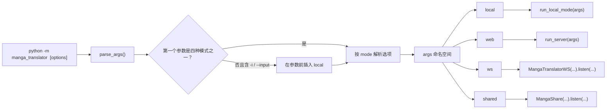
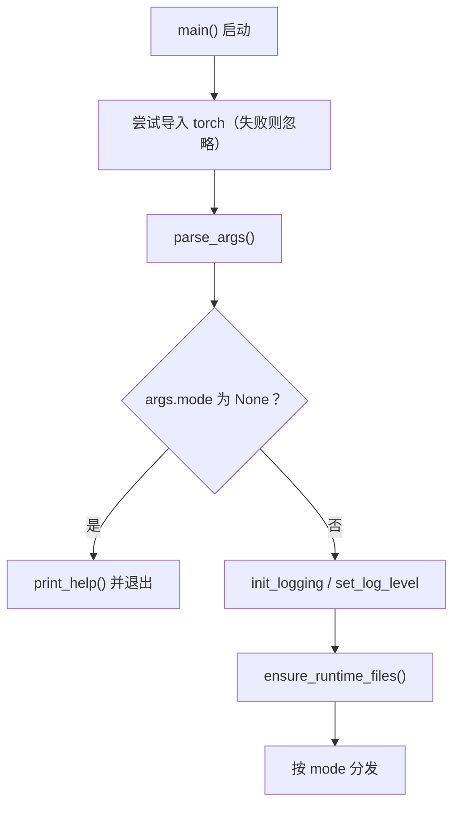

# 命令结构

当你不使用桌面界面、直接在终端中运行本工具时，先要知道正式入口和子命令。CLI 的正式入口只有一个：`python -m manga_translator <mode> [options]`；`parse_args()` 把命令行解析成同一个 `args` 命名空间，再按模式分发到 `local`、`web`、`ws`、`shared` 四条执行链。`--help` 由 `argparse` 自动提供，顶层帮助只列模式，选项要用 `<mode> --help` 查看。

这里仅固定入口、子命令和 `--help` 契约。输入输出、配置覆盖、工作流、子进程内存、调试产物和三个服务模式的内部协议分别见[本地输入与输出](./local-input-output.md)、[配置覆盖](./configuration-overrides.md)、[工作流与文件模式](./workflow-and-file-modes.md)、[子进程内存与恢复](./subprocess-memory-and-recovery.md)、[输出、调试与退出码](./output-debugging-and-exit-codes.md)、[web/ws/shared 模式](./web-ws-and-shared-modes.md)。

## 命令范围 {#feature-boundary}

- 正式入口只有 `python -m manga_translator <mode> [options]`；在本仓库中，使用项目受管运行时的等价形式是 `uv run --no-sync python -m manga_translator <mode> [options]`。
- 顶层只注册 `local`、`web`、`ws`、`shared` 四个子命令；`local` 是唯一支持省略模式的快捷写法。
- `local` 是唯一带必填选项（`-i/--input`）的子命令，其余三个模式的选项都有默认值。
- 顶层没有可同时作用于四种模式的业务选项；`python -m manga_translator --help` 只列出模式和帮助选项。
- 这里不把独立模块入口（例如 `python -m manga_translator.mode.local`）或 `manga_translator/server/args.py` 的解析器当作正式顶层契约。

## 终端操作 {#terminal-operations}

### 查看顶层帮助 {#top-level-help}

在仓库根目录运行：

```powershell
uv run --no-sync python -m manga_translator --help
```

usage 显示为 `__main__.py [-h] {web,local,ws,shared} ...`；positional arguments 列出四个模式，options 只有 `-h, --help`。顶层使用默认 `argparse` formatter，不会把子命令的选项展开到根帮助中，也不会自动打印解析后的默认值。

### 查看子命令帮助 {#subcommand-help}

每个子命令都提供 `-h/--help`：

```powershell
uv run --no-sync python -m manga_translator local --help
uv run --no-sync python -m manga_translator web --help
uv run --no-sync python -m manga_translator ws --help
uv run --no-sync python -m manga_translator shared --help
```

`local` 还支持隐式省略模式：当第一个用户参数不是四个模式且参数列表含 `-i` 或 `--input` 时，解析器会在解析前插入 `local`。例如 `uv run --no-sync python -m manga_translator -i placeholder.png --help` 的 usage 会变成 `__main__.py local ...`；任意位置参数本身不会触发该回退。

## 子命令与选项 {#subcommands-and-options}

### 顶层子命令 {#subcommand-overview}

顶层解析器只注册下列四个子命令。`__main__.py` 解析完成后把同一个 `args` 命名空间分发到相应执行链。

| 子命令 | 用途 | 顶层分发目标 | 默认网络端点（如适用） |
| --- | --- | --- | --- |
| `local` | 本地图片/文件夹翻译 | `mode.local.run_local_mode(args)` | 不监听端口 |
| `web` | HTTP API 和 Web 界面服务器 | `server.run_server(args)` | `0.0.0.0:8000`，可由 `MT_WEB_HOST` / `MT_WEB_PORT` 改写 |
| `ws` | 内部 WebSocket 后端 | `MangaTranslatorWS(...).listen(...)` | 本地监听 `127.0.0.1:5003`；上游地址 `ws://localhost:5000` |
| `shared` | 内部 shared/API 实例 | `MangaShare(...).listen(...)` | `127.0.0.1:5003` |



## 命令如何执行 {#runtime-behavior}

### 参数解析与隐式 local {#parse-and-implicit-local}

`args.py#parse_args()` 先创建带四个子解析器的顶层解析器，再检查 `sys.argv`：第一个参数不是四种模式且参数列表含 `-i` 或 `--input` 时，在第一个参数前插入 `local`。解析完成后若 `args.mode` 仍为 `None`，打印顶层帮助并退出；否则返回 `args`。`__main__.py` 在解析前先尝试导入 `torch`（导入失败时忽略），因此缺少或 DLL 不兼容 PyTorch 的环境中，连 `--help` 也可能在解析前失败。



### 模式分发与共享初始化 {#dispatch-and-shared-init}

解析成功后，`__main__.py` 把 `args.disable_onnx_gpu` 统一导出为环境变量 `MT_DISABLE_ONNX_GPU=1`，初始化日志（`-v` 时为 DEBUG，否则 INFO），并在分发前调用 `ensure_runtime_files()` 统一释放外部配置表和 AI 提示词表。之后按 `args.mode` 分发：`local` 走 `asyncio.run(run_local_mode(args))`；`web` 走 `run_server(args)`；`ws` 构造 `MangaTranslatorWS(vars(args))` 并 `listen`；`shared` 构造 `MangaShare(vars(args))` 并 `listen`。`ws`/`shared` 的 host、port、nonce 与连接字段由 `vars(args)` 传入构造器，默认端点见[顶层子命令](#subcommand-overview)。`web` 各选项的默认值来自 `MT_*` 环境变量，在进程启动时求值，因此 `--help` 文本中的基准值（如 `0.0.0.0`、`8000`）不等于当次运行必然生效的值。

## 使用限制 {#dependencies-and-conflicts}

- `python -m manga_translator.mode.local --help` 能返回 `0`，但这是独立模块入口，不属于正式顶层契约：它的解析器额外公开 `--resume`、`--concurrent`，没有顶层 `local` 的 GPU、ONNX、格式、批量大小和 attempts 选项，且内存参数默认值为 `8000`、`80`、`50` 而非 `0`、`0`、`0`。`__main__.py` 不调用这份解析器。
- `manga_translator/server/args.py` 的另一套 `parse_arguments()` 未接入顶层分发；`server/main.py` 的直接模块守卫还导入不存在的 `manga_translator.args.parse_arguments`（正式顶层定义的是 `parse_args`）。它不能替代正式 `web` 命令。
- `local` 的子进程路径只把 `--use-gpu`、`--disable-onnx-gpu` 写入 `cli_config`，再把原配置交给 `translate_with_subprocess`；`--subprocess` 与 `--format`、`--batch-size` 或 `--attempts` 组合时，“覆盖配置文件”的行为尚未进入该分支。帮助文本与当前代码不一致。
- 独立 `local.py` 解析器声明的 `--resume` 没有从 `run_local_mode()` 传给 `translate_with_subprocess(..., resume=...)`；其帮助存在不等于该恢复行为已经接通。
- `--memory-limit`、`--memory-percent`、`--batch-per-restart` 只在 `--subprocess` 路径消费；不启用子进程时这些值不参与翻译。
- `web` 选项的帮助文字写的是源码基准值；真实默认值可被启动时的 `MT_*` 环境变量改写，不能只从帮助文本反推当次运行的生效值。
- 完整服务启动、真实输入翻译、模型/API 依赖、端口占用和内部协议均不属于本页验证范围；它们由对应功能页和相关页面说明。
