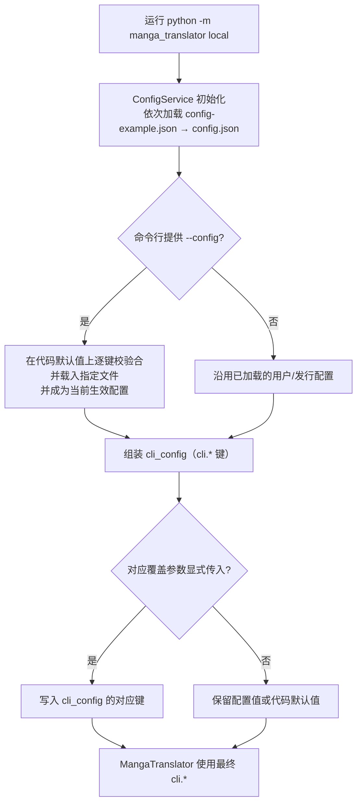
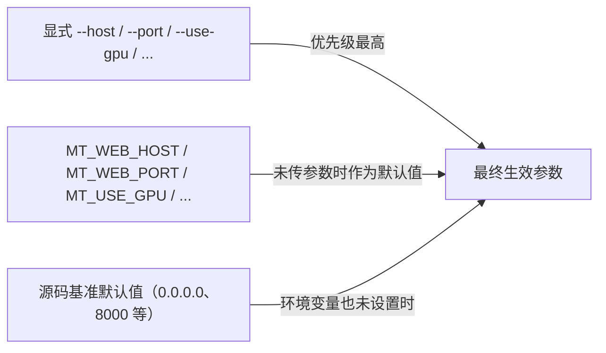
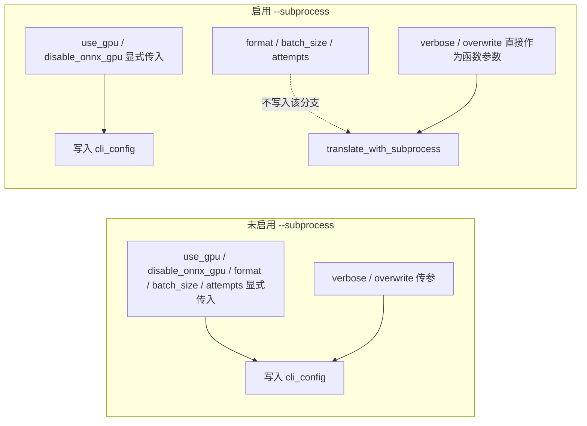

# CLI 配置覆盖

当你在命令行运行 `local` 模式，希望这次运行使用另一份配置文件，或临时调整几个参数而不编辑 `config/config.json` 时，使用这里介绍的三条途径：`--config` 选择配置文件，显式 CLI 参数覆盖配置文件中的 `cli.*` 值，`MT_*` 环境变量为 `web`/`ws`/`shared` 提供参数默认值。

这里仅说明“配置从哪里读、谁覆盖谁”。命令结构见[命令结构](./command-structure.md)，输入输出见[本地输入输出](./local-input-output.md)，子进程与内存参数见[子进程、内存与恢复](./subprocess-memory-and-recovery.md)，服务模式启动见[Web/WS/Shared 模式](./web-ws-and-shared-modes.md)。

## 命令范围 {#feature-boundary}

- `--config` 只存在于 `local` 子命令；`web`、`ws`、`shared` 没有配置文件选项。
- 显式 CLI 参数只会覆盖配置文件中的 `cli.*` 键；未传值时保留配置文件或默认值，帮助文本所称“覆盖配置文件”只有在显式传参时才成立。
- `MT_*` 环境变量只参与 `web`/`ws`/`shared` 参数默认值的计算；`local` 模式没有 `MT_*` 参数默认值。
- CLI 覆盖只影响本次运行，不会把新值写回任何配置文件。
- API 密钥等凭据通过 `.env` 与 API 管理页解析，不属于本页的覆盖范围。

## 用 --config 指定配置文件 {#config-flag}

`local` 模式用 `--config` 指定本次运行的配置文件：

```powershell
uv run --no-sync python -m manga_translator local -i input.png --config path/to/my-config.json
```

`local --help` 中该选项的帮助原文为：`--config CONFIG` 配置文件路径（默认：config/config.json）。提供 `--config` 后，`run_local_mode` 会调用 `load_config_file()` 载入该文件；载入失败时打印“无法加载配置文件: {path}”并以退出码 `1` 结束。

### 配置文件加载链 {#config-load-chain}

`ConfigService` 初始化时按以下顺序逐键校验并深合并：

| 顺序 | 来源 | 说明 |
| --- | --- | --- |
| 1 | 用户配置 `config/config.json` | 优先加载，覆盖下面的默认配置 |
| 2 | 发行模板 `config/config-example.json` | 用户配置不存在时作为基底 |
| 3 | Qt 代码默认值 `AppSettings()` | 文件缺失或键无效时的兜底 |

提供 `--config` 时，指定文件会在代码默认值之上整体载入，并成为当前生效配置；之前已加载的用户 `config/config.json` 不再叠加到该文件之上。每个文件按键校验，无效键回退默认值并写入日志（最多打印前 5 个键）。

### 指定文件失败时 {#config-load-failure}

| 失败原因 | 命令行表现 |
| --- | --- |
| 文件不存在 | `load_config_file` 返回失败，打印“无法加载配置文件: {path}”，退出码 `1` |
| JSON 解析失败 | 同上 |
| 最终模型校验失败 | 回退默认配置并返回失败，命令行表现同上 |

## 参数覆盖优先级 {#override-priority}

生效优先级从高到低：

1. 显式 CLI 参数（只在显式传入时覆盖）。
2. 配置文件：`--config` 指定的文件 > 用户 `config/config.json` > 发行 `config/config-example.json`。
3. 代码默认值：Qt `AppSettings()` / 核心 `Config()`。

CLI 覆盖发生在翻译启动前的 `cli_config` 组装阶段，不改变文件内容。

### 未传值不覆盖 {#explicit-only}

- `--use-gpu`、`--disable-onnx-gpu`、`--format`、`--batch-size`、`--attempts` 的解析默认值是 `None`，只有显式传入才会写入 `cli_config`；不传时保留配置文件或默认值。
- `-v` 与 `--overwrite` 是 `store_true` 开关，传参只会“开启”。若配置文件里 `cli.verbose` 或 `cli.overwrite` 为 `true`，不传参也会生效，命令行无法用“不传参”来关闭。
- `--format` 的帮助列出 `png/jpg/jpeg/jfif/webp/avif/bmp/tiff/tif/heic/heif`，但解析阶段不设置 `choices`；传入列表外的值会在后续保存阶段失败，而不是在解析阶段被拒绝。

### 子进程模式差异 {#subprocess-difference}

启用 `--subprocess` 后，`run_local_mode` 只把显式传入的 `--use-gpu`、`--disable-onnx-gpu` 写入 `cli_config`，再把配置交给 `translate_with_subprocess`；`--format`、`--batch-size`、`--attempts` 的“覆盖配置文件”行为没有进入该分支。`-v`/`--overwrite` 在子进程分支作为函数参数直接传入。这是源码差异，尚未在所有环境中确认；不启用 `--subprocess` 时，上述五个覆盖参数才按帮助语义生效。

## 配置文件详解 {#config-file-details}

`local` 模式涉及的配置文件主要是发行默认模板 `config/config-example.json` 与用户配置 `config/config.json`；导出原文/译文时还会读取原文→译文映射模板 `config/translation_template.json`。本小节按仓库中的实际文件说明它们的结构与写法，只引用发行模板的脱敏默认值，不展示任何真实用户配置或私有路径。

### 发行默认模板 config/config-example.json {#config-example-structure}

`config/config-example.json` 是随发行包提供的默认配置模板，也是没有用户配置时的基底。它是一个按功能分组的 JSON 对象，每个组对应一条翻译流水线阶段：

| 配置组 | 对应阶段 | 主要字段示例 |
| --- | --- | --- |
| `translator` | 翻译 | `translator`（如 `openai`）、`target_lang`、`keep_lang` |
| `detector` | 检测 | `detector`（如 `default`）、`detection_size`、`text_threshold` |
| `ocr` | 文字识别 | `ocr`（如 `48px`）、`secondary_ocr`、`min_text_length` |
| `inpainter` | 修复 | `inpainter`（如 `lama_large`）、`inpainting_size` |
| `render` | 排版渲染 | `renderer`、`font_family`、`layout_mode` |
| `colorizer` | 上色 | `colorizer`（如 `none`）、`colorization_size` |
| `upscale` | 超分 | `upscaler`（如 `mangajanai`）、`tile_size` |
| `cli` | 命令行输出与批量 | `verbose`、`format`、`overwrite`、`batch_size`、`save_text` 等 |
| `app` | 桌面应用状态 | `theme`、`ui_language`、`last_output_path` |

除分组外，顶层还有 `filter_text_enabled`、`kernel_size`、`mask_dilation_offset`、`use_custom_api_params` 等跨阶段字段；完整字段以 `config/config-example.json` 为准，各组参数的界面说明见设置页与[界面选项对照表](../reference/options-i18n-matrix.md)。

### 用户配置 config/config.json 如何覆盖模板 {#user-config-override}

`config/config.json` 是用户自己的配置，结构与发行模板相同。`ConfigService` 初始化时逐键校验并深合并：用户配置优先，缺失或无效的键回退到发行模板，再回退到代码默认值。因此：

- 用户配置只需要写要修改的组或字段，其余键沿用发行默认值。
- 提供 `--config` 时，指定文件在代码默认值之上整体载入并成为当前生效配置，用户 `config/config.json` 不再叠加。
- 最终生效优先级为：显式 CLI 参数 > 配置文件（`--config` 文件 > `config/config.json` > `config/config-example.json`）> 代码默认值，详见[参数覆盖优先级](#override-priority)。

### 原文→译文映射模板 config/translation_template.json {#translation-template}

`config/translation_template.json` 是导出原文/译文时使用的映射模板。文件开头有一行 `output_format` 配置，决定导出文件的扩展名（默认 `json`，可改成 `txt` 等安全扩展名）；后面的内容定义“原文 → 译文”的映射写法，`<original>` 占位符代表一条原文文本，`<translated>` 占位符代表它的译文。发行包自带的默认内容如下：

```json
"output_format": "json",
{
    "<original>": "<translated>",
    "<original>": "<translated>",
    "<original>": "<translated>"
}
```

- 导出原文（`cli.template` + `cli.save_text` 组合，即“导出原文”工作流）时，每条文本区域的原文填入 `<original>` 位置；导出译文（`cli.generate_and_export`，即“导出翻译”工作流）时，译文填入 `<translated>` 位置。两种导出的文件名分别为 `<图片名>_original.<扩展名>` 与 `<图片名>_translated.<扩展名>`。
- `output_format` 只允许安全扩展名字符（字母、数字、`.`、`_`、`-`），非法值回退为 `json`；模板必须至少包含一个 `<original>` 占位符。
- 映射行不要求必须是 JSON：可以换成任意自由文本格式，例如 `原文: <original> 译文: <translated>`，每条文本区域按该格式输出一行。

### 命令行参数与配置键对应 {#cli-args-config-keys}

`local` 子命令中会写回 `cli.*` 配置键的覆盖参数如下（其余参数如 `-i`、`-o`、`--config`、`--subprocess` 与内存参数是本次运行的参数，不写入配置）：

| CLI 参数 | 配置键 | 说明 |
| --- | --- | --- |
| `--use-gpu` | `cli.use_gpu` | 使用 GPU 加速 |
| `--disable-onnx-gpu` | `cli.disable_onnx_gpu` | 禁用 ONNX Runtime GPU 加速 |
| `--format` | `cli.format` | 输出图片格式 |
| `--batch-size` | `cli.batch_size` | 批量处理大小 |
| `--attempts` | `cli.attempts` | 翻译失败重试次数 |
| `-v` / `--verbose` | `cli.verbose` | 显示详细日志 |
| `--overwrite` | `cli.overwrite` | 覆盖已存在文件 |

工作流相关配置键（`cli.save_text`、`cli.load_text`、`cli.template`、`cli.generate_and_export`、`cli.upscale_only`、`cli.colorize_only`、`cli.inpaint_only`、`cli.replace_translation` 等）与界面工作流的对应见[工作流与文件模式](./workflow-and-file-modes.md)与[工作流矩阵](../reference/workflow-matrix.md)。这些键没有对应的正式 CLI 参数，只能通过配置文件设置。

## 覆盖优先级图示 {#priority-diagram}

下图回答“传或不传参数、给不给 `--config`，用户看到的 `cli.*` 值会怎么变”（`local` 非子进程路径）：



限制：该图只描述 `local` 非子进程路径；`--subprocess` 分支的覆盖范围见下。`-i`、`-o`、`--config` 和内存参数不是 `cli.*` 覆盖。

`web`/`ws`/`shared` 的参数默认值优先级：



限制：环境变量默认值在 `parse_args()` 阶段按进程环境计算一次；`.env` 加载发生在 web 服务导入时，晚于该阶段。

子进程与非子进程的覆盖差异：



限制：该图来自当前代码；子进程分支中 `--format`/`--batch-size`/`--attempts` 是否真的不生效尚未在所有环境中确认，帮助文本与源码存在差异。

## 使用限制 {#dependencies-and-conflicts}

- `--config` 只存在于 `local`；`web`、`ws`、`shared` 没有配置文件参数。
- CLI 覆盖只影响本次运行，不回写 `config/config.json`；下次运行仍按文件内容加载。
- `cli.verbose`/`cli.overwrite` 为 `true` 时，不传 `-v`/`--overwrite` 也会生效；开关参数无法反向关闭配置中的开启值。
- `--use-gpu`/`--disable-onnx-gpu` 在 `local` 未传时是 `None`（不覆盖），与 `web` 模式由环境变量提供默认值的语义不同。
- `--attempts`（`local`）与 `--retry-attempts`（`web`）都接受 `-1` 表示无限重试，但分属不同子命令，默认值来源不同。
- 配置文件中的 `cli.batch_concurrent` 在特殊工作流下会被强制关闭（见[工作流与文件模式](./workflow-and-file-modes.md)）；正式 `local` 解析器没有 `--concurrent` 参数，无法通过 CLI 覆盖它。
- 这里不处理 API 密钥、`.env` 凭据解析和候选轮换；相关内容见 API 管理页与[翻译器选择](../desktop/translator/selection-and-languages.md)。
