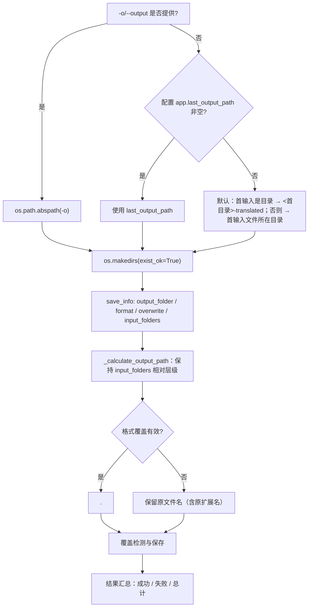

# 本地输入与输出

这里介绍 `local` 模式（本地图片/文件夹翻译）的输入与输出：`-i/--input` 接受哪些路径、`-o/--output` 如何决定输出目录、每张图片最终写到哪里，以及控制台如何汇总结果。它不覆盖翻译流水线内部算法（见检测、OCR、翻译、修复、排版各页），不覆盖 `--config` 与显式参数覆盖（见[配置覆盖](./configuration-overrides.md)），也不覆盖批量并发与子进程内存管理（见相应 CLI 页）。四个顶层子命令的结构见[命令结构](./command-structure.md)。桌面版的文件列表与输出目录控件见[文件列表与输入](../desktop/translation/file-list-and-input.md)与[输出目录与工作流](../desktop/translation/output-directory-and-workflow.md)。

## 命令范围 {#feature-boundary}

- `-i/--input` 是必填参数，接受一个或多个图片文件或文件夹；文件夹会递归扫描图片，并跳过名为 `manga_translator_work` 的工作目录。
- `-o/--output` 是可选的输出目录；未提供时按“`-o` → `app.last_output_path` → 默认规则”三级回退。
- 这里仅写 `local` 的输入输出与结果汇总；GPU/ONNX、`--format`、`--batch-size`、`--attempts` 等显式覆盖见[配置覆盖](./configuration-overrides.md)。
- 控制台汇总行（成功/失败/总计）来自 `manga_translator/mode/local.py` 的硬编码输出，不属于 i18n 文案；与输入/输出共享概念的 UI 调用 key 对照见[界面选项对照表](../reference/options-i18n-matrix.md)。

## 操作方法 {#ui-operations}

### 运行 local 命令 {#run-local-command}

正式入口（项目受管运行时）：

```powershell
uv run --no-sync python -m manga_translator local -i <输入图片或文件夹>... [-o <输出目录>] [选项]
```

1. 在 `-i` 后传入一个或多个路径：图片文件或文件夹。文件夹递归扫描受支持扩展名的图片。
2. 需要时用 `-o` 指定输出目录；省略时按默认规则推导（见[输出目录判定](#output-directory-resolution)）。
3. 要重新翻译已存在的输出文件时加 `--overwrite`；保持默认（按配置 `cli.overwrite`）则跳过已存在文件。
4. 第一个参数不是 `local/web/ws/shared` 且参数列表包含 `-i`/`--input` 时，解析器会隐式插入 `local`，因此 `python -m manga_translator -i page.png` 等价于显式 `local`。

## 输入与输出选项 {#input-output-options}

支持的输入扩展名（唯一来源 `manga_translator/image_formats.py`）：

| 类别 | 扩展名 |
| --- | --- |
| 位图 | `.png` `.jpg` `.jpeg` `.jfif` `.bmp` `.tiff` `.tif` |
| Web/现代格式 | `.webp` `.avif` `.heic` `.heif` |

`local` 的文件夹扫描只收集图片扩展名；压缩包/文档（`.pdf/.epub/.cbz/.cbr/.zip`）不会作为 `local` 输入自动解包，这与桌面文件列表不同。

## 命令如何执行 {#runtime-behavior}

### 输入收集 {#input-collection}

1. 每个 `-i` 路径先转绝对路径：文件加入单独文件列表，目录加入文件夹列表。
2. 文件夹按自然排序，逐个调用 `get_image_files_from_folder(folder, recursive=True)` 递归扫描；扫描会跳过名为 `manga_translator_work` 的目录，目录与文件都按自然排序（`file2` 排在 `file10` 前）。
3. 单独文件按自然排序追加到文件夹文件之后，因此多个 `-i` 混合输入时，文件夹图片整体排在单独文件之前。
4. 逐个校验存在且是文件；找不到任何图片时打印“未找到图片文件”并退出（子进程模式返回非零）。

### 输出目录判定 {#output-directory-resolution}



图说明：这是三级输出回退与逐图输出路径计算。`-o` 永远最高优先；`app.last_output_path` 是桌面保存的“最后输出路径”，CLI 未提供 `-o` 且该值非空时也会使用它。文件夹输入默认在首输入目录旁生成 `<目录名>-translated`；文件输入默认写到该文件所在目录。输出目录内按输入文件夹的相对层级保持目录结构（`<输出>/<文件夹名>/<相对路径>/<文件名>`）。

### 结果与汇总 {#results-and-summary}

- 每张图片打印 `✅ 完成: <文件名>` 或 `❌ 翻译失败: <文件名>`；`-v` 下额外打印错误详情。
- 结束时打印 `✅ 成功: N`、`❌ 失败: M`、`📊 总计: T` 与输出目录；非子进程路径还会列出输出目录文件数（`-v` 下列出前 10 个文件名和大小）。
- 非子进程路径在 `result/` 下写 `log_<时间戳>.txt`，`-v` 时日志级别为 DEBUG。
- 成功/取消返回码为 0；配置加载失败或未捕获异常返回 1。

## 使用限制 {#dependencies-and-conflicts}

- 输入文件必须存在且可读，扩展名必须属于支持集合。文件夹递归跳过 `manga_translator_work`，不要把工作目录当作普通输入目录。
- 关闭覆盖时，输出文件已存在的图片会被跳过（计入“成功（跳过）”）；只有 `--overwrite` 或配置 `cli.overwrite=true` 才会重新翻译。
- 多个输入文件夹写入同一输出目录时按各自相对层级落盘；`input_folders` 只记录目录型输入。
- `cli.save_to_source_dir` 由桌面 `app_logic.py` 构造的 `save_info` 传入；`local` 的 `save_info` 只含 `output_folder/format/overwrite/input_folders`，因此 CLI 输出始终写入解析出的输出目录，不会跳到原图旁的 `manga_translator_work/result`。
- 特殊工作流（仅翻译 JSON、导出原文/翻译、替换翻译等）改变输入/输出文件类型，但逐图输出路径仍走 `_calculate_output_path`；详见[工作流](../workflows/translate-json-only.md)各页。
