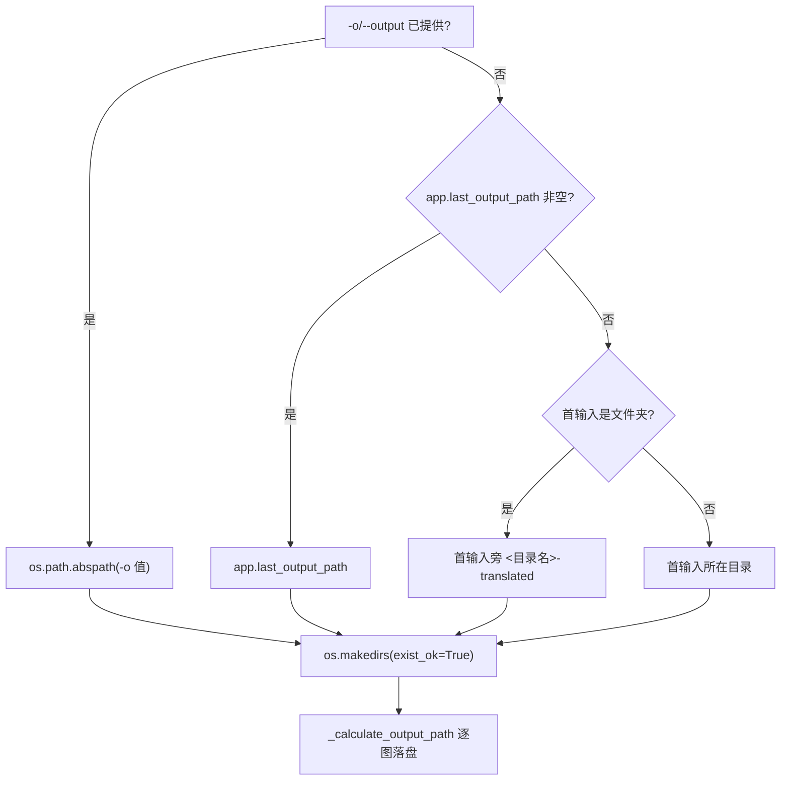
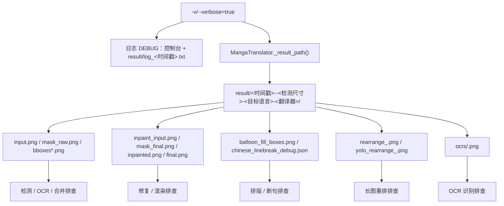

# 输出、调试与退出码

这里说明 `local` 命令运行后你会在哪里看到结果：最终图片的输出目录与命名、`-v/--verbose` 开启后写入的日志和调试产物，以及命令结束时的进程退出码。它不覆盖输入收集（见[本地输入与输出](./local-input-output.md)）、显式参数覆盖（见[配置覆盖](./configuration-overrides.md)）、工作流与文件模式（见[工作流与文件模式](./workflow-and-file-modes.md)）和子进程内存管理（见[子进程内存与恢复](./subprocess-memory-and-recovery.md)）；四个顶层子命令的结构见[命令结构](./command-structure.md)。调试产物的逐阶段含义与脱敏规则由调试目录相关页面承接，这里仅固定路径契约。

## 命令范围 {#feature-boundary}

- `-o/--output` 决定最终图片的输出目录；省略时按“`-o` → `app.last_output_path` → 默认规则”三级回退，具体见[输出目录判定](#output-directory-resolution)。
- `-v/--verbose` 只改变日志级别、日志文件和 `result/` 调试产物，不改变翻译结果图片本身。
- 进程退出码只有三个约定值：`0` 成功/跳过/取消，`1` 配置加载失败或未捕获异常，`2` `argparse` 解析错误；单图失败不会改变退出码。
- 这里不展示真实 `.env`、用户 `config.json`、API Key、用户名、私有绝对路径、用户图片或私有提示词；日志与调试产物分享前必须脱敏。

## 终端操作 {#terminal-operations}

### 运行 local 并启用详细日志 {#run-local-with-verbose}

正式入口（项目受管运行时）：

```powershell
uv run --no-sync python -m manga_translator local -i <输入图片或文件夹>... -o <输出目录> -v
```

1. 用 `-o` 指定输出目录；省略时按三级回退推导。
2. 加 `-v/--verbose` 后，控制台与日志文件都使用 DEBUG 级别，并在 `result/` 下写入调试产物。
3. 不带 `-v` 时控制台与日志为 INFO 级别，`result/` 不写单图调试目录。
4. 控制台汇总行（`📤 输出目录: ...`、`✅ 成功: N` 等）是 `manga_translator/mode/local.py` 的硬编码输出，不经过 i18n locales。

### 查看输出与调试产物 {#inspect-output-and-debug}

- 最终图片写入[输出目录判定](#output-directory-resolution)解析出的目录；每张图片一个文件，命名见[输出文件名与格式](#output-filename-and-format)。
- verbose 时，`MangaTranslator._result_path()` 把中间图写到 `result/<时间戳>-<图片MD5>-<检测尺寸>-<目标语言>-<翻译器>/`，调试目录结构见[调试目录与产物](#debug-tree)。
- 非子进程路径在 `result/` 写 `log_<yyyyMMddHHmmss>.txt`；桌面 UI 启动时也写同名日志。日志包含路径与文本，外发前脱敏。

## 输出目录与文件命名 {#output-directory-and-naming}

### 输出目录判定 {#output-directory-resolution}

两条执行路径（子进程与非子进程）都使用同一套三级回退：`-o` 优先；否则用配置 `app.last_output_path`；再否则按默认规则（首输入是文件夹时在其旁生成 `<目录名>-translated`，是文件时写到该文件所在目录）。



图说明：`-o` 永远最高优先；`app.last_output_path` 是桌面保存的“最后输出路径”，CLI 未提供 `-o` 且该值非空时也会使用。文件夹输入默认在首输入目录旁生成 `<目录名>-translated`；文件输入默认写到该文件所在目录。输出目录内按输入文件夹的相对层级保持结构（`<输出>/<文件夹名>/<相对路径>/<文件名>`）。

### 输出文件名与格式 {#output-filename-and-format}

- 输出文件名以输入文件名为基础：`<stem>.<扩展名>`。
- `--format` 或配置 `cli.format` 有效（非空、非 `不指定`、非 `none`）时使用 `<stem>.<format>`，否则保留原文件名（含原扩展名）。
- 保存质量由 `cli.save_quality` 控制：核心 `MangaTranslator.parse_init_params`、Qt 模型与发行配置默认均为 `100`（`mode/local.py` 汇总打印的兜底 `95` 只是显示差异，实际保存消费者默认是 `100`）。
- CLI 构造的 `save_info` 只含 `output_folder/format/overwrite/input_folders`，不包含 `save_to_source_dir`，因此 CLI 输出始终写入解析出的输出目录，不会跳到原图旁的 `manga_translator_work/result`。

## verbose 调试 {#verbose-debugging}

### 日志 {#logs}

- `-v` 时 `init_logging()` 后调用 `set_log_level(DEBUG)`，默认 `INFO`。`manga_translator/utils/log.py` 的 Formatter 对 ERROR/WARN 着色，DEBUG 行格式为 `[name] message`，并强制刷新 stdout。
- 非子进程路径在 `translate_files()` 中创建 `result/log_<yyyyMMddHHmmss>.txt` 文件 handler，`-v` 时文件日志级别为 DEBUG，并在控制台打印 `📝 日志文件: ...`。
- 子进程路径由 worker 进程同样以 DEBUG/INFO 初始化日志，并把 `verbose` 写回 `cli_config`。
- 桌面 UI 启动也会写 `result/log_<时间戳>.txt`（`desktop_qt_ui/main.py`），格式与 CLI 一致。

### 调试目录与产物 {#debug-tree}

verbose 时，每张输入图在 `_set_image_context()` 建立图片级子目录名 `{timestamp_ms}-{input_md5}-{detection_size}-{target_lang}-{translator}`；`_result_path()` 将中间图写入 `BASE_PATH/result/<子目录>/<文件名>`。`result_sub_folder` 在仓库内默认为空字符串，当前源码没有后续赋值，因此 verbose 路径不含额外分组层。



图说明：`-v` 开启后新增 DEBUG 日志与调试目录；不是每次运行都会产生全部产物。下列产物均为 `verbose=True` 下的条件写入，具体触发条件来自当前代码（`research/phase0-debug-artifact-path-trace.md`），不代表每次运行必有：

| 产物 | 触发条件（均需 verbose） | 排查用途 |
| --- | --- | --- |
| `input.png` | 开始处理前 | 检测/OCR 的输入图 |
| `mask_raw.png` | 检测返回 `ctx.mask_raw` | 原始置信热图（带颜色条） |
| `bboxes_unfiltered.png` | 检测后仍有文本行 | 未过滤文本行框 |
| `bboxes_unfiltered_labeled.png` | 上一条件 + `merge_special_require_full_wrap` + 非空文本行 | 模型辅助合并标签框 |
| `bboxes_with_scores.png` / `mask_binary.png` | 检测器返回调试元组 | 检测器评分框与二值掩码 |
| `hybrid_detection_boxes.png` | 检测器返回图 + `use_yolo_obb` | 主检测与 YOLO OBB 合并框 |
| `bboxes.png` | OCR 合并后存在 `text_regions` | 最终文本块可视化 |
| `mask_bubble_clip_debug.png` | `limit_mask_dilation_to_bubble_mask` 且气泡掩码非空 | 气泡约束蒙版叠加图 |
| `inpaint_input.png` / `mask_final.png` | 翻译完成且存在 `ctx.mask` | 修复输入与最终蒙版 |
| `inpainted.png` | 正常流程 | 修复后图像 |
| `balloon_fill_boxes.png` | `layout_mode='balloon_fill'` 且渲染器返回非空调试图 | 气泡填充排版调试图 |
| `chinese_linebreak_debug.json` | 上一条件 + 非空断句记录 | AI 断句记录 |
| `final.png` | `ctx.result` 非空（回退尺寸后） | 最终渲染图 |
| `rearrange_<n>.png` | 长图重排计划 + verbose | 送入检测前的补边批次 |
| `yolo_rearrange_<n>.png` | YOLO OBB 重排计划 + verbose | YOLO 单个重排 patch |
| `ocrs/<index>.png` | OCR 实现收到 verbose 且区域未被前置过滤 | 透视裁切后的 OCR 输入 |
| `<stem>_photoshop_script.jsx` | PSD 导出且 verbose 或 `script_only` | Photoshop 脚本 |

`final.png` 在 `_revert_upscale()` 中写入调试目录；`ctx.debug_folder` 在 verbose 时保存该子目录名，供 Web 模式缓存访问。调试产物可能含用户图像、文本或本机路径，分享前必须脱敏；不能把条件产物描述成每次运行必有。

## 退出码 {#exit-codes}

`python -m manga_translator <mode> ...` 进程退出码约定如下：

| 退出码 | 场景 | 来源 |
| --- | --- | --- |
| `0` | 翻译成功或全部跳过；用户取消（`KeyboardInterrupt` / `asyncio.CancelledError`）；`--help` | `mode/local.py`、`__main__.py`、`argparse` |
| `1` | `--config` 加载失败；子进程模式未找到图片；未捕获异常；无模式且无 `-i` 时打印帮助后退出 | `mode/local.py`、`args.py`、`__main__.py` |
| `2` | `argparse` 解析错误（例如缺少必填 `-i/--input`、未知选项） | `argparse` 标准行为 |

要点：

- 单图失败不改变进程退出码：`translate_files()` 汇总失败数量后正常返回，退出码仍为 `0`；失败只体现在 `❌ 失败: N` 汇总行。脚本化使用时以汇总行或日志为准。
- 非子进程路径在“未找到图片”时打印 `❌ 未找到图片文件` 后正常返回（退出码 `0`）；子进程路径在同一情况打印相同信息后 `sys.exit(1)`。这是两条路径差异。
- 无模式且参数不含 `-i/--input` 时，`parse_args()` 打印帮助并以 `1` 退出。
- `-v` 下异常会额外打印 traceback，但退出码仍按上表。

## 使用限制 {#dependencies-and-conflicts}

- 调试产物只在 `verbose=True` 时写入；不开启时 `result/` 只用于日志（非子进程路径）或 Web/WS 的最终图缓存。
- `-v` 会增加磁盘占用；长图重排、混合检测、气泡约束、PSD 导出和各 OCR 实现各有独立触发条件，互不保证同时出现。
- 退出码不以失败张数为准：`ignore_errors`、单图失败汇总都不改变 `0`/`1` 判定。
- `--subprocess` 与 `--memory-*` 只影响子进程路径的日志/退出分支；内存阈值触发的提前退出由 `subprocess_manager` 处理，见[子进程内存与恢复](./subprocess-memory-and-recovery.md)。
- verbose 调试目录名包含图片 MD5 与目标语言/翻译器字段；不要把含用户图片 MD5 的路径写进公开报告。
