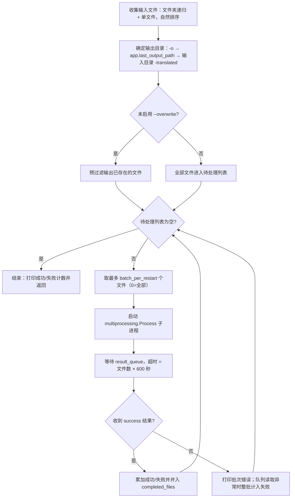
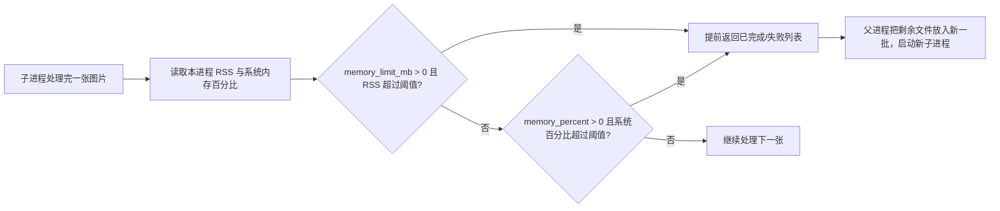

# CLI 子进程、内存与恢复

当一次要翻译大量图片、且长任务中模型与中间结果占用内存持续增长时，可以使用 `local` 子进程模式。`--subprocess` 让每个批次在一个独立子进程中运行，父进程只负责收集文件、分配批次和收集结果；达到 `--memory-limit`、`--memory-percent` 或 `--batch-per-restart` 阈值后，当前子进程提前结束，剩余文件由新子进程继续处理，已经完成的文件不会重复翻译。

这里仅列出 `local --subprocess` 的子进程、内存限制与恢复机制。普通（非子进程）本地翻译见[本地输入与输出](./local-input-output.md)，命令结构与正式入口见[命令结构](./command-structure.md)，配置覆盖见[配置覆盖](./configuration-overrides.md)，输出与退出码见[输出、调试与退出码](./output-debugging-and-exit-codes.md)。

## 命令范围 {#feature-boundary}

- `--subprocess` 只改变 `local` 的执行路径：文件收集、输出目录和“跳过已存在”逻辑与普通模式一致，但翻译在 `multiprocessing.Process` 子进程中逐批进行。
- `--memory-limit`、`--memory-percent`、`--batch-per-restart` 只在启用 `--subprocess` 时被消费；普通 `local` 路径会忽略这三个参数。
- “恢复”在本页包含三层：同一次运行内内存超限后换新子进程继续；子进程异常时同一批文件自动重试；重新运行且未启用 `--overwrite` 时跳过输出已存在的文件。正式顶层 `local` 不提供可用的跨运行 `--resume` 选项，见[`--resume` 参数](#resume)。
- 这里不负责 `cli.attempts`（API 调用失败重试）、API 候选槽轮换（见 API 管理页面）、`cli.batch_size`/`cli.batch_concurrent`（批量并发，见[CLI 批量与输出](../desktop/settings/cli-batch-and-output.md)），以及 `web`/`ws`/`shared` 服务模式（见[Web、WS 与 Shared 模式](./web-ws-and-shared-modes.md)）。

## 命令行操作 {#command-line-operations}

### 启用子进程模式

在仓库根目录，用项目受管运行时调用：

```powershell
uv run --no-sync python -m manga_translator local -i ./manga_folder/ --subprocess
```

- `-i`/`--input` 必填，可给出多个；文件夹会递归收集图片，单个文件按名称自然排序后处理。
- `-o`/`--output` 指定输出目录；未指定时依次使用配置中的 `app.last_output_path`、输入文件夹加 `-translated` 后缀或首个输入文件所在目录。
- `--config` 指定配置文件；加载失败时打印错误并退出（码 1）。
- 未启用 `--overwrite` 时，父进程先预过滤输出已存在的文件，只有剩余文件进入子进程。

### 设置内存与重启阈值

- 只限制子进程自身内存，超过 4000 MB 就重启：`--memory-limit 4000`。
- 只限制系统内存占比，超过 85% 就重启：`--memory-percent 85`。
- 每 20 张重启一次子进程释放内存：`--batch-per-restart 20`。
- 同时设置绝对内存与每批张数：`--memory-limit 6000 --batch-per-restart 30`。

```powershell
uv run --no-sync python -m manga_translator local -i ./manga_folder/ --subprocess --memory-limit 4000
uv run --no-sync python -m manga_translator local -i ./manga_folder/ --subprocess --memory-percent 85
uv run --no-sync python -m manga_translator local -i ./manga_folder/ --subprocess --batch-per-restart 20
uv run --no-sync python -m manga_translator local -i ./manga_folder/ --subprocess --memory-limit 6000 --batch-per-restart 30
```

阈值语义与正式默认值见[参数与选项](#parameters-and-options)。绝对限制与百分比限制可以同时设置并都被检查，两者不是同一个指标。

## 参数与选项 {#parameters-and-options}

> 与桌面设置共用的界面文案与存储键对照，见[界面选项对照表](../reference/options-i18n-matrix.md)。

#### --subprocess {#subprocess}

加 `--subprocess` 启用子进程模式：每个批次在一个独立子进程中翻译，父进程只负责收集文件、分配批次和收集结果；达到内存或分批阈值后，当前子进程提前结束，剩余文件由新子进程继续处理，已经完成的文件不会重复翻译。可选值：`--subprocess`（启用）或不传（关闭，默认）。默认值：`false`。

#### --memory-limit {#memory-limit}

限制子进程自身的内存占用（单位 MB）：处理过程中超过阈值时，当前子进程提前结束，剩余文件交给新子进程继续。可选值：正整数（MB）；`0` 表示不限制。默认值：`0`。

#### --memory-percent {#memory-percent}

限制系统内存占用比例：整机内存使用率超过阈值时，当前子进程提前结束，剩余文件交给新子进程继续。可选值：正整数（百分比）；`0` 表示不限制。默认值：`0`。

#### --batch-per-restart {#batch-per-restart}

每处理 N 张图片后重启一次子进程以释放内存。可选值：正整数（张数）；`0` 表示不按张数重启（一次处理全部待处理文件）。默认值：`0`。

#### --resume {#resume}

断点续传开关只存在于独立模块解析器（`python -m manga_translator.mode.local --help`），正式顶层 `local` 没有该选项，不要依赖它完成跨运行续传。跨运行恢复实际靠“未启用 `--overwrite` 时跳过输出已存在文件”的预过滤实现；需要重新翻译已存在文件时使用 `--overwrite`。可选值：`--resume`（声明存在）或不传。默认值：`false`（正式解析器无此选项）。

## 命令如何执行 {#runtime-behavior}

### 父进程调度循环

`run_local_mode()` 的子进程分支把全部输入交给 `translate_with_subprocess()`。它维护一个 `completed_files` 集合作为本次运行的“断点”：每轮从待处理列表取出最多 `batch_per_restart` 个文件（`0` 表示全部），启动一个子进程，等待结果队列，把完成文件并入集合，再进入下一轮，直到没有待处理文件。



子进程内逐张调用 `translate_batch`：构造 `Config` 时只取 `render`/`upscale`/`translator`/`detector`/`colorizer`/`inpainter`/`ocr` 以及 `kernel_size`、`mask_dilation_offset`、`force_simple_sort` 等显式键；把 `cli.verbose`/`cli.overwrite` 写回配置，`font_family` 复制到顶层；每张图片处理完立即 `close()` 释放句柄。

### 内存检查与提前退出

worker 在每张图片处理完后读取“本进程 RSS”和“系统内存百分比”（都依赖 psutil），再独立检查两个阈值；任一超限就提前返回已完成的文件列表，不再处理剩余文件。父进程把剩余文件交给下一轮的新子进程，`restart_count` 加一。



- 显示规则：`--memory-limit > 0` 时只显示绝对阈值；否则 `--memory-percent > 0` 时显示百分比并换算约多少 MB；`--batch-per-restart > 0` 时显示每批张数。
- 两者都设时同时生效：`--memory-limit` 看子进程自身 RSS，`--memory-percent` 看整机内存使用率，不是同一指标。
- psutil 不可用时两个读取函数都返回 `0`，内存检查整段被跳过，只保留按张数重启。

### 失败与恢复

子进程与父进程之间通过 `multiprocessing.Queue` 传递结果。不同失败位置的恢复行为如下表（均为代码行为，实际结果仍受系统环境影响）：

| 事件 | 父进程行为 | 对结果的影响 |
| --- | --- | --- |
| 子进程顶层异常（返回 error 结果） | 打印“批次错误”与 traceback（`-v` 时） | 不计入失败；同一批文件留在待处理列表，下一轮自动重试 |
| 结果队列读取超时或异常 | 打印“无法获取子进程结果”，`failed_count` 直接加上本批文件数 | 本批文件既计入失败、又因未进入 `completed_files` 而被下一轮重试，存在重复计数风险 |
| 单张图片在子进程内失败 | 计入 `failed_count`，不加入 `completed_files` | 该文件留在待处理列表并反复进入后续批次；失败可复现时可能陷入重复处理 |
| 子进程未在 30 秒内退出 | `terminate()`，5 秒后仍存活则 `kill()` | 已完成文件保留，未完成文件按上表规则进入下一轮 |
| 内存超限提前返回 | 正常收下 `success` 结果 | 已完成文件保留，剩余文件进入新子进程（批次数 +1） |
| 用户 Ctrl+C | 终止当前子进程，退出码 0 | 已落盘输出保留；重跑且未加 `--overwrite` 时跳过已存在文件 |

“断点续传”的准确含义：

- 同一次运行内：`completed_files` 保证内存超限或重启后已完成文件不会重复进入新批次。
- 跨运行：正式顶层 `local` 没有可用的 `--resume`；跨运行恢复实际靠“未启用 `--overwrite` 时跳过输出已存在文件”的预过滤实现。
- worker 中还有一个每 5 张触发一次的 torch/CUDA 检查块，当前源码里是空操作（不释放显存），仅作静态观察记录。

## 使用限制 {#dependencies-and-conflicts}

- psutil 是可选的：缺失时 RSS 与系统内存读取都返回 `0`，内存限制静默失效，只剩按张数重启。
- 三层默认值不能混用：正式 `local` 的 `--memory-limit`/`--memory-percent`/`--batch-per-restart` 默认是 `0/0/0`；`subprocess_manager.py` 的函数签名常量是 `0/80/50`；`manga_translator/mode/local.py` 独立解析器是 `8000/80/50`。只有正式 `args.py` 的 `0/0/0` 属于顶层 `local --help` 契约。
- `--format`、`--batch-size`、`--attempts` 的帮助文本写着“覆盖配置文件”，但在子进程分支中只有 GPU/ONNX 覆盖会被写入 `cli_config`，这三个值不会进入 `translate_with_subprocess`。帮助文本与当前代码不一致。
- 子进程模式一次只运行一个子进程，没有并行；`cli.batch_concurrent` 不参与子进程调度。
- 内存限制针对的是 RAM（子进程 RSS / 整机内存），与 GPU 显存（VRAM）无关；显存不足问题见[模型、GPU 与内存](../troubleshooting/model-gpu-and-memory.md)。
- `app.unload_models_after_translation`（“翻译完成后卸载模型”）是桌面端翻译结束后的卸载开关，与这里的运行时阈值不同。
- 父进程等待结果队列的超时是“本批文件数 × 600 秒”，`--batch-per-restart 0` 且文件很多时等待可能极长。
