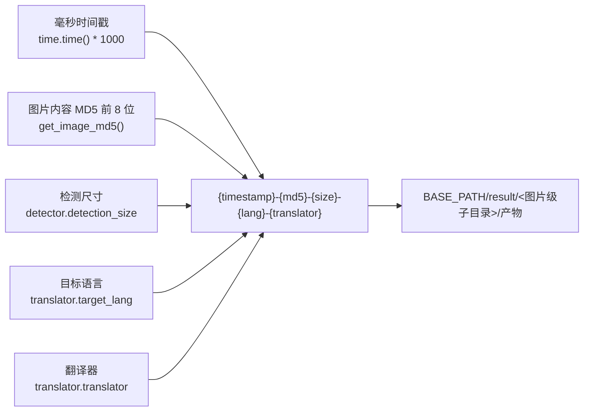
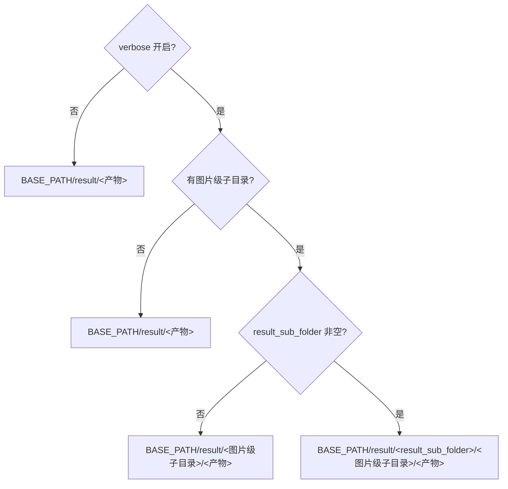

# 调试目录命名与总览

当你开启“详细日志”后，应用会在 `result/` 目录下为每张输入图生成一个调试子目录，并写入检测、OCR、蒙版、修复和排版等中间文件。这里说明这个子目录的命名规则、`result/` 的目录结构，以及各类调试产物的生成阶段和触发条件，帮助你根据目录名定位某一次运行，并判断哪些文件每次都会出现、哪些只在特定配置或工作流下出现。

这里不深入单个产物的排查方法：检测与长图重排见[输入检测与长图重排](./input-detection-and-rearrangement.md)，OCR 与文本区域见[OCR 与文本区域](./ocr-and-text-regions.md)，蒙版、修复与排版见[蒙版、修复与排版](./mask-inpainting-and-rendering.md)，特殊工作流见[特殊工作流与 WebSocket](./special-workflows-and-websocket.md)。调试产物的清理、脱敏和对外分享见[如何阅读和分享一次调试运行](./how-to-read-and-share-a-debug-run.md)。

## 先看哪些产物

- “详细日志”开关决定是否生成单图调试子目录；关闭时不会创建带时间戳的图片级子目录。
- 图片级调试子目录名固定为 `{时间戳毫秒}-{图片 MD5 前 8 位}-{检测尺寸}-{目标语言}-{翻译器}`，在每张输入图开始处理时建立。
- 调试目录统一位于 `BASE_PATH/result/` 下；`BASE_PATH` 在冻结（打包）运行时是可执行文件所在目录，在源码运行时是仓库根目录。
- 这里仅负责命名规则与产物总览；每个产物的深入含义分别由其他 debugging 页面承接，这里不重复展开。

## 查看调试产物

### 在设置页开启详细日志

1. 打开“设置”，选择“通用”分组。
2. 打开“详细日志”开关。右侧说明面板会显示该设置的说明文字。
3. 开始翻译后，中间产物写入 `BASE_PATH/result/` 下按命名规则生成的图片级子目录。
4. 翻译失败时，“翻译错误”对话框会提供“打开日志文件夹”按钮，直接打开 `result/` 目录。

命令行 `local` 模式同样支持 `-v/--verbose` 参数，效果与桌面开关一致，详见 CLI 文档。

## 产物如何生成

### 图片级子目录命名规则

每张输入图开始处理时按以下格式生成调试子目录名：

```text
{timestamp_ms}-{input_md5}-{detection_size}-{target_lang}-{translator}
```

| 字段 | 来源 | 示例 | 说明 |
| --- | --- | --- | --- |
| `timestamp_ms` | `str(int(time.time() * 1000))` | `1785860417472` | 毫秒级时间戳，保证目录名唯一 |
| `input_md5` | `get_image_md5(image)` | `3415b69c` | 图片内容 MD5 前 8 位；相同图片内容得到相同值 |
| `detection_size` | `config.detector.detection_size` | `2048` | 检测尺寸；兜底 `1024` |
| `target_lang` | `config.translator.target_lang` | `CHS` | 目标语言代码；缺配置时兜底 `unknown` |
| `translator` | `config.translator.translator` | `openai` | 翻译器标识；缺配置时兜底 `unknown` |

图片内容先统一转为 RGB，再编码为 PNG 字节流计算 MD5，只取前 8 位十六进制，避免目录名过长；计算失败时回退为 `fallback_{毫秒时间戳}`。没有传入图片时，MD5 字段为 `unknown`。

例如 `result/1785860417472-3415b69c-2048-CHS-openai/` 正好对应上面五个字段：毫秒时间戳 `1785860417472`、图片 MD5 `3415b69c`、检测尺寸 `2048`、目标语言 `CHS`、翻译器 `openai`。目录名本身只包含哈希与配置值，不包含用户文字；目录内的文件属于用户内容，分享前必须脱敏。



### 调试路径的组成

调试路径根据 verbose、图片上下文和 `result_sub_folder` 决定，并自动创建父目录：

| 条件 | 返回路径 |
| --- | --- |
| `verbose=True`、有图片上下文、`result_sub_folder` 非空 | `BASE_PATH/result/<result_sub_folder>/<图片级子目录>/<产物>` |
| `verbose=True`、有图片上下文、`result_sub_folder` 为空 | `BASE_PATH/result/<图片级子目录>/<产物>` |
| 非 verbose（或没有图片级路径）、`result_sub_folder` 为空 | `BASE_PATH/result/<产物>` |
| 非 verbose、`result_sub_folder` 非空 | `BASE_PATH/result/<result_sub_folder>/<产物>` |



### 目录结构总览

```text
BASE_PATH/result/
├─ log_20260807120000.txt          # Qt UI / CLI 运行日志（时间戳为 yyyyMMddHHmmss）
└─ 1785860417472-3415b69c-2048-CHS-openai/   # verbose 单图调试目录
   ├─ input.png                     # 处理前输入图
   ├─ bboxes.png                    # 合并后的文本块可视化
   ├─ mask_raw.png                  # 原始检测置信热图
   ├─ inpaint_input.png             # 修复输入预览
   ├─ mask_final.png                # 最终修复蒙版
   ├─ inpainted.png                 # 修复结果
   ├─ final.png                     # 最终输出（含还原尺寸）
   ├─ ocrs/                         # 每个文本区域的 OCR 裁切输入
   │  ├─ 0.png
   │  └─ 1.png
   └─ ...                           # 条件产物见下表
```

### 产物总览：基础产物

以下产物在 verbose 正常流程中最常出现；是否真正生成仍取决于检测/OCR 结果与翻译进度：

| 产物 | 生成阶段 | 触发条件 | 内容与排查用途 |
| --- | --- | --- | --- |
| `input.png` | 翻译流程开始前 | `verbose=True` | 处理前的输入图；检测/OCR 问题排查 |
| `mask_raw.png` | 检测后 | `verbose=True` 且检测返回 `ctx.mask_raw` | 带颜色条的原始检测置信热图；检测阈值排查 |
| `bboxes_unfiltered.png` | 检测后 | `verbose=True` 且检测后仍有文本行 | 原图上的未过滤文本行框；检测/OCR 过滤排查 |
| `bboxes.png` | OCR 与文本行合并后 | `verbose=True` 且存在 `ctx.text_regions` | 最终文本块可视化；合并/排序排查 |
| `inpaint_input.png` | 修复前 | `verbose=True` 且翻译完成后有 `ctx.mask` | 修复输入预览 |
| `mask_final.png` | 修复前 | 同上 | 最终用于修复的蒙版 |
| `inpainted.png` | 修复后 | verbose 正常流程 | 修复后的图像 |
| `final.png` | 还原尺寸时 | 调用还原尺寸、存在 `ctx.result` 且 verbose | 最终（或还原尺寸后）的 PIL 输出 |
| `ocrs/<序号>.png` | OCR 阶段 | `verbose=True` 且文本区域未被前置过滤 | 透视裁切后的 OCR 输入，垂直文本会旋转；48px/Manga OCR/PaddleOCR 压缩至 200px |

### 产物总览：条件产物

以下产物只在特定配置、检测器、工作流或模式下生成，不能描述成每次 verbose 运行必有：

| 产物 | 触发条件 | 内容与排查用途 |
| --- | --- | --- |
| `bboxes_unfiltered_labeled.png` | `ocr.merge_special_require_full_wrap=True` 且标签绘制器收到非空文本行 | 带序号/标签的文本行框；模型辅助合并排查 |
| `bboxes_with_scores.png`、`mask_binary.png` | 检测器第三返回值为评分框/二值掩码调试元组 | 检测评分框与配套二值掩码 |
| `hybrid_detection_boxes.png` | 检测器第三返回值为图像且 `detector.use_yolo_obb=True` | 主检测与 YOLO OBB 合并框图 |
| `rearrange_<序号>.png` | 默认/DBConvNext/CTD 检测器触发长图重排计划 | 送入检测网络前的方形补边批次；长图重排排查 |
| `yolo_rearrange_<序号>.png` | `use_yolo_obb=True` 且 YOLO OBB 得到重排计划 | YOLO OBB 单个重排 patch |
| `mask_bubble_clip_debug.png` | `limit_mask_dilation_to_bubble_mask=True` 且成功取得非空气泡掩码 | 气泡裁剪前后和保护区域叠加图 |
| `balloon_fill_boxes.png` | `layout_mode='balloon_fill'` 且渲染器返回非空调试图 | 气泡填充布局调试图 |
| `chinese_linebreak_debug.json` | 同上且累计了非空断句记录 | 中文断句记录；可能含原文/译文，分享前须脱敏 |
| `replace_debug_match.jpg`、`debug_extracted_text.png`、`inpainted.png` | 替换翻译工作流且 verbose | 匹配框/重叠信息、抽取文字与替换流程修复图 |
| `ws_final.png`、`ws_render_in.png`、`ws_render_out.png`、`ws_mask.png`、`ws_inmask.png`、`ws_output.png` | WebSocket 模式且 verbose | WS 渲染各中间/最终图 |
| `<输入文件名>_photoshop_script.jsx` | PSD 导出且 verbose 或 `psd_script_only` | Photoshop 自动化脚本；可能含图层文本和文件路径，分享前须脱敏 |
| `log_<yyyyMMddHHmmss>.txt` | Qt UI 启动或 CLI local 初始化日志 | 应用根级运行日志，不属于单图调试子目录 |

### 实际产物与条件产物的区分

- 上表列出的是当前源码在不同模式、配置和工作流下**可能**产生的完整集合，不是某一次运行必然生成的全部文件。
- 无文本页、早退、失败/取消、特殊工作流（替换翻译、WebSocket、仅 JSON 等）都会跳过不同阶段，从而跳过对应产物。
- 这些文件是启用 verbose 后由操作者或问题报告接收者查看的终端诊断写入。
- 判断某次运行“实际存在哪些产物”，应回到 `result/` 目录按本页命名规则找到对应子目录，再结合运行时的配置与工作流核对，不能把条件产物当作每次必有。

## 产物与隐私

- 图片级子目录依赖 verbose 开关、图片上下文和 `result_sub_folder`；三者缺一都会落到不带图片级子目录的路径。
- `ocrs/` 子目录由 `_run_ocr()` 在 verbose 时通过临时设置 `MANGA_OCR_RESULT_DIR` 指向图片级 `ocrs/` 生成；直接调用 OCR 实现且环境变量未设置时回退到 `result/ocrs/`。
- `BASE_PATH` 在冻结打包与源码运行下指向不同位置（可执行文件目录 vs 仓库根目录），跨机器对照目录时要注意。
- Qt UI 的 `result/log_*.txt` 文件日志在启动时创建且文件处理器始终为 DEBUG 级别，即使关闭 verbose 也会生成；verbose 主要影响控制台日志级别和图片级调试子目录。
- 调试目录可能包含完整页面图、识别文本、框坐标、翻译结果或 JSX 中的本机路径，不能直接打包上传或公开。
