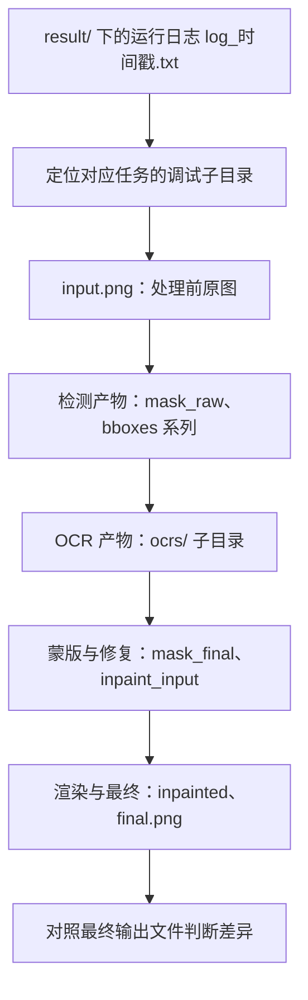
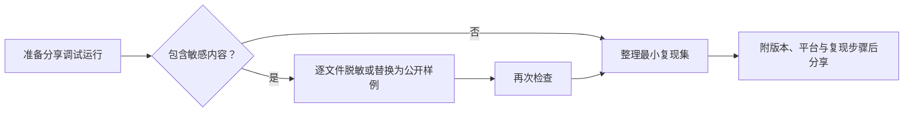

# 如何阅读与分享一次调试运行

当一次翻译结果异常、报错或需要向开发者反馈时，这里说明如何开启“详细日志”生成调试产物、按什么顺序阅读它们，以及清理、脱敏和对外分享的注意事项。逐文件的生成阶段、触发条件和排查用途见[调试目录命名与概览](./folder-naming-and-overview.md)及各调试子页；这里不重复这些内容，也不替代故障排查与隐私清理页面。

## 先看哪些产物 {#scope}

- “详细日志”开关只决定是否把中间产物写入 `result/` 并提升控制台日志级别；它不改变翻译结果，最终输出路径由输出配置（含“输出到原图目录”）决定。
- 运行日志文件始终以 DEBUG 级别写入文件；“详细日志”影响的是控制台输出级别以及调试中间文件是否生成。
- 这里仅列出“阅读顺序、清理、脱敏、分享”；每种产物的具体含义由各自调试页面负责。

## 查看调试产物 {#ui-operations}

### 开启详细日志 {#enable-verbose-logging}

1. 打开“设置”，选择“通用”分组。
2. 打开“详细日志”开关并保存。
3. 重新运行一次翻译任务。Qt UI 启动时无论是否开启详细日志，`result/` 下都会创建运行日志 `log_时间戳.txt`；开启后任务还会为每张图片创建调试子目录。
4. 翻译出错弹出“翻译错误”对话框时，可点击“打开日志文件夹”直接跳转到日志所在目录。

### 定位日志与调试目录 {#locate-logs-and-debug-directory}

- 桌面应用和 CLI 都在应用根目录（开发环境为仓库根目录，打包版为可执行文件所在目录）的 `result/` 下写入 `log_<yyyyMMddHHmmss>.txt`。
- 每张输入图对应一个调试子目录，命名为 `{时间戳毫秒}-{图片MD5}-{检测尺寸}-{目标语言}-{翻译器}`。界面说明文案简写为“时间戳-图片名-目标语言-翻译器”，实际文件名中“图片名”位置是图片的 MD5。
- 批量任务中每张图片都有自己的子目录，按时间戳区分；对应关系可从日志中的图片路径和子目录名核对。

## 阅读顺序 {#reading-order}

推荐的阅读顺序是先看运行日志定位阶段和错误，再进入对应图片的调试子目录，按处理流水线顺序核对中间产物，最后对照最终输出。

- 先看日志：日志包含每张图的处理时间线、警告和错误栈；错误信息里可能带本机路径，公开前必须处理。
- 再看子目录：从 `input.png` 开始，按“检测 → OCR → 蒙版/修复 → 渲染 → 最终”的顺序核对，定位是哪一步偏离了预期。
- 最后对照输出：`result/` 里的 `final.png` 是 verbose 调试副本，最终保存的图片按输出配置写到别处；两者应一致，不一致说明保存环节有问题。
- 条件产物不保证每次都有：无文本早退、特殊工作流、WebSocket 模式和部分 OCR/渲染分支会跳过某些文件，缺失不代表异常。

## 清理 {#cleanup}

清理前先完全退出 Qt UI（或停止 CLI），否则日志文件被文件处理器占用，Windows 上可能删除失败。清理时 `log_*.txt` 和对应时间戳调试文件夹要配套删除，不要只删一半。

| 产物 | 位置 | 清理方式 |
| --- | --- | --- |
| 运行日志 | `result/log_<yyyyMMddHHmmss>.txt` | 关闭应用后删除 |
| 每图调试目录 | `result/<时间戳>-<MD5>-<尺寸>-<语言>-<翻译器>/` | 关闭应用后删除整个目录 |
| OCR 输入裁切 | 上述目录下的 `ocrs/` 子目录 | 随调试目录一起删除 |
| PSD/JSX | `manga_translator_work/psd/`（`psd_script_only` 时在输入图片目录） | 单独删除，不属于 `result/` |
| 运行时配置表 | `config/` 下的 `text_replacements.yaml`、`rich_text_rules.yaml`、`filter_list.json`、`translation_template.json` 及提示词文件 | 删除后下次启动会由 `ensure_runtime_files()` 重建默认值，但自定义修改会丢失 |

## 脱敏 {#sanitization}

`result/` 下的任何图片、JSON、JSX 和日志都可能包含完整页面图、识别文本、框坐标、翻译结果、本机路径甚至凭据，不能直接打包上传。`mask_raw` 只是 base64 编码的 PNG，编码不等于脱敏。

| 数据类别 | 可能出现的位置 | 分享前处理 |
| --- | --- | --- |
| API 密钥、认证密钥、Token | `.env`、环境变量、请求日志、导入配置 | 删除或替换为明显虚构的占位文本 |
| 用户图片、原文、译文、OCR 文本、框坐标、蒙版 | 调试 PNG/JPG、`ocrs/`、逐图 JSON、`mask_raw` | 使用可公开样例；逐文件检查 |
| 本机绝对路径 | 日志、错误信息、PSD JSX、JSON 中的导出目录 | 替换为相对路径或占位符 |
| 私有提示词 | 自定义 prompt JSON/YAML | 不展示正文，只说明结构 |
| 会话/认证令牌 | 服务日志、请求头 | 删除值，只保留头名称 |

## 对外分享 {#sharing}

分享调试运行的目标是让接收方无需你的图片和密钥就能复现问题。优先整理最小复现集，而不是打包整个 `result/` 或工作目录。

| 应包含 | 不应包含 |
| --- | --- |
| 应用/CLI 版本号与操作系统 | 真实 API Key、Token 或密码 |
| 复现步骤、目标语言、翻译器与关键参数 | 用户原图、大段原文/译文文本 |
| `log_*.txt` 中与问题相关的片段 | 整个 `result/` 目录或整个工作目录 |
| 脱敏后的对应时间戳调试子目录 | 本机绝对路径、私有提示词 |
| 脱敏后的配置片段 | 会话令牌、认证信息 |

## 产物与隐私 {#dependencies}

- `verbose` 与最终输出位置互相独立：调试产物写 `BASE_PATH/result/`，最终图按“输出到原图目录”或输出文件夹计算，两者不要混为一处。
- 调试子目录是“某次运行实际存在的产物”；当前源码在不同模式下可能生成更多文件，不要把条件产物写成每次必有。
- 批量、并发与上下文历史不影响调试目录的隔离：每张图片仍按图片 MD5 和时间戳拥有独立子目录。
- 关闭 `verbose` 后，新运行不再生成调试中间文件，但历史 `result/` 内容不会自动删除，需要按上文手动清理。
