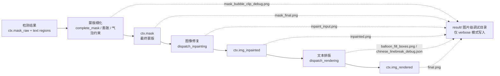

# 蒙版、修复与排版调试产物

启用“详细日志”后，每张输入图会在 `result/` 下建立独立调试子目录，其中蒙版细化、图像修复和文本排版三个阶段会写入用于排查的图片与 JSON。这里说明这些产物的生成顺序、触发条件、画面/内容含义和排查用途；检测阶段的置信热图与 OCR 裁切图分别在[输入、检测与重排调试](./input-detection-and-rearrangement.md)和[OCR 与文本区域调试](./ocr-and-text-regions.md)，替换翻译与 WebSocket 的产物见[特殊工作流与 WebSocket 调试](./special-workflows-and-websocket.md)。

设置页中控制这些阶段的参数（“修复”与“排版”分组）见[蒙版与修复设置](../desktop/settings/mask-and-inpainting.md)和[排版与渲染设置](../desktop/settings/typesetting-and-rendering.md)；这里不重复参数默认值。

## 排查场景 {#when-to-use}

- 文字擦除不干净或背景被破坏时，用 `inpaint_input.png`、`mask_final.png` 和 `inpainted.png` 判断是蒙版范围问题还是修复模型问题。
- 开启“膨胀不超过气泡蒙版”后蒙版异常时，用 `mask_bubble_clip_debug.png` 查看裁剪与回填。
- “智能气泡”排版溢出或降级时，用 `balloon_fill_boxes.png` 查看气泡蒙版、渲染框和溢出候选。
- 中文语义断句选择不符合预期时，用 `chinese_linebreak_debug.json` 查看候选评估与最终选择。
- 所有调试图、断句 JSON 和日志都可能包含完整页面、原文、译文、坐标或 base64 蒙版；对外分享前必须逐文件脱敏。

## 数据流与产物位置 {#data-flow-and-location}

正常翻译流水线在“蒙版生成 → 修复 → 渲染”阶段依次产生 `ctx.mask`、`ctx.img_inpainted` 和 `ctx.img_rendered`，verbose 模式下把中间产物写到当前图片的调试子目录：

- verbose 模式下，调试目录名按 `{timestamp_ms}-{input_md5}-{detection_size}-{target_lang}-{translator}` 生成，产物写入 `BASE_PATH/result/<图片级子目录>/`；目录命名与整体结构见[调试目录命名与总览](./folder-naming-and-overview.md)。
- `ctx.mask_raw` 是检测器输出的原始蒙版（通常是置信度图），`ctx.mask` 是细化后的二值蒙版；蒙版细化只消耗 `ctx.mask_raw` 与 `text_regions`，不直接依赖检测热力图 PNG。
- 特殊流程会改变上述产物集合：AI 渲染器（OpenAI/Gemini 渲染器）跳过修复阶段；`renderer=none` 跳过文本绘制；仅修复、仅翻译 JSON 和替换翻译走各自分支，详见下文与特殊工作流页。

## 蒙版阶段产物 {#mask-artifacts}

蒙版阶段在 `_complete_translation_pipeline()` 中调用 `_run_mask_refinement()`，通过 `dispatch_mask_refinement()` 以 `method='fit_text'` 执行 `complete_mask()`，并按需应用“扩大气泡修复范围”和“膨胀不超过气泡蒙版”。verbose 下写入以下文件：

| 产物 | 触发条件 | 画面/内容含义 | 排查用途 |
| --- | --- | --- | --- |
| `mask_final.png` | `verbose=True`；翻译完成后存在 `ctx.mask` | 最终用于修复的二值蒙版（`255` = 待擦除区域），由 `ctx.mask` 直接写出 | 对照 `inpaint_input.png` 判断蒙版是否过大/过小；过大会侵蚀背景或相邻气泡，过小会残留文字边缘 |
| `mask_bubble_clip_debug.png` | 上一条件；`ocr.limit_mask_dilation_to_bubble_mask=True`；气泡模型返回非空蒙版 | 原图叠加：蓝色=气泡蒙版、绿色=裁剪后保留蒙版、黄色=保护区回填、红色=被裁剪像素，图例位于左上角 | 排查“膨胀不超过气泡蒙版”的裁剪与回填是否符合预期 |
| `mask_raw.png` | `verbose=True`；检测返回 `ctx.mask_raw` | 带置信度颜色条的原始检测热力图 | 属于检测阶段产物；作为蒙版细化的输入来源，详见[输入、检测与重排调试](./input-detection-and-rearrangement.md) |

蒙版细化失败时：仅修复模式回退为对 `ctx.mask_raw` 做简单膨胀（`cv2.dilate`，核为 `config.kernel_size`，迭代 `mask_dilation_offset // kernel_size` 次）；导出/模板模式直接回退为 `ctx.mask_raw`。这些回退不产生额外调试文件。逐图 JSON 保存的蒙版与 `mask_is_refined` 标志，见[调试产物参考索引](../reference/debug-artifact-index.md)。

## 修复阶段产物 {#inpainting-artifacts}

修复阶段通过 `_run_inpainting()` 调用 `dispatch_inpainting()`；`inpaint_input.png` 用 `Inpainter.none` 生成（把蒙版区域涂成纯白），随后真实修复器输出 `ctx.img_inpainted`。verbose 下写入以下文件：

| 产物 | 触发条件 | 画面/内容含义 | 排查用途 |
| --- | --- | --- | --- |
| `inpaint_input.png` | `verbose=True`；翻译完成后存在 `ctx.mask` | 蒙版区域被涂成纯白的修复输入预览（`Inpainter.none` 结果） | 直观确认“哪些区域会被擦除”，与 `mask_final.png` 对照 |
| `inpainted.png` | 正常完整流水线 `verbose=True` | 修复阶段输出的整页 `ctx.img_inpainted` | 确认文字是否擦除干净、背景是否被破坏；AI 渲染器模式跳过修复，此时该文件内容等于原工作图 |

- 选择 OpenAI/Gemini 渲染器时 `_should_skip_inpainting_for_ai_renderer()` 返回真，修复阶段被跳过，`ctx.img_inpainted = ctx.img_rgb`；此时 `inpainted.png` 仍会写出，但内容不是模型修复结果。
- 极端长宽比图片会在 `dispatch_inpainting()` 内按 `INPAINT_SPLIT_RATIO = 3.0` 拆块、重叠融合；开启“逐块修复”时按最终蒙版孤立连通块逐块裁窗修复。两种分块都只改变送入模型的图块，不改变 `inpainted.png` 的整页形态。
- `save_text` 开启时，修复结果还会按“可编辑图片”功能保存到输入图同级的 `manga_translator_work/inpainted/<stem>_inpainted.<原图扩展名>`，该文件不是 `result/` 调试目录产物。

## 排版阶段产物 {#rendering-artifacts}

排版阶段通过 `_run_text_rendering()` 调用 `dispatch_rendering()`；`layout_mode='balloon_fill'` 且 verbose 时渲染器返回调试图与断句记录。verbose 下写入以下文件：

| 产物 | 触发条件 | 画面/内容含义 | 排查用途 |
| --- | --- | --- | --- |
| `balloon_fill_boxes.png` | `verbose=True`；`render.layout_mode='balloon_fill'`；渲染器返回非空调试图 | 原图叠加：红色=OCR 框、黄色=区域气泡连通块、蓝色=全局气泡蒙版、绿色=最终渲染框、橙色=溢出候选框，图例位于左上角 | 排查“智能气泡”排版：区域是否被气泡完整包裹、何时降级为严格边界、溢出候选是否被采用 |
| `chinese_linebreak_debug.json` | 上一条件；`render.semantic_linebreak=True`；目标语言为中文；存在非空断句记录 | `version: 1`、`type: chinese_linebreak_debug`，`records` 数组记录 `stage`、`region_index`、`input`、候选评估、选中结果和 `mask`（png_base64） | 排查中文语义断句候选选择与溢出；记录含原文/译文，分享前必须脱敏 |
| `final.png` | `_revert_upscale()` 被调用；存在 `ctx.result`；`verbose=True` | 最终（或还原尺寸后的）PIL 输出 | 与常规保存结果对照，确认最终排版与导出一致 |

`renderer=none` 时 `_run_text_rendering()` 直接把底图作为输出，不绘制文本，也不产生断句记录。AI 渲染器（OpenAI/Gemini 渲染器）与 `renderer=none` 均不会生成 `balloon_fill_boxes.png` 和 `chinese_linebreak_debug.json`（前者需要 `layout_mode='balloon_fill'`，而 AI 渲染器通常配合其他排版方式）。

## 依赖与限制 {#dependencies-and-limits}

- “详细日志”开关是这些调试产物的总开关；关闭时正常流程不写 `result/` 调试目录（Web/server 模式保存 `final.png` 的分支除外）。
- 条件产物不是每次运行必有：`mask_bubble_clip_debug.png` 需要开关开启且气泡模型返回非空蒙版；`chinese_linebreak_debug.json` 需要 `balloon_fill` + 中文语义断句 + 非空记录；`inpaint_input.png` 与 `mask_final.png` 需要翻译完成后存在 `ctx.mask`。
- 三个调试图片只在正常完整流水线 `_complete_translation_pipeline()` 写入；仅修复、仅翻译 JSON、替换翻译和 WebSocket 模式走各自分支，产物集合不同（见[特殊工作流与 WebSocket 调试](./special-workflows-and-websocket.md)）。
- `inpaint_input.png` 使用 `Inpainter.none` 把蒙版区域涂白，不代表真实修复器的输入预处理，只用于可视化待擦除范围。
- AI 渲染器会跳过修复阶段；`renderer=none` 跳过文本绘制；这些跳过会直接改变 `inpainted.png` 与断句记录是否出现。
- 修复模型按 `inpainting_size` 缩放输入，极端长宽比按 `INPAINT_SPLIT_RATIO=3.0` 拆块；分块与逐块修复只改变模型输入，不改变调试图整页形态。
- 调试图与 JSON 可能含完整用户页面、OCR 文本、译文、坐标、base64 蒙版或本机路径，默认视为用户内容，公开前逐文件检查；这里不展示真实密钥、用户图片或私有绝对路径。
