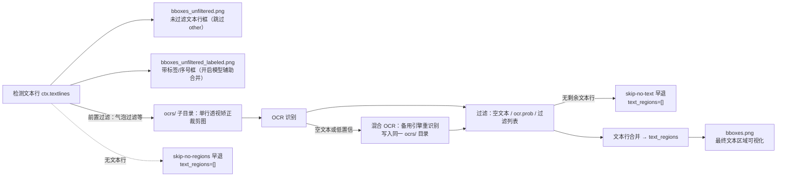

# OCR 与文本区域调试产物

当 OCR 把文字识别错、漏识别、把多行并成一行，或者文本区域的合并与排序不符合阅读顺序时，本页用于读懂“详细日志”在 `result/` 调试目录中生成的 OCR 输入裁剪图、文本区域框和 `ocrs/` 子目录。这些是条件写入的静态调试中间文件：只由“详细日志”开关触发，不参与最终结果，也不代表每次翻译都会生成。

这里仅列出 OCR 输入与文本区域框的可视化产物。检测阈值与 `mask_raw.png`、`bboxes_with_scores.png`、`mask_binary.png`、`hybrid_detection_boxes.png` 等见[检测与重排](./input-detection-and-rearrangement.md)；OCR 引擎、混合 OCR、过滤与合并参数见[OCR、过滤与文本行合并](../desktop/settings/ocr-filter-and-merge.md)；调试目录命名与全局清理见[调试目录命名与总览](./folder-naming-and-overview.md)。

## 先看哪些产物 {#feature-boundary}

- 内容包括的产物：`ocrs/<index>.png`（单行 OCR 输入裁剪图）、`bboxes_unfiltered.png` 与 `bboxes_unfiltered_labeled.png`（OCR 前的文本行框）、`bboxes.png`（合并后的最终文本区域框），以及 `ocrs/` 子目录的路径、触发条件、画面含义与排查用途。
- 产物仅在“详细日志”开关开启时写入；桌面端在“设置 → 通用”中开启，CLI 使用 `-v/--verbose` 参数。该开关的完整说明见[CLI、批处理与输出](../desktop/settings/cli-batch-and-output.md)。
- 不覆盖蒙版、修复、排版、替换翻译和 WebSocket 的调试产物（分别在[蒙版、修复与排版](./mask-inpainting-and-rendering.md)等页面）；不把条件产物描述成每次运行必有。

## 查看调试产物 {#ui-operations}

### 开启详细日志 {#enable-verbose}

1. 打开“设置”，选择“通用”分组，打开“详细日志”开关。
2. 或在使用 CLI 时附加 `-v/--verbose` 参数，例如 `python -m manga_translator local -i <输入路径> -v`。
3. 重新运行需要排查的图片。调试文件写入 `result/<图片调试子目录>/`，`ocrs/` 是其中的子目录。
4. 排查结束并准备分享前，先关闭应用，再删除 `result/` 下不需要的日志文件与调试文件夹。

## 调试产物与触发条件 {#debug-artifacts-and-triggers}

调试文件位于 `result/<图片调试子目录>/`（打包版为可执行文件旁的 `result/`）。开启“详细日志”后，OCR 阶段会创建 `ocrs/` 子目录，其余图片写入同一调试子目录。以下产物全部是条件产物，不是每次运行必有。

### 产物清单 {#artifact-table}

| 产物 | 生成阶段 | 触发条件 | 画面/内容含义 | 排查用途 |
| --- | --- | --- | --- | --- |
| `ocrs/<index>.png` | OCR 阶段 | `verbose=True`，且该文本行通过 OCR 前置过滤（气泡过滤等） | 透视矫正后的单个文本行裁剪图，即送入 OCR 网络的输入；竖排文本旋转为横排；48px 与 PaddleOCR 路径把长边限制到 200px | OCR 识别错误/漏识别时，确认送入模型的图是否裁对、是否被旋转或压缩 |
| `bboxes_unfiltered.png` | 检测后、OCR 前 | `verbose=True`，且检测后仍有文本行 | 原图上绘制未过滤文本行框，跳过标签为 `other` 的框 | 确认哪些框进入 OCR，检测框是否完整覆盖文字 |
| `bboxes_unfiltered_labeled.png` | 检测后、OCR 前 | `verbose=True`，开启模型辅助合并（`ocr.merge_special_require_full_wrap`），且收到非空文本行 | 带序号与标签（`balloon`、`qipao`、`other` 等）的彩色文本行框，优先使用检测原始全集 | 排查标签分流与模型辅助合并的输入 |
| `bboxes.png` | 文本行合并后 | `verbose=True`，且存在 `ctx.text_regions` | 最终文本区域（`TextBlock`）可视化：panel 框（关闭简单排序时）、区域外框、行折线、角度/坐标标注与区域序号 | 排查文本行合并、阅读顺序与 panel 划分 |

### 无文本早退 {#no-text-early-exit}

- 检测后没有文本行：报告 `skip-no-regions`，`ctx.text_regions` 置为空列表，不写 `bboxes_unfiltered*.png` 与 `bboxes.png`，直接进入还原尺寸阶段。
- OCR 后没有文本行（全部为空文本、低置信或命中过滤列表）：报告 `skip-no-text`，`ctx.text_regions` 置为空列表，不写 `bboxes.png`。
- 因此“调试目录里没有 `bboxes.png`”不一定是写入失败，也可能是无文本早退；请先看日志中的 `skip-no-regions` / `skip-no-text`。

## 产物如何生成 {#runtime}

### 从文本行到文本区域的调试链路 {#data-flow}

### `ocrs/` 子目录的写入与编号 {#ocrs-writing-and-indexing}

- verbose 开启时，OCR 裁剪图写入 `<result>/<图片调试子目录>/ocrs/`（配置了 `result_sub_folder` 时在其下多一级）。
- 写裁剪图的 OCR 引擎包括 32px、48px、48px-CTC、Manga OCR 与 PaddleOCR 共五个；AI OCR（OpenAI/Gemini）与 PaddleOCR-VL 不写逐区域裁剪图。
- 编号按文本行处理顺序递增；PaddleOCR 使用原始文本行序号（`{i}.png`），32px 使用运行序号（`{ix}.png`），48px/48px-CTC/Manga OCR 使用批内全局编号（`{ix-N+i}.png`）。被前置过滤的行不写文件，因此编号不连续。
- 竖排文本写入前旋转 90°；48px 与 PaddleOCR 路径把长边限制到 200px 并启用高压缩 PNG。
- 当图片级调试子目录不可用时，回退到 `result/ocrs/`（不带图片级子目录）。

### 文本区域框的画面含义 {#text-region-box-meaning}

`bboxes.png` 中的画面含义：

- panel 框为紫色矩形并带 panel 序号，仅在不使用简单排序（`force_simple_sort=False`）时执行 panel 检测；
- 每个文本区域画绿色外框（包围盒）、每行的青色折线与行号，以及黄色最小外接矩形；
- 区域中心标注角度 `a:`、左上角坐标 `x:`/`y:`，区域左上角标注区域序号。

### 过滤与混合 OCR 对产物的影响 {#filter-and-hybrid-effects}

- 过滤阶段依次丢弃空文本、低于 `ocr.prob` 的低置信行和命中过滤列表（`filter_text_enabled`）的行；被丢弃的行不会出现在 `text_regions` 与 `bboxes.png` 中。
- 混合 OCR（`ocr.use_hybrid_ocr`）把主 OCR 空文本或低置信的行交给 `ocr.secondary_ocr` 重新识别，两次运行都会写 `ocrs/`，编号可能冲突并被覆盖，因此同一编号最终保留哪次结果需要以实际运行为准。
- 无文本早退发生在过滤之后，此时 `bboxes.png` 不生成；这不影响 `input.png`、`final.png` 等其他阶段产物。

## 产物与隐私 {#dependencies}

- `ocrs/` 与所有框图都依赖 `cli.verbose=True`；关闭 verbose 后不产生任何本页产物。
- `bboxes_unfiltered_labeled.png` 依赖模型辅助合并开关（`ocr.merge_special_require_full_wrap`），关闭时不写该文件。
- `bboxes.png` 是否画 panel 框依赖 `force_simple_sort`；开启简单排序时只画区域框。
- 混合 OCR 两次识别共用 `ocrs/` 目录，编号不保证与最终文本区域一一对应；不要把 `ocrs/<index>.png` 直接当作最终区域序号的证据。
- 产物来自用户原图与 OCR 文本，可能包含用户图像、原文与坐标；分享前必须逐文件检查并脱敏。
