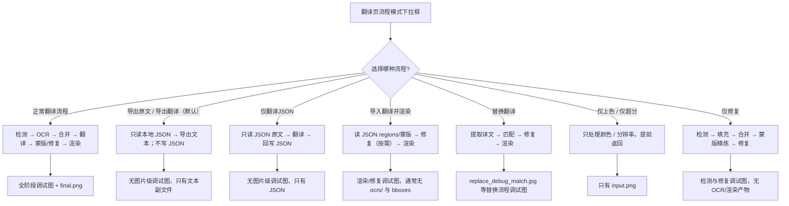
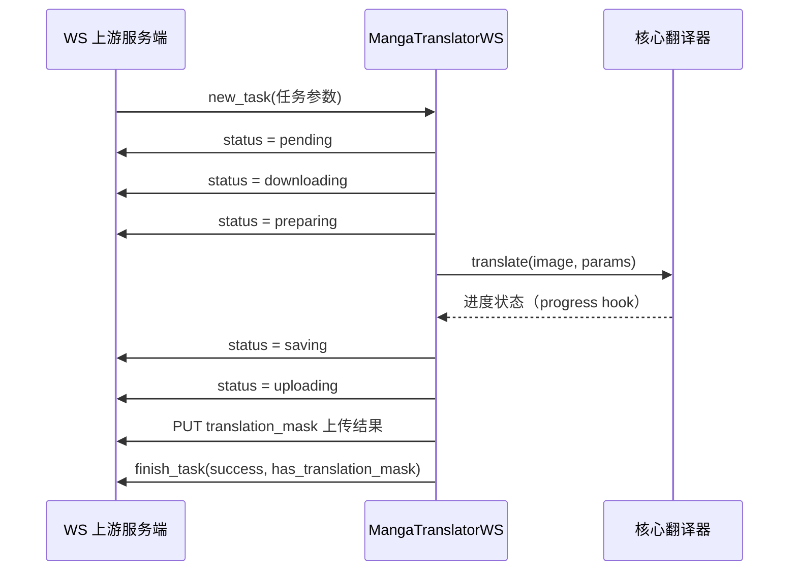

# 特殊工作流与 WebSocket 调试产物

当“导出原文”“导出翻译”“仅翻译（JSON）”“导入翻译并渲染”“替换翻译”或“仅上色/仅超分/仅修复”等流程跳过标准流水线的部分阶段时，这里说明它们会（或不会）产生哪些调试产物；`ws` 与 `shared` 两种内部传输模式除了普通调试图外，还有自己的 `ws_*` 调试图与传输相关文件。普通翻译流程的逐阶段调试图片见[调试目录与总览](./folder-naming-and-overview.md)、[OCR 与文本区域](./ocr-and-text-regions.md)、[蒙版、修复与排版](./mask-inpainting-and-rendering.md)；`ws`/`shared` 的完整协议契约见[内部 shared 与 WebSocket 协议](../developer/internal-shared-and-websocket.md)。

## 先看哪些产物

- 调试产物分为三类：特殊工作流跳过阶段后的“条件产物”、`ws` 模式渲染回调写入的 `ws_*` 图片、以及 `shared`/`ws` 模式运行产生的日志与目录。
- 除特别说明外，所有调试产物都需要 `verbose` 开启；不开启时只写最终输出图、JSON/文本导出等业务文件。
- “某次运行实际存在的产物”和“当前源码在该模式下可能生成的完整产物”不同：例如导入翻译并渲染只在缺少蒙版或需要重新检测时才会触发检测分支。
- 这里不重复 `shared`/`ws` 的端点、端口、鉴权和 pickle/protobuf 序列化细节，那些属于[内部 shared 与 WebSocket 协议](../developer/internal-shared-and-websocket.md)。

## 查看调试产物

### 在翻译页选择流程模式

打开“翻译”页面。页面上方是“翻译流程模式：”下拉框，下方“开始任务前请选择翻译流程模式。”是提示文字。下拉框共 9 个选项，选中后会把对应后端标志写入配置并立即保存；开始按钮文案也会随模式变化。

### 在设置页开启详细日志

打开“设置”→“通用”分组，勾选“详细日志”开关。Qt UI 启动时无论此项是否开启，都会创建运行日志 `result/log_<时间戳>.txt`。开启后，控制台还会显示 DEBUG 级别信息，并在每次翻译时为单张图片建立保存调试缓存/中间文件的子目录；关闭后不会创建这些图片级调试子目录。CLI 的 `local`、`ws`、`shared`、`web` 子命令各自提供 `-v/--verbose` 开关。

## 特殊工作流调试产物

下拉框中的 8 个非默认模式都会跳过标准流水线的部分阶段，因此下表是“详细日志开启时该模式可能产生的条件产物”，不是每次运行都有。

| 流程模式（UI） | 跳过/改变阶段 | verbose 条件产物 |
| --- | --- | --- |
| 正常翻译流程 | 无 | 标准流水线全套：`input.png`、`mask_raw.png`、`bboxes*.png`、`ocrs/`、`mask_final.png`、`inpaint_input.png`、`inpainted.png`、渲染类调试图、`final.png` |
| 导出原文 | 默认沿用检测/OCR；开启本地 JSON 开关后只读 JSON | 默认可能产生检测/OCR调试图；开关开启后无图片级调试图且不修改 JSON |
| 导出翻译 | 默认沿用检测/OCR/翻译；开启本地 JSON 开关后只读 JSON | 默认可能产生检测/OCR/翻译调试图；开关开启后无图片级调试图且不修改 JSON |
| 仅翻译（JSON） | 跳过检测/OCR/渲染；只读写 JSON | 无图片级调试图；成功后回写 JSON 并删除 `imagename_original.txt` |
| 导入翻译并渲染 | 跳过检测/OCR/翻译；直接渲染 | 通常只有渲染/修复类产物（`inpaint_input.png`、`mask_final.png`、`inpainted.png`、`final.png`）；缺少蒙版或开启导入 YOLO 框时才触发检测分支 |
| 替换翻译 | 不走普通翻译；提取译文→匹配→修复→渲染 | `replace_debug_match.jpg`、`inpainted.png`、`debug_extracted_text.png` |
| 仅上色 | 只上色 | `input.png`；无检测/OCR/渲染/`final.png` |
| 仅超分 | 只超分 | `input.png`；无检测/OCR/渲染/`final.png` |
| 仅修复 | 检测→填充→合并→蒙版精炼→修复；无 OCR/翻译/渲染 | `input.png`、检测类调试图（`bboxes_with_scores.png` 等）、`inpaint_input.png`、`mask_final.png`、`inpainted.png` |



上图描述的是代码中的分支。每个分支的实际产物还依赖检测器是否返回调试图、是否有文本区域、是否缺少蒙版等条件，不能把条件产物写成每次必有。

### 导出类流程

- “导出原文”和“导出翻译”默认沿用旧流程：前者执行检测/OCR，后者还执行翻译，因此可能生成检测/OCR调试图并写回 JSON。
- 开启“仅从本地 JSON 导出文本”后，两个模式会在图片加载前只读本地工程 JSON；verbose 不产生 `input.png`、检测/OCR或渲染调试图，只生成相应文本副文件，JSON 保持不变。
- “仅翻译（JSON）”从 JSON 读原文翻译后回写 JSON，成功后删除对应的 `imagename_original.txt`；该分支不进入逐图调试写入。
- 模板格式由 `config/translation_template.json` 决定；文本副文件属于业务文件，不是调试产物。

### 导入与替换流程

- “导入翻译并渲染”：从 `_translations.json`（或内存载荷）读 regions 与蒙版后直接渲染，跳过检测/OCR/翻译。JSON 已带精炼蒙版时不再生成检测类调试图；JSON 缺蒙版、或开启“导入 YOLO 框”需要重新检测生成蒙版时，才会触发检测分支。修复图可能来自编辑器内存载荷、磁盘 `manga_translator_work/inpainted/` 或重新运行修复，只有真正运行修复时才有 `inpaint_input.png`/`mask_final.png`/`inpainted.png`。
- “替换翻译”：把同名的翻译图放到 `manga_translator_work/translated_images/`，程序提取译文文字、在生肉图上匹配区域、修复原文区域并渲染译文。verbose 时依次写 `replace_debug_match.jpg`（生肉框/翻译框/匹配线与重叠率）、`inpainted.png`（修复后的生肉图）、`debug_extracted_text.png`（直接粘贴模式下提取的译文文字）。

### 单阶段流程

- “仅上色”/“仅超分”：在逐图入口保存 `input.png`（verbose）后立即返回，不进入检测/OCR/翻译/渲染，因此没有 `mask_raw.png`、`ocrs/`、`inpainted.png`、`final.png`。
- “仅修复”：执行“检测 → 填充占位文本 → 文本行合并 → 蒙版精炼 → 修复”，跳过 OCR、翻译与渲染。verbose 时产生 `input.png`、检测器返回的调试图（如 `bboxes_with_scores.png`/`mask_binary.png`/`hybrid_detection_boxes.png`）和修复类产物（`inpaint_input.png`、`mask_final.png`、`inpainted.png`），不产生 `ocrs/` 与渲染调试图，也没有 `final.png`。

## WebSocket 与共享传输调试产物

`ws` 模式（`MangaTranslatorWS`）在 verbose 时除了普通流水线产物，还会在图片级调试子目录写入以下渲染相关图片；`shared` 模式本身不写专属文件，但 verbose 时同样走普通 `_result_path()` 调试目录。

| 产物 | 写入点 | 触发条件 | 内容与消费者 |
| --- | --- | --- | --- |
| `ws_render_in.png` | `manga_translator/mode/ws.py#_run_text_rendering` | `ws` 模式且 verbose | 渲染前的图像 `ctx.img_rgb` |
| `ws_render_out.png` | 同上 | `ws` 模式且 verbose | 渲染后的输出，未裁蒙版 |
| `ws_mask.png` | 同上 | `ws` 模式且 verbose | 最终渲染蒙版（白色 255），由“渲染前后有差异的像素”与 `ctx.mask` 合并得到 |
| `ws_inmask.png` | 同上 | `ws` 模式且 verbose | 仅保留蒙版区域的输入图（RGBA × mask） |
| `ws_output.png` | 同上 | `ws` 模式且 verbose | 仅保留蒙版区域的渲染输出（RGBA × mask），即真正上传的结果内容 |
| `ws_final.png` | `manga_translator/mode/ws.py#server_process_inner` | `ws` 模式且 verbose，且翻译成功 | 还原到原尺寸（LANCZOS）后的最终结果 |
| `result/<task_id>/` | `manga_translator/mode/ws.py#server_process_inner` | `ws` 模式且 verbose | 处理前先清理并重建该目录；当前源码中 `ws_*` 调试图实际经 `_result_path()` 写入图片级子目录，`result/<task_id>/` 与图片级子目录的关系需在所用版本中确认 |

`shared` 模式的传输相关文件只有运行日志与调试子目录本身：`MangaShare` 用 `MangaTranslator(params)` 创建翻译器，`verbose` 由参数透传，调试图写入与普通模式相同的 `result/<image-subfolder>/` 位置。`result/log_<时间戳>.txt` 是桌面 Qt UI 在 `desktop_qt_ui/main.py` 启动时配置的全局 DEBUG 日志，不属于单图调试子目录。

## 产物如何生成

### 调试目录与触发条件

每张输入图开始处理时生成子目录名：

```text
{毫秒时间戳}-{图片MD5前8位}-{detection_size}-{目标语言}-{翻译器}
```

MD5 是对 PNG 归一化后的图片内容计算并截取前 8 位，计算失败时回退为 `fallback_<时间戳>`。verbose 且有图片上下文时，产物写入 `BASE_PATH/result/<图片子目录>/<产物>` 并自动创建父目录；`BASE_PATH` 在打包版为可执行文件所在目录，开发环境为仓库根目录。设置页“详细日志”的描述文案把它简写为“时间戳-图片名-目标语言-翻译器”，实际中间字段是 MD5 与检测尺寸。

这些直接写入的终端诊断文件（如 `input.png`、`mask_raw.png`、`bboxes*.png`、`ocrs/`、`inpaint_*.png`、`inpainted.png`、`final.png`）供开启 verbose 的操作者或问题报告接收者查看。

### WebSocket 模式协议与产物

`ws` 模式以内部执行器身份主动连接上游服务器，从上游给定的图片地址下载图片，翻译完成后把结果回传，并持续上报 `status` 消息（`pending` → `downloading` → `preparing` → `saving` → `uploading`，另有 `error-download`、`error-upload`）。端点、鉴权与消息格式等协议细节见[内部 shared 与 WebSocket 协议](../developer/internal-shared-and-websocket.md)。



verbose 时写入 `ws_render_in`/`ws_render_out`、`ws_mask`、`ws_inmask`、`ws_output`，上传前还会保存 `ws_final.png`；这些文件的含义见上文“WebSocket 与共享传输调试产物”。

### 共享传输协议与产物

`shared` 模式在本地启动内部服务，只放行 `translate` 与 `translate_batch` 两个方法，verbose 时的调试产物与普通模式一致（写入图片级调试子目录）。其监听地址、鉴权与消息帧格式等协议细节见[内部 shared 与 WebSocket 协议](../developer/internal-shared-and-websocket.md)。
## 产物与隐私

- 所有调试产物都以 `verbose` 为前提；`desc_cli_verbose` 描述的是 Qt UI 行为，CLI 各模式用 `-v` 单独控制，两者不要混写。
- 特殊工作流与 `batch_concurrent` 不兼容：`load_text`、`translate_json_only`、`template+save_text`、`generate_and_export`、`colorize_only`、`upscale_only`、`inpaint_only`、`replace_translation` 任一开启时，`batch_concurrent` 会被忽略并回退顺序处理；`template+save_text` 还会强制 `batch_size=1`。
- `ws`/`shared` 是内部执行链路，不是对外 Web API；Web 模式的 `0.0.0.0:8000`、shared 的 `127.0.0.1:5003`、ws 上游的 `ws://localhost:5000` 三个端口不能混写。
- 调试图片、`ocrs/` 裁切图、`replace_debug_match.jpg`、`ws_*` 图片、JSON 和日志都可能包含用户图像、原文/译文文本或本机路径；对外分享前必须逐文件脱敏，`mask_raw` base64 或 PNG 调试图都不等于已脱敏。
