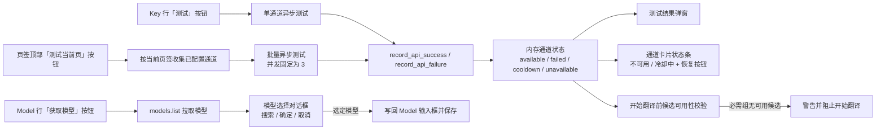

# 连接测试与模型列表

在 API 管理页填好 Key、Base 与 Model 后，先用本页功能验证连接是否真的可用，再从服务端拉取模型名写回“模型”字段。测试不只弹结果框：成功或失败会写入内存中的通道状态，并影响“开始翻译”前的候选可用性校验。

这里不负责凭据字段本身的填写、掩码与 `.env` 持久化（见[API 凭据、地址与模型](./credentials-addresses-models.md)），不负责通道增删与轮询策略（见[通道与轮询策略](./slots-and-rotation.md)），也不负责真实请求失败后的冷却、不可用与自动恢复状态机（见[失败、冷却与恢复](./failures-cooldown-and-recovery.md)）。

## 配置范围

- “测试”测试单个 API 通道（Key 行右侧按钮）；“测试当前页”批量测试当前功能页签下所有已配置通道。批量测试只作用于当前页签（翻译/文字识别/上色/渲染），不会跨页签。
- 测试结果通过 `record_api_success` / `record_api_failure` 写入内存状态；开始翻译前 `validate_api_candidate_availability()` 按必需通道组检查是否还有可用候选，全部不可用时阻止开始并弹出警告。
- “获取模型”从服务端拉取模型列表，并把选中的模型名写回 Model 输入框。只有模型行有该按钮；Key 行只有“测试”，Base 行两个按钮都没有。
- 这里不覆盖 `run_with_api_candidates` 的 failover/round_robin 请求重试、冷却计时与恢复逻辑，那部分状态机属于[失败、冷却与恢复](./failures-cooldown-and-recovery.md)。
- 测试与取模型都会发起真实网络请求，需要对应通道已填写 Key/Base/Model；本地 OpenAI 兼容端点（`localhost`、私有 IP、`.local` 等）在密钥为空时会自动使用 `ollama` 占位密钥。

## 在 API 管理中操作

### 测试单个 API 通道

1. 打开“API 管理”，选择“翻译”、“文字识别”、“上色”或“渲染”页签。
2. 在任一 API 通道卡片的 Key 行右侧点击“测试”。
3. 弹出进度框“测试中”与“正在测试API连接，请稍候...”，可点击“取消”中止；取消后不弹结果框。
4. 成功时弹出信息框，标题“API连接测试成功！”；失败时弹出“错误”框，标题“API连接测试失败”，正文包含分类后的排查建议与 API 地址示例。

### 测试当前页的全部通道

1. 在页签顶部的功能选择器行右侧点击“测试当前页”。
2. 弹出“API 批量测试”进度框，提示“正在测试 {count} 个 API 通道，并发 {concurrency}...”，并发数固定为 3。
3. 完成后弹出“API 批量测试结果”：“共 {total} 个，可用 {available} 个，不可用 {unavailable} 个”。正文只列出不可用通道，前缀为 `[不可用]` 并附错误信息；全部可用时只显示“无不可用 API”。
4. 若当前页签没有任何可测通道（未填写 Key/Base，且本地占位规则不适用），点击后只提示“没有可测试的 API 通道”。

### 获取模型列表并写入模型字段

1. 在任一 API 通道卡片的 Model 行右侧点击“获取模型”。
2. 弹出“获取模型”进度框，提示“正在获取模型列表，请稍候...”，可取消。
3. 成功后弹出“选择模型”对话框，提示“可用模型：”，输入框占位为“搜索模型...”，按钮为“确定”/“取消”；未选中任何模型时“确定”禁用，只有一个过滤结果时自动选中。
4. 选定模型后点“确定”，模型名会写回 Model 输入框并触发保存；服务端返回空列表时提示“没有可用的模型”；拉取失败时提示“获取模型列表失败”。

## 测试结果展示 {#test-result-display}

### 单通道测试结果

成功信息框标题固定为“API连接测试成功！”，正文显示测试函数返回的详情（例如“连接成功，模型 {model} 可用”）。失败框标题为“API连接测试失败”，正文按错误关键字分类给出建议，并附加“API 地址示例：{地址}”和原始错误（按 60 字符换行）。这些详情文本目前是中文硬编码，不随界面语言切换。

### 批量测试结果

批量测试结果框按“可用/不可用”汇总。结果标题显示总数与可用/不可用数量；正文只列出未通过的通道，每行前缀 `[不可用]` 后跟通道标签（如 `OpenAI API Key #2`）与包装后的错误信息；全部通过时正文为空并显示“无不可用 API”。关闭弹窗后界面按最新状态重建通道卡片与状态条。

### 通道状态条与恢复

当通道处于 `unavailable`（永久不可用）或 `cooldown`（冷却中）时，对应通道卡片内会插入彩色状态条：`unavailable` 显示“不可用”，`cooldown` 显示“冷却中”，右侧是同步图标恢复按钮（提示文字“恢复”）。点击恢复会调用 `clear_api_status` 清除该通道的内存状态并立即重建分组。

## 请求如何处理 {#runtime-behavior}

### 测试目标识别与通道收集

每个环境变量键先按 `OCR_` / `COLOR_` / `RENDER_` 作用域与 `OPENAI` / `GEMINI` / `DEEPSEEK` / `GROQ` / `CUSTOM_OPENAI` / `SAKURA` 提供商拆分，再识别测试目标：作用域决定 `openai_ocr`、`gemini_ocr`、`openai_colorizer`、`gemini_renderer` 等；无作用域的提供商映射到 `openai`、`gemini`、`sakura` 等；翻译页签还会用当前翻译器键兜底。批量测试只收集当前页签作用域下字段为 `API_KEY` / `AUTH_KEY` / `TOKEN` 的键，按“功能:提供商:槽位”去重；翻译页签且当前翻译器为 Sakura 时，额外收集 `SAKURA_API_BASE` 作为单项。一个通道只有在配置了 Key，或是 Sakura/本地 OpenAI 兼容端点只需要地址时才会进入测试列表。

### 测试请求的构造

`test_api_connection_async()` 按测试目标分发到不同实现，全部走真实 HTTP 请求：

- OpenAI 文本（翻译）：填了模型就调用 `chat.completions.create` 测试该模型，否则调用 `models.list`；客户端超时 30 秒。
- OpenAI OCR：未填模型时使用默认 `gpt-4o`，向模型发送一张 50×50 白色测试图并附带 “Read the image and reply with OK.”；超时 30 秒。
- OpenAI 上色/渲染：未填模型时使用默认 `gpt-image-1`，调用图像生成接口；超时 60 秒。
- Gemini 文本/OCR：未填模型时 OCR 使用默认 `gemini-1.5-flash`，生成内容或列出模型；超时 30 秒。
- Gemini 上色/渲染：未填模型时使用默认 `gemini-2.0-flash-preview-image-generation`，请求 TEXT+IMAGE 模态并关闭安全阈值；超时 60 秒。
- Sakura：使用 OpenAI 兼容客户端和固定占位密钥测试模型或列出模型；测试路径没有显式短超时，依赖 SDK 默认值。

OpenAI 系列优先使用跟随当前 Chrome 浏览器指纹的 `curl_cffi` 客户端（`impersonate="chrome"`），不可用时回退到标准 `openai` 客户端；Gemini 系列优先 `AsyncGeminiCurlCffi`，不可用时回退到 `google-genai` 同步客户端（在事件循环执行器中运行）。

### 模型列表拉取

`get_available_models_async()` 对 OpenAI 兼容目标调用 `models.list()`，读取全部 `data[].id` 并 `sort(reverse=True)` 让较新模型排前，客户端超时 60 秒；Gemini 使用 `models.list()`（curl_cffi 分支直接取 `id`，google-genai 回退分支去掉 `models/` 前缀）；Sakura 同样走 OpenAI 兼容 `models.list()`。模型列表来自服务端返回值，依赖凭据、地址与远端服务，不能作为静态选项表。不支持的目标（既不是 OpenAI 兼容也不是 Gemini/Sakura）返回“该翻译器不支持获取模型列表”并提示“获取模型列表失败”。

### 失败分类与用户提示

`_format_test_connection_error()` 按关键字把错误分为三类并给出建议：网络类（connection、timeout、DNS、host、`curl: (7)`、`curl: (28)` 等）建议先检查模型/地址/密钥，再检查网络并尝试开启 TUN（虚拟网卡模式）；服务类（502/503/504、service unavailable、bad gateway、upstream 等）建议稍后重试或更换 API 站点/渠道；其余统一提示检查模型、地址与密钥。错误正文还附“API 地址示例：{示例}”。`record_api_failure()` 会进一步按 400/402/404/429 与消息标记把状态写成 `failed` / `cooldown` / `unavailable`。

### 超时与取消

单通道测试、批量测试与取模型都在独立异步任务中运行，期间显示可取消的进度框。取消或任务被取消时直接关闭进度框，不弹结果框。客户端超时（文本/OCR 30 秒、图像与取模型 60 秒）由测试代码传入；超时异常会进入失败分类，按“连接错误、超时”提示处理。

## 测试与取模型数据流 {#flow-diagram}

上图画的是数据流：测试结果通过共享内存状态同时影响结果弹窗、卡片状态条和开始翻译的门禁；取模型单独走 `models.list`，只在用户选定后才写回配置。它不代表“测试成功”就等于“真实翻译一定成功”——真实请求仍受轮询策略、冷却与恢复状态机影响，见[失败、冷却与恢复](./failures-cooldown-and-recovery.md)。

## 凭据、网络与错误

- 测试与取模型依赖通道的 Key/Base/Model 与网络；这里不会写真实密钥，也不会把服务端返回的模型列表当作静态枚举。
- 测试写入的状态是内存态（`_API_STATUS`），不持久化到 `.env` 或 `config.json`；重启后状态清空，卡片不显示历史状态条。
- 开始翻译前的候选校验会把处于 `cooldown` / `unavailable` 的通道视为不可用；需要重新“测试当前页”或点击恢复按钮后再开始。
- 混合 OCR 开启时，主/副 OCR 的 OpenAI/Gemini 分组可能同时出现，批量测试会把两组通道都纳入当前页签测试。
- Sakura 分组没有 Model 字段，因此没有“获取模型”按钮；若测试目标带 `sakura`，只需要地址即可发起测试。
- 取模型对 OpenAI 兼容端点与 Gemini 的实现不同（排序、前缀处理、回退客户端），返回的模型名写法可能不同，直接写入 Model 字段前应确认与请求体 `model` 字段的兼容性。
