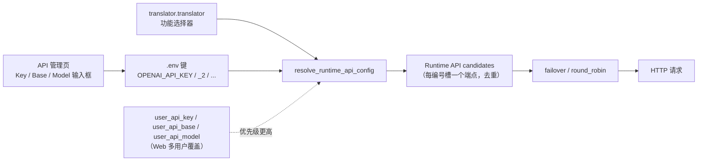

# API 凭据、地址与模型

当使用 OpenAI、Gemini 或 Sakura 等远程 API 时，这里说明如何填写各提供商的密钥（Key）、API 地址（Base）与模型名（Model）三个字段，它们如何保存到 `.env`、如何通过编号通道（`_2`、`_3` …）复用，以及界面如何隐藏和脱敏这些值。这里不负责提供商页签、功能选择器、槽轮换策略、连接测试、自定义请求参数和预设；它们分别在[提供商页签](./provider-tabs.md)、[功能选择器](./feature-selectors.md)、[通道与轮询策略](./slots-and-rotation.md)、[连接测试与模型列表](./connection-tests-and-model-list.md)、[自定义请求参数](./custom-request-parameters.md) 和[预设与持久化](./presets-and-persistence.md) 中说明。

## 配置范围

- Key/Base/Model 是“API 通道”卡片的三个字段：Key 保存密钥、Base 保存请求地址、Model 保存模型名，三者各自对应一个 `.env` 键。
- 只有被当前功能选择器激活的提供商分组才显示凭据卡片。OpenAI/Gemini 使用 Key/Base/Model；Sakura 只有地址和词典路径，没有 Key 与 Model。
- `.env` 是桌面端唯一凭据持久化位置；`config.json` 与 `config/config-example.json` 不保存 API 密钥。Web 多用户场景的 `user_api_key`/`user_api_base`/`user_api_model` 是配置覆盖，不属于本页输入框。
- `_2`、`_3` 等编号后缀是同一提供商内部的候选通道，不是新翻译器；切换翻译器仍由 `translator.translator` 决定。

## 在 API 管理中操作

### 在 API 管理页填写凭据

1. 打开左侧导航“API 管理”。页面副标题为“管理每个翻译器的 API 密钥和环境变量”。
2. 在顶部页签中选择“翻译”、“文字识别”、“上色”或“渲染”。
3. 每个页签顶部是功能选择器行（标签如“翻译器：”）和“测试当前页”按钮。切换功能会刷新下方凭据分组，详细边界见[功能选择器](./feature-selectors.md)。
4. 被激活的提供商显示一张或多张“API 通道”卡片。卡片标题最左侧是拖拽手柄，随后是两位编号徽标（例如 `01`、`02`）与“API 通道”，右上角是删除按钮。编号只显示在徽标中，不拼进标题文字。
5. 卡片内按顺序显示三个字段：Key（例如“OpenAI API Key”）、Model（例如“OpenAI Model”）、Base（例如“OpenAI API Base”）。
6. 密钥输入框默认以掩码显示（密码回显模式），点击行内眼睛图标可在“显示密钥”与“隐藏密钥”之间切换。
7. Key 行右侧有“测试”按钮，Model 行右侧有“获取模型”按钮，Base 行没有按钮。
8. 点击“+ 添加 API 通道”会为当前提供商创建编号为 `_2` 的下一个通道；达到界面上限后按钮隐藏。
9. 按住拖拽手柄可调整通道顺序；整组 Key/Model/Base 会一起写入新的连续编号。任一字段修改后立即更新内存与 `os.environ`，并在 250ms 合并后由后台线程原子写回 `.env`。

## 编号通道字段

同一个提供商的三个字段可以按编号组成多个候选通道。编号从 `1` 开始，`1` 对应基础键本身，`2` 及以上在键名末尾追加 `_<编号>`：

- `OPENAI_API_KEY`、`OPENAI_MODEL`、`OPENAI_API_BASE` 是 1 号通道。
- `OPENAI_API_KEY_2`、`OPENAI_MODEL_2`、`OPENAI_API_BASE_2` 是 2 号通道，以此类推。

- `get_indexed_env_key(base_key, index)` 负责生成编号键：`index <= 1` 返回基础键，否则返回 `f"{base_key}_{index}"`。
- `get_rotation_slot_count()` 扫描当前 `.env` 中所有形如 `<base>_<编号>` 的键，取最大编号作为通道数量；空槽的卡片会照常显示。
- 界面上限 `API_ROTATION_UI_MAX_SLOTS = min(10, MAX_ROTATION_SLOTS)`，其中引擎层 `MAX_ROTATION_SLOTS = 30`；达到上限后“+ 添加 API 通道”按钮隐藏。
- “+ 添加 API 通道”先为新编号的三个键写入空值再刷新；拖拽排序由 `_build_api_rotation_reorder_updates()` 整组改写各编号的 Key/Model/Base；删除某张卡片时 `_delete_api_rotation_slot()` 会把后续槽整体前移，保持卡片编号连续，再删除最后一个槽的键。
- 每个提供商组还有一个策略键，例如 `OPENAI_API_ROTATION_STRATEGY`、`OCR_OPENAI_API_ROTATION_STRATEGY`，由“轮询策略：”下拉框写入；策略如何决定请求顺序见[通道与轮询策略](./slots-and-rotation.md)。
- 运行时按 1..通道数读取每个编号的 Key/Base/Model，并去掉 `(api_key, base_url, model)` 完全相同的重复端点。

## 隐藏与脱敏

- `_is_secret_env_key()` 把包含 `API_KEY`、`AUTH_KEY` 或 `TOKEN` 的键视为机密，例如 `OPENAI_API_KEY`、`DEEPL_AUTH_KEY`、`CAIYUN_TOKEN`。
- 机密字段使用密码回显模式（`QLineEdit.EchoMode.Password`），行内眼睛图标在“显示密钥”与“隐藏密钥”之间切换；工具提示文案来自 `Show Secret` / `Hide Secret` 两个 locale key。
- 密钥与令牌的占位符分别是“粘贴你的密钥”和“粘贴你的令牌”，不包含真实值。
- `.env` 是明文本地文件，位于打包后的 exe 目录或开发时的项目根目录；不要提交、导出或截图真实密钥。预设可以保存 API 环境变量，但导出的配置 JSON 明确排除 API 密钥，见[预设与持久化](./presets-and-persistence.md)。

## 请求如何处理

`ConfigService` 启动时把 `.env` 读入内存并加载到 `os.environ`（`load_app_dotenv(override=True)`）。输入框每次修改都会立即更新内存和 `os.environ`，并由 `QTimer` 以 250ms 合并，之后在“config-writer”后台线程中把整个 `.env` 原子重写为 `KEY="value"` 行。翻译器、OCR、上色器和渲染器在 `parse_args()` 时调用 `resolve_runtime_api_config()`，按编号槽读取环境变量并构造候选端点，最后交给 `failover`/`round_robin` 策略发起实际请求。

对 OpenAI 兼容的本地端点（`localhost`、私有 IP、`.local` 等），空密钥会被规范化为 `ollama` 占位值，使 Ollama 等本地服务无需填写密钥即可工作；非本地端点仍要求真实密钥。

## 凭据、网络与错误

- 功能选择器决定显示哪个提供商分组；在 API 管理页切换翻译器会写同一个 `translator.translator` 键，并刷新所需凭据组。
- 开启混合 OCR（`ocr.use_hybrid_ocr`）时，主 OCR 与副 OCR 对应的 OpenAI/Gemini 分组可能同时显示。
- Sakura 分组只有地址与词典路径；没有 Key/Model，也就没有“获取模型”按钮，但“测试”仍按地址执行。
- Web 服务场景下，`translator.user_api_key`/`user_api_base`/`user_api_model` 以及服务器端 `_runtime_api_overrides` 的优先级高于 `.env`；桌面端默认不存在这些覆盖。
- 本页字段与自定义请求参数（`config/custom_api_params.json`）无关；模型名会成为请求体中的 `model` 字段，自定义参数按模型名匹配预设。
- API 密钥会写入 HTTP 请求头。若密钥混入中文、全角符号或不可见字符，桌面端会在发起网络请求前停止，并提示异常字符在密钥中的位置；请重新从服务商复制纯净密钥，不要删除字符后继续猜测原密钥。
- 未激活的历史环境变量（DeepL、彩云、百度、有道、Groq、DeepSeek、Together 等）不会在界面显示，但代码仍保留其读取逻辑。
