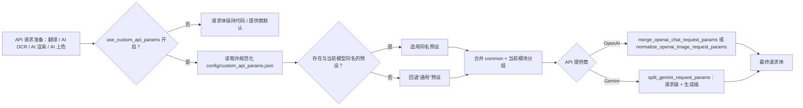
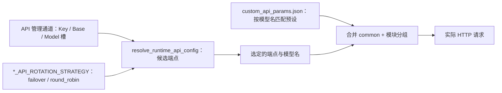

# 自定义请求参数

当需要给翻译、AI OCR、AI 渲染或 AI 上色请求附加 `temperature`、`top_p`、`max_tokens` 等请求体字段时，这里说明 `config/custom_api_params.json` 的文件结构、模型预设匹配、按模块分组合并进 OpenAI/Gemini 请求体的规则，以及与 `*_API_ROTATION_STRATEGY` 轮询策略的边界。这里不负责连接凭据、模型选择或 API 通道轮询；它们分别在[API 凭据、地址与模型](./credentials-addresses-models.md)和[通道与轮询策略](./slots-and-rotation.md)中说明。总开关位于[设置 → 通用](../settings/general-and-app.md)。

## 配置范围

- `config/custom_api_params.json` 是请求体额外参数文件：它只向 OpenAI/Gemini 请求体追加字段，不保存连接凭据（Key/Base/Model 在 `.env`）、不选择模型、不参与 `*_API_ROTATION_STRATEGY` 的候选通道轮询。
- 顶层布尔键 `use_custom_api_params` 决定是否读取该文件；旧版本放在 `translator.use_custom_api_params` 的值会在加载时迁移到顶层。
- 文件顶层是“模型预设”对象；默认预设名为“通用”，该字符串是存储值，不随界面语言翻译。
- 每个预设固定包含 `common`、`translator`、`ocr`、`colorizer`、`render` 五个分组；运行时只合并 `common` 与当前 API 模块分组，其他模块分组不会混入请求。
- 预设按请求实际使用的模型名匹配：存在同名顶层预设时优先，否则回退“通用”。

## 在 API 管理中操作

### 打开自定义参数编辑器 {#open-editor}

1. 打开“设置”，选择“通用”分组。
2. 找到“使用自定义API参数”开关；它绑定顶层配置键 `use_custom_api_params`。
3. 点击行内“编辑”按钮，打开“编辑自定义 API 参数”对话框；文件不存在时后端会先创建默认文件。
4. 对话框顶部“模型预设”下拉框选择当前编辑的预设；默认选中“通用”，可“添加预设”、“重命名”或“删除”除“通用”外的预设。
5. 在“分类 API 参数”页签中，按分组页签编辑字段行：参数名、类型、值和删除按钮；类型下拉框固定为字符串、数值、布尔值、空值和 JSON。
6. 或切换到“源码编辑”页签直接编辑整个 JSON 文件内容。
7. 点击“保存”写回文件，状态栏显示“保存成功”；JSON 语法或结构错误时显示对应错误信息，不写回文件。

## 参数与选项

> 本页各参数的界面名称、存储键与默认值的对应关系，见参考页[界面选项对照表](../../reference/options-i18n-matrix.md)。

#### 使用自定义API参数 {#use-custom-api-params}

“使用自定义API参数”是开关，位于“设置 → 通用”。开启后，各 API 模块按当前模型名匹配参数预设，只合并 `common` 与当前模块分组并写进请求体；关闭时请求体保持代码/提供商默认。开启时可用行内“编辑”按钮打开“编辑自定义 API 参数”对话框。默认值：`true`。

## 自定义请求参数文件（custom_api_params.json）

`config/custom_api_params.json` 就是“自定义请求参数”预设文件：程序按“模型预设”读取它，把预设里的字段合并进翻译、AI OCR、AI 上色和 AI 渲染的请求体。文件顶层是一个 JSON 对象，每个键是一个预设名；默认预设名为“通用”（该字符串是存储值，不随界面语言翻译）。想让某个具体模型使用专属参数时，新建一个以模型名命名的顶层预设，请求使用该模型时会优先命中它，其他模型统一回退到“通用”。

每个预设固定包含五个分组：`common`、`translator`、`ocr`、`colorizer`、`render`。运行时只合并 `common` 与当前模块对应的分组——翻译用 `translator`，AI OCR 用 `ocr`，AI 上色用 `colorizer`，AI 渲染用 `render`——其他模块的分组不会混入请求；除这五个分组外的其他顶层分组名不会被任何模块读取。

脱敏示例结构（不含任何真实密钥或用户数据）：

```json
{
  "通用": {
    "common": {},
    "translator": {
      "temperature": 0.3,
      "top_p": 0.95
    },
    "ocr": {
      "temperature": 0.0
    },
    "colorizer": {},
    "render": {}
  },
  "gpt-4o": {
    "common": {},
    "translator": {
      "temperature": 0.7,
      "max_tokens": 2048
    },
    "ocr": {},
    "colorizer": {},
    "render": {}
  }
}
```

### 怎么编辑

- 推荐在“设置 → 通用”找到“使用自定义API参数”，点击行内的“编辑”按钮，在“编辑自定义 API 参数”对话框中编辑：顶部“模型预设”下拉框选择预设，可“添加预设”“重命名”“删除”；“分类 API 参数”页签按分组逐行添加参数名、类型和值；“源码编辑”页签可直接修改整个 JSON。
- 也可以直接用文本编辑器修改文件。文件缺失时，程序会按默认内容自动创建；已有内容不会被覆盖。
- 保存时按 UTF-8、2 空格缩进写回；JSON 语法或结构错误时不会写回，编辑器会显示错误信息。
- 不要把 API Key、Token 或私有提示词写进这个文件：这些值会原样进入请求体，可能出现在日志或调试产物中。

### 与“使用自定义API参数”的关系

“使用自定义API参数”开关（配置键 `use_custom_api_params`）决定是否读取这个文件：开启时，各 API 模块按请求实际使用的模型名匹配预设，命中同名预设就用它，否则回退“通用”，只合并 `common` 与当前模块分组；关闭时完全不读取该文件，请求体保持代码/提供商默认。旧版本放在 `translator.use_custom_api_params` 的值会在加载时自动迁移到顶层。

## 请求如何处理

### 预设匹配与合并 {#preset-resolution}

每次 API 请求按以下顺序解析自定义参数：

1. `is_custom_api_params_enabled(config)` 读取顶层 `use_custom_api_params`，旧值回退 `translator.use_custom_api_params`；关闭时直接返回空参数。
2. `load_custom_api_params_file()` 读取并规范化文件；JSON 非法时记录错误并返回空预设。
3. `resolve_custom_api_params_for_model()` 取请求使用的模型名（去掉首尾空白）；若存在同名顶层预设则选用，否则回退“通用”。
4. 合并 = 预设的 `common` + 当前模块分组；`section` 只能是 `translator` / `ocr` / `colorizer` / `render`，其他值抛 `ValueError`。
5. 消费者按提供商调用合并器，把结果写进最终请求体。



模型名来自 API 管理通道或翻译器默认，不由本文件决定；因此同一配置文件在不同模型上可能匹配不同预设。

## 与 API 轮询策略的边界 {#rotation-boundary}



自定义参数按“本轮实际使用的模型名”匹配预设；模型名本身来自通道与轮询选中的端点，不由该文件决定。轮询策略改变的是候选端点的顺序与选择，不是请求体字段；通道重试、冷却、不可用和恢复也不会改动已合并的自定义参数。

## 凭据、网络与错误

- 预设匹配依赖请求使用的模型名；模型名来自 API 管理通道或翻译器默认，同一文件在不同模型上可能选中不同预设。
- JSON 语法或结构错误时自定义参数不可用：解析失败记录错误并返回空预设，翻译等流程仍按默认参数继续。
- 翻译的普通重试、质量重试与 API 通道轮询不会修改已合并的自定义参数；每次请求都会重新解析，模型名随轮询变化时预设可能改变。
- 不要把 API Key、Token、私有提示词写进该文件：这些值会被原样放入请求体并可能出现在日志/调试产物中。
- 该文件与上下文页数、提示词文件、RPM、流式开关相互独立；它们控制请求的不同维度，详见翻译器与设置页面。
- Web 模式下 `use_custom_api_params` 是服务器端键，不在 Web 用户配置接口显示。
