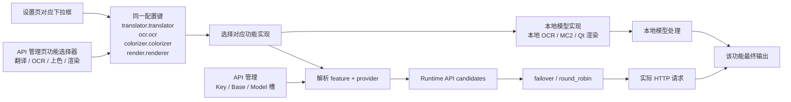
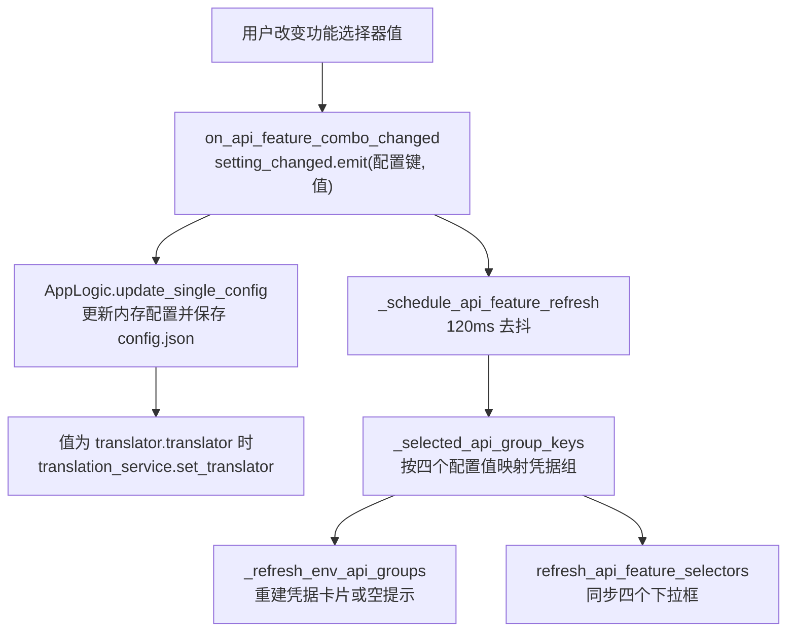

# API 功能选择器

需要在不翻设置页的情况下快速切换翻译、OCR、上色或渲染的实现时，使用 API 管理页每个页签顶部的功能选择器。它们不是独立的“API 配置”，而是直接写入对应功能的同一个配置键，因此在这里把“翻译器”从 OpenAI 换成 Gemini 也会真的切换翻译器，并立即刷新当前页所需的凭据组。

这里说明四个功能选择器分别写入哪个配置键、切换后如何刷新凭据分组、以及如何真正改变对应功能的实现。翻译实现之间的详细差异见[翻译器选择与目标语言](../translator/selection-and-languages.md)；候选槽与轮换策略见[候选槽与轮换](./slots-and-rotation.md)；凭据字段编辑与连接测试分别见[凭据、地址与模型](./credentials-addresses-models.md)和[连接测试与模型列表](./connection-tests-and-model-list.md)。

## 配置范围 {#feature-boundary}

- API 管理页的“翻译”“OCR”“上色”“渲染”四个页签顶部各有一个功能选择器，分别绑定 `translator.translator`、`ocr.ocr`、`colorizer.colorizer`、`render.renderer` 四个配置键。
- 与“翻译器选择”的区别：设置页“Translation”的翻译器下拉框与 API 管理页翻译页签顶部的翻译器下拉框写入同一个 `translator.translator` 键，选项和显示值来源也相同；因此在 API 管理页修改“翻译器”会真正改变翻译实现，并刷新所需凭据组，而不是只改连接信息。
- 与“API 候选槽轮换”的区别：Key/Base/Model 槽与 `failover`/`round_robin` 只在已经选定的实现内部挑选请求端点，处理重试、冷却、不可用和恢复，不改变实现本身。
- `translator_chain` 把上一翻译器的输出交给下一翻译器继续翻译，与本页四个选择器无关。

## 在 API 管理中操作 {#ui-operations}

### 在 API 管理页切换功能实现 {#api-tab-selectors}

1. 打开“API 管理”。页面头部显示标题和说明，下方是四个页签：“翻译”“文字识别”“上色”“渲染”。
2. 每个页签顶部有一行功能选择器：左侧标签、中间下拉框、右侧“测试当前页”按钮。
3. 在下拉框选择新值。选择后立即写入对应配置键并保存到 `config/config.json`；约 120ms 去抖后刷新当前页的凭据分组，并同步四个选择器的显示值。
4. 选中需要 API 的实现（如 OpenAI/Gemini 翻译、AI OCR、AI 上色、AI 渲染）时，页签内出现对应的 Key/Base/Model 槽；选中本地或无 API 的实现时显示“当前……不需要 OpenAI/Gemini API Key。”的提示卡片。
5. 点击“测试当前页”会对该页签所有已配置的候选槽执行连接测试；测试目标由当前选择器的值和环境变量前缀共同推导，具体流程见[连接测试与模型列表](./connection-tests-and-model-list.md)。

## 功能选择器参数 {#parameters}

> 本页各参数的界面名称、存储键与默认值的对应关系，见参考页[界面选项对照表](../../reference/options-i18n-matrix.md)。

#### 翻译器 {#translator-translator}

“翻译器”下拉框位于 API 管理页“翻译”页签顶部，也作为设置页“翻译”分组的第一行。选项：OpenAI、OpenAI高质量翻译、Google Gemini、Gemini高质量翻译、Sakura、无、原文。选择后立即写入配置并真正切换翻译实现；需要 API 的选项会在页签内显示对应凭据组。默认值：`openai`。详细说明见[翻译器选择与目标语言](../translator/selection-and-languages.md)。

#### OCR 模型 {#ocr-ocr}

“OCR 模型”下拉框位于 API 管理页“文字识别”页签顶部，也出现在设置页“OCR”分组。选项直接显示存储值：32px、48px、48px_ctc、mocr、paddleocr、paddleocr_korean、paddleocr_latin、paddleocr_thai、paddleocr_vl、openai_ocr、gemini_ocr。前九项为本地 OCR 引擎；openai_ocr 和 gemini_ocr 使用 OpenAI/Gemini 视觉请求，需要对应凭据组。默认值：`48px`。详细说明见[OCR、过滤与文本行合并](../settings/ocr-filter-and-merge.md)。

#### 上色模型 {#colorizer-colorizer}

“上色模型”下拉框位于 API 管理页“上色”页签顶部，也出现在设置页上色相关分组。选项：无（不上色）、Manga Colorization v2（本地）、OpenAI Colorizer、Gemini Colorizer。OpenAI/Gemini 上色器需要对应凭据组。默认值：`none`。详细说明见[超分与上色](../settings/upscale-and-colorization.md)。

#### 渲染器 {#render-renderer}

“渲染器”下拉框位于 API 管理页“渲染”页签顶部，也出现在设置页排版/渲染相关分组。选项：Default、OpenAI Renderer、Gemini Renderer、无。OpenAI/Gemini 渲染器需要对应凭据组，并会跳过修复、使用原图作为渲染基底；“无”时直接输出原图，不进行排版渲染。默认值：`default`。详细说明见[排版与渲染](../settings/typesetting-and-rendering.md)。

## 请求如何处理 {#runtime-behavior}

### 从选择器到实现 {#selector-to-implementation}

四个选择器共享同一条链路：把配置值交给对应功能的注册表，再决定走 API 候选还是本地模型。只有 OpenAI/Gemini 类实现才需要凭据解析；本地模型（如 32px OCR、MC2、Default 渲染器）不经过候选解析。

`translator_chain` 在翻译阶段把上一个翻译器的结果串联给下一个翻译器，不参与端点轮换，也不写入这四个配置键。

### 联动刷新凭据组 {#credential-group-refresh}

功能选择器变化后，界面先写配置，再用 120ms 去抖合并“凭据组重建 + 选择器同步”两次刷新，避免连续切换时反复重建控件。

`_selected_api_group_keys(config)` 读取四个配置值并返回每个页签要显示的凭据组，例如翻译器为 `openai`/`openai_hq` 时返回 `translator_openai`，OCR 为 `openai_ocr` 时返回 `ocr_openai`。`_refresh_env_api_groups` 据此重建当前页的 Key/Base/Model 槽；没有 API 要求的实现显示“No … API required”空提示。设置页修改 `translator.translator`、`ocr.ocr`、`ocr.secondary_ocr`、`ocr.use_hybrid_ocr`、`colorizer.colorizer`、`render.renderer` 中的任一个后约 100ms 也会调用同一个刷新函数，所以设置页的修改同样会更新 API 管理页的凭据组。

### 与翻译器选择的同步 {#translator-selector-sync}

- 设置页“Translation”的翻译器下拉框与 API 管理页翻译页签顶部的翻译器下拉框绑定同一个 `translator.translator` 键，选项与显示值来自同一 `get_options_for_key("translator")` / `get_display_mapping("translator")`。
- 任一处切换都会写回配置，并在键为 `translator.translator` 时调用 `translation_service.set_translator()`；因此“在 API 管理页改翻译器也会真的切换翻译器”。
- API 候选槽轮换不写这个键，只影响已选实现内部的请求端点；`translator_chain` 也不写这个键。

## 凭据、网络与错误 {#dependencies-and-conflicts}

- 四个选择器与设置页对应下拉框共享配置键；它们不是互相独立的设置，最后修改者生效，没有“API 页覆盖设置页”的优先级。
- 凭据值本身存在 `.env`（或运行时覆盖），不写入这四个配置键；见[凭据、地址与模型](./credentials-addresses-models.md)。
- 启用混合 OCR 后，OCR 页签会同时考虑 `ocr.secondary_ocr` 的 AI 引擎并显示对应凭据组；`ocr.ocr` 选择器只代表主 OCR。
- `render.renderer` 为 `openai_renderer`/`gemini_renderer` 时跳过修复并使用原图作为渲染基底；`none` 时不执行排版渲染。
- `sakura` 翻译不需要 Key/Model 槽，只需要 `SAKURA_API_BASE` 与字典路径。
- 切换实现不会重置该功能的请求参数、自定义参数或提示词；这些由对应功能页管理。
