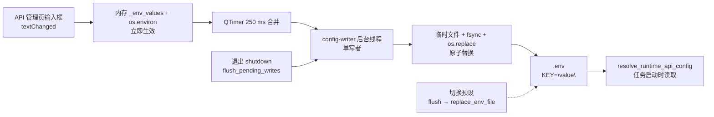

# 预设与持久化

当你想在多套服务配置之间快速切换整组 API 凭据，或者想弄清楚 API 管理页输入框里的 Key/Base/Model 到底在什么时候真正写入磁盘时，使用本页。它说明 `.env` 的读取与写入（`config_service.py`）、API 预设（`PresetService`）的新增、切换与删除、重新加载/恢复，以及导出、导入和截图/报告中的脱敏边界。Key/Base/Model 字段本身见[API 凭据、地址与模型](./credentials-addresses-models.md)，编号通道与轮询策略见[通道与轮询策略](./slots-and-rotation.md)。

## 配置范围

- `.env` 是桌面端唯一凭据持久化位置：API 管理页的 Key/Base/Model、编号通道、轮询策略都写入 `.env`；`config/config.json` 与 `config/config-example.json` 不保存 API 密钥。
- API 预设是 `.env` 环境变量的整组快照，保存为 `presets/<名称>.json` 的扁平 JSON；`config.json` 的 `app.current_preset` 只记录当前选中的预设名（默认 `"默认"`），不复制预设内容。
- 应用预设会整体替换 `.env`：只保留预设中包含的键，`.env` 里不在预设中的键会被删除；这不是增量合并。
- 本页负责预设的新增、删除与切换，`.env` 的自动保存（250 ms 防抖 + 后台原子写盘）、重新加载与退出前刷新，以及导出/导入配置时的凭据脱敏边界。
- 这里不负责：Key/Base/Model 输入与掩码（见[API 凭据、地址与模型](./credentials-addresses-models.md)）、编号通道增删与轮询策略（见[通道与轮询策略](./slots-and-rotation.md)）、失败冷却与恢复（见[失败、冷却与恢复](./failures-cooldown-and-recovery.md)）、连接测试与模型列表（见[连接测试与模型列表](./connection-tests-and-model-list.md)）、自定义请求参数里的“模型预设”（见[自定义请求参数](./custom-request-parameters.md)）。

## 在 API 管理中操作

### 在 API 管理页管理预设

1. 打开左侧导航“API 管理”。页头卡片副标题“管理每个翻译器的 API 密钥和环境变量”下方是全局预设工具栏，对翻译、OCR、上色、渲染四个页签同时生效。
2. 预设工具栏由三部分组成：标签“预设：”、只读下拉框、`+`（添加新预设）与“删除”按钮。`+` 与“删除”的具体提示分别来自“添加新预设”和“删除选中的预设”。
3. 点击 `+` 弹出“添加预设”对话框，提示“输入预设名称：”。名称为空时警告“预设名称不能为空”；同名时询问“预设 '{name}' 已存在。是否覆盖？”。新建预设默认是空白预设：包含全部已知 API 环境变量键、值全部为空，不会复制当前 `.env` 内容。
4. 在下拉框选择其他预设即开始切换：先等待（flush）未落盘的待写内容，把当前 `.env` 值保存回旧预设，再用新预设整体替换 `.env`，最后按新值刷新所有输入框和占位符。
5. 点击“删除”会先询问“确定要删除预设 '{name}' 吗？”，确认后删除 `presets/<名称>.json`，成功提示“预设删除成功”。

### 在设置页导出与导入配置

1. 打开“设置”（`Settings`），页头右侧有“导出配置”（`Export Config`）与“导入配置”（`Import Config`）按钮。
2. 导出配置把当前设置写成 JSON，排除 `app` 段与 `cli.verbose`；因为 API 密钥只存在于 `.env`，导出结果不包含任何凭据，弹窗会提示导出内容不含 API 密钥等敏感信息（实际显示值以当前 locale 为准）。
3. 导入配置把所选 JSON 深度合并进当前设置，保留当前 `app` 段，不写 `.env`；弹窗会提示 API 密钥等敏感信息已保留，现有 API 密钥不受影响。
4. 导入成功后发送 `config_loaded` 信号，设置页重建并刷新说明面板；`.env` 中的 API 凭据不会被导入操作改写。

## 请求如何处理

### 启动加载

`ConfigService.__init__` 先确定 `.env` 路径：打包后位于可执行文件同级目录，开发时位于项目根目录，并把路径写入 `MANGA_TRANSLATOR_ENV_PATH`。随后用 `read_dotenv_file()` 把 `.env` 读入内存 `_env_values`，再调用 `load_app_dotenv(override=True)` 把全部键加载到 `os.environ`（覆盖同名环境变量）。

`PresetService.__init__` 确保 `presets/` 目录存在；若 `默认.json` 不存在则创建默认预设：全部已知 API 键为空，`OPENAI_API_BASE=https://api.openai.com/v1`、`OPENAI_MODEL=gpt-4o`。配置加载优先级为用户配置 `config/config.json` > 默认配置 `config/config-example.json` > 代码默认值；`app.current_preset` 用于在启动和重建时定位当前预设。

### 编辑、防抖与原子写盘

输入框 `textChanged` → `_debounced_save_env_var` → `env_var_changed` 信号 → `MainAppLogic.save_env_var` → `ConfigService.save_env_var`。`save_env_vars` 立即更新内存 `_env_values` 与 `os.environ`，校验键名（`validate_env_key`）并去除值首尾空白；磁盘写入交给 250 ms 单发 `QTimer`（`SAVE_DEBOUNCE_MS = 250`）合并，因此连续输入只产生一次写盘。

定时器到期后，在唯一线程名 `config-writer` 的 `ThreadPoolExecutor(max_workers=1)` 上执行 `_write_snapshots`：`_merge_dotenv_updates` 保留 `.env` 中未修改的行（含注释与原始格式），只重写变更键并追加新键；最终用“临时文件 + `os.replace`”原子替换，写盘前 `fsync`。删除键（`delete_env_vars`）把值标记为 `None`，重写时移除对应行，并从内存与 `os.environ` 删除。写盘失败会发 `write_failed` 信号，后续保存自动切换为整文件替换以恢复一致性。

### 预设切换与整体替换

`load_preset` 读取 `presets/<名称>.json` 并规范化（补齐全部已知 API 键、保留额外自定义键），然后调用 `replace_env_file`。`replace_env_file` 用预设内容整体替换 `.env`：内存 `_env_values` 直接换成预设键集合，旧键中不在预设内的会从 `os.environ` 删除，磁盘待写内容标记为“整文件替换”。切换预设前先 `flush_pending_writes()`，保证正在防抖的编辑先落盘、再保存进旧预设。

### 重新加载与退出前刷新

`reload_config()` 强制完整重载：先 flush 待写内容，重新把 `.env` 加载到 `os.environ`，重建 `AppSettings`，按优先级重载配置，最后发 `config_changed` 让 UI 重建；`reload_from_disk()` 只从当前 `config_path` 重载配置。开始翻译前会排空待写内容（`_flush_all_pending_env_vars`），`flush_pending_writes()` 停止定时器、提交并等待全部写盘完成。应用退出时 `main.py` 调用 `ConfigService.shutdown()`，先 `flush_pending_writes()` 再关闭写线程，保证没有丢失 250 ms 待写内容。

上图只描述凭据与预设的写入生命周期。空键、本地空密钥占位、编号槽与轮询候选的解析见[API 凭据、地址与模型](./credentials-addresses-models.md)与[通道与轮询策略](./slots-and-rotation.md)；`config.json` 的 250 ms 防抖属于同一写线程，但这里不展开设置字段本身。

## 脱敏与文件安全

- `.env` 与 `presets/*.json` 都保存真实凭据（明文），两者均被 `.gitignore` 忽略；不要把其中任何一行、整个文件或截图提交到仓库或公开报告。
- 输入框对包含 `API_KEY`、`AUTH_KEY`、`TOKEN` 的键使用密码回显，可用眼睛图标切换“显示密钥/隐藏密钥”；显示密钥只是界面行为，不代表文件或日志安全。
- “导出配置”排除 `app` 段与 `cli.verbose`，且 `config.json` 本身不含 API 密钥，因此导出产物不含凭据；“导入配置”不写 `.env`，现有 API 密钥保留。
- 切换预设会把当前 `.env` 值保存进旧预设，因此用户创建或更新过的预设文件可能随时间包含真实密钥；这里不展示任何预设内容或真实密钥值。

## 凭据、网络与错误

- `.env`、`presets/*.json`、`config/config.json`、`config/custom_api_params.json` 职责不同：分别是凭据/环境变量、预设快照、UI 设置、请求体参数。切换预设只影响 `.env`；导入配置只影响 `config.json`；`custom_api_params.json` 的“模型预设”与本页 API 预设无关（见[自定义请求参数](./custom-request-parameters.md)）。
- 应用预设会整体替换 `.env`，因此手动编辑过 `.env` 或写入过预设不认识的键时，应用预设会删除这些键；不要在应用仍有待写操作时手改同一文件。
- Web 多用户场景下 `translator.user_api_key`/`user_api_base`/`user_api_model` 等覆盖优先级高于 `.env`（见[API 凭据、地址与模型](./credentials-addresses-models.md)）；桌面端默认不存在这些覆盖。
- 预设名会经 `_sanitize_filename` 清洗（`< > : " / \ | ? *` 替换为 `_`）；预设下拉框只显示 `presets/` 下 `*.json` 文件去掉后缀的名称。
- 退出前 `shutdown` 只保证“已提交的写入”完成，不负责再次读取输入框；正常输入已随 250 ms 防抖提交到内存。
