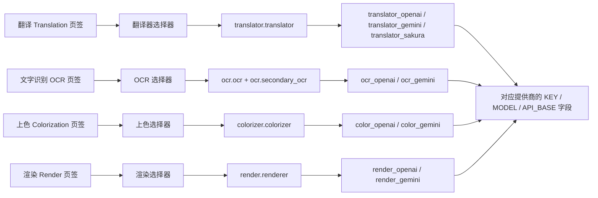

# API 管理页签与提供商字段

当你需要分别配置翻译、文字识别（OCR）、上色和渲染各自使用的 API 凭据时，打开“API 管理”。该页按功能分成四个页签，每个页签对应一个功能；页签顶部是该功能的选择器，下方只显示当前选中提供商的凭据字段组。

这里仅说明四个页签的布局、切换，以及每个页签展示哪个提供商的哪组字段。功能选择器的完整选项与写入行为见[功能选择器](./feature-selectors.md)，Key/Base/Model 字段含义见[凭据、地址与模型](./credentials-addresses-models.md)，候选槽与轮询见[API 通道与轮询策略](./slots-and-rotation.md)，连接测试与模型列表见[连接测试与模型列表](./connection-tests-and-model-list.md)。

## 配置范围

- API 管理页固定包含四个页签，路由键分别为 `env_translation`、`env_ocr`、`env_colorization`、`env_render`，对应翻译、文字识别、上色和渲染四个功能。
- 每个页签顶部有一个功能选择器下拉框，分别写入 `translator.translator`、`ocr.ocr`、`colorizer.colorizer`、`render.renderer`；文字识别页签在启用混合 OCR 时还读取 `ocr.secondary_ocr`。
- 页签本身只是导航容器：点击页签只切换右侧的堆叠页面，不修改任何配置。真正改变配置的是页签内的功能选择器。
- 每个页签显示的提供商组由该功能选择器的当前值决定；未命中任何 API 提供商时显示“不需要 API”的空状态提示，不渲染凭据卡片。
- 翻译器选择、API 功能选择器、API 候选槽轮换是三个不同边界：本页与[功能选择器](./feature-selectors.md)负责页签、选择器与字段组；`translator.translator` 的翻译实现选择见[翻译器选择](../translator/selection-and-languages.md)；槽轮换见[API 通道与轮询策略](./slots-and-rotation.md)。

## 在 API 管理中操作

### 打开 API 管理并切换页签 {#open-and-switch-tabs}

1. 在左侧导航选择“API 管理”。标题下方显示副标题“管理每个翻译器的 API 密钥和环境变量”，副标题下方是全局 API 预设工具栏（“预设：”下拉框、“添加新预设”和“删除选中的预设”按钮），预设的增删与加载见[预设与持久化](./presets-and-persistence.md)。
2. 在页签栏点击“翻译”、“文字识别”、“上色”或“渲染”切换页签；打开页面时默认停在“翻译”页签。
3. 切换页签不会保存或丢弃任何输入，也不会改变任何配置键；四个页签的凭据字段相互独立。

### 页签内的功能选择器行 {#feature-selector-row}

每个页签的内容是一张区块卡片，第一行固定是“功能选择器行”：左侧标签、中间下拉框、右侧“测试当前页”按钮。四个页签的标签与写入配置键如下；下拉框选项复用设置页的同一组枚举与显示映射，改动会立即写入对应配置键并刷新字段组。

“测试当前页”只对当前页签对应功能的所有已配置密钥执行批量连接测试，见[连接测试与模型列表](./connection-tests-and-model-list.md)。

### 提供商字段组与空状态 {#provider-groups-and-empty-state}

- 选择器命中的每个提供商对应一张凭据卡片。OpenAI/Gemini 卡片包含“轮询策略：”下拉框、编号通道卡片（Key/Model/Base 三个字段）和“+ 添加 API 通道”按钮；Sakura 是简化的两字段卡片（地址与词典路径），没有轮询策略和通道槽。
- 每个通道卡片最左侧提供拖拽手柄，随后显示两位编号徽标（例如 `01`）与固定标题“API 通道”；字段标签本身不带编号，批量测试结果列表里才使用“OpenAI API Key #2”这种带编号的显示名。拖拽会整组调整 Key/Model/Base 的候选顺序。
- 密钥字段（API Key / AUTH Key / Token）默认掩码显示，可用眼睛按钮的“显示密钥/隐藏密钥”切换；每个密钥行右侧有“测试”按钮，模型行右侧有“获取模型”按钮。
- 当选择器当前值不需要 OpenAI/Gemini 凭据时（例如翻译器为 `none`/`original`、OCR 为 `48px`、上色器为 `none`、渲染器为 `default`），卡片区显示对应的“不需要 API”提示，不渲染任何凭据字段。

## 页签结构 {#tab-structure}

下图表示“页签 → 功能选择器 → 配置键 → 提供商字段组”的固定映射；OpenAI/Gemini 组内具体显示 KEY / MODEL / API_BASE 三列字段。

## 页签与功能选择器的关系 {#tab-selector-relationship}

- 页签代表功能，功能选择器代表该功能当前选中的实现/提供商；两者合起来决定页签下方渲染哪组字段。
- 选择器改动时，界面发出 `setting_changed`（携带配置键与存储值），再通过 120ms 去抖定时器重建四个页签的字段组并重新填充所有选择器。
- 四个页签的选择器都从同一份配置读取：在设置页或编辑器里修改 `translator.translator`、`ocr.ocr`、`colorizer.colorizer`、`render.renderer` 后，回到 API 管理页会按新值重建字段组。
- 文字识别页签的特殊性：启用混合 OCR 后，主 OCR（`ocr.ocr`）和备用 OCR（`ocr.secondary_ocr`）可以分别是 `openai_ocr`/`gemini_ocr`，此时两套提供商组会同时显示在同一个页签里。
- 未命中任何提供商时显示空状态提示（见上文三列表），而不是空白的崩溃态。

## 凭据、网络与错误

- 页签切换不写配置；只有功能选择器和字段编辑会写入配置。不要期望“只看一眼页签”会改动任何设置。
- 凭据字段是 `.env` 键，编辑会立即进入内存并按统一节奏合并落盘；字段组按当前选择器值重建，未选中的提供商组即使 `.env` 里有值也不会显示。
- 同一功能的选择器与设置页共用配置键，二者是同一设置的两个编辑入口，不是两份独立配置。
- Sakura 翻译没有 Key/Model/Base 通道槽，只有地址与词典路径；“轮询策略：”下拉框和“+ 添加 API 通道”只出现在 OpenAI/Gemini 组。
- 冷却/不可用/恢复标记属于通道状态，见[故障、冷却与恢复](./failures-cooldown-and-recovery.md)；这里不展开轮询细节。
