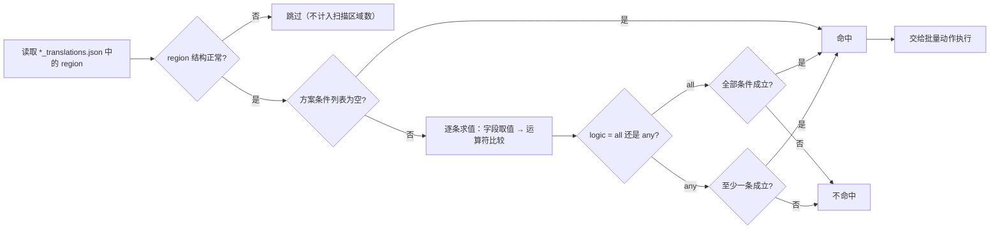

# 批量条件匹配

当一批图片里的文字区域需要按内容、排版或属性统一筛选后再批量修改时，在“批量管理”页使用匹配条件。条件负责筛出命中的区域，批量动作再对这些区域改文字、富文本样式或属性；两者分开，不存在“哪条条件的命中区间才是目标”的歧义。

这里按条件字段与匹配规则。方案的增删改见[方案管理（增删改）](./schemes-crud.md)，批量动作见[批量动作与执行顺序](./actions-and-order.md)，预览、写回、备份与恢复见[预览、应用与恢复](./preview-apply-restore.md)。

## 适用场景 {#feature-boundary}

- 一个方案包含 `match`（`logic` + `conditions`）与 `actions` 两部分；条件是前半部分，只筛选区域。
- 条件为空时，范围内的所有区域都命中（“不填条件表示范围内的所有区域都命中。”）。
- 条件只在结构正常的区域上求值；结构异常的区域在扫描和执行阶段都会被跳过。
- 批量管理的条件处理的是主页文件列表中的 `*_translations.json` 区域数据，与翻译流水线的 `batch_size`、`batch_concurrent`（图片分批/并发翻译）没有关系。

## 在批量管理中操作 {#ui-operations}

### 在批量管理页配置匹配条件

1. 打开左侧主导航中的“批量管理”页面。
2. 选择或新建一个方案（方案列表操作见[方案管理（增删改）](./schemes-crud.md)）。
3. 在“匹配条件”卡片中，先用逻辑下拉框选择“全部满足”或“任一满足”。
4. 点击“添加条件”新建一行条件 `[字段 ▼] [运算符 ▼] [值] [×]`；字段下拉框列出全部可匹配字段，运算符随字段类型变化，值编辑器按“字段类型 + 运算符”动态生成。
5. 修改字段或运算符后，值编辑器会重建；不需要值的运算符（`empty`、`not_empty`、`is_true`、`is_false`）隐藏值编辑器。
6. 点击行尾 `×` 删除该条件（按钮提示为“移除条件”）。
7. 任何改动都会把方案标记为待保存，约 600 ms 后自动保存到 `config/batch_edit_schemes.yaml`，同时清空上一次的预览结果。

### 条件行与值编辑器

每条条件行 `[字段 ▼] [运算符 ▼] [值] [×]` 的值编辑器按字段类型和运算符现造：

| 字段类型 | 值编辑器 | 说明 |
| --- | --- | --- |
| 文本 | 单行输入框 | 占位文案为“值” |
| 枚举 | 下拉框 | 直接显示存储值，不翻译；例如排版方向 `h`/`v`/`hr`/`vr`/`auto` |
| 数字 | 数值输入框 | 整数范围 -100000…100000；小数保留 3 位、步进 0.05 |
| 数字区间 | 低值 + “到” + 高值 | 两个数值输入框 |
| 颜色 | 颜色选择器 | 使用“接近颜色”时附带“容差”，范围 0…442、默认 30 |
| 布尔 | “是”/“否”下拉框 | 存储 `true`/`false` |
| 字体 | 字体下拉框 | 列出系统字体 |

## 条件字段 {#condition-fields}

以下字段出现在“字段”下拉框中；标为“否”的字段只能用于条件，不能作为“批量改区域属性”动作的写入目标。

字段取值说明：

- `translation` 匹配的是区域正文：优先取富文本文档的可见文字（换行为 `\n`），解析失败时回退到 `translation` 字段。匹配不跑在带 `[BR]` 的 `translation` 上，避免 `[BR]` 四个字符污染字符下标。
- `text`、`prob`、`has_rich_text`、`line_count`、`region_index` 是只读字段，不会出现在“改 region 属性”动作里。
- `direction` 取值会做别名归一化：`horizontal` → `h`、`vertical` → `v`，并接受 `h`/`v`/`hr`/`vr`/`auto`。
- `fg_colors`/`bg_colors` 为空时会回退读取 `font_color`/`bg_color`，兼容编辑器保存的历史形态。

## 匹配运算符与规则 {#operators-and-rules}

运算符由字段类型决定，逐类型列出。

匹配规则：

- 文本：先 `str()` 归一，`contains`/`not_contains` 是子串判断，`eq`/`ne` 是整串相等；`empty`/`not_empty` 按去除首尾空白后的文本判断。
- 正则：使用 `re.search` 子串搜索；正则表达式非法时，`regex` 与 `not_regex` 都返回不匹配（不会因非法正则报错中断整批扫描）。
- 枚举：比较前去除首尾空白并转小写；排版方向再做别名归一化。
- 数字：数值解析失败时该条件不匹配；`eq`/`ne` 使用浮点近似比较（相对/绝对容差 `1e-9`）；`between` 包含两端，且低值大于高值时自动交换。
- 颜色：按 RGB 距离比较；`color_eq` 要求距离为 0，`color_near` 要求距离 ≤ 容差（未提供容差时默认 `30.0`，UI 范围 0…442）。
- 布尔：`is_true` 要求值为真，`is_false` 要求值为假。
- 未知字段、未知运算符或字段类型与运算符不匹配时，该条件一律不匹配（返回假）。

## 条件匹配流程 {#matching-flow}

下图是单条区域从文件到“是否命中”的判定流程（“执行动作”的具体内容见[批量动作与执行顺序](./actions-and-order.md)）：

限制说明：上图是代码中的判定路径；`translation` 的正文口径是富文本可见文字（`\n`），因此 `contains`/`regex` 等运算符看到的是 `\n` 换行而非 `[BR]` 标记。执行（应用）阶段会重新读盘并再次跑同一套条件，不会直接套用预览缓存。

## 限制与注意事项 {#dependencies-and-conflicts}

- 条件只负责筛区域，动作各自带 `pattern` 在译文里定位子串；条件与动作不共享“命中区间”。
- 条件的求值依赖区域里的 `texts`/`lines`/`translation`/富文本等字段；OCR 文本缺失或结构异常的区域会被跳过，不会被条件“选中”。
- 方案改动后上一次预览自动作废，需要重新点击“预览命中”生成新的命中列表。
- 批量管理条件与翻译设置的 `context_size`、`batch_size`、`batch_concurrent` 完全无关：前者操作的是已翻译 JSON 的区域数据，后者控制翻译流水线的分批与并发。
- 这里不读取或展示真实 `.env`、用户 `config.json` 或任务产物；方案 YAML 只记录条件和动作结构，不包含凭据。