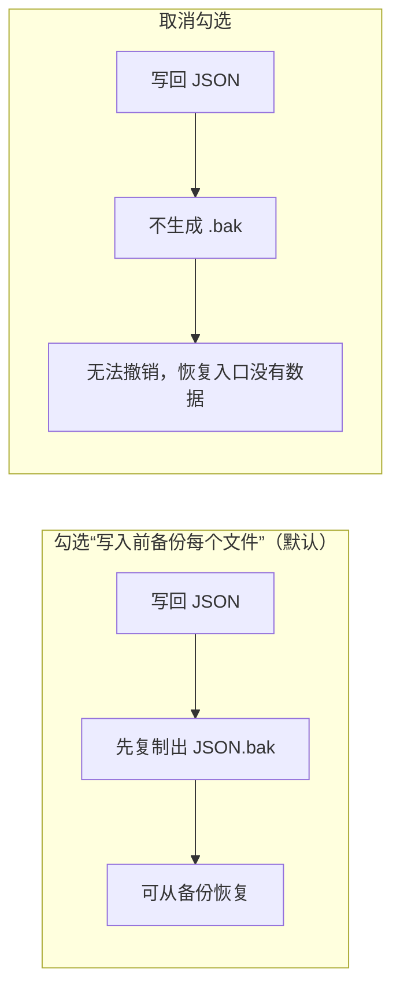
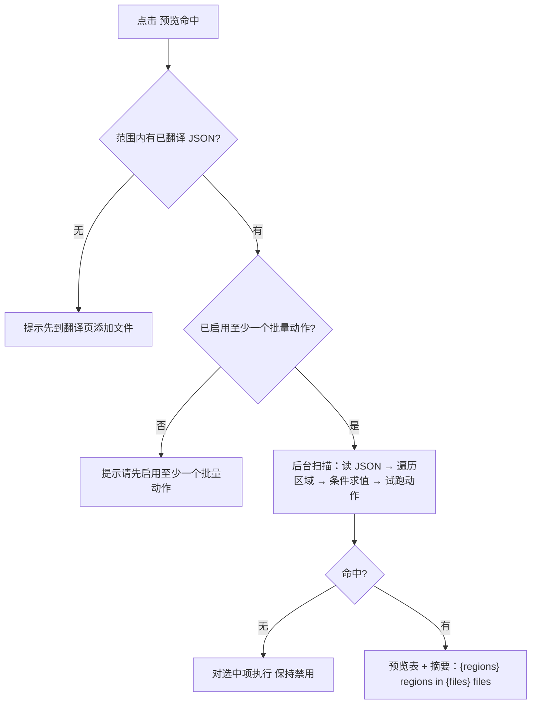
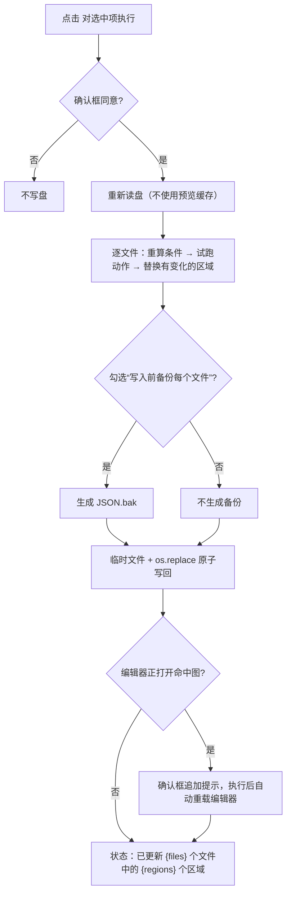
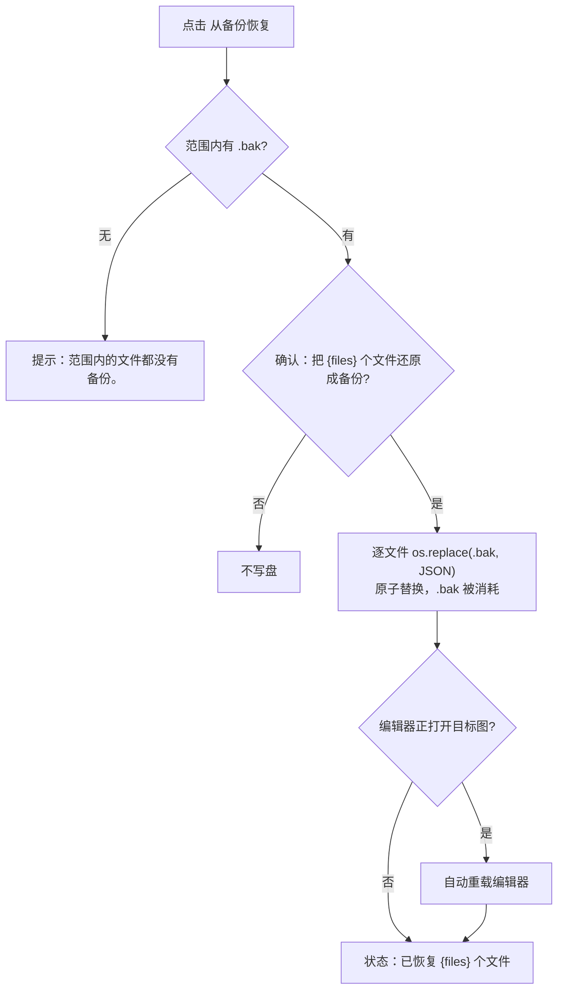

# 批量预览、应用与恢复

批量管理页以主页文件列表中的已翻译文件为作用范围：先“预览命中”，在表格里核对每个将要被改写的区域，再勾选需要写回的行，最后“对选中项执行”。写回前默认把每个 JSON 复制一份 `.bak`，因此多数误操作可以通过“从备份恢复”撤销。

这里按预览、勾选、写回、备份与恢复。方案的增删改与自动保存见[批量方案管理](./schemes-crud.md)，条件字段与 `all`/`any` 逻辑见[匹配条件](./conditions.md)，三类批量动作与固定执行顺序见[动作与顺序](./actions-and-order.md)。编辑器自身的保存与回写见[编辑器的导入导出与回写](../editor/import-export-and-writeback.md)。

## 适用场景 {#feature-boundary}

- 批量写回的目标是逐图 JSON（`<stem>_translations.json`），不是最终图片；批量管理不进入渲染管线。
- 预览是必经步骤：界面没有“不预览直接执行”的按钮。
- 作用范围来自主页文件列表快照中的 `json_by_file`（图片路径 → JSON 路径）；面板自己不重扫磁盘，文件列表变化时由主窗口把新快照推给面板。
- “对选中项执行”总是重新读盘再执行方案，不使用预览缓存的命中结果。
- 恢复只能把文件还原成同目录的 `.bak`；`.bak` 是一次性消耗品，恢复后不再存在。
- “匹配条件”卡片与“批量动作”卡片属于批量面板的同一页，但各自的细节分别见[匹配条件](./conditions.md)与[动作与顺序](./actions-and-order.md)。

## 在批量管理中操作 {#ui-operations}

### 检查作用范围并预览命中 {#preview-matches}

打开“批量管理”。页面底部状态栏右侧显示“范围：主页文件列表中的 {count} 个已翻译文件”。

配置好条件与动作后：

1. 点击“预览命中”。
2. 若主页文件列表里还没有已翻译文件，会提示“主页文件列表里还没有已翻译的文件，请先在翻译页添加文件。”。
3. 若没有启用任何批量动作，会提示“请先启用至少一个批量动作。”。
4. 扫描在进度框“扫描中...”中执行，可以取消。
5. 命中结果写入预览表，每一行是一个区域，共六列：勾选、图片、区域、原文、改后、变更。

- “图片”列显示文件名，悬停提示该 JSON 的完整路径；“区域”列显示区域序号；“原文”/“改后”列显示可见译文正文（换行显示为 `\n`）；“变更”列列出会被改写的字段（例如 `line_spacing, translation`）。
- “全部选中”与“全不选”一次切换所有行的勾选状态。
- 没有命中时“对选中项执行”保持禁用；命中后摘要显示“{files} 个文件中的 {regions} 个区域”。
- 扫描发现结构异常的区域会跳过，并在状态行追加“跳过 {count} 个结构异常的区域”；读不到的文件会弹出“{count} 个文件读取失败”的错误框。
- 条件或动作一旦修改，上一次的预览结果立即作废（表格清空、Apply 重新禁用），必须重新预览。

### 批量写回（应用） {#apply}

1. 在预览表中勾选要写回的行。
2. 默认勾选“写入前备份每个文件”；取消勾选时，确认框会追加“备份已关闭，此操作无法撤销。”。
3. 点击“对选中项执行”，确认框显示“对 {files} 个文件中的 {regions} 个区域执行该方案？”。
4. 如果编辑器正打开命中范围内的图片，确认框会追加提示：编辑器内存中的旧副本会在切图时覆盖这次修改，执行后会自动重新加载编辑器。
5. 进度框标题为“对选中项执行”，文案“写入中...”，可以取消；取消后状态行显示“已取消”，不写盘。
6. 完成后状态行显示“已更新 {files} 个文件中的 {regions} 个区域”；有文件写入失败时弹出“{count} 个文件写入失败”的错误框。
7. 写回成功后预览表清空——盘上内容已经变化，旧预览不再可信。

### 从备份恢复 {#restore}

1. 点击“从备份恢复”，按钮提示为“把范围内每个文件还原成它的 .bak，还原后 .bak 就消耗掉”。
2. 范围内没有 `.bak` 时提示“范围内的文件都没有备份。”。
3. 有备份时确认框显示“把 {files} 个文件还原成备份？备份会被消耗掉。”；若编辑器正打开目标图，同样追加重载提示。
4. 进度框文案“正在恢复...”，可以取消。
5. 完成后状态行显示“已恢复 {files} 个文件”；写入失败的文件会列入“{count} 个文件写入失败”的错误框。

恢复的作用范围同样是“主页文件列表中的已翻译文件”：它只处理这些文件旁边的 `.bak`，不会扫描全盘，也不会生成新的备份。

## 选项与状态 {#options-and-statuses}

#### “写入前备份每个文件” {#backup-option}

在预览卡片头部勾选“写入前备份每个文件”（默认勾选）。勾选时，应用前会把每个要改写的 JSON 复制一份 `.bak`；取消勾选时没有 `.bak`，后续“从备份恢复”无法还原这些文件。

取消勾选只影响本次点击“对选中项执行”时的写回行为：它不会删除历史遗留的 `.bak`，也不会阻止“从备份恢复”使用已有的备份。

## 方案如何应用 {#runtime-behavior}

### 预览扫描 {#scan-mechanism}

点击“预览命中”后，面板把当前方案（条件 + 动作）和范围里的 JSON 路径交给后台线程。后台对每个 JSON 执行：读取并解析（沿用原文件缩进）→ 遍历顶层每个图片条目下的 `regions` → 跳过结构不健全的区域 → 对每个区域求值条件 → 把方案试跑在区域副本上。试跑结果与原文不同时生成一行命中记录。

“原文”/“改后”两列显示可见译文正文：富文本存在时以富文本为准，否则回退到 `translation`；换行在表格里显示为 `\n`。预览只是计算，不写盘。

### 应用写回 {#apply-mechanism}

“对选中项执行”携带的是用户勾选的行（JSON 路径 + 图片 key + 区域序号），而不是整份命中列表。执行时引擎重新读盘，对每个目标区域再次做健全性检查、条件求值和方案执行，然后：

1. 只替换发生变化的区域条目；其余顶层键（`mask_raw`、`mask_is_refined`、覆盖层、尺寸等）和未命中区域原样保留。
2. 勾选备份时先用 `shutil.copy2` 生成 `<json>.bak`。
3. 在同目录写临时文件（`.batch_edit_*.tmp`），`fsync` 后 `os.replace` 原子替换原 JSON。
4. 沿用原文件缩进（后端写 4、编辑器写 2），`ensure_ascii=False`，让 diff 最小。
5. 只写回实际有变化的文件；没有变化的文件不会被改写，也不会生成备份。

写回只修改 JSON 中的文本/样式条目，不会自动重新渲染图片；需要回到翻译或编辑器工作流重新导出。

### 恢复 {#restore-mechanism}

“从备份恢复”对范围内每个有 `.bak` 的 JSON 执行 `os.replace(backup, json_path)`：只改目录项、不搬数据，比逐字节拷贝快，而且本身就是原子操作。恢复成功后 `.bak` 被消耗（不再存在），所以按钮提示明确写“还原后 .bak 就消耗掉”。没有 `.bak` 的文件被跳过；全部没有时提示“范围内的文件都没有备份。”。

### 取消与后台执行 {#cancel-and-threading}

预览、应用、恢复都在后台执行，不会阻塞界面；可以随时取消，取消后不写盘，状态行显示“已取消”。进度框可以关闭，关闭等价于取消。

### 编辑器冲突与重载 {#editor-conflict}

编辑器把区域常驻内存且不监听文件变化；切图时的自动导出会用内存里的旧数据全量覆盖盘上 JSON。因此如果写回/恢复的目标包含编辑器当前打开的图片，面板会在确认框追加“编辑器当前打开着‘{name}’。”的提示，并在执行成功后调用编辑器的重载入口重新加载该图片，避免内存旧数据把刚写回的内容抹掉。

## 限制与注意事项 {#dependencies-and-conflicts}

- 作用范围完全来自主页文件列表快照：文件列表里没有的 JSON 不会被预览、应用或恢复；面板不自行扫描磁盘。
- 应用前必须重新预览：条件或动作一变，旧预览作废。
- 应用时若取消“写入前备份每个文件”，该文件没有 `.bak`，后续“从备份恢复”无法还原。
- 恢复只针对范围内的 `.bak`：不能恢复从未备份的文件，也不能回滚到某个历史版本（`.bak` 只有一份且会被消耗）。
- 写回只覆盖 JSON 中的区域条目；蒙版、覆盖层和尺寸等其余键保留，但若编辑器在写回后未重载，切图自动导出仍可能覆盖整个 JSON。
- 批量写回与渲染管线无关：修改不会自动重新渲染图片。