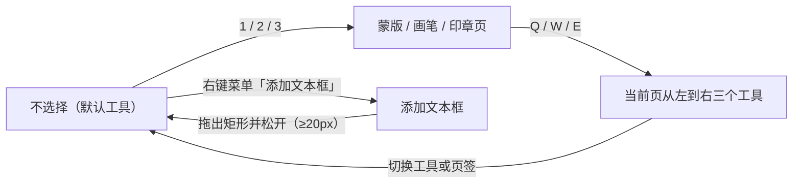
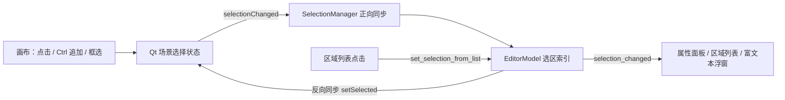

# 画布工具与选区

进入编辑器后，画布是修改文本区域和修复图片的主要工作区。这里说明如何切换每种画布工具（选择、蒙版画笔、橡皮擦、彩色画笔、仿制印章），以及选择、拖拽和缩放画布与文本区域的具体操作。蒙版笔画如何写入修复蒙版、画笔/印章图层与清除按钮见[蒙版、画笔与仿制印章](./mask-paint-and-clone-stamp.md)；顶栏菜单、显示模式与排列操作见[工具栏与菜单](./toolbar-and-menus.md)；快捷键注册与焦点优先级见[快捷键](./shortcuts.md)。

## 可以做什么

- 画布工具是一个单一活动状态 `active_tool`，可选值为 `select`、`brush`、`eraser`、`paint`、`paint_erase`、`clone`、`stamp_erase` 以及临时绘制状态 `draw_textbox`。UI 通过属性面板按钮、键盘 `1`/`2`/`3` 与 `Q`/`W`/`E`，以及右键菜单“添加文本框”修改它。
- 选择（点击、框选、多选）和区域拖拽只在“选择”工具下发生；画笔类工具按下左键后画布不再响应区域选择，而是绘制笔画。
- 视图缩放与平移（滚轮缩放、放大/缩小、适应窗口、中键拖动）作用于整个画布视图，不改变区域数据；`Ctrl+滚轮` 调整选中区域字号、`Shift+滚轮` 调整共享画笔大小，这两类组合键归[快捷键](./shortcuts.md)页。
- 选区在画布、区域列表和属性面板之间双向同步；区域原文/译文编辑、查找替换、OCR/翻译按钮和列表行为见[区域列表与文本编辑](./region-list-and-text-editing.md)。
- 蒙版细化、画笔/印章图层的数据结构与渲染归[蒙版、画笔与仿制印章](./mask-paint-and-clone-stamp.md)，这里仅说明工具入口与指针语义。

## 在编辑器中操作

### 在属性编辑中切换画布工具

打开编辑器后，左侧默认显示“属性编辑”。在“图像编辑”分组中有“蒙版”“画笔”“印章”三个页签，每个页签提供一组互斥工具按钮；将鼠标悬停在页签上可查看 `1`/`2`/`3` 快捷键提示。三个页签共用一个按钮组，因此选中任一页签的工具都会取消其他页签的工具选中。

三个页签的工具按钮按下后分别发出 `select`、`brush`、`eraser`、`paint`、`paint_erase`、`clone`、`stamp_erase` 活动值；按钮的选中状态又随模型中的活动工具反向同步。切换页签时，如果当前工具不属于新页签，会自动把活动工具切回该页签的“不选择”按钮，避免跨页工具冲突。

蒙版页额外提供“显示优化蒙版”和“清除所有蒙版”；画笔页提供“显示画笔层”、“清除画笔图层”和“画笔颜色：”；印章页提供“显示印章层”、“清除印章层”。三个页签共用同一个“笔刷大小：”字段，范围 5–200，初始 30。

不用打开面板时，按 `1`/`2`/`3` 可切换“蒙版”/“画笔”/“印章”页；`Q`/`W`/`E` 固定选择当前页从左到右的三个工具，也就是“不选择”、画笔（印章页为仿制印章）和橡皮擦。在空白画布上右键选择“添加文本框”，会进入 `draw_textbox` 绘制模式。

### 画布指针操作

下表按活动工具列出指针语义；输入层把画笔类工具一律当作绘制，不响应区域选择。

| 活动工具 | 左键 | 右键 | 说明 |
| --- | --- | --- | --- |
| 选择工具 | 点击选中区域；在白框内拖拽移动；拖动手柄缩放/旋转；在空白处拖拽框选 | 打开上下文菜单 | 区域选择与几何编辑 |
| 添加文本框 | 拖出矩形创建新文本区域，松开后自动回到“选择” | “添加文本框”由右键菜单进入 | 矩形宽或高小于 20px 时放弃创建 |
| 蒙版画笔 | 按住拖动向优化蒙版写入白色笔画 | — | 提交 `MaskEditCommand` 并触发修复笔画 |
| 橡皮擦 | 按住拖动把蒙版笔画擦成 0 | — | 提交 `MaskEditCommand` |
| 彩色画笔 | 按住拖动以画笔颜色写入画笔图层 | — | 写入 `paint_overlay` |
| 彩色画笔擦除 | 按住拖动擦除画笔图层 | — | 写入 `paint_overlay` |
| 仿制印章 | 按住拖动仿制涂抹到印章图层 | 右键取样；右键菜单被屏蔽 | 取样圈标记；偏移在落笔时锁定 |
| 印章擦除 | 按住拖动擦除印章图层 | — | 写入 `stamp_overlay` |

画笔、橡皮擦、彩色画笔、仿制印章和印章擦除都显示圆形光标，半径随画笔大小和当前缩放变化；`draw_textbox` 显示十字光标。进行中的框选或笔画在切换工具、打开右键菜单、按 `Escape` 或窗口失焦时统一清理：切工具前按旧工具语义提交，右键菜单/失焦时直接丢弃。

### 选择、拖拽与缩放

- 选择：在“选择”工具下点击文本区域即选中；按住 `Ctrl` 点击可追加选择；在空白画布按住左键拖出虚线框，松开后按“与框相交”精确命中旋转和细长区域，未按 `Ctrl` 时先清空旧选择。点击空白处（零尺寸框选）等效于取消选择。
- 拖拽：拖动已选中的区域（白框内部）可移动它，其他同时选中的区域会一起跟随移动；拖动选中区域四周的白色方形手柄可调整外框大小，拖动旋转手柄按角度旋转。移动/缩放/旋转完成后通过 `update_region_geometry` 写回区域数据并进入撤销历史。
- 缩放：滚轮向上以 1.15 倍放大、向下以 1/1.15 缩小，倍率钳制在 0.05–50；缩放以鼠标位置为锚点。顶栏“菜单”中的“放大 (+)”、“缩小 (-)”和常驻“适应窗口”按钮调用同一套视图变换。
- 平移：按住鼠标中键拖动可平移画布；中键按下时内部切到 `ScrollHandDrag`，松开后恢复 `NoDrag`。
- 视图状态（变换矩阵与中心点）通过 `view_state_changed` 同步给原图对比面板和富文本浮窗定位。

## 工具与选区流程

下面是工具状态流转和选区双向同步的示意。工具切换先按旧工具语义提交进行中的交互，因此不会把蒙版笔画错误地提交到新工具；`draw_textbox` 提交后自动回到“选择”。

选区在任何一端变化都会同步到另一端：画布上的点击/框选先落到 Qt 场景的选择状态，再由 `SelectionManager` 转成模型中的索引列表，属性面板、区域列表和富文本浮窗都读取同一份模型选择；在区域列表中点击则通过 controller 反向写回模型并刷新画布选中状态。

## 修改如何保存

### 工具状态机

`session.py` 中 `active_tool` 的初始值是 `select`。`EditorModel.set_active_tool()` 只在值变化时发出信号；`GraphicsView._on_active_tool_changed()` 先按旧工具语义提交进行中的框选/笔画，再切换内部 `_active_tool` 并更新光标。`clone` 之外的工具切换会清除仿制印章的取样点和偏移。

`draw_textbox` 不会出现在属性面板按钮中：只有右键菜单“添加文本框”（`enter_drawing_mode`）会先清空选择、把活动工具设为 `draw_textbox`，画布拖出矩形后 `_finish_textbox_drawing` 创建区域并自动回到 `select`；矩形宽或高小于 20px 时放弃创建。新区域会继承最后选中区域的字体、颜色、对齐等样式作为模板，文字方向按框的宽高推断。

### 选区双向同步

`SelectionManager` 用 `_syncing` 标志防止循环同步：Qt 场景 `selectionChanged` → 模型 `set_selection`；模型 `selection_changed` → 逐个 `setSelected`。框选使用 `scene.items(rect, IntersectsItemShape)` 做精确命中，而不是 `boundingRect`，因此旋转和细长区域不会被误选。区域列表重建后通过 `restore_selection_after_rebuild` 恢复选中状态。

## 限制与注意事项

- 区域选择只在 `select` 工具下发生；画笔类工具的左键总是绘制，不能用来点选区域。
- `Delete` 删除区域、`Ctrl+Z`/`Ctrl+Y` 撤销重做都受焦点约束：焦点在文本控件时留给文本编辑，焦点在画布时才执行区域操作，详见[快捷键](./shortcuts.md)。
- `Ctrl+滚轮` 和 `Shift+滚轮` 会被快捷键管理器拦截，分别调整选中区域字号和共享画笔大小，不会穿透成画布缩放。
- 切换页签会把工具切回该页的“不选择”，因此“蒙版画笔”和“彩色画笔”不会同时处于活动状态。
- 右键菜单的“🔍 OCR识别选中项”“🌐 翻译选中项”“📋 复制区域”“🎨 粘贴样式”“🗑️ 删除选中的 N 个区域”“➕ 添加文本框”“📋 粘贴区域”“🔄 刷新视图”是代码里的中文字面量，没有 `en_US`/`zh_CN` 对照，不会随语言切换；仿制印章活动时右键被取样占用，菜单完全屏蔽。
- 视图缩放钳制在 0.05–50 之间，防止滚轮缩放跑飞和极小缩放下描边残影；缩放只改变视图变换，不改变区域数据。
