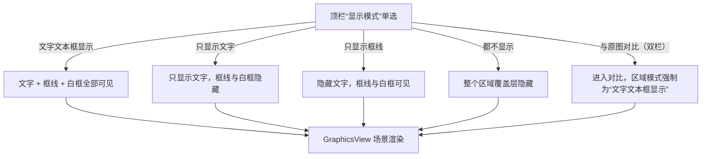
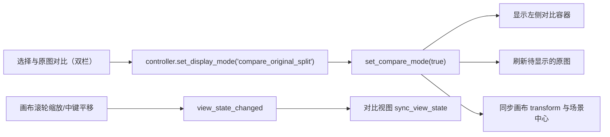

# 显示、对比与排列

当需要检查译文排版是否遮住原图、核对修复/去字结果，或者把多个文字区域整理成对齐的行列时，本页用于切换画布显示模式、开启原图双栏对比，并对选中区域执行对齐与间距分布。这里仅负责“怎么显示”和“怎么排列”；顶栏菜单结构、缩放倍率和五个编辑开关见[编辑器工具栏与菜单](./toolbar-and-menus.md)，区域选择与拖动见[画布工具与选区](./canvas-tools-and-selection.md)，文字与样式编辑见[文本属性](./text-properties.md)和[样式属性](./style-properties.md)。

## 可以做什么

- “显示模式”是互斥单选，只改变画布上文字区域覆盖层（文字、框线、白框）的可见性，不修改任何区域数据，也不是导出参数。
- “与原图对比（双栏）”在编辑画布左侧额外显示一张只读原图预览，右侧画布按“文字文本框显示”渲染，便于同时查看原图和当前编辑结果。
- “原图不透明度:”只控制画布中原图覆盖层的透明度，用于在“看修复/去字结果”和“看原图”之间切换；它不是导出参数。
- “排列”只移动选中文字区域的位置（修改区域 `center`），不改变文字内容、样式或区域大小。
- 这里不覆盖菜单展开方式、快捷键、缩放倍率与五个开关的持久化（见[编辑器工具栏与菜单](./toolbar-and-menus.md)），也不覆盖蒙版/画笔/仿制工具（见[蒙版、画笔与仿制印章](./mask-paint-and-clone-stamp.md)）。

## 在编辑器中操作

### 切换显示模式

1. 在编辑器顶栏打开“显示模式”。
2. 在五个互斥选项中任选一个：“文字文本框显示”“只显示文字”“只显示框线”“都不显示”或“与原图对比（双栏）”。
3. 切换即时生效：画布只改变文字与框线覆盖层的显示，区域数据和图片本身不变。
4. 选择“都不显示”后画布上的区域覆盖层全部隐藏，画布上无法直接点选区域；需要改回其他显示模式才能继续在画布上操作。

### 与原图双栏对比

1. 打开“显示模式”，选择“与原图对比（双栏）”。
2. 编辑画布右侧保持原样，左侧出现只读的原图预览面板；右侧画布自动按“文字文本框显示”渲染。
3. 左侧与右侧共享缩放和平移：在画布上滚轮缩放或中键拖动，左侧预览同步跟随。
4. 再次打开“显示模式”选择其他选项退出对比，左侧面板隐藏。

### 调整原图不透明度

- 拖动顶栏“原图不透明度:”滑条，范围 0–100。
- `0` 表示原图覆盖层完全透明（看到修复/去字底图，没有修复图时看到画布底色），`100` 表示完全不透明（看到原图/工作底图）。
- 控件初始值为 `0`；加载文档后，有修复图时保持 `0`（看修复结果），否则自动切到 `100`（看原图）。自动修复完成后也会回到 `0`，除非你已经手动调整过滑条。

### 对齐与分布文字区域

1. 在画布上选中区域：画布参照下至少 1 个，选区参照下至少 2 个；间距分布至少 3 个。不满足时对应菜单项保持禁用。
2. 打开“排列”，先选择参照：“参照：选区”（默认）或“参照：画布”。
3. 在六项对齐（左对齐、水平居中、右对齐、顶对齐、垂直居中、底对齐）中点击一项执行对齐。
4. 或点击“垂直间距分布”或“水平间距分布”均分选中区域之间的空白。
5. 菜单点击后保持打开，可连续调整参照并多次执行；每次对齐/分布都是单条批量命令，可用 `Ctrl+Z` 整批撤销。

### 适应窗口

点击顶栏“适应窗口”把当前图片完整缩放到画布可视区域并保持宽高比。它只改变视图，不修改区域数据；缩放倍率与滚轮缩放细节见[编辑器工具栏与菜单](./toolbar-and-menus.md)。

## 修改如何保存

### 显示模式如何控制画布内容 {#display-mode-mechanism}

控制器把显示模式映射为两个信号：`compare_enabled` 和 `region_display_mode`。对比模式开启时区域模式强制为 `full`；其余模式直接作为区域模式。画布收到 `region_display_mode_changed` 后，按区域 item 的文字、框线、白框三级可见性切换。

显示模式只切换覆盖层可见性；底图与区域数据永远不变。

### 对比视图如何与画布保持同步 {#compare-sync}

对比面板 `OriginalCompareView` 是只读 `QGraphicsView`：`setInteractive(False)`、不抢焦点、无滚动条。文档加载时后台并行读取原图（`_load_compare_image` 从原始 `source_path` 读取；当原图与显示图同路径时直接复用显示图），超过 3,000,000 像素时先降采样再显示。画布每次缩放/平移都发出 `view_state_changed`（transform + 场景中心），对比视图用同一 transform 和中心对齐视口；切图时新原图先缓存为待显示，仅在对比模式可见时刷新。

### 原图不透明度的图层语义 {#opacity-layers}

画布按 z 序叠放：修复图 `z=1` 为底层，原图/工作图 `z=2` 为覆盖层，画笔 `z=5`、印章 `z=6`、文字区域 `z=100` 依次在上。滑条值除以 100 后写入模型 `original_image_alpha`，并作为覆盖层 `setOpacity` 的值：

| 滑条值 | 覆盖层透明度 | 画布实际看到 |
| --- | --- | --- |
| `0` | 完全透明 | 修复/去字底图；无修复图时看到画布底色 |
| `100` | 完全不透明 | 原图/工作底图 |

加载文档时若用户尚未手动调整，默认透明度按“是否存在修复图”决定：有修复图取 `0`，否则取 `1`；自动修复完成时同样回到 `0`。手动拖动滑条后 `_user_adjusted_alpha` 置位，后续自动流程不再覆盖用户设置。

### 对齐与分布的几何计算 {#arrange-geometry}

对齐/分布都以区域白框在世界坐标中的参考点（左/右/上/下/中心）为输入，只平移区域 `center`。参照线取“选区白框包围盒”或“图片场景矩形”的 `min`/`max`/中点：

| 对齐动作 | 选区参照目标线 | 画布参照目标线 |
| --- | --- | --- |
| 左对齐 | 包围盒 `min_x` | 图片矩形 `min_x` |
| 水平居中 | 包围盒水平中点 | 图片水平中点 |
| 右对齐 | 包围盒 `max_x` | 图片矩形 `max_x` |
| 顶对齐 | 包围盒 `min_y` | 图片矩形 `min_y` |
| 垂直居中 | 包围盒垂直中点 | 图片垂直中点 |
| 底对齐 | 包围盒 `max_y` | 图片矩形 `max_y` |

间距分布先把区域按参考值排序，两端不动，计算“总跨度 − 区域尺寸总和”得到总空白并除以 `n-1`，再把内部区域依次放到“上一个区域 far 边 + 等分间隙”的位置，因此得到的是区域之间空白相等，而不是中心点等距。所有结果打包为一条 `MultiRegionUpdateCommand` 批量命令，整批可撤销；执行后立即移动白框和文字，不等待防抖渲染。

## 限制与注意事项

- 显示模式只影响覆盖层可见性：“都不显示”下区域覆盖层隐藏，画布无法直接点选区域；“只显示文字”时框线隐藏，区域边界不可见。
- 对比模式把右侧画布强制为 `full`：即使之前选了“只显示文字”，进入对比后也会显示文字与框线；退出对比需要重新选择其他显示模式，不会自动恢复。
- 对齐/分布依赖选区数量和参照：画布参照 ≥1、选区参照 ≥2、间距分布 ≥3；不满足时菜单项禁用。多选方式见[画布工具与选区](./canvas-tools-and-selection.md)。
- 对齐/分布只修改区域 `center`，会触发模型更新和区域重建；它是位置操作，不改变文字内容、样式和大小。
- “原图不透明度”不是导出参数：导出走导出服务，透明度只影响画布查看。修复图、`editor_base` 等文件语义见[导入导出与写回](./import-export-and-writeback.md)。
- 大图对比预览会降采样到最多 3,000,000 像素，极高缩放时左侧预览清晰度可能低于画布；这只影响预览，不影响导出。
- 显示模式、透明度与对比状态都保存在编辑器会话内，不写入配置文件；重新打开编辑器后回到默认值。
