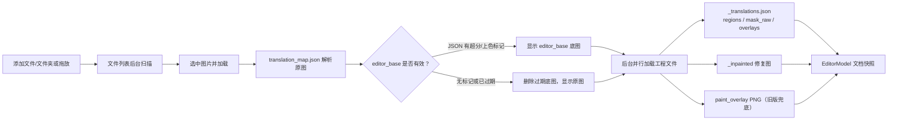
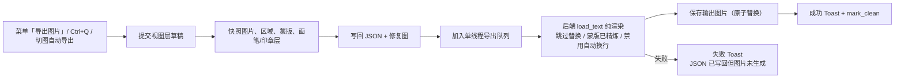
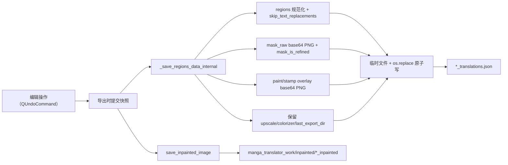

# 编辑器导入导出与写回

编辑器把翻译流水线生成的工程数据读进来，让你逐区域修改文字、位置、样式、蒙版和画笔/印章层；修改完成后，执行一次“导出图片”会把当前图渲染成最终图片，同时把工程数据写回磁盘。这里说明这些数据的导入格式、导出渲染与输出路径，以及 JSON、修复图等工程数据的写回机制。

右侧文件列表的增删、切页和“任务完成”进入编辑器的完整操作见[布局与文件列表](./layout-and-file-list.md)；顶栏“导出图片”菜单项与“切图时自动导出”开关的界面和持久化见[工具栏与菜单](./toolbar-and-menus.md)；`Ctrl+Q` 等快捷键的分派见[快捷键](./shortcuts.md)；蒙版与画笔/印章层如何进入工程文件见[蒙版绘制与仿制印章](./mask-paint-and-clone-stamp.md)。

## 可以做什么 {#feature-boundary}

- 本页负责编辑器与磁盘之间的数据边界：导入时读取哪些工程文件、导出时渲染什么、写回哪里，以及写回内容的格式。
- 不负责右侧文件列表的按钮、树形展示和行状态（归[布局与文件列表](./layout-and-file-list.md)）；不负责“导出图片”菜单项和“切图时自动导出”开关的界面与持久化（归[工具栏与菜单](./toolbar-and-menus.md)）。
- 编辑器导出不是重新跑完整翻译流水线：它直接渲染当前快照，不重新检测、OCR、翻译、上色或超分；蒙版视为已精炼，修复图直接复用。
- 翻译页的“导入翻译并渲染”与编辑器共用同一套 `_translations.json` 格式，但入口不同：前者是翻译页的工作模式，后者是编辑器文件列表加载图片时自动读取工程数据。
- 不在本页展示真实用户图片、工程 JSON、密钥或私有路径；格式只以键名和脱敏结构描述。

## 在编辑器中操作 {#ui-operations}

### 导入图片与工程数据 {#import-images-and-project-data}

1. 在编辑器右栏点击“添加文件”、“添加文件夹”或直接拖放文件/文件夹，把图片加入页面列表；列表按钮的完整操作见[布局与文件列表](./layout-and-file-list.md)。
2. 点击列表行（或按 `A`/`D` 切页）加载该图片：编辑器在后台读取关联的 `*_translations.json`、修复图和画笔层，画布显示后即可编辑。
3. 翻译任务完成后，主窗口弹出“任务完成”确认框；选择“是”会进入编辑器并打开结果对应的原图（先经 `translation_map.json` 或本次任务的输出映射解析原图路径）。

### 导出当前图片 {#export-current-image}

1. 打开顶栏“菜单”，点击“导出图片”，或按 `Ctrl+Q`。
2. 编辑器先冲刷浮动富文本等防抖期内的草稿，再写回工程数据并进入导出队列；导出期间显示进度 Toast，成功后显示“导出成功 … 已同步 JSON”。
3. 开启“切图时自动导出”时，切到下一张图会自动先导出当前图；自动导出被拒绝会中止切图。

### 未保存编辑与切页 {#unsaved-changes-and-switching}

关闭“切图时自动导出”后，当前图存在未保存编辑时切页会弹出三按钮对话框（源码硬编码中文）：

| 按钮 | 行为 |
| --- | --- |
| 导出图片 | 先导出当前图，等导出成功后再加载目标图；导出未入队或失败则不切页 |
| 不保存 | 放弃未保存的编辑，直接加载目标图 |
| 取消 | 中止切页，留在当前图 |

## 导入：文件与工程数据 {#import-files-and-project-data}

支持加载的页面图片扩展名与主页一致：`.png`、`.jpg`、`.jpeg`、`.jfif`、`.webp`、`.avif`、`.bmp`、`.tiff`、`.tif`、`.heic`、`.heif`。

### 导入流程 {#import-flow}

## 导出：渲染、输出路径与队列 {#export-rendering-output-and-queue}

### 导出做了什么 {#what-export-does}

“导出图片”不重新运行检测/OCR/翻译/上色/超分，而是把当前快照直接交给后端 `load_text` 纯渲染：`translator='none'`、`load_text=True`、`save_text=False`；蒙版视为已精炼（`mask_is_refined`），修复图直接复用；导出配置还会强制 `render.disable_auto_wrap=True`，因为文本框布局已由用户排布。

导出前先做两件持久化：把工程数据写回 `*_translations.json`（见[写回：JSON 与修复图](#writeback-json-and-inpainted)），并把当前修复图（没有修复图时用底图充当）写回 `_inpainted` 文件，让后端 `load_text` 跳过自己的修复步骤。之后才把渲染任务加入导出队列。

### 输出路径与文件名 {#output-path-and-filename}

输出目录按以下优先级确定：

1. 该图 JSON 中记录的 `last_export_dir`（上次导出目录）。
2. `cli.save_to_source_dir` 开启时：`<原图目录>/manga_translator_work/result`。
3. `app.last_output_path`（存在且有效时）。
4. 原图所在目录。

文件名规则：`cli.format` 非空且不是“不指定”时使用该扩展名（小写）；否则沿用原图扩展名；都没有时使用 `.png`。图片质量取 `cli.save_quality`。若开启了 `cli.export_editable_psd`，渲染完成后还会在 `manga_translator_work/psd/` 下导出可编辑 PSD（`cli.psd_script_only` 时只导出脚本）。

### 导出队列与“已保存”语义 {#export-queue-and-clean-state}

导出是异步单线程队列任务（`ThreadPoolExecutor(max_workers=1)`）：

- 同一张图的自动导出会合并：新任务入队时取消该图未开始的旧自动导出；手动导出不合并。
- 工程数据写回成功后任务即入队并 `mark_clean()`（QUndoStack 干净状态）。因此“未保存”判定只看导出是否已入队，不看渲染是否最终成功；渲染失败时 JSON 已写回，但输出图片不会生成，界面显示失败 Toast。
- 导出期间 Toast 显示“正在导出…”或“正在导出（N 个任务）”；成功显示“导出成功\n<输出路径>\n已同步 JSON”，失败显示“<文件名> 导出失败：<原因>”。
- 关闭应用时若有未完成任务，先弹出“导出任务尚未完成”确认框；选择“是”会排空导出队列再退出，选择“否”则取消关闭。

### 导出流程 {#export-flow}

## 写回：JSON 与修复图 {#writeback-json-and-inpainted}

### JSON 写回 {#json-writeback}

导出时 `EditorControllerExportService.save_editor_json()` 把当前快照写到 `find_json_path()` 找到的 `*_translations.json`：

- 以原图绝对路径作为顶层键；`regions` 经 `_normalize_regions_for_backend` 规范化：补齐 `translation`、`texts`、`font_size`、`angle`、`target_lang`、`language`、`direction` 等字段，把 `fg_colors`/`fg_color` 元组转成 `font_color` 十六进制，把 `v`/`h` 转成 `vertical`/`horizontal`。
- 恒写 `skip_text_replacements: true`：编辑器 `translation` 字段就是替换后终稿（`translation_raw` 才是替换前），后端重渲染不能再次替换。
- 蒙版存在时写 `mask_raw`（base64 PNG）并标 `mask_is_refined: true`，后端跳过蒙版优化。
- 画笔/印章层有内容时以 base64 PNG（RGBA）写入 `paint_overlay` / `stamp_overlay`。
- 保留已有 JSON 的超分/上色信息与 `last_export_dir`（`preserve_existing_preprocess_flags`），避免下次导出丢失底图来源标志。
- 写入采用“同目录临时文件 + `os.replace`”的原子替换，避免半截 JSON 被后端读到。

### 修复图写回 {#inpainted-writeback}

`save_inpainted_image()` 把当前修复图（没有则用底图充当）写到 `manga_translator_work/inpainted/<图片名>_inpainted.<扩展名>`，质量取 `cli.save_quality`，同样走临时文件 + `os.replace`。后端渲染后若重新生成了修复图，也会回写同一路径（`_persist_backend_inpainted_image`），保证下次编辑看到的是最新修复结果。

### 写回流程 {#writeback-flow}

## 限制与注意事项 {#dependencies-and-conflicts}

- 编辑器导出强制 `disable_auto_wrap=True`，因此导出结果不受“启用 AI 断句”等自动换行设置影响；文本框大小和位置以编辑器为准。
- `translation` 恒为替换后终稿：导入旧 JSON 缺 `translation_raw` 时用 `translation` 回填；写回时 `skip_text_replacements` 防止二次替换。
- 批量管理等外部写回会修改 JSON，但编辑器把区域常驻内存且不监听文件变化；批量面板写回后会调用 `load_image_and_regions` 让编辑器重新加载，否则切图自动导出会用旧内存覆盖新写入。相关流程见[批量管理：预览、应用与恢复](../batch-management/preview-apply-restore.md)。
- 切页自动导出依赖导出队列：自动导出被拒绝会中止切图；手动导出时切图等待导出完成。
- `editor_base` 只在 JSON 有超分/上色标记时有效；没有标记时编辑器删除过期底图并回退到原图，避免显示与当前 JSON 不匹配的旧底图。
- JSON 不存在时导出会新建（`find_json_path` 无结果则 `get_json_path(create_dir=True)`）；写入后位于新位置，旧版同目录 JSON 仍可读但不再作为写入目标。
