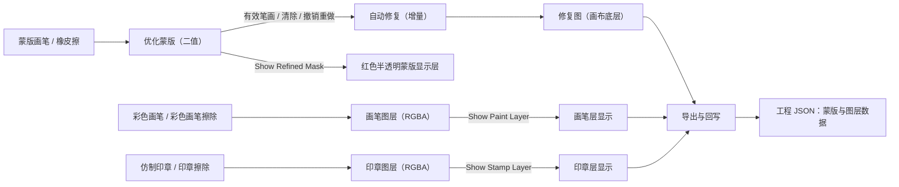
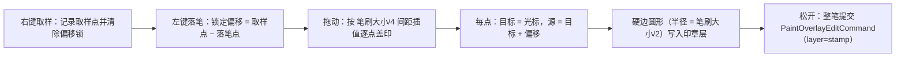

# 蒙版绘制与仿制印章

当自动生成的修复蒙版漏掉文字残影、多盖住背景，或者图片上还有水印、网格、气泡线等需要手动抹掉的内容时，可以在编辑器左侧的“图像编辑”分组中切换蒙版画笔、彩色画笔和仿制印章，直接在画布上修改修复蒙版或修补图像。这里说明这三类工具的写入目标、显示控制、自动修复触发、撤销与持久化格式；工具入口、指针语义、缩放平移与选区见[画布工具与选区](./canvas-tools-and-selection.md)，修复器本身的模型与参数见[设置 → 蒙版与修复](../settings/mask-and-inpainting.md)，快捷键与焦点规则见[快捷键](./shortcuts.md)。

## 可以做什么

- 蒙版画笔（`brush`）和橡皮擦（`eraser`）编辑的是**优化蒙版**（`refined_mask`，二值数组 0/255），不是检测输出的原始蒙版；每次有效笔画提交一个 `MaskEditCommand`，并触发一次自动修复。
- 彩色画笔（`paint`、`paint_erase`）写入**画笔图层**（`paint_overlay`，RGBA）；仿制印章（`clone`、`stamp_erase`）写入**印章图层**（`stamp_overlay`，RGBA）。这两层是覆盖在修复图之上的独立透明层，不参与蒙版二值化。
- “清除所有蒙版”清空的是优化蒙版（没有优化蒙版时以原始蒙版为起点清零）；“清除画笔图层”“清除印章图层”分别清空对应 RGBA 层，三者都走可撤销命令。
- 这里不负责工具按钮切换、选区、缩放平移、右键菜单和快捷键注册（见[画布工具与选区](./canvas-tools-and-selection.md)与[快捷键](./shortcuts.md)），也不负责修复器模型、修复尺寸、精度和逐块修复等全局参数（见[设置 → 蒙版与修复](../settings/mask-and-inpainting.md)）。

## 在编辑器中操作

### 在属性面板选择图层与工具

打开编辑器后，左侧默认显示“属性编辑”。在“图像编辑”分组中有“蒙版”“画笔”“印章”三个页签，各页签提供一组互斥工具按钮；三个页签共用一个按钮组，因此选中任一页签的工具都会取消其他页签的按钮。切换页签时，如果当前工具不属于新页签，会自动切回新页签的“不选择”，避免跨页工具冲突。三个页签还共享同一个“笔刷大小：”字段。

### 蒙版页签：画笔与橡皮擦

1. 打开“蒙版”页签。
2. 点击“画笔”或“橡皮擦”；也可以直接按 `W` / `E` 切换，无需打开面板。
3. 拖动“笔刷大小：”滑条调整笔画粗细，范围 5–200，初始 30；在画布上按住 `Shift+滚轮` 每格 ±1 调整同一个字段。
4. 在画布上按住左键拖动：画笔把笔画位置写为 255，橡皮擦把笔画位置清为 0。松开后整笔作为一个可撤销命令提交，并触发一次自动修复。
5. 勾选“显示优化蒙版”在画布上以半透明红色显示优化蒙版；点击“清除所有蒙版”把优化蒙版整体清空。

### 画笔页签：彩色画笔

1. 打开“画笔”页签。
2. 选择“画笔”或“橡皮擦”：前者用“画笔颜色：”选择的颜色写入画笔图层，后者擦除画笔图层。
3. 画笔颜色默认 `#ffffff`（白色），点击颜色按钮打开“选择画笔颜色”对话框；空值会规范化到 `#ff0000`。
4. “显示画笔层”只控制画笔图层是否显示，不删除数据，默认勾选。“清除画笔图层”把整层清空，可通过撤销恢复。

### 印章页签：取样与涂抹

1. 打开“印章”页签，选择“仿制印章”。
2. 在画布上**右键**点击要复制的源位置进行取样；仿制印章活动时右键不再打开上下文菜单。
3. 按住**左键**拖动涂抹：落笔瞬间锁定“取样点 − 落笔点”的偏移，之后源位置跟随光标保持该偏移；拖动过程中逐点把源像素盖印到印章图层。
4. 需要修正误盖时，选择同一页签的“橡皮擦”，按住左键拖动擦除印章图层。
5. 勾选“显示印章层”控制印章图层显示，默认勾选；点击“清除印章层”清空整层，可通过撤销恢复。

## 图层与数据流

工具按钮、写入目标、显示层和导出之间的数据流如下。蒙版类工具最终影响的是修复蒙版和自动修复结果；画笔/印章类工具写入的是两个独立的 RGBA 覆盖层，不进入蒙版二值化。

修复图、画笔层、印章层都叠加在画布底图之上，文字区域渲染在最上层；仿制印章的取样源正是“画布当前可见内容”（修复图优先，否则原图，再叠加画笔层和本笔已盖印的印章内容），因此同一笔内可以继续传递仿制内容。

## 修改如何保存

### 蒙版笔画与自动修复

- `_build_stroke_mask` 把落笔点连成带圆头的折线，再按“笔刷大小 × 蒙版/图像尺寸比”换算成蒙版分辨率下的二值笔画；蒙版分辨率以 `refined_mask` 为准，没有优化蒙版时以底图像素尺寸为准。
- 提交时比较新旧蒙版，只有实际变化才构造 `MaskEditCommand`（记录变化包围盒内的旧/新像素补丁），通过 `QUndoStack` 执行。
- 画笔触及的每个 8 邻域蒙版连通块会并入 `MaskDelta.added` 的待修复区域；即使二值蒙版没有变化，整个被触及连通块仍会进入修复流水线，并按其包围盒外扩 50px 做增量修复，其他不相连的蒙版保持不变。橡皮擦只提交真实移除区域，移除像素直接从底图恢复。
- 每次蒙版修复操作都会推进 `mask_revision` 并生成新的 `InpaintKey`；新笔画会取消并自然淘汰旧 key 的未完成结果，连续快速涂抹最终只接受最新结果。
- 修复器本身使用设置中的 `inpainter`、`inpainting_size`、`inpainting_precision`、`force_use_torch_inpainting`，设备为 `cuda`（开启 GPU 且可用时）或 `cpu`，详见[设置 → 蒙版与修复](../settings/mask-and-inpainting.md)。
- 笔画预览颜色：蒙版画笔为半透明红色、橡皮擦为半透明蓝色、彩色画笔为所选颜色、画笔/印章擦除为半透明青色；仿制印章直接显示真实盖印像素。

### 画笔与印章图层

- 两层的运行态都是 `(H, W, 4)` 的 RGBA uint8 数组，尺寸始终与底图像素一致；空层在显示端隐藏，提交时若与旧层完全一致则跳过。
- `paint` 用所选颜色写入 RGB 并置 alpha=255；`paint_erase`/`stamp_erase` 把笔画位置的 alpha 清为 0（不物理删除数组）。
- 每次拖动画笔、橡皮或印章擦除的完整笔画提交一个 `PaintOverlayEditCommand`，同样只记录变化包围盒，undo/redo 只恢复该包围盒像素。

### 仿制印章算法

- 取样圈是画布顶层虚线圆，半径随笔刷大小变化；偏移锁定前停在取样点，锁定后跟随光标显示“源位置 = 光标 + 偏移”。
- 单点盖印是像素格对齐的硬边圆，圆内取复合源的 RGB 写入印章层并把 alpha 置 255，边缘不随拖动方向变化。
- `Escape` 或画布失焦会取消进行中的盖印，不提交。

### 显示与清除

- 蒙版显示用 `build_mask_display_frame`：二值蒙版转成红色（255,0,0）、alpha=128 的预乘 RGBA，预览按最大 200 万像素降采样；优化蒙版 z=11、原始蒙版 z=10。
- 画笔层 z=5、印章层 z=6，都在修复图（z=1）之上、文字区域之下；“显示画笔层/显示印章层”只切换 `layer_visible`，不删除数据。
- “清除所有蒙版”清空优化蒙版后照常触发自动修复；“清除画笔图层/清除印章图层”在有内容时提交清空命令，空层直接返回。

## 撤销与重做

蒙版笔画、清除所有蒙版、画笔/印章笔画和图层清除都进入同一个 `QUndoStack`：

- `MaskEditCommand`：undo/redo 通过补丁或全量数组写回 `refined_mask`；写回同样触发 `refined_mask_changed`，因此撤销/重做蒙版编辑也会重新触发自动修复。
- `PaintOverlayEditCommand`：`layer='paint'` 作用于画笔层，`layer='stamp'` 作用于印章层；undo/redo 只改对应层像素，不触发修复。
- 撤销粒度是“整笔”，不是单个取样点；`Ctrl+Z`/`Ctrl+Y` 的焦点规则见[快捷键](./shortcuts.md)。

## 限制与注意事项

- 蒙版类工具依赖修复器配置可加载（模型、尺寸、精度）；加载失败或模型缺失时蒙版仍会更新，但修复图不会刷新，日志记录错误。
- 画笔类工具左键总是绘制，不能点选或拖动区域；区域操作必须先切回“选择”。
- 切换页签会把活动工具切回新页签的“不选择”，蒙版画笔与彩色画笔不会同时处于活动状态。
- `Shift+滚轮` 调整的是三个页签共享的笔刷大小（5–200），不会缩放画布；`Ctrl+滚轮` 调整选中区域字号，两者都归[快捷键](./shortcuts.md)。
- 仿制印章活动时右键被取样占用，右键菜单完全屏蔽；`Escape`/失焦丢弃未提交笔画。
- 笔画数据按底图全分辨率保存（RGBA 层为 H×W×4），超大图片会占用较多内存；显示层会降采样，但落笔与盖印都在全分辨率进行。
- 画笔/印章层、优化蒙版都随导出写入工程文件；导出与回写格式见[导入导出与回写](./import-export-and-writeback.md)。
