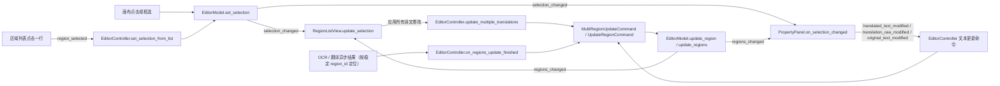

# 区域列表与文本编辑

当你在编辑器里需要逐条核对 OCR 结果、调整某句台词或重新识别某个文字框时，使用左栏的“译文列表”和属性面板的“文本内容”区。这里介绍区域列表的浏览、排序、查找替换、批量应用，以及属性面板中的原文/译文编辑和列表同步；样式、富文本、蒙版与导入导出分别见对应页面。

## 可以做什么 {#feature-boundary}

- 左栏包含两个路由：“译文列表”与“属性编辑”（属性面板），默认显示后者。内容包括区域列表的全部交互，以及属性面板“文本内容”与“操作”两个分区。
- 区域列表每一行显示“编号: 原文”和可编辑译文框；行内修改只是列表草稿，必须点击“应用所有译文修改”才写入模型。
- 属性面板文本区维护三个文本字段：原文 `text`、最终译文 `translation`、替换前译文 `translation_raw`。“显示替换前译文”默认勾选，勾选时编辑的是 `translation_raw`。
- 不覆盖：样式设置见[样式属性](./style-properties.md)；浮动富文本编辑器见[浮动富文本](./floating-rich-text.md)；蒙版、画笔与印章见[蒙版绘制与仿制印章](./mask-paint-and-clone-stamp.md)；导入导出与写回见[导入导出与回写](./import-export-and-writeback.md)；快捷键见[快捷键](./shortcuts.md)。

## 在编辑器中操作 {#ui-operations}

### 打开左栏并浏览区域列表 {#open-region-list}

1. 在编辑器打开一张图片后，左栏默认显示“属性编辑”。点击“译文列表”切到区域列表。
2. 列表每一行显示 `1: 原文` 形式的编号加原文、一个可编辑译文框和拖动手柄。译文框占位提示会随界面语言切换。
3. 拖动行首手柄可以调整区域顺序；编号、画布区域和导出的 JSON 顺序会同步变化，操作支持撤销和重做。点击列表项或译文框只选择对应区域，不会打开富文本浮窗。
4. 在画布上点击或框选区域，模型选区变化会反向选中对应列表行；点击列表行也会通过 controller 把该区域设为画布和属性面板的当前选区。
5. 直接编辑某行译文只修改列表草稿；点击“应用所有译文修改”才把有变化的行批量提交。

### 查找替换与应用所有译文修改 {#find-replace-apply}

1. 在“查找”输入要查找的文字，在“替换为”输入替换文字。
2. 点击“全部替换”会在所有列表行的译文框草稿中执行纯文本替换（`str.replace`，非正则）；查找内容为空时不执行。
3. “全部替换”只改列表草稿；点击“应用所有译文修改”后，controller 汇总所有行译文，跳过未变化的区域，把变化区域合并为一次可撤销的批量更新命令。
4. 正在编辑（持焦点）的列表行在模型刷新时不会被覆盖，避免丢焦点、光标或 IME 组合字。

### 在属性面板编辑文本 {#edit-text-in-property-panel}

单选区域后，“文本内容”区启用；多选时文本区禁用，样式区与操作区仍可用。

1. “原文:”输入框直接写回区域原文 `text` 字段。
2. “显示替换前译文”默认勾选：此时“译文:”框编辑的是 `translation_raw`，每次变化实时经过替换规则生成 `translation`；取消勾选后编辑的是最终 `translation`。
3. 译文框用 `↵` 显示换行；保存时 `↵` 转换为模型存储的 `[BR]`，显示时 `[BR]`、` `、`【BR】` 和真实换行都会转成 `↵`。
4. 点击“占位符”在译文框光标处插入全角下划线 `＿`；点击“换行↵”插入 `↵`。
5. “字符数: 0”标签在源码中是静态文案，当前没有动态字符计数逻辑。
6. 选择“OCR模型:”后点击“识别”对当前选区重新 OCR；选择“翻译器：”与“目标语言：”后点击“翻译”翻译当前选区。OCR 与翻译器下拉仍复用主页的选项列表，但当前选择分别保存到 `app.editor_ocr` 与 `app.editor_translator`，不会改写主页的 `ocr.ocr` 与 `translator.translator`；编辑器默认 OCR 为 `mocr`、默认翻译器为 `openai`。目标语言仍使用主页的 `translator.target_lang`。

### 复制、粘贴与删除区域 {#copy-paste-delete}

“操作”区在单选和多选时都可用：

- “复制”：把当前选区区域数据复制到内部剪贴板。
- “粘贴”：单选时粘贴样式（保留位置与文本，覆盖字体、字号、颜色、对齐、方向、行距与字距）；多选或无选区时按鼠标位置或默认偏移粘贴整个区域。
- “删除”：删除选中区域，一次操作可撤销。若编辑器菜单中的“删除文本框并恢复原图”开关已开启，还会同步移除该区域对应的原始蒙版和精修蒙版，使被抹除区域恢复原图；蒙版变化与区域删除可一起撤销/重做。

## 修改如何保存 {#runtime-behavior}

### 列表同步流程 {#list-sync-flow}

`EditorModel` 是区域状态的单一事实来源，所有区域改动都必须经过模型的 mutation 方法并广播 `RegionChange`。区域列表按 `reset`/`updated`/`inserted`/`removed` 四种 kind 做最小刷新；差量更新时保留未提交草稿，持焦点的译文框不被覆盖。

同步通道汇总：

| 方向 | 信号 / 动作 | 接收方 | 关键行为 |
| --- | --- | --- | --- |
| 列表 → 模型选区 | `region_selected` | `controller.set_selection_from_list` → `model.set_selection` | 点击列表行，画布与属性面板跟随切换 |
| 模型选区 → 列表 | `selection_changed` | `RegionListView.update_selection` | 画布/属性面板引发的选区变化反向选中列表项 |
| 模型区域 → 列表 | `regions_changed` | `RegionListView.on_regions_changed` | 按 kind 差量刷新，保留草稿、不覆盖持焦点行 |
| 列表 → 模型 | “应用所有译文修改” | `controller.update_multiple_translations` | 汇总草稿、跳过未变化区域、单次可撤销命令 |
| 属性面板 → 模型 | 文本修改信号 | `controller.update_translated_text` 等 | 实时写回 `translation`/`translation_raw`/`text` |
| 异步任务 → 模型 | 稳定 `region_id` 定位 | `controller.on_regions_update_finished` | 等待期间插入/删除区域不会写错目标 |

## 限制与注意事项 {#dependencies-and-conflicts}

- 区域列表、属性面板和工具栏对齐/分布按钮都监听同一模型选区，不各自保存一份选区副本；任何一方改变选区都会让其余视图刷新。
- 正在编辑的列表行与属性面板文本框在常规刷新中不会被覆盖；只有异步任务（`source="async"`）写回时才强制刷新文本字段，防止陈旧文档覆盖模型。
- `translation` 与 `translation_raw` 是同一区域的两个字段，不是两个区域；“显示替换前译文”只改变编辑目标，不改变区域本身。
- “编辑时自动应用富文本规则”由编辑器菜单开关控制，富文本规则的定义与渲染时机归富文本规则页。
- 与批量管理的写回、替换规则的实时应用存在交互；批量写回、`.bak` 与恢复归批量管理页。
- 焦点在文本控件时，`Delete` 不删除区域，`1`/`2`/`3`/`Q`/`W`/`E`/`A`/`D` 被转发为文字而不是切换页签、工具或图片，详见[快捷键](./shortcuts.md)。
