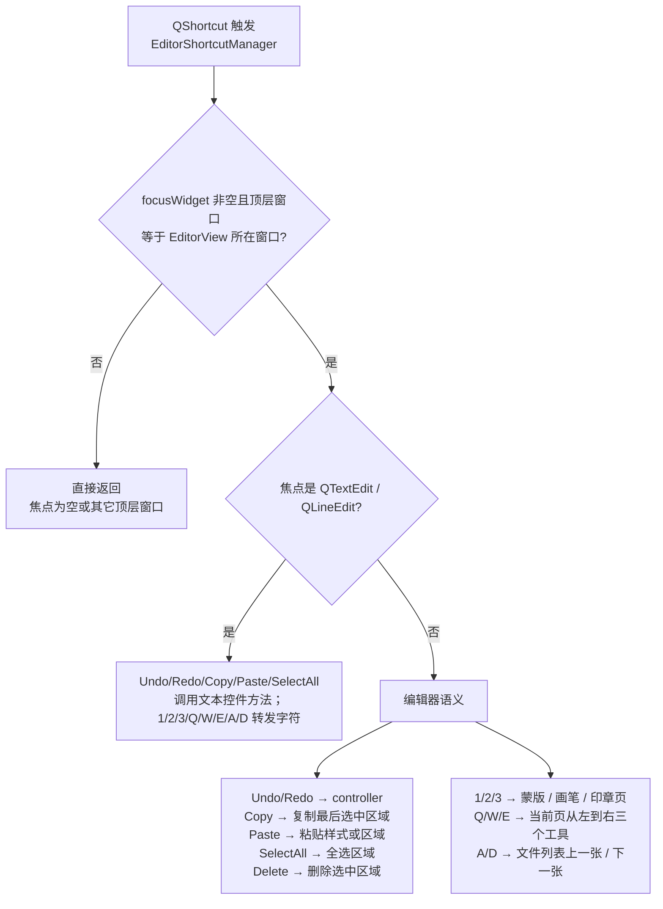
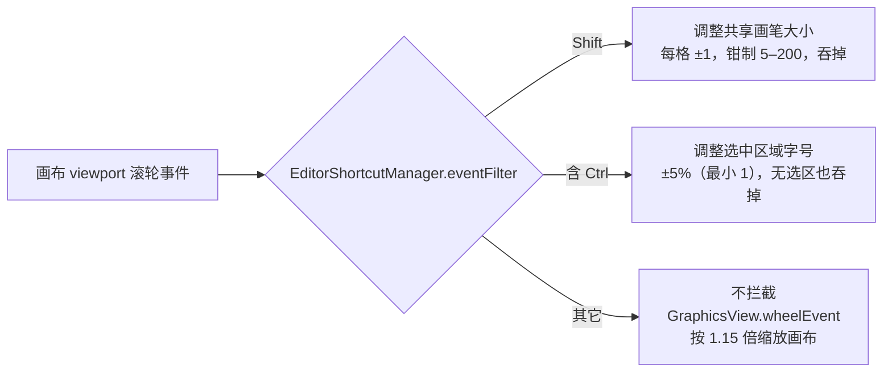

# 编辑器快捷键

编辑器的大多数高频操作都可以用键盘或滚轮完成：撤销/重做、复制/粘贴/删除、切换画布工具、切换图片，以及用滚轮组合调整画笔大小和选中区域字号。这里列出 `EditorShortcutManager` 实际注册的全部快捷键与滚轮组合，并解释焦点在文本控件、画布或浮动富文本窗口时这些按键分别交给谁处理。

工具栏与菜单项、画布工具、区域列表、属性面板和浮动富文本的完整操作分别见[工具栏与菜单](./toolbar-and-menus.md)、[画布工具与选区](./canvas-tools-and-selection.md)、[区域列表与文本编辑](./region-list-and-text-editing.md)、[文本属性](./text-properties.md)、[样式属性](./style-properties.md)、[浮动富文本](./floating-rich-text.md)和[导入导出与写回](./import-export-and-writeback.md)。这里按“按哪个键会发生什么”，不重复这些页面里的控件细节。

## 可以做什么 {#feature-boundary}

- 编辑器键盘快捷键全部由 `desktop_qt_ui/ui/editor/shortcut_manager.py#EditorShortcutManager` 注册，工具栏不注册 `QAction` 快捷键，只在“导出图片”“撤销”“重做”菜单项后追加提示文字。
- `Undo`、`Redo`、`Copy`、`Paste`、`Select All`、`Delete` 使用 `QKeySequence.StandardKey` 注册；在 Windows 上的主绑定分别为 `Ctrl+Z`、`Ctrl+Y`、`Ctrl+C`、`Ctrl+V`、`Ctrl+A`、`Del`。实际显示会随 Qt 平台映射。
- `Ctrl+Q` 导出、`1`/`2`/`3` 切换图像编辑页、`Q`/`W`/`E` 切换当前页工具、`A`/`D` 切换图片是固定字面量，不随平台变化；页签上的数字仅通过悬浮提示显示。
- 滚轮组合通过安装在画布 viewport 上的事件过滤器处理：`Shift+滚轮` 调整共享画笔大小，任意含 `Ctrl` 的滚轮组合调整选中区域字号，普通滚轮交给 `GraphicsView` 缩放画布。
- `Escape` 或画布失焦会取消进行中的框选、绘制、文本框、仿制、区域拖动或中键平移，不提交任何修改。
- 快捷键分派优先级从高到低为：焦点在其他顶层窗口（例如浮动富文本窗口）→ 焦点在主窗口文本控件 → 焦点在画布。完整冲突规则见[运行机理](#runtime-behavior)。

## 在编辑器中操作 {#ui-operations}

### 在“菜单”中查看快捷键提示 {#toolbar-hints}

打开编辑器顶栏“菜单”：“导出图片”、“撤销”、“重做”三个菜单项由代码追加 `(Ctrl+Q)`、`(Ctrl+Z)`、`(Ctrl+Y)` 提示文字。这些提示只是文字，真正的快捷键由 `EditorShortcutManager` 注册。

### 键盘快捷键速查 {#shortcut-reference}

以下表格是 `_setup_editor_shortcuts()` 实际注册的全部键盘快捷键。焦点在文本控件（`QTextEdit` 或 `QLineEdit`）时的行为与画布焦点不同；`1`/`2`/`3`/`Q`/`W`/`E`/`A`/`D` 在文本焦点下会作为普通字符转发给文本控件，不切换页签、工具或图片。

| 快捷键 | 文本控件焦点时 | 画布焦点时 |
| --- | --- | --- |
| `Ctrl+Z` | 撤销文本编辑 | 撤销编辑器操作 |
| `Ctrl+Y` | 重做文本编辑 | 重做编辑器操作 |
| `Ctrl+C` | 复制文本 | 复制最后选中的区域 |
| `Ctrl+V` | 粘贴文本 | 单选时粘贴样式；无选区时按鼠标位置或默认位置粘贴区域 |
| `Ctrl+A` | 全选文本 | 选中全部区域 |
| `Del` | 不删除区域 | 删除选中区域 |
| `Ctrl+Q` | 仍导出（先冲刷浮动富文本待提交内容） | 仍导出 |
| `1` | 输入字符 `1` | 切换到“蒙版”页 |
| `2` | 输入字符 `2` | 切换到“画笔”页 |
| `3` | 输入字符 `3` | 切换到“印章”页 |
| `Q` | 输入字符 `q` | 选择当前页第一个工具（不选择） |
| `W` | 输入字符 `w` | 选择当前页第二个工具（画笔或仿制印章） |
| `E` | 输入字符 `e` | 选择当前页第三个工具（橡皮擦） |
| `A` | 输入字符 `a` | 文件列表选择上一张图片 |
| `D` | 输入字符 `d` | 文件列表选择下一张图片 |

### 滚轮组合 {#wheel-combos}

| 组合 | 效果 | 限制 |
| --- | --- | --- |
| `Shift + 滚轮` | 调整共享画笔大小，每格 ±1 | 钳制在 `5`–`200`；事件被吞掉，不缩放画布 |
| 任意含 `Ctrl` 的滚轮组合 | 按 ±5%（最小 1）调整所有选中区域字号 | 无选区时也吞掉事件，不穿透成画布缩放 |
| 普通滚轮 | 以鼠标点为锚缩放画布 | 倍率钳制在 `0.05`–`50.0`，由 `GraphicsView.wheelEvent()` 处理 |

## 修改如何保存 {#runtime-behavior}

### 快捷键注册与焦点分派 {#registration-and-dispatch}

`EditorShortcutManager` 把所有编辑器快捷键都注册为带焦点感知（`context_aware=True`）。触发时先取 `QApplication.focusWidget()`：如果焦点控件为空，或焦点控件的顶层窗口不是 `EditorView` 所在窗口（例如焦点在 `Qt.Tool` 浮动富文本窗口），所有编辑器快捷键直接返回，防止用主窗口残留焦点误删画布区域；否则再看焦点是否为 `QTextEdit` / `QLineEdit`，决定把按键交给文本控件还是编辑器语义。

### 文本焦点时的按键转发 {#text-widget-forwarding}

焦点在文本控件时，`1`/`2`/`3`/`Q`/`W`/`E`/`A`/`D` 的处理会临时禁用对应快捷键，然后向文本控件合成发送 `KeyPress` 与 `KeyRelease` 事件（例如 `q`），发送完再恢复快捷键，避免递归触发。`Ctrl+Q` 导出不区分焦点：它直接调用 `EditorView.export_image()`，导出前先 `flush_pending_changes()` 冲刷浮动富文本编辑器中防抖期内的正文与注音内容。

### 滚轮事件过滤 {#wheel-event-filter}

`EditorShortcutManager` 在 `graphics_view.viewport()` 上安装事件过滤器，滚轮事件先到过滤器：

`Shift` 分支以“修饰键等于 Shift”判断，`Ctrl` 分支以“包含 Ctrl”判断，因此 `Ctrl+Shift+滚轮` 也走调字号。属性面板的滑条、数值框和下拉框在未获得键盘焦点时不吞滚轮，让父滚动区域接管；`CustomSlider` 仅在持焦点时用滚轮改值。

### Escape 与画布失焦 {#escape-and-focus-out}

画布有进行中的交互（框选、绘制、文本框、仿制、区域拖动或中键平移）时，按 `Escape` 会调用 `_cancel_active_interaction(commit=False)` 丢弃这些交互，不提交修改；`focusOutEvent`（模态框、窗口失活、焦点转移）也走同样的丢弃路径，防止丢失 `mouseRelease` 后框选矩形或绘制预览残留在场景里。

## 限制与注意事项 {#dependencies-and-conflicts}

- `Delete` 只在焦点不是文本控件时删除区域；文本控件内的 `Delete` 不会触发区域删除。
- 浮动富文本窗口以 `WA_ShowWithoutActivating` 显示，选区变化不会调用 `focus_text()` 抢焦点，画布保留焦点，因此 `Delete`/`A`/`D`/`1`/`2`/`3`/`Q`/`W`/`E` 在浮窗出现后仍按画布语义工作；点击浮窗内的文本框后才进入文字编辑。
- 画布鼠标按下会先 `force_save_property_panel_edits()` 再 `setFocus()` 给画布，防止切画布时丢失属性面板正在编辑的文本。
- 区域列表的正在编辑行使用差量同步保留草稿：持焦点的译文框不会被模型更新覆盖，避免丢焦点、光标或 IME 组合字；属性面板的正在编辑文本在常规刷新时同样不覆盖，异步强制字段更新是例外。
- 工具栏只显示快捷键提示文字而不注册 `QAction` 快捷键，避免与 `EditorShortcutManager` 的双重触发。
- 快捷键行为依赖选区状态：无选区时 `Delete`、`Copy` 无操作，`Paste` 按鼠标位置粘贴新区域；多选时 `Copy` 只复制最后选中的区域。
- 在编辑器之外（主窗口其它页面或系统其它窗口），这些快捷键不属于 `EditorShortcutManager` 的注册范围，不保证生效。
