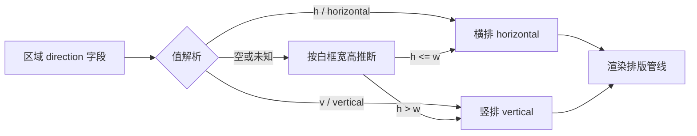
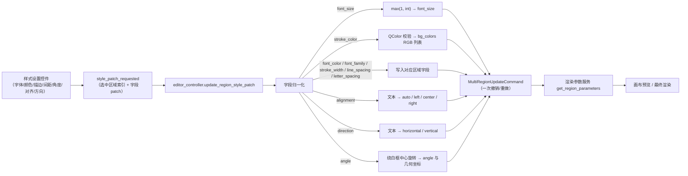

# 编辑器样式属性

当需要统一或微调文字区域的显示样式——字体、字号、文字颜色、描边、行距、字距、旋转角度、对齐和排版方向——使用属性面板中的“样式设置”分区。这里按区域级基础样式：每个字段的修改作为一次样式 patch，作用于当前全部选中区域。逐段富文本样式（加粗、发光、注音、TCY 等）见[浮动富文本编辑器](./floating-rich-text.md)，文本内容与 OCR/翻译见[区域列表与文本编辑](./region-list-and-text-editing.md)，蒙版/画笔/仿制工具见[画布工具与选区](./canvas-tools-and-selection.md)，样式随项目 JSON 的导入导出见[导入导出与回写](./import-export-and-writeback.md)。

## 可以做什么

- “样式设置”是属性面板三个分区之一，其余两个是“图像编辑”和“文本内容”；这里仅列出样式分区。
- 样式字段是区域数据字段（`font_family`、`font_size`、`bg_colors` 等），不是全局渲染配置键。设置页“渲染”分组的全局参数只在区域没有对应字段时作为基础值参与计算。
- 单选时文本、样式、操作三区都启用；多选时文本区禁用、样式和操作区仍可用，修改任一样式字段会同时应用到全部选中区域；无选区时三区禁用。多选没有“混合值”显示，样式控件保留最近单选的值。
- 富文本“局部样式”（加粗、斜体、下划线、删除线、文字颜色、发光、外描边、TCY、注音、局部旋转等）作用于单个连续文本段，不写入这些区域字段。
- 样式组合只保存区域级样式字段的子集，不保存字体大小与角度。

## 在编辑器中操作

### 打开属性面板与选择区域

1. 打开编辑器，左侧栏默认显示“属性编辑”。
2. 在画布上单选一个区域：文本、样式、操作三区均启用，样式控件显示该区域的实际值。
3. 框选或多个区域：文本区禁用，样式区与操作区仍可用；修改任一样式字段会同时应用到所有选中区域。
4. 无选区：三个分区全部禁用，样式控件回到初始默认值。
5. 画布点击前会先强制保存属性面板中正在编辑的文本（`force_save_property_panel_edits()`），避免切换画布时丢失修改。

### 修改颜色、描边与间距

- 点“字体颜色”或“描边颜色”的颜色按钮打开取色弹层。弹层包含“色板”、“亮度”、“自定义”、“常用颜色”、“曾经用过”分组，可输入 HEX 或 RGB；点“屏幕取色”进入全屏取色器，左键取色，右键或 Esc 取消。
- “字体大小”由数值框（8–1000）和滑条（8–150）同步控制；两者范围不同，滑条只覆盖常用区间。
- “描边宽度”设为 `0` 时不绘制描边。
- 颜色选择器把选中的颜色记入“最近使用”并在应用配置中保存（最多 20 个），下次打开弹层可直接选用。

### 保存与应用样式组合

1. 调整好样式后点保存按钮（悬停提示“保存当前样式组合”），输入名称并保存；名称不能为空，已存在时确认是否覆盖。
2. 从“样式组合：”下拉选择已保存的样式，即把该组合应用到当前全部选中区域；应用不改变字体大小与角度。
3. 点删除按钮（悬停提示“删除当前选中的已保存样式”）删除当前选中的组合，需二次确认。
4. 配置写盘失败时保存或删除会弹错误提示。

### 从画布快速调整字号

在画布上按住 Ctrl 滚动滚轮，按当前字号约 5% 的步长调整所有选中区域的字体大小（最小钳制为 1）；即使没有选区，事件也会被吞掉，不会穿透成画布缩放。Shift+滚轮调整的是画笔大小，属于“图像编辑”分区，见[画布工具与选区](./canvas-tools-and-selection.md)。

## 参数与选项

本页各参数的详细介绍（界面名称、存储键、默认值与生效阶段），见[界面选项对照表](../../reference/options-i18n-matrix.md)。

#### 字体 {#font-family}

在属性面板 → 样式设置中选择文字字体。字体下拉框按当前界面语言排序，列出系统已安装的字体；留空表示跟随全局渲染字体。修改后画布预览与最终渲染立即更新，白框尺寸会按新字体重新计算。

#### 字体大小 {#font-size}

在属性面板 → 样式设置中调整文字大小：数值框范围 8–1000，滑条范围 8–150，两者同步，滑条只覆盖常用区间。也可以按住 Ctrl 在画布上滚动滚轮，按当前字号约 5% 的步长调整所有选中区域的字号。修改后白框尺寸会重新计算，可能与相邻区域重叠。

#### 字体颜色 {#font-color}

在属性面板 → 样式设置中打开颜色选择器选择文字颜色，可输入 HEX 或 RGB，也可用“屏幕取色”从屏幕取色。设置后会覆盖 OCR 检测的原始前景色，立即反映在画布预览与最终渲染中。最近使用的颜色会被记住，下次打开弹层可直接选用。

#### 描边颜色 {#stroke-color}

在属性面板 → 样式设置中打开颜色选择器选择描边颜色。描边是否绘制由“描边宽度”决定：宽度为 0 时不绘制描边，颜色也不生效。

#### 描边宽度 {#stroke-width}

在属性面板 → 样式设置中通过数值框（0–1，步长 0.01）调整描边宽度，取值是相对字号的描边比例；设为 0 时不绘制描边。修改后白框尺寸会重新计算。

#### 行间距 {#line-spacing}

在属性面板 → 样式设置中通过数值框（0.1–5，步长 0.1）调整行距倍率，1.0 表示默认行距。修改后白框尺寸会重新计算。

#### 字间距 {#letter-spacing}

在属性面板 → 样式设置中通过数值框（0.1–5，步长 0.1）调整字距倍率，1.0 表示默认字距。修改后白框尺寸会重新计算。

#### 角度 {#angle}

在属性面板 → 样式设置中通过数值框（-9999–9999，步长 1）输入旋转角度（度），0.0 表示不旋转。修改以白框中心为旋转中心重算区域几何，文本框随角度旋转显示。

#### 对齐 {#alignment}

在属性面板 → 样式设置的下拉框中选择文字在框内的对齐方式：

| 选项 | 说明 |
| --- | --- |
| 自动 | 由排版管线自动决定对齐位置 |
| 左对齐 | 文字靠框左边缘对齐 |
| 居中 | 文字在框内水平居中 |
| 右对齐 | 文字靠框右边缘对齐 |

#### 方向 {#direction}

在属性面板 → 样式设置的下拉框中选择文字排版方向：

| 选项 | 说明 |
| --- | --- |
| 横排 | 文字从左到右、按行换行 |
| 竖排 | 文字从上到下、按列排列 |

下拉框不提供“自动”；区域未设置方向时按白框宽高推断显示（高大于宽显示竖排，否则横排），推断只影响面板显示，不写回区域数据。

## 修改如何保存

样式设置控件的每次修改都会把“选中的区域索引 + 字段 patch”通过 `style_patch_requested` 交给 controller。controller 先做字段归一化（字号取整、颜色转 RGB、对齐/方向文本反查、角度几何旋转），再以一次 `MultiRegionUpdateCommand` 写入全部选中区域，因此一次修改对应一次可撤销的操作。区域数据随后经渲染参数服务解析，供画布预览和最终渲染使用。

限制说明：描边颜色写入的是 `bg_colors` 而不是同名区域字段；字号、字体、行距、字距、方向和描边宽度属于 `_FONT_AFFECTING_FIELDS`，修改后白框尺寸会同步重算，而颜色、对齐和角度不触发白框重算。

## 限制与注意事项

- 样式组合保存的是字体、颜色、描边、间距、对齐和方向，不包含字体大小与角度；应用样式组合不会改变这两个字段。
- “复制区域/粘贴样式”只复制 `font_family`、`font_size`、`font_color`、`alignment`、`direction`、`line_spacing`、`letter_spacing`，不复制描边颜色、描边宽度和角度；右键菜单的“🎨 粘贴样式”是源码中文字面量，不经 i18n，不会随语言切换。
- 多选修改样式会把同一 patch 应用到全部选中区域，且以一次撤销命令记录；多选没有“混合值”显示。
- 画布 Ctrl+滚轮调字号是独立入口，与面板数值框共用 `font_size` 字段；Shift+滚轮调画笔大小属于“图像编辑”分区。
- `line_spacing`/`letter_spacing` 在区域缺省时回退到渲染配置（否则 `1.0`），显式设置会覆盖全局值。
- 描边颜色选择器使用 `saved_stroke_colors` 配置键，但 `AppSection` 只定义了 `saved_colors`，跨重启持久化需要运行核对。
- 样式字段只影响编辑器预览与最终渲染，不改变 OCR、翻译或蒙版阶段。
