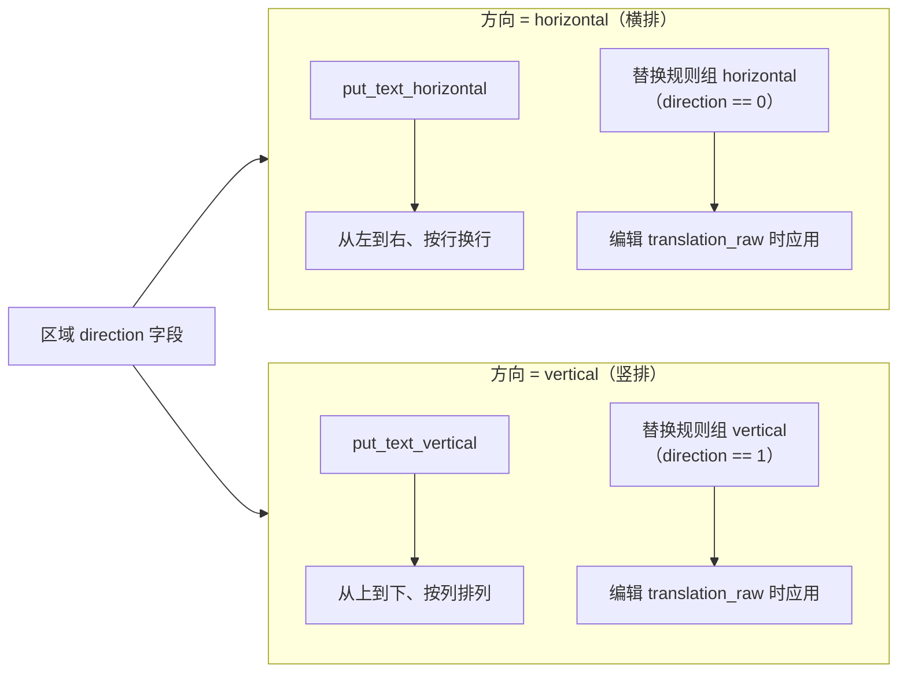

# 文本属性

当需要让某一句台词更醒目、把文字改成竖排、调整行距字距或旋转文字区域时，在编辑器的“属性编辑”中修改文本排版属性。这里介绍属性面板中与文本排版有关的字段：字体、字号、字体颜色、行间距、字间距、角度、对齐与方向，以及这些字段的选区语义、保存时机和渲染消费者。

文本内容本身的编辑（原文、译文、替换前译文、占位符/换行按钮、OCR/翻译按钮）见[区域列表与文本编辑](./region-list-and-text-editing.md)；样式预设与描边见[样式属性](./style-properties.md)；画布上的区域对齐/分布见[显示、对比与排列](./display-compare-and-arrange.md)。

## 可以做什么 {#feature-boundary}

- 左栏“属性编辑”面板从上到下包含“图像编辑”、“文本内容”、“样式设置”和“操作”四个分区。内容包括“样式设置”中改变文字外观的排版字段：`Font:`、`Font Size:`、`Font Color:`、`Line Spacing:`、`Letter Spacing:`、`Angle:`、`Alignment:`、`Direction:`。
- “文本内容”与“操作”两个分区归[区域列表与文本编辑](./region-list-and-text-editing.md)，这里仅引用其字段名与写回语义，不重复展开。
- “样式设置”中的“样式组合：”、“描边颜色：”、“描边宽度：”归[样式属性](./style-properties.md)。
- “图像编辑”中的蒙版/画笔/印章工具与图层归[画布工具与选区](./canvas-tools-and-selection.md)及[蒙版、画笔与仿制印章](./mask-paint-and-clone-stamp.md)。
- 属性面板的“对齐：”是文字在文本框内的对齐方式（自动/左/居中/右），不是把多个文字框互相对齐的“排列”动作；后者归[显示、对比与排列](./display-compare-and-arrange.md)。

## 在编辑器中操作 {#ui-operations}

### 属性面板分区与选区语义 {#panel-sections-and-selection}

打开编辑器后，左栏默认显示“属性编辑”。选区状态决定四个分区的可用性，由 `PropertyPanel.on_selection_changed()` 统一处理：

| 选区状态 | 文本内容 | 样式设置 | 操作 | 行为 |
| --- | --- | --- | --- | --- |
| 无选区 | 禁用 | 禁用 | 禁用 | 清空原文/译文框，字号重置为 12，行距/字距重置为 1.0，角度重置为 0，颜色恢复默认 |
| 单选 | 启用 | 启用 | 启用 | 面板显示该区域全部字段，可编辑文本与排版属性 |
| 多选 | 禁用 | 启用 | 启用 | 文本框清空但不禁用样式控件；排版修改以一条撤销命令同时应用到全部选中区域 |

多选时没有“混合值”专用 UI：样式控件保留原值，任何修改都会发出 `style_patch_requested(选中索引列表, patch)`，由 controller 归一化后合并成一次 `MultiRegionUpdateCommand`。

### 修改排版字段 {#edit-typography-fields}

1. 在画布上单选一个文字区域，“样式设置”分区启用。
2. “字体：”是带搜索的 `FontComboBox`，列出系统字体与项目 `fonts/` 目录注册的字体；鼠标悬停列表项会临时刷新文本框预览，点击后才写回区域 `font_family`，离开或关闭列表会恢复当前字体。设置页开启“禁止使用系统字体库”后，这里的新选择只来自项目字体。
3. “字体大小：”是数值框（8–1000）加滑条（8–150），两者联动；超出滑条范围的数值仍可通过数值框输入。
4. “字体颜色：”是颜色选择器，最近使用的颜色会保存到配置的 `saved_colors`。
5. “行间距：”与“字间距：”范围 0.1–5.0、步长 0.1，初始 1.0，按基本间距的倍率生效。
6. “角度：”范围 -9999–9999°，步长 1，带 `°` 后缀；修改会以白框中心为轴旋转区域几何。
7. “对齐：”下拉提供自动/左对齐/居中/右对齐；“方向：”下拉只提供横排/竖排（`auto` 被排除，见[参数与选项](#parameters)）。
8. 每个控件变化都会立即发出样式补丁信号，不要求点击“保存”；同一批修改合并为一条可撤销命令。

### 文本内容与操作区 {#text-content-and-actions}

“文本内容”分区维护原文 `text`、最终译文 `translation`、替换前译文 `translation_raw` 三个字段；“显示替换前译文”默认勾选，勾选时编辑的是 `translation_raw`，并实时经过替换规则生成 `translation`。“操作”分区提供复制/粘贴/删除。两者的字段写回、`↵`/`[BR]` 转换、占位符/换行按钮和 OCR/翻译按钮详见[区域列表与文本编辑](./region-list-and-text-editing.md)。

## 参数与选项 {#parameters}

本页各参数的详细介绍（界面名称、存储键、默认值与生效阶段），见[界面选项对照表](../../reference/options-i18n-matrix.md)。

#### 字体 {#font-family}

在属性面板 → 样式设置的“字体：”中选择文字字体。下拉框带搜索，列出系统字体和项目 `fonts/` 目录注册的可缩放字体，显示名按当前语言本地化；留空表示跟随全局渲染字体。字体不可用时不阻塞渲染，会回退默认字体并记录警告。

#### 字体大小 {#font-size}

在属性面板 → 样式设置中调整字号：数值框范围 8–1000，滑条范围 8–150，两者联动，滑条只覆盖常用区间。也可以按住 Ctrl 在画布上滚动滚轮调整所有选中区域的字号。修改后白框尺寸会重新计算，可能与相邻区域重叠。

#### 字体颜色 {#font-color}

在属性面板 → 样式设置中打开颜色选择器选择文字颜色。设置后会覆盖 OCR 检测的原始前景色，立即反映在画布预览与最终渲染中；最近使用的颜色会保存到应用配置，下次可直接选用。

#### 行间距 {#line-spacing}

在属性面板 → 样式设置中调整行距倍率（0.1–5.0，步长 0.1），1.0 表示默认行距。修改后白框尺寸会重新计算。

#### 字间距 {#letter-spacing}

在属性面板 → 样式设置中调整字距倍率（0.1–5.0，步长 0.1），1.0 表示默认字距。修改后白框尺寸会重新计算。

#### 角度 {#angle}

在属性面板 → 样式设置中输入旋转角度（-9999–9999，步长 1），0.0 表示不旋转。修改以白框中心为轴旋转区域几何，文本框随角度旋转显示。

#### 对齐 {#alignment}

在属性面板 → 样式设置的下拉框中选择文字在框内的对齐方式：

| 选项 | 说明 |
| --- | --- |
| 自动 | 由排版管线自动决定对齐位置 |
| 左对齐 | 文字靠框左边缘对齐 |
| 居中 | 文字在框内水平居中 |
| 右对齐 | 文字靠框右边缘对齐 |

#### 方向 {#direction}

在属性面板 → 样式设置的下拉框中选择文字排版方向（下拉不提供“自动”）：

| 选项 | 说明 |
| --- | --- |
| 横排 | 文字从左到右、按行换行 |
| 竖排 | 文字从上到下、按列排列 |

区域未设置方向时按白框宽高推断显示（高大于宽显示竖排，否则横排），推断不写回区域数据。横排与竖排进入不同的排版与替换路径，详见[方向如何改变渲染](#direction-render)。

## 修改如何保存 {#runtime-behavior}

### 样式补丁的合并与保存时机 {#style-patch-flow}

排版字段没有独立的“保存”按钮：控件变化即通过 `style_patch_requested` 发出补丁，`EditorController.update_region_style_patch()` 会先过滤 `_STYLE_PATCH_FIELDS`、归一化取值（`font_size` 下限 1、间距/描边转浮点、`stroke_color` 转 `bg_colors` RGB、`alignment`/`direction` 归一化），再把所有选中区域合并成一条 `MultiRegionUpdateCommand`，因此一次修改可以用 `Ctrl+Z` 整批撤销。`block_updates` 标志阻止面板回填时再次发信号造成循环。

### 方向如何改变渲染 {#direction-render}

方向是唯一会切换渲染函数与替换规则组的排版字段：横排走 `put_text_horizontal` 并应用 `horizontal` 替换组，竖排走 `put_text_vertical` 并应用 `vertical` 替换组。编辑 `translation_raw` 时，`apply_replacements()` 按该区域当前方向选组，因此同一段替换前文本在横竖排下可能得到不同最终译文。

区域没有显式方向时，属性面板按白框宽高推断显示值（高大于宽显示竖排），但不会自动写入区域 `direction`；渲染服务则在 `calculate_default_parameters()` 中按宽高比给出默认方向（宽高比大于 2 为横排、小于 0.5 为竖排、否则 `auto`）。

## 限制与注意事项 {#dependencies-and-conflicts}

- 排版字段的写回依赖单选或纯样式多选：多选时文本内容区禁用，只有排版修改会广播到全部选中区域。
- 正在编辑的文本控件在常规刷新中不会被覆盖，只有异步任务写回（`source="async"`）才强制刷新，避免丢光标或 IME 组合字。
- 属性面板的滑条、数值框和下拉只在自身获得键盘焦点时吞滚轮；未聚焦时滚轮交给父滚动区域，不会误改值。
- `Ctrl+滚轮` 调整所有选中区域字号、`Shift+滚轮` 调整共享画笔大小，这两类组合被快捷键管理器拦截，见[快捷键](./shortcuts.md)。
- 字号、字距、行距、方向属于字体影响字段，写回后同步白框尺寸；同步只改框的宽高和中心，正文中心保持不动。
- 属性面板“对齐：”是文字在框内的对齐；“排列”菜单的六向对齐/分布是把文字框互相对齐，两者不要混用。
- 字体不可用时不阻塞渲染，回退默认字体并记录警告；手改 JSON 时写入字体文件路径而不是字体族名不会生效。
- 描边颜色/宽度与样式预设归[样式属性](./style-properties.md)，这里不重复其参数定义。
