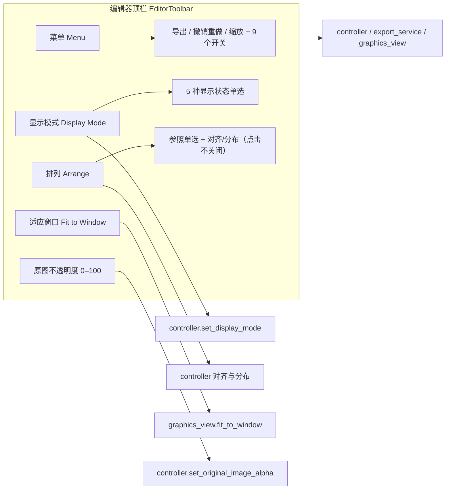

# 编辑器工具栏与菜单

进入编辑器后，顶部有一条固定的横向工具栏。它把高频操作收进三个单级下拉菜单（“菜单”、“显示模式”、“排列”），并保留“适应窗口”和“原图不透明度”两个常驻控件。这里说明这三个菜单的展开方式、每个菜单项的去向，以及九个编辑开关的存储与持久化。

“显示模式”和“排列”两个菜单的完整选项与画布效果见[显示、对比与排列](./display-compare-and-arrange.md)；画布工具、属性面板、富文本浮窗、快捷键和导入导出分别见[画布工具与选区](./canvas-tools-and-selection.md)、[文本属性](./text-properties.md)、[样式属性](./style-properties.md)、[浮动富文本](./floating-rich-text.md)、[快捷键](./shortcuts.md)和[导入导出与写回](./import-export-and-writeback.md)。

## 可以做什么

- 工具栏本身不负责页面切换：返回主页的入口在主窗口侧边栏，不在编辑器顶栏。
- “菜单”下拉包含导出、撤销/重做、放大/缩小和九个可勾选开关；九个开关写入 `app` 段配置并持久化。
- “显示模式”是互斥单选，决定画布显示原图、文字、框线、都不显示或双栏对比；“排列”提供参照单选、对齐和间距分布。两者的完整选项归[显示、对比与排列](./display-compare-and-arrange.md)。
- 放大/缩小只是视图缩放：每步按 1.15 倍缩放，画布倍率钳制在 `0.05`–`50.0`；“适应窗口”只做视图适配，两者都不修改任何区域数据。
- “原图不透明度”滑条（0–100）只控制画布中原图覆盖层的透明度，不是导出参数。
- 快捷键的真实注册不在工具栏：导出 `Ctrl+Q`、撤销 `Ctrl+Z`、重做 `Ctrl+Y` 由 `EditorShortcutManager` 全局注册，工具栏只显示提示文字，见[快捷键](./shortcuts.md)。

## 在编辑器中操作

### 三个下拉菜单

1. 打开“菜单”：显示“导出图片”（代码追加 `(Ctrl+Q)` 提示）、撤销/重做（提示 `Ctrl+Z` / `Ctrl+Y`）、放大/缩小（“放大 (+)”“缩小 (-)”），以及九个带勾选标记的编辑开关。

#### 九个编辑开关

“菜单”下拉里的九个编辑开关都带勾选标记，含义与默认值如下：

- **启用编辑器吸附**（默认 `false`）：旋转文本框时把角度吸附到 `0/90/180/270/360/-90/-180/-270/-360` 以及其它文本框的角度；移动/缩放时也按吸附逻辑对齐，方便排列对齐。
- **中心点缩放**（默认 `false`）：缩放文本框时以中心点为基准，而不是对边/对角固定。
- **显示富文本编辑弹窗**（默认 `true`）：编辑富文本时自动弹出浮动富文本编辑器；关闭后不再自动弹出。详见[浮动富文本编辑器](./floating-rich-text.md)。
- **固定富文本编辑弹窗**（默认 `false`）：固定浮窗当前位置，并阻止选区清空、译文列表操作或文本框拖动造成的自动隐藏；配置键为 `app.editor_rich_text_popup_pinned`，修改后立即写入配置文件。
- **编辑时自动应用富文本规则**（默认 `true`）：编辑文字时自动按富文本匹配规则应用样式；关闭后只有手动应用才生效。详见[富文本规则表、Raw 编辑与匹配逻辑](../rich-text-rules/table-raw-and-match.md)。
- **切图时自动保存**（默认 `true`）：切换图片前自动保存有改动的工程数据；配置键为 `app.editor_auto_save_on_switch`。
- **切图时自动导出**（默认 `true`）：切换到另一张图片时，若当前图有未导出的修改会自动导出；关闭后切换时会先询问未保存修改如何处理。详见[导入导出与写回](./import-export-and-writeback.md)。
- **不再提醒未保存**（默认 `false`）：自动保存和自动导出同时关闭时，切图不再显示确认对话框；配置键为 `app.editor_suppress_unsaved_warning`。
- **删除文本框并恢复原图**（默认 `false`）：删除文本框时同步移除对应的原始蒙版和精修蒙版，使被抹除区域恢复原图；删除和蒙版变化作为同一操作支持撤销/重做。配置键为 `app.editor_delete_and_recover`。该功能参考 BallonsTranslator（BT）实现。

2. 打开“显示模式”：单选切换五种画布显示状态；详细效果见[显示、对比与排列](./display-compare-and-arrange.md)。
3. 打开“排列”：先选参照（选区/画布），再点对齐或分布；菜单在点击后保持打开，方便连续操作。详细选项见[显示、对比与排列](./display-compare-and-arrange.md)。

### 常驻控件

- 点击“适应窗口”：把当前图片完整缩放到画布可视区域，保持宽高比。
- 拖动“原图不透明度:”滑条：`0` 表示完全透明（看到修复/去字后的底图），`100` 表示完全不透明（看到原图）；初始为 `0`。

## 修改如何保存

### 菜单展开与语言切换

三个下拉按钮都是单级菜单，没有二级子菜单；图标、勾选/单选标记和文字列独立排列：

- “菜单”使用带左侧选中标记列的 `CheckableMenu`：九个开关被勾选时显示标记列，图标列与文字列独立排列。
- “显示模式”的五个状态和“排列”的参照选项都是 `QActionGroup` 互斥单选。
- “排列”菜单是“点击不关闭”菜单：选择参照或执行一次对齐/分布后菜单保持展开，方便连续操作；点击菜单外或按 `Esc` 才关闭。
- 语言切换时 `EditorView.refresh_ui_texts()` 调用 `EditorToolbar.refresh_ui_texts()`，三个菜单整体重建，并从内部字段恢复显示模式、参照、开关和启用状态，避免状态丢失。
- 窗口过窄时工具栏内容放进横向滚动区，不换行、不折叠。

### 导出与切图自动导出

- 点击“导出图片”（或按 `Ctrl+Q`）：`EditorView.export_image()` → `controller.export_image()`，先 `commit_pending_edits()` 提交未保存编辑，再交给后台导出队列（`EditorControllerExportService`）执行；导出进度用 Toast 展示，失败有独立错误提示。
- 加载图片开始前 `toolbar.set_export_enabled(False)` 禁用导出，数据应用完成后再启用。
- “切图时自动导出”控制切图时如何处理未保存编辑：
  - 开启：有未保存编辑时自动执行导出（`automatic=True`）；导出被拒绝则中止切图。
  - 关闭：弹出“未保存的编辑”三按钮对话框（“导出图片”/“不保存”/“取消”）。这三个按钮当前是源码硬编码中文，没有 i18n key，属于已知缺失项，不虚构英文标签。
- 自动导出的消费方在切图时直接读取配置，不依赖视图内存状态。

### 撤销与重做

- 撤销/重做通过 `QUndoStack`（`history_service`）实现；每次命令状态变化后由 controller 更新工具栏的撤销/重做启用状态。
- 工具栏上的快捷键文字只是提示；带焦点感知的实际注册在 `EditorShortcutManager`。

### 缩放与适应窗口

- “放大 (+)”/“缩小 (-)”每次调用 `_apply_zoom(1.15)` / `_apply_zoom(1 / 1.15)`，目标倍率钳制在 `0.05`–`50.0`。
- 画布滚轮同样缩放（向上放大、向下缩小，倍率 1.15），锚点在鼠标位置。
- “适应窗口”调用 `fitInView(..., KeepAspectRatio)` 把当前图片完整放入可视区。

### 原图不透明度

- 滑条值 `0`–`100` 映射为 `0.0`–`1.0`：`0` 完全透明（显示修复/去字底图），`100` 完全不透明（显示原图）。
- 加载图片时若用户尚未手动调整过透明度，默认值按“是否有修复图”决定：有修复图取 `0`，无修复图取 `1`；用户一旦拖动滑条，本次会话不再自动覆盖（`_user_adjusted_alpha`）。
- 滑条变化经模型 `original_image_alpha_changed` 信号反向同步回工具栏，外部修改也能刷新滑条位置。

## 限制与注意事项

- 工具栏只显示快捷键文字而不注册 `QAction` 快捷键，避免与 `EditorShortcutManager` 的焦点感知注册双重触发。
- 焦点在文本框时，撤销/重做等编辑快捷键留给文本控件；`1`/`2`/`3`/`Q`/`W`/`E`/`A`/`D` 被转发为文字而不是切页签、切工具或切图；`Ctrl+Q` 导出不受影响。详见[快捷键](./shortcuts.md)。
- “排列”菜单的可用状态与选区数量相关：以画布为参照时选 1 个区域即可对齐，以选区为参照需 2 个，间距分布需 3 个。
- “切图时自动导出”依赖导出队列和图片加载流程：自动导出被拒绝会中止切图；手动选择“导出图片”时，切图会等导出完成后再继续。
- 导出是异步队列任务，与编辑器取消/清理共用状态机；应用关闭时先排空导出队列再退出。
- 关闭“显示富文本编辑弹窗”后，已显示的浮窗立即隐藏；画布仍保留焦点，不改变删除/快捷键语义。
- “固定富文本编辑弹窗”写入 `app.editor_rich_text_popup_pinned`；重启后从配置恢复，不是仅当前会话有效。
