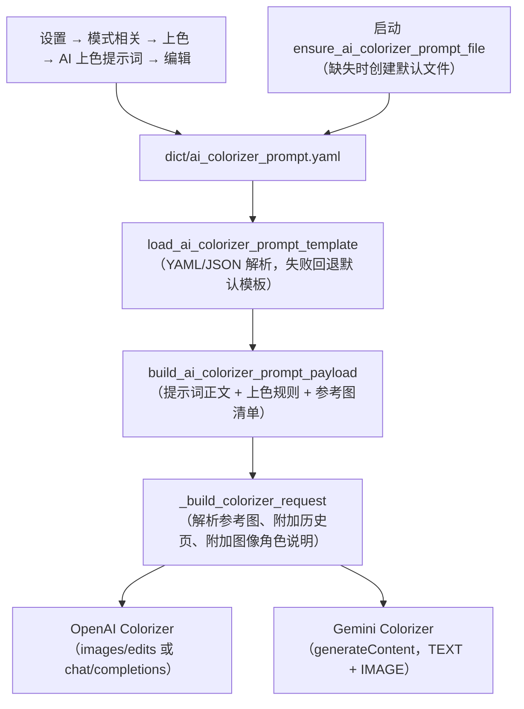
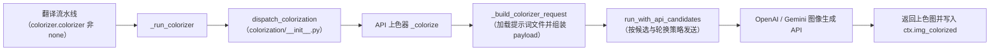

# AI 上色提示词

当选择 `OpenAI Colorizer` 或 `Gemini Colorizer` 给漫画页上色时，AI 上色器会读取一个固定的提示词文件，把上色指令、上色规则和参考图片随页面图片一起发送给图像生成模型。这里说明这个文件放在哪里、包含哪些字段、如何被加载并注入请求，以及它和翻译自定义 HQ 提示词的边界。上色模型、上色大小、降噪强度和历史页数的参数说明见[超分与上色](../settings/upscale-and-colorization.md)；提示词列表、应用与预览的完整流程见[提示词列表、应用与预览](./list-apply-and-preview.md)；翻译自定义提示词见[上下文与提示词](../translator/context-and-prompts.md)。

## 适用场景

- `colorizer.ai_colorizer_prompt_path` 是设置页“AI 上色提示词”这一固定提示词编辑动作的 UI 调用键；它不是普通配置行，也没有像 `translator.high_quality_prompt_path` 那样的可选文件下拉框。
- 设置页编辑动作和运行时请求构建都固定使用默认路径 `dict/ai_colorizer_prompt.yaml`（`DEFAULT_AI_COLORIZER_PROMPT_PATH`）。Qt 模型 `ColorizerSettings` 和发行配置 `config/config-example.json` 都没有同名持久化字段；不要把这个键当成可切换的翻译提示词路径。
- 这里不展示真实提示词正文、API 密钥或用户参考图片路径；只说明文件结构、加载规则和注入路径。
- 离线上色器 `Manga Colorization v2`（`mc2`）不读取提示词文件；只有 `openai_colorizer` 和 `gemini_colorizer` 会加载 `dict/ai_colorizer_prompt.yaml`。

## 在提示词管理中操作

### 在设置页编辑 AI 上色提示词

1. 打开“设置”，选择“模式相关”页签，找到“上色”分组。
2. 在“AI 上色提示词”行点击“编辑”。该行只有编辑动作，没有路径下拉框或数值输入；说明面板显示“OpenAI 上色 / Gemini 上色使用固定的 YAML 提示词文件。点击 Edit 直接编辑内容。”
3. 弹出的“编辑提示词”对话框标题带文件名，默认打开“模板编辑”页签，包含三个分区：
   - “提示词正文”：上色主提示词，多行文本框。
   - “上色规则”：每行一条规则，保存时按行拆分为列表。
   - “参考图片”：两列表格，列头为“路径”和“说明”；可用“添加参考图片”选择图片文件并填写说明，用“删除行”删除。
4. 可以用“添加字段”重新插入已删除的分区；分区可上下移动，但保存顺序不会改变运行时的加载顺序。
5. 切换到“源码编辑”页签可“直接编辑文件原始内容”；保存前校验 YAML/JSON 可解析，格式错误时状态栏显示“格式错误”。
6. 点击“保存”写回文件并关闭；成功显示“保存成功”，失败显示“保存失败”或“序列化错误”。

格式要点：`dict/ai_colorizer_prompt.yaml` 是 YAML，根对象主键为 `ai_colorizer_prompt`（上色主提示词字符串，可留空），另有 `colorization_rules` 与 `reference_images` 两个列表；正文在设置页“编辑”中修改；文件缺失、根不是对象或主键为空时回退到内置默认模板。

参考图片用于给 AI 上色提供配色参考：可以添加上色效果理想的样张——例如同一人物的上色图、场景或背景的配色示例——模型会把它们作为建议与当前页面图片一起发送，帮助在整批或跨页之间保持人物与场景的上色一致性。参考图只作为建议，不会强制逐像素照搬；某张参考图缺失时仅记录警告并跳过。

### 从提示词管理页进入专用编辑器

“提示词管理”列表由 `get_hq_prompt_options()` 生成，会排除系统提示词以及 `ai_ocr_prompt`、`ai_colorizer_prompt`、`ai_renderer_prompt` 三个固定 AI 提示词文件名，因此 `dict/ai_colorizer_prompt.yaml` 本身不会出现在该列表中，避免被当作翻译自定义提示词应用。

如果用户自建文件的内容包含 `ai_colorizer_prompt`、`colorization_rules`、`reference_images` 等上色专用字段，`open_prompt_editor()` 会按内容识别（`is_ai_colorizer_prompt_file`）并打开同一个 `AIColorizerPromptEditorDialog`；预览面板也会显示“提示词正文 / 上色规则 / 参考图片”三个分区。否则回退到通用 `PromptEditorDialog`。

## 提示词如何加载

### 提示词加载与请求注入 {#prompt-injection}

图下限制说明：只有 `colorizer.colorizer` 为 `openai_colorizer` 或 `gemini_colorizer` 时该文件才会被加载；`mc2`、`none` 以及不需要上色的工作流不会读取它。参考图缺失时只记录警告并跳过，不终止请求。`n### 进入 AI 上色请求的路径 {#request-path}

说明：`colorize_only`（仅上色）工作流在上色完成后直接以 `ctx.img_colorized` 作为结果，跳过检测、OCR、翻译与排版；普通工作流中上色发生在超分之后、检测之前。AI 上色请求还会应用 `colorizer` 分区的自定义请求参数（见 API 管理页），与提示词文件相互独立。

### 历史页图像上下文 {#history-images}

`colorizer.ai_colorizer_history_pages`（“AI 上色历史页数”）只对 OpenAI/Gemini 上色器生效：每页上色成功后把结果图存入内存历史，下一次请求把最近 N 张已上色页面作为 `history_reference` 参考图附加，只传图像、不传文字；`0` 关闭。历史页不足时使用已有页，任务顺序与并发隔离会限制可用历史。

## 限制与注意事项

- 只影响 AI 上色器：`mc2` 与 `none` 不读取提示词文件；把文件内容改成翻译提示词不会让离线上色器改变行为。
- 与翻译自定义 HQ 提示词互不通用：`translator.high_quality_prompt_path` 是可选择的翻译提示词路径，`dict/ai_colorizer_prompt.yaml` 是固定的 AI 上色提示词文件；`get_hq_prompt_options()` 明确排除 `ai_colorizer_prompt` 等 AI 提示词文件名，防止把上色文件应用到翻译请求。
- 参考图片路径可能是用户私有路径；相对路径依次按提示词目录、图片目录、项目根目录和当前目录解析，绝对路径直接使用。公开文档与截图不得包含这些路径或图片。
- 提示词内容属于业务文本。共享日志、请求导出或调试目录前，必须删除提示词正文、参考图路径、历史页面图像和凭据。
- 编辑器 Raw 模式要求 YAML/JSON 可解析；根节点不是对象、字段类型不对或 PyYAML 缺失时，加载器回退默认模板，编辑器保存时给出格式或序列化错误。
