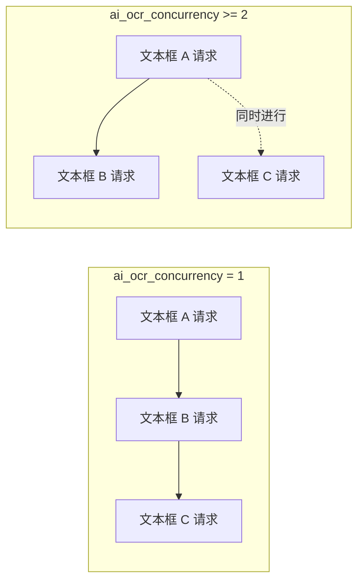
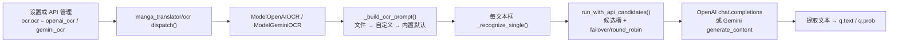

# AI OCR 提示词

当“OCR 模型”（`OCR Model`）选择 `openai_ocr` 或 `gemini_ocr` 时，AI OCR 会把一段提示词连同每个文本框截图一起发送给视觉模型。这里说明这段提示词的配置键、`dict/` 下的提示词文件、加载与注入方式、进入 AI OCR 请求的路径，以及与自定义 HQ 翻译提示词的边界。OCR 引擎整体选择、凭据和候选槽见[OCR、过滤与文本行合并](../settings/ocr-filter-and-merge.md)与[API 功能选择器](../api-management/feature-selectors.md)；提示词文件的通用列表与应用见[提示词列表、应用与预览](./list-apply-and-preview.md)。

## 适用场景 {#feature-boundary}

- `ocr.ai_ocr_prompt_path` 是设置页“AI OCR 提示词”行的固定提示词文件编辑动作，绑定后端 `dict/ai_ocr_prompt.yaml`（缺失时自动创建，旧版 `dict/ai_ocr_prompt.json` 会迁移），本身不写入 `config/config.json`。
- `ocr.ai_ocr_custom_prompt` 是可直接填写的备用提示词文本；`ocr.ai_ocr_concurrency` 限制同一张图内同时发出的 AI OCR 请求数。
- `dict/ai_ocr_prompt.yaml` 只被 `openai_ocr` / `gemini_ocr` 消费；`translator.high_quality_prompt_path` 是 HQ 翻译的自定义提示词，两者文件和配置键不能互换。
- 这里不复制真实提示词正文，也不展示 API Key；凭据、地址和模型见[API 凭据、地址与模型](../api-management/credentials-addresses-models.md)。

## 在提示词管理中操作 {#ui-operations}

### 在设置页的“文字识别”分组配置 {#configure-in-settings}

1. 打开“设置”，选择“文字识别”分组。
2. “AI OCR 提示词”行是固定提示词文件动作；点击“编辑”打开提示词编辑器。
3. “AI OCR 自定义提示词”输入框留空时按运行优先级使用文件或内置默认；非空时在文件为空/无有效键时参与。
4. “AI OCR 并发数”输入正整数，`1` 表示串行识别文本框，`2` 及以上并行识别。
5. 在“API 管理”的“文字识别”页签把功能选择器设为 OpenAI/Gemini 后，配置 `OCR_OPENAI_*` / `OCR_GEMINI_*` 凭据槽，见[API 功能选择器](../api-management/feature-selectors.md)。

### 编辑提示词文件 {#edit-prompt-file}

1. 在设置页点击“编辑”后打开提示词编辑器（`SimplePromptEditorDialog`），窗口标题为“编辑: ai_ocr_prompt.yaml”，卡片内显示相对路径提示 `dict/ai_ocr_prompt.yaml`。
2. 文本框预填当前文件内容；文件不存在时自动创建并预填内置默认提示词。
3. 修改后点击“保存”把纯文本写回文件（YAML `ai_ocr_prompt: |` 块）；点击“取消”放弃修改。写入失败弹出“错误”消息框，不覆盖原文件。

格式要点：`dict/ai_ocr_prompt.yaml` 是 YAML，根对象主键为 `ai_ocr_prompt`（字符串，可留空）；正文在设置页“编辑”中修改；文件缺失或主键为空时按“AI OCR 自定义提示词”→“内置默认提示词”的顺序回退。

## 参数与选项 {#parameters-and-options}

> 本页各参数的界面名称、存储键与默认值等对照，见参考页[界面选项对照表](../../reference/options-i18n-matrix.md)。

#### AI OCR 提示词 {#ocr-ai-ocr-prompt-path}

“AI OCR 提示词”位于“设置 → 文字识别”，是 OpenAI OCR / Gemini OCR 使用的固定提示词文件动作：点击“编辑”打开提示词编辑器修改提示词正文。它没有路径下拉框，内容始终写回 `dict/ai_ocr_prompt.yaml`；文件不存在时会自动创建并预填内置默认提示词。默认值：内置默认提示词。

#### AI OCR 自定义提示词 {#ocr-ai-ocr-custom-prompt}

“AI OCR 自定义提示词”位于“设置 → 文字识别”，是可选的文本输入框。留空时使用提示词文件或内置默认；填写后，只有提示词文件为空或没有有效键时才会参与请求。默认值：留空（不启用）。

#### AI OCR 并发数 {#ocr-ai-ocr-concurrency}

“AI OCR 并发数”位于“设置 → 文字识别”，是正整数输入框，控制同一张图内同时发出的 AI OCR 请求数量：`1` 表示逐个识别文本框，`2` 及以上会并行识别多个文本框。并发越高单图识别越快，但更容易触发 API 限流或配额。默认值：`10`。

并发数只限制同一张图内 AI OCR API 请求的同时数量；候选槽轮换仍按每个请求独立进行，不因并发设置改变。
## 提示词如何加载 {#runtime-behavior}

### 提示词文件加载与优先级 {#prompt-loading}

1. `ensure_ai_ocr_prompt_file()` 保证 `dict/ai_ocr_prompt.yaml` 存在：缺失时写入内置默认，若存在旧版 `dict/ai_ocr_prompt.json` 则迁移其内容。
2. `load_ai_ocr_prompt_file()` 用 `load_prompt_file()` 解析 `.yaml` / `.yml` / `.json`，根必须是字典，返回第一个非空字符串键：`ai_ocr_prompt` → `ocr_prompt` → `prompt`。
3. `_build_ocr_prompt()` 的优先级：文件内容 → `ai_ocr_custom_prompt` → `DEFAULT_AI_OCR_PROMPT`。
4. 识别响应经过 `_normalize_ocr_text()`：统一换行、去除首尾空白，并剥离首尾三反引号代码围栏（若模型返回了 Markdown）。

### 进入 AI OCR 请求的路径 {#request-path}

提示词以 `user` 消息的文本部分与文本框 PNG 图片一起发送：OpenAI 使用 `messages[0].content` 的 `text` + `image_url`（base64 data URL）；Gemini 使用 `contents[0].parts` 的 `text` + `inlineData`。启用自定义 API 参数时，`config/custom_api_params.json` 的 `ocr` 段（默认 `temperature: 0.0`）会合并进请求体；凭据与候选端点由 `resolve_runtime_api_config(feature="ocr", ...)` 从 `.env` / API 管理槽解析。

## 限制与注意事项 {#dependencies-and-conflicts}

- `ocr.ocr` 必须是 `openai_ocr` 或 `gemini_ocr`，否则 AI OCR 提示词不被消费；离线 OCR（48px、PaddleOCR 等）使用各自模型提示，与本页无关。
- 提示词文件只被 AI OCR 消费；`translator.high_quality_prompt_path` 是 HQ 翻译的自定义提示词，见[上下文与提示词](../translator/context-and-prompts.md)，两者文件不能互换。
- `ai_ocr_prompt` 属于系统提示词 stem，被“提示词管理”列表和 HQ 提示词下拉排除，因此不会出现在[提示词列表、应用与预览](./list-apply-and-preview.md)中；编辑入口只在设置页。
- AI OCR 请求还受 API 管理页的 Key/Base/Model、候选槽轮换与自定义请求参数影响；这些机制不改变提示词内容。
- 提示词正文属于用户内容；共享日志、请求导出或调试目录前必须删除提示词正文、文本框文本、路径与凭据。
