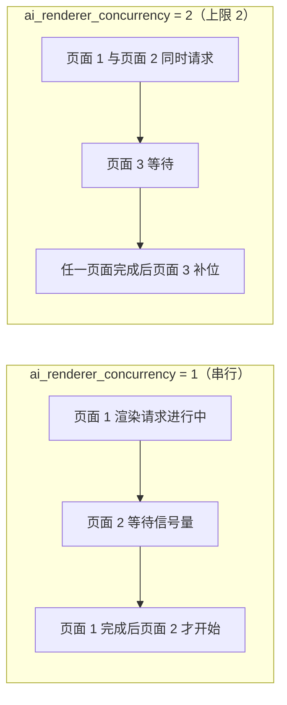
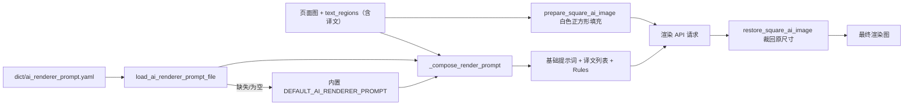
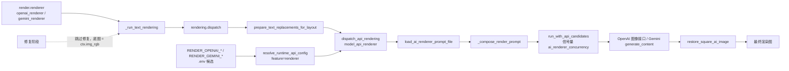

# AI 渲染提示词

当“渲染器”选择 `openai_renderer` 或 `gemini_renderer` 时，整页译文不再由本地字体排版绘制，而是把页面图和区域译文一起交给图像生成模型重绘。这里说明 AI 渲染使用的固定提示词文件、加载与注入方式、进入 AI 渲染请求的路径，以及它与自定义 HQ 翻译提示词的边界。

这里不覆盖渲染器枚举、字体和排版参数（见[排版与渲染](../settings/typesetting-and-rendering.md)），不覆盖 API 凭据、候选槽与轮询（见 API 管理页面），也不覆盖自定义 HQ 翻译提示词本身（见[上下文与提示词](../translator/context-and-prompts.md)）。

## 适用场景 {#feature-boundary}

- `render.renderer` 决定是否进入 AI 渲染：`openai_renderer` / `gemini_renderer` 走图像生成 API，`default` 走本地 Qt/text_render 绘制，`none` 跳过文本绘制。
- `render.ai_renderer_prompt_path` 是设置页“排版”中固定提示词编辑动作的 UI 行键，不是持久化配置值，也不是可切换路径；它始终编辑 `dict/ai_renderer_prompt.yaml`。
- `render.ai_renderer_concurrency` 限制同一提供商同时进行的 AI 渲染 API 请求数。
- AI 渲染提示词是固定文件，与用户可选的自定义 HQ 提示词（`translator.high_quality_prompt_path`）属于不同功能，文件不能互换。

## 在提示词管理中操作 {#ui-operations}

### 在设置页编辑 AI 渲染提示词 {#edit-in-settings}

1. 打开“设置”，选择“排版”分组。
2. 找到“AI 渲染提示词”行，点击右侧“编辑”按钮。
3. 弹出提示词编辑对话框（`SimplePromptEditorDialog`）：窗口标题为“编辑: ai_renderer_prompt.yaml”，标题与章节名为“AI 渲染提示词”，路径提示为 `dict/ai_renderer_prompt.yaml`（可选中复制）。
4. 编辑区为等宽字体文本框，默认显示当前提示词文件内容；文件不存在时显示内置默认提示词。点击“保存”后按 YAML 字面块写回文件；点击“取消”放弃修改；保存失败弹出“错误”对话框。

格式要点：`dict/ai_renderer_prompt.yaml` 是 YAML，根对象主键为 `ai_renderer_prompt`（字符串，可留空）；正文在设置页“编辑”中修改；文件缺失或主键为空时回退到内置默认提示词。

### 与提示词管理页的边界 {#prompt-management-boundary}

打开“提示词管理”时，列表只包含用户提示词文件；`get_hq_prompt_options()` 扫描 `dict/` 下的 `.yaml`、`.yml`、`.json` 文件时会排除 `ai_renderer_prompt` 等系统提示词文件名。因此 AI 渲染提示词不会出现在“应用所选提示词”候选里，也不会被 HQ 提示词应用操作改写。提示词管理页的完整操作见[提示词列表、应用与预览](./list-apply-and-preview.md)。

## 参数与选项 {#parameters-and-options}

> 本页各参数的界面名称、存储键与默认值等对照，见参考页[界面选项对照表](../../reference/options-i18n-matrix.md)。

#### 渲染器 {#render-renderer}

“渲染器”下拉框位于“设置 → 排版”分组，决定如何绘制译文：Default 使用本地字体排版，OpenAI Renderer / Gemini Renderer 用图像生成 API 重绘译文，“无”则不绘制译文。选择 AI 渲染器后修复阶段也会被跳过。默认值：Default。详细说明见[排版与渲染](../settings/typesetting-and-rendering.md)。

#### AI 渲染提示词 {#render-ai-renderer-prompt-path}

“AI 渲染提示词”位于“设置 → 排版”分组，是 OpenAI 渲染 / Gemini 渲染使用的固定提示词文件动作：点击“编辑”打开提示词编辑器修改提示词正文。它没有路径下拉框，内容始终写回 `dict/ai_renderer_prompt.yaml`；文件不存在时显示内置默认提示词。默认值：内置默认提示词。

#### AI 渲染并发数 {#render-ai-renderer-concurrency}

“AI 渲染并发数”位于“设置 → 排版”分组，是正整数输入框，控制同一提供商同时进行的 AI 渲染 API 请求数：并发数越大，批量模式下可同时渲染的页面越多，但也更容易触发 API 限流或 429。默认值：`1`。

并发限制按提供商分组：`openai_renderer` 和 `gemini_renderer` 各有独立的信号量，提高并发只影响同一种渲染器的页面；实际同时请求数还受 API 限流、候选轮换和网络往返影响，不一定等于并发上限。
## 提示词文件加载与注入 {#loading-and-injection}

### 固定文件加载 {#prompt-file-loading}

`dict/ai_renderer_prompt.yaml` 是 AI 渲染器的固定提示词文件。启动时 `ConfigService.__init__` 与 `runtime_files.ensure_runtime_files()` 都会调用 `ensure_ai_renderer_prompt_file()`：文件不存在时写入内置默认提示词，文件命中旧版提示词时升级为默认提示词，但不会覆盖用户已修改的内容。

### 注入到渲染请求 {#prompt-injection}

请求构造时 `_build_base_prompt()` 再次调用 `ensure_ai_renderer_prompt_file()` 并 `load_ai_renderer_prompt_file(None)`；加载失败或为空时回退到内置 `DEFAULT_AI_RENDERER_PROMPT`。`_compose_render_prompt()` 把基础提示词与以下内容拼接：

- 标题行“Translation list with original texts as reference:”；
- 每个有非空译文的区域一条 `- translation: ...`，附 `original: ...`（原文本参考）和 `direction: vertical|horizontal`；
- 固定的 `Rules:` 列表（逐条匹配气泡、渲染所有译文包括拟声词、保持页面布局与画作、只返回渲染图）。

译文值先经 `rich_text.plain_text_of()` 展平为纯文本，再把换行转义为 `\\n`。页面图在发送前用 `prepare_square_ai_image()` 填充到白色正方形，返回后按 `restore_square_ai_image()` 裁回原尺寸；若模型返回尺寸不一致再 LANCZOS 缩放到原图尺寸。

## 进入 AI 渲染请求的路径 {#request-path}

选择 `openai_renderer` / `gemini_renderer` 后，文本渲染阶段调用 `rendering.dispatch`（在 `manga_translator/rendering/__init__.py`），它先对区域执行 `prepare_text_replacements_for_layout()`（应用替换规则），再调用 `model_api_renderer.dispatch_api_rendering()`。后者按 `render.renderer` 创建 `OpenAIRenderer` 或 `GeminiRenderer`，执行 `BaseAPIRenderer.render()`：

1. `_read_runtime_config()` 通过 `resolve_runtime_api_config(feature="renderer", provider=...)` 读取 `.env` 候选；OpenAI 使用 `RENDER_OPENAI_API_KEY` / `RENDER_OPENAI_API_BASE` / `RENDER_OPENAI_MODEL`（回退 `OPENAI_API_KEY` / `OPENAI_API_BASE`），Gemini 使用 `RENDER_GEMINI_API_KEY` / `RENDER_GEMINI_API_BASE` / `RENDER_GEMINI_MODEL`（回退 `GEMINI_API_KEY` / `GEMINI_API_BASE`）。
2. 过滤出有非空译文的区域；没有可渲染区域时直接返回原图。
3. 构造提示词与正方形页面图（见上节）。
4. 获取信号量，调用 `run_with_api_candidates()` 按候选槽和策略发起请求；候选失败会重建客户端并继续轮换。
5. OpenAI 走 `request_openai_image_with_fallback()`（按兼容端点顺序尝试），Gemini 走 `generate_content()`（`responseModalities: ["TEXT", "IMAGE"]`，内置关闭安全阈值）。
6. 裁回原尺寸并返回。

另一个关键路径是修复阶段：`_should_skip_inpainting_for_ai_renderer()` 在 `render.renderer` 为 `openai_renderer` / `gemini_renderer` 时跳过修复，`ctx.img_inpainted = ctx.img_rgb`，即 AI 渲染的底图是原始工作图而不是修复图。

## 与自定义 HQ 提示词的边界 {#hq-prompt-boundary}

AI 渲染请求只读取 `dict/ai_renderer_prompt.yaml`，不会读取 HQ 自定义提示词；反之 HQ 翻译也不会读取 AI 渲染提示词。两者正文结构不同（HQ 提示词含占位符与输出格式，AI 渲染提示词是给图像模型的自由文本），文件互换会导致请求行为异常。

## 限制与注意事项 {#dependencies-and-conflicts}

- 选择 `openai_renderer` / `gemini_renderer` 但 `.env` 缺少对应 API Key 时，UI 在开始翻译前弹出“需要填写 API 密钥”（`API Keys Required`）并阻止启动；OpenAI 渲染器在配置了本地 Base 地址时允许空 Key（`allow_empty_api_key_for_local_base`），Gemini 渲染器必须有 Key。
- `RENDER_*` 键会进入 API 管理的候选槽与轮询（`API_ROTATION_ENV_GROUPS`），轮换不改变 `render.renderer` 与提示词文件。
- AI 渲染时跳过修复阶段，底图是原始工作图；蒙版、修复图和排版调试产物不会由 AI 渲染路径生成。
- 替换规则在进入 AI 渲染前应用到译文（`prepare_text_replacements_for_layout`），富文本规则在请求后的同步阶段应用。
- 并发数、API 限流与候选轮换共同决定实际吞吐；取消任务时不应分享中间请求或用户图像。
- 页面正文只记录提示词 schema 和脱敏占位，不展示真实提示词正文、密钥、用户名或私有绝对路径。
