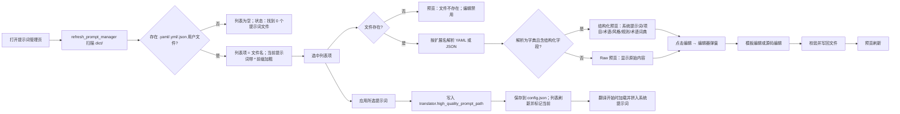

# 提示词列表、应用与预览

当自定义 HQ 提示词由文件维护时，本页用于查看 `dict/` 下的用户提示词文件、把选中文件写入翻译器配置、预览文件内容并进入编辑。这里不解释“自定义提示词”参数本身的含义（见[上下文与提示词](../translator/context-and-prompts.md)），也不管理系统提示词与 AI OCR/上色/渲染提示词的固定文件（分别见[系统与翻译提示词](./system-and-translation-prompts.md)、[AI OCR 提示词](./ai-ocr-prompt.md)、[AI 上色提示词](./ai-colorizer-prompt.md)和[AI 渲染提示词](./ai-renderer-prompt.md)）。

## 适用场景 {#feature-boundary}

- 列表只显示 `dict/` 下 `.yaml`、`.yml`、`.json` 的用户提示词文件，并排除系统提示词文件名（`system_prompt_hq`、`system_prompt_hq_format`、`system_prompt_line_break`、`glossary_extraction_prompt`、`ai_ocr_prompt`、`ai_colorizer_prompt`、`ai_renderer_prompt`）。
- “应用所选提示词”把 `dict/<文件名>` 写入 `translator.high_quality_prompt_path` 并持久化到 `config/config.json`；它不切换翻译器类型、API 凭据或候选槽。
- 预览分为“结构化”和“Raw”两种展示；“编辑”入口打开二级弹窗，结构化文件包含“模板编辑 / 源码编辑”两个页签。
- 这里不写入真实密钥或私密提示词正文；错误信息中的本机路径不得复制进公开报告。

## 在提示词管理中操作 {#ui-operations}

### 查看提示词列表

1. 从左侧导航打开“提示词管理”。页面标题为“提示词管理”，副标题为“管理和应用翻译提示词文件”。
2. “提示词列表”卡片显示可用文件。当前已应用的提示词带 `* ` 前缀、加粗并使用主题色，悬停提示“当前提示词：{filename}”。
3. 状态标签显示“找到 {count} 个提示词文件。”。切回该页或点击“刷新”会重新扫描 `dict/`；点击“打开目录”会用系统文件管理器打开 `dict/` 目录。

### 应用所选提示词

1. 在列表中选中一个提示词文件。
2. 点击“应用所选提示词”，或直接双击列表项。
3. 程序把 `dict/<文件名>` 写入 `translator.high_quality_prompt_path` 并保存配置；列表刷新后该项成为当前提示词，状态标签显示“当前提示词：{filename}”。
4. 在“设置”→“翻译”分组的“自定义提示词”中可以看到同一个路径。

### 预览结构化与 Raw 内容

- 未选中文件时，右侧“提示词预览”显示“选择一个提示词文件以预览”，编辑按钮不可用。
- 选中文件后，标题区显示文件名；若文件能解析为字典且包含结构化字段（`system_prompt`、`project_data`、`style_guide`、`translation_rules`、`glossary`，或上色提示词字段），显示结构化分区：系统提示词、项目/项目数据与术语表、风格指南、翻译规则、术语词典（按人物/地点/组织/物品/技能/生物分类）；上色文件另显示提示词正文、上色规则和参考图片。
- 无法解析或非结构化内容显示“无法识别格式 – 显示原始内容”，以只读文本框展示原文。
- 预览内容只读；修改文件请使用“编辑”按钮。

### 进入编辑

1. 在预览面板右上角点击“编辑”。
2. 结构化文件打开“编辑提示词”弹窗，包含“模板编辑 / 源码编辑”两个页签；非结构化文件只有“源码编辑”。
3. 模板编辑按字段分区编辑，可通过“添加字段”增删字段、上移/下移分区；源码编辑直接修改原始文本。
4. 保存时校验格式（YAML/JSON）并写回 UTF-8 文件；成功后状态显示“保存成功”，预览自动刷新。AI 上色提示词文件（`ai_colorizer_prompt.yaml`）打开专用的上色提示词编辑器。

### 新建、复制、重命名与删除

- “新建”创建 YAML 提示词模板，输入文件名（不含扩展名）后写入 `dict/`。
- “复制”复制选中文件，默认新名为 `原文件名_copy`。
- “重命名”重命名选中文件；若重命名的是当前提示词，`translator.high_quality_prompt_path` 会同步更新。
- “删除”弹出“确认删除”并询问“确定要删除此提示词文件吗？”；删除当前提示词时会清空路径。
- 新建/复制/重命名都会校验文件名（非法字符、重名、无效扩展名），成功后状态标签显示“已创建/已复制/已重命名为/已删除：{filename}”。

## 空状态与错误状态 {#empty-and-error-states}

| 触发条件 | 列表/状态标签 | 预览面板 | 可用操作 |
| --- | --- | --- | --- |
| 尚未选中文件 | 状态标签保持“找到 {count} 个提示词文件。” | “选择一个提示词文件以预览”；编辑禁用 | 新建 / 刷新 / 打开目录 |
| `dict/` 没有可用用户文件 | “找到 0 个提示词文件。”；列表为空 | 同上（清空状态） | 新建 / 打开目录 |
| 选中项文件已被外部删除 | 列表项可能仍短暂存在 | “文件不存在”；编辑禁用 | 刷新 / 删除 |
| 文件存在但解析失败或根类型不是字典 | 状态标签不变 | “无法识别格式 – 显示原始内容” | 编辑（源码编辑保存时校验） |
| 读取文件发生 I/O 错误 | 状态标签不变 | “读取文件出错：{error}” | 编辑 |
| 编辑器保存时格式或序列化错误 | 编辑器状态区显示“格式错误 / 序列化错误 / 保存失败” | — | 修正后重新保存 |

错误信息可能包含本机路径或解析细节；复制到公开报告前必须脱敏。

## 提示词如何加载 {#runtime-behavior}

列表刷新、选中预览、应用和编辑共享同一条数据流：

- 列表来源：`controller.get_hq_prompt_options()` 扫描 `config_service.root_dir/dict`，只收集 `.yaml/.yml/.json`，按文件名排序，并排除系统提示词文件名。`refresh_prompt_manager` 用“文件元组 + 当前文件名”签名判断是否需要重建列表。
- 应用动作：`apply_selected_prompt` 发出 `setting_changed("translator.high_quality_prompt_path", "dict/<文件名>")`；`app_logic.update_single_config` 更新配置模型并调用 `save_config_file()` 持久化。该键不会热更新翻译服务，只在翻译开始时读取。
- 预览判定：`PromptPreviewPanel.load_file` 先检查文件是否存在，再用 `yaml.safe_load` / `json.load` 解析；`_is_structured` 要求根是字典且含至少一个结构化字段。解析失败或非结构化内容一律走 Raw 预览。
- 编辑保存：`PromptEditorDialog` 在模板页签收集字段并序列化（YAML 用 `allow_unicode` 输出，JSON 用 `indent=2`），在源码页签校验 JSON/YAML 语法，最后以 UTF-8 写回；关闭后预览刷新。
- 最终消费者：翻译开始时 `_load_and_prepare_prompts` 把相对路径 `dict/<文件名>` 解析为绝对路径，用 `load_custom_prompt` 加载（文件缺失时会尝试替换扩展名），存入 `ctx.custom_prompt_json`；`_build_system_prompt` 用 `_flatten_prompt_data` 把它展平后放在基础系统提示词之前。开启 `extract_glossary` 时，翻译器把提取到的新术语通过 `merge_glossary_to_file` 写回提示词文件的 `glossary` 字段。

## 限制与注意事项 {#dependencies-and-conflicts}

- `translator.high_quality_prompt_path` 由 OpenAI / Gemini 翻译器（含 HQ 变体）在翻译阶段消费，`_load_and_prepare_prompts` 会在配置了该路径时加载自定义提示词；Sakura 等不使用该字段的翻译器不会读取它，切换到这类翻译器时路径仍保留但不会被消费。
- 应用动作只写配置键，不切换翻译器或 API 候选槽；相关边界见[翻译器选择](../translator/selection-and-languages.md)与 API 管理页面。
- 列表排除系统提示词与 AI OCR/上色/渲染提示词文件；这些固定提示词在“设置”→“OCR / 排版 / 模式专用”中编辑，不在本页 CRUD。
- 删除当前提示词会清空路径；重命名当前提示词会同步路径。应用前文件会被重新校验。
- 提示词正文属于用户内容；共享日志、请求导出或调试目录前必须删除提示词正文、本机路径与凭据。
