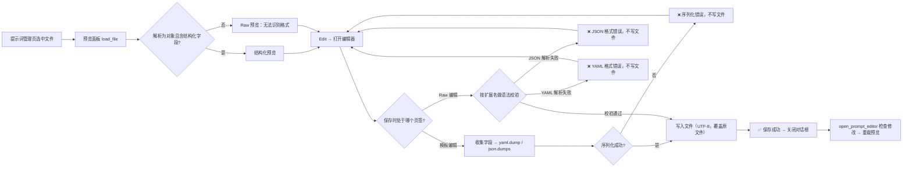

# 提示词结构化编辑器

当你需要编辑 `dict/` 下的自定义翻译提示词文件时，提示词管理页的“编辑”会打开结构化编辑器。编辑器提供“模板编辑”与“源码编辑”两种模式：前者把 YAML/JSON 中的结构化字段拆成表单，后者直接编辑文件原文。这里说明两种模式的判定、字段与格式、校验错误以及保存后文件如何被恢复和使用。

这里仅列出编辑器本身；文件列表、新建/复制/重命名/删除和应用所选提示词见[提示词列表、应用与预览](./list-apply-and-preview.md)，系统提示词与输出格式的组合见[系统与翻译提示词](./system-and-translation-prompts.md)和[上下文与提示词](../translator/context-and-prompts.md)。

## 适用场景

- 结构化编辑器读写的是 `dict/` 下的用户提示词文件（`.yaml`、`.yml`、`.json`），不写 `.env`、`config.json` 或任何 API 凭据。
- 编辑器只负责“写回文件”；“应用所选提示词”把路径写入 `translator.high_quality_prompt_path` 属于提示词列表页。
- 内容包含 `ai_colorizer_prompt`、`colorization_rules` 或 `reference_images` 的文件会被识别为 AI 上色提示词，改由专用编辑器打开，不走通用结构化字段。
- AI OCR、AI 渲染的固定提示词在设置页使用各自的简单编辑器，不进入本页的模板字段；系统提示词文件（`system_prompt_hq`、`system_prompt_hq_format`、`system_prompt_line_break`、`glossary_extraction_prompt`）不出现在用户提示词列表中。
- 页面只记录结构和脱敏占位符，不展示真实提示词正文、密钥或私有路径。

## 在提示词管理中操作

### 打开编辑器 {#open-editor}

1. 打开“提示词管理”，在左侧“提示词列表”中选中一个文件；右侧“提示词预览”会显示结构化预览或原始内容。
2. 点击预览面板右上角的“编辑”按钮，弹出“编辑提示词”对话框，窗口标题形如“编辑提示词 – 文件名”。
3. 文件不存在时预览面板显示“文件不存在”且“编辑”按钮不可用；文件读取失败时编辑器状态栏显示“错误：{error}”。
4. 设置页“翻译”分组中的“自定义提示词”是下拉框，只负责选择当前提示词文件；修改文件内容需要回到提示词管理页打开编辑器。

### 模板编辑与 Raw 编辑 {#editor-tabs}

编辑器顶部是两个页签：

- “模板编辑”：只有文件能被解析为结构化字段时才出现，按字段拆分表单，并提供“添加字段”、上移/下移/删除等操作。
- “源码编辑”：始终出现，用等宽字体编辑文件原文，顶部提示“直接编辑文件原始内容”。

不符合格式的文件只显示“源码编辑”页签。两个页签共享同一个“保存”按钮和底部状态栏；保存后两个页签内容会同步。

## 结构化字段与判定 {#structured-fields}

### 结构化判定 {#structured-detection}

文件先按扩展名解析：`.yaml`/`.yml` 用 PyYAML `safe_load`，其余用 `json.load`。解析结果必须是对象（dict），并且包含结构化字段才被判定为结构化。解析失败、根不是对象、或不含结构化字段时，预览显示“无法识别格式 – 显示原始内容”，编辑器只保留“源码编辑”页签。根类型错误在相关编辑器中对应文案为“JSON 顶层必须是对象”与“YAML 根节点必须是映射”。

### 字段与控件 {#fields-table}

模板编辑页签只按文件已有的字段建立区域，未出现的字段可通过“添加字段”补齐。每个字段区域可上移、下移或删除；字段顺序会影响保存后文件的键顺序。模板中没有对应控件的其他键会原样保留（“透传”），不会被模板保存丢弃；例如 `output_format`、`persona` 或未来扩展字段在收集数据时保持原值。

### 术语词典分类 {#glossary-categories}

`glossary` 下的分类页签按固定分类排序，分类名即存储值，不随界面语言翻译；例如 `Org` 在页签上的英文显示值是 Organization。所有分类都使用相同的条目结构：顶层 `original` 是正式原文名称，`aliases` 保存不同的别名或叫法；每个叫法包含自己的 `translations`，每条译文包含 `text` 和可选 `condition`。编辑器用“叫法原文 / 译文 / 使用条件”三列表编辑，同一叫法的多行会保存为同一个 `aliases` 项的多个译文分支。新建条目没有叫法时，正式名称会自动复制为第一条叫法。所有分类都可填写 `description`。

`overwrite` 控制相同正式原文的自动提取结果能否追加新的叫法，默认不允许。自动提取返回顶层 `original`、`category` 和 `aliases`；每个别名必须只有一个 `translations[].text`。已有正式原文只有在 `overwrite: true` 时才接受新的叫法；已经存在的叫法会被整条忽略，不会追加第二个 AI 译文。AI 携带的条件、描述、覆盖开关及其他未知字段不会写回。仅兼容最初的单个 `translation` 存储格式；通过结构化编辑器保存后会转成统一的 `aliases` 结构。空分类会保留，避免保存后 `glossary` 被塌缩成空对象。

## 校验、保存与恢复 {#validation-save-restore}

### 模板页签的保存 {#template-save}

1. 点击“保存”后，先从各控件收集数据（`_collect_template_data`）。
2. 按文件扩展名序列化：`.yaml`/`.yml` 用 `yaml.dump(allow_unicode=True, default_flow_style=False, sort_keys=False)`；`.json` 用 `json.dumps(indent=2, ensure_ascii=False)`。
3. 序列化异常时状态栏显示“❌ 序列化错误”，不写文件。
4. 写入成功后在状态栏显示“✅ 保存成功”，把自由编辑页签内容同步为同一份文本，并关闭对话框。

### Raw 页签的保存 {#raw-save}

Raw 页签保存前按扩展名做语法校验，校验失败不写文件：

- `.json`：`json.loads(content)` 失败 → “❌ JSON 格式错误”。
- `.yaml`/`.yml`：`yaml.safe_load(content)` 失败 → “❌ YAML 格式错误”。

校验只检查语法，不检查根类型；写入使用 UTF-8 编码，直接覆盖原文件。写入异常时显示“❌ 保存失败”，对话框不关闭。

### 状态与错误 {#status-errors}

| 状态 | 触发条件 | 结果 |
| --- | --- | --- |
| `Loaded successfully` | 文件读取并完成解析 | 进入可编辑状态 |
| `Error: {error}` | 读取文件失败 | 状态栏显示错误，正文为空 |
| `Serialize Error` | 模板收集或序列化异常 | 不写文件，对话框不关闭 |
| `Format Error` | Raw 中 JSON/YAML 语法错误 | 不写文件，对话框不关闭 |
| `Save failed` | 写入文件异常 | 不写文件，对话框不关闭 |
| `Saved successfully` | 写入成功 | 同步两个页签并关闭对话框 |

### 关闭与恢复 {#close-restore}

- “取消”或关闭窗口不会写文件；已编辑内容只在本次会话的控件中。
- 编辑器关闭后，调用方读取 `get_was_modified()`；只要发生过保存，或 Raw 页签内容与打开时不同，就会重新加载预览面板，显示最新的文件内容。
- 提示词文件没有自动备份：编辑器是原地覆盖写入，保存前不会生成 `.bak`。要恢复旧内容需要靠你自己的副本或版本管理，这与批量方案写 `.bak` 的行为不同。
- 文件被改成无法解析后，翻译运行时不会崩溃，而是跳过自定义提示词继续使用内置基础系统提示词；修复文件后重新打开编辑器即可恢复。

## 运行时消费 {#runtime-consumption}

翻译开始前，`_load_and_prepare_prompts` 读取 `translator.high_quality_prompt_path`，用 `load_custom_prompt` 按扩展名解析文件（`.yaml` → `.yml` → `.json` 顺序查找，根不是对象时返回空）。解析出的结构化数据随后被 `_flatten_prompt_data` 递归拍平成文本块，注入到 OpenAI/Gemini 的系统提示词中；目标语言占位符（写作 `target_lang` 三层花括号占位符）会被替换为目标语言全称。

开启“自动提取新术语”（键 `translator.extract_glossary`）后，翻译提取到的新术语会通过 `merge_glossary_to_file` 自动合并回提示词文件的 `glossary`（按扩展名写 YAML 或 JSON）。新原文会创建同名的第一条 `aliases` 叫法，并在其 `translations` 中写入提取译文；已有原文只有在条目显式设置 `overwrite: true` 时才追加尚不存在的叫法，已有叫法的整条 AI 结果会丢弃。自动合并不会修改已有译文、条件、描述、覆盖开关或其他人工字段。也就是说，除了编辑器，运行中的翻译也会在满足条件时写回该文件。

## 限制与注意事项

- 文件格式依赖运行时 PyYAML：`PyYAML` 缺失时 `.yaml`/`.yml` 无法解析，编辑器退化为 Raw 模式，运行时跳过自定义提示词。
- 提示词文件只影响翻译请求的系统提示词；它不保存 API 凭据、不选择翻译器、不参与 API 候选槽轮换。
- 结构化字段的模板保存会保留未知键，但 Raw 页签中手写的键与格式由你自己负责；错误的根类型（如顶层是列表）不会被结构化预览识别。
- 不要把 API Key、Token、用户名、私有绝对路径或业务敏感文本写进提示词文件；文件会被原样展平进请求，并可能出现在日志与调试产物中。
- 自动术语合并会修改当前提示词文件；如果你不希望运行时改动文件，关闭“自动提取新术语”或改用只读副本。
