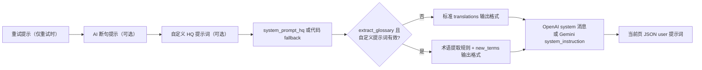
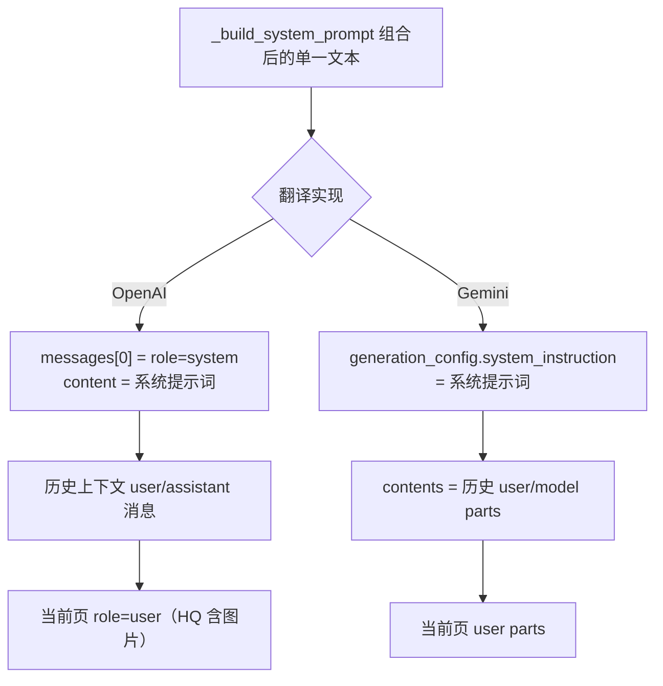

# 系统提示词与翻译提示词

翻译请求由系统提示词与翻译提示词共同驱动：系统提示词文件控制“如何翻译”与“输出什么格式”，翻译提示词提供自定义规则、术语提取和 AI 断句要求。当你需要知道某个提示词文件何时被读取、以什么顺序拼接、`target_lang` 占位符在哪里替换，以及最终怎样进入 OpenAI/Gemini 请求时，使用本页。

这里不覆盖提示词文件的列表、应用与 CRUD（见[提示词列表、应用与预览](./list-apply-and-preview.md)），也不覆盖结构化编辑器（见[提示词结构化编辑器](./structured-editor-and-format.md)）；AI OCR、AI 上色和 AI 渲染提示词分别见[AI OCR 提示词](./ai-ocr-prompt.md)、[AI 上色提示词](./ai-colorizer-prompt.md)和[AI 渲染提示词](./ai-renderer-prompt.md)。上下文历史页如何变成消息见[上下文与提示词](../translator/context-and-prompts.md)。

## 适用场景 {#feature-boundary}

- 系统提示词固定文件：`dict/system_prompt_hq.yaml`（基础系统提示词）与 `dict/system_prompt_hq_format.yaml`（输出格式）。它们由运行时按文件名 stem 从 `dict/` 加载，不属于用户提示词列表，桌面端没有专用编辑器。
- 翻译提示词：`translator.high_quality_prompt_path` 指向的自定义 HQ 提示词（`dict/` 下的 `.yaml`/`.yml`/`.json` 用户文件）、`dict/glossary_extraction_prompt.yaml`（术语提取规则）与 `dict/system_prompt_line_break.yaml`（AI 断句提示词）。
- 相关配置键：`translator.high_quality_prompt_path`、`translator.extract_glossary`、`render.disable_auto_wrap`；完整参数文档见[翻译设置](../settings/translation.md)与[排版与渲染](../settings/typesetting-and-rendering.md)。
- 这里仅说明提示词如何加载、组合并进入 OpenAI/Gemini 系统指令；不涉及翻译器选择、API 凭据和候选槽轮换（见[翻译器选择](../translator/selection-and-languages.md)与[API 管理页](../api-management/slots-and-rotation.md)）。
- 不在页面中写入真实 API Key、私有提示词正文或本机绝对路径；提示词内容属于用户数据，共享日志、请求导出或调试目录前必须删除。

## 普通翻译提示词文件格式 {#custom-prompt-file-format}

自定义翻译提示词使用模板文件：复制 `dict/prompt_example.yaml` 并改名为你自己的文件（例如 `dict/my_manga_prompt.yaml`），然后在“提示词管理”页点击“应用所选提示词”，或在“设置”→“翻译”分组的“自定义提示词”下拉中选用。文件是 YAML，根必须是对象，结构如下：

```yaml
system_prompt: ""
glossary:
  Person:
    - original: ""
      aliases:
        - original: ""
          translations:
            - text: ""
              condition: ""
      description: ""
      overwrite: false
  Location: []
  Org: []
  Item: []
  Skill: []
  Creature: []
```

- `system_prompt`：字符串，自定义系统提示词正文，可留空。留空时只使用内置基础提示词；填写的内容会叠加在基础提示词之前。
- `glossary`：术语表，按 `Person` / `Location` / `Org` / `Item` / `Skill` / `Creature` 分组。所有分类使用同一结构：顶层 `original` 是正式原文，`aliases` 保存不同叫法，每个叫法的 `translations` 保存一个或多个人工译文及可选 `condition`；空数组（如 `Location: []`）表示该分类没有条目。
- 占位符：正文中的 <code>&#123;&#123;&#123;target_lang&#125;&#125;&#125;</code> 会在每次请求构造时被替换为目标语言名称，见[占位符替换](#placeholders)。

脱敏示例（只演示结构与占位符用法，不含真实提示词内容）：

```yaml
system_prompt: |
  你是漫画翻译助手。将 {{{target_lang}}} 翻译得自然流畅，保持角色语气一致。
glossary:
  Person:
    - original: "示例角色名"
      aliases:
        - original: "示例角色名"
          translations:
            - text: "示例角色译名"
      description: "示例角色介绍"
      overwrite: true
  Location: []
  Org:
    - original: "示例组织名"
      aliases:
        - original: "示例组织名"
          translations:
            - text: "示例组织译名"
      overwrite: false
  Item: []
  Skill: []
  Creature: []
```

## 在提示词管理中操作 {#ui-operations}

### 在提示词管理页选择并应用翻译提示词 {#apply-translation-prompt}

打开“提示词管理”，“提示词列表”只显示 `dict/` 下的用户提示词文件，并排除系统提示词 stem（`system_prompt_hq`、`system_prompt_hq_format`、`system_prompt_line_break`、`glossary_extraction_prompt`、`ai_ocr_prompt`、`ai_colorizer_prompt`、`ai_renderer_prompt`）。选中文件后点击“应用所选提示词”，程序把 `dict/<文件名>` 写入 `translator.high_quality_prompt_path` 并持久化，状态标签显示“当前提示词：{filename}”。

列表、预览和编辑的完整操作见[提示词列表、应用与预览](./list-apply-and-preview.md)；结构化编辑与保存校验见[提示词结构化编辑器](./structured-editor-and-format.md)。

### 在设置页打开相关开关 {#settings-toggles}

1. 打开“设置”→“翻译”分组，打开“自动提取新术语”。该开关写入 `translator.extract_glossary`；只有同时存在可解析的自定义提示词时，翻译请求才会追加术语提取规则与 `new_terms` 输出格式。
2. 打开“设置”→“排版”分组，打开“AI 断句”。该开关写入 `render.disable_auto_wrap`；开启后翻译请求会加载 `dict/system_prompt_line_break.yaml`，并在用户输入 JSON 的每个区域上附加 `original_region_count`。
3. `translator.high_quality_prompt_path` 的界面显示名是“自定义提示词”。它的动态设置控件在 `dynamic_settings.py` 中实现（打开下拉时重新扫描 `dict/` 并排除系统提示词）；实际设置该键的主要入口是提示词管理页的“应用所选提示词”。

## 提示词如何加载 {#runtime-behavior}

### 文件加载时机 {#loading-timing}

翻译批次开始前，`_load_and_prepare_prompts()` 做一次提示词准备：

- 若 `translator.high_quality_prompt_path` 非空，先把路径规范化（`normalize_server_resource_path`），相对路径再与 `BASE_PATH` 拼接，然后调用 `load_custom_prompt()` 解析。精确路径不存在时会按 `.yaml` → `.yml` → `.json` 顺序替换扩展名重试；解析失败只记录警告，不中断翻译。
- 若 `render.disable_auto_wrap` 为真，调用 `load_line_break_prompt()` 从 `dict/` 加载 `system_prompt_line_break`，结果存入 `ctx.line_break_prompt_json`；文件缺失同样只记警告。

基础系统提示词、输出格式与术语提取提示词不在准备阶段预载：每次构造请求（包括重试）时，`_build_system_prompt()` 按 stem 从 `dict/` 现读 `system_prompt_hq`、`system_prompt_hq_format`，术语模式再读 `glossary_extraction_prompt`。加载器优先 `.yaml`，其次 `.yml`，最后 `.json`。

### 组合顺序 {#composition-order}

`_build_system_prompt()` 把提示词拼成一段单一文本，顺序固定为：重试提示（仅重试时）→ AI 断句提示（可选）→ 自定义 HQ 提示词（可选）→ 基础系统提示词 → 输出格式。自定义提示词由 `_flatten_prompt_data()` 递归展平为文本块；开启术语提取且自定义提示词有效时，基础提示词之后依次追加术语提取规则和带 `new_terms` 的扩展输出格式，各段之间用 `\n\n---\n\n` 分隔。



基础系统提示词缺失或为空时使用代码内 fallback（`_HQ_FALLBACK_PROMPT`）；输出格式提示词缺失时记录日志但请求仍会发出，只是缺少严格格式约束。

### 占位符替换 {#placeholders}

提示词文件中的占位符是三层花括号的字面量标记（例如 <code>&#123;&#123;&#123;target_lang&#125;&#125;&#125;</code>），不是 Python 字符串格式化语法。每次请求构造时，运行时把标记替换为目标语言全称：`VALID_LANGUAGES` 把语言代码映射为全称（如 `CHS` → `Chinese (Simplified)`、`JPN` → `Japanese`），未收录的代码原样保留。替换只发生在内存中的请求文本，不会改写 `dict/` 文件。

| 占位符 | 所在文件 | 替换时机 | 替换为 |
| --- | --- | --- | --- |
| <code>&#123;&#123;&#123;target_lang&#125;&#125;&#125;</code> | `system_prompt_hq`、`system_prompt_hq_format`、自定义提示词、`glossary_extraction_prompt` | 每次请求构造 | 目标语言全称 |
| <code>&#123;&#123;&#123;optional_new_terms_rule&#125;&#125;&#125;</code> | `system_prompt_hq_format` | 仅 `extract_glossary=True` | 要求输出 `new_terms` 键的规则文本；普通模式替换为空 |
| <code>&#123;&#123;&#123;optional_new_terms_example_suffix&#125;&#125;&#125;</code> | `system_prompt_hq_format` | 仅 `extract_glossary=True` | 输出 JSON 示例中的 `new_terms` 段；普通模式替换为空 |
| <code>&#123;&#123;&#123;optional_new_terms_final_instruction&#125;&#125;&#125;</code> | `system_prompt_hq_format` | 仅 `extract_glossary=True` | 未找到新术语时返回 `"new_terms": []` 的结尾指令；普通模式替换为空 |

### 进入 OpenAI/Gemini 系统指令 {#system-instruction-path}

组合后的系统提示词作为一个整体注入，不会按文件拆成多条 system 消息：



- OpenAI（`openai.py`、`openai_hq.py`）：系统提示词放入 `messages[0]`（`role=system`），随后插入 `_build_openai_context_messages()` 生成的历史 `user`/`assistant` 消息，最后追加当前页 `user` 请求；HQ 模式的用户消息包含图片内容。
- Gemini（`gemini.py`、`gemini_hq.py`）：系统提示词赋给 `generation_config.system_instruction`，`contents` 先插入 `_build_gemini_context_messages()` 生成的历史 `user`/`model` parts，最后追加当前页 `user` parts。
- 术语模式开启且响应包含 `new_terms` 时，OpenAI/Gemini 都会调用 `merge_glossary_to_file()`，把新术语合并写回自定义提示词文件的 `glossary` 字段（按扩展名写 YAML 或 JSON）。
- 流式与非流式传输使用同一套系统指令和消息构建；`disable_auto_wrap` 开启时，当前页用户 JSON 中每个区域带有 `original_region_count`，供最终渲染检查 `[BR]` 标记数量。

## 限制与注意事项 {#dependencies-and-conflicts}

- “自动提取新术语”单独开启无效：代码要求 `bool(custom_prompt_json) and extract_glossary` 同时为真，即必须存在可解析的自定义提示词且开关开启。
- 基础系统提示词缺失回退到代码内置文本；格式或术语提示词缺失只减弱约束、不崩溃；自定义提示词解析失败时跳过该文件继续使用基础提示词。
- 术语写回会修改 `dict/` 下的自定义提示词文件；如果不想让运行时改动文件，关闭“自动提取新术语”或改用只读副本。
- 系统提示词文件被用户提示词列表排除且没有桌面编辑器；手动修改需保持 YAML/JSON 根结构为对象。
- `render.disable_auto_wrap` 同时影响排版换行和翻译请求（断句提示词 + `original_region_count`），不是纯渲染开关；Qt 默认 `true` 与核心/发行默认 `false` 不一致。
- 提示词正文可能包含业务文本并原样进入请求与日志；共享前必须删除提示词正文、历史文本、路径和凭据。
