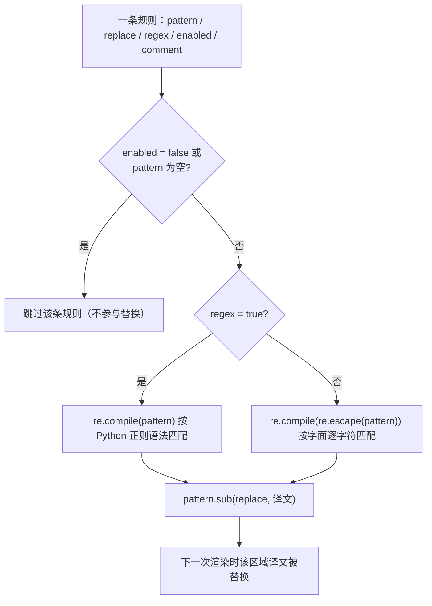
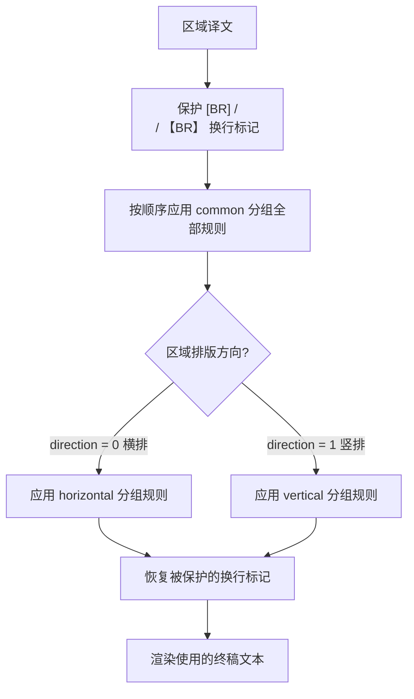
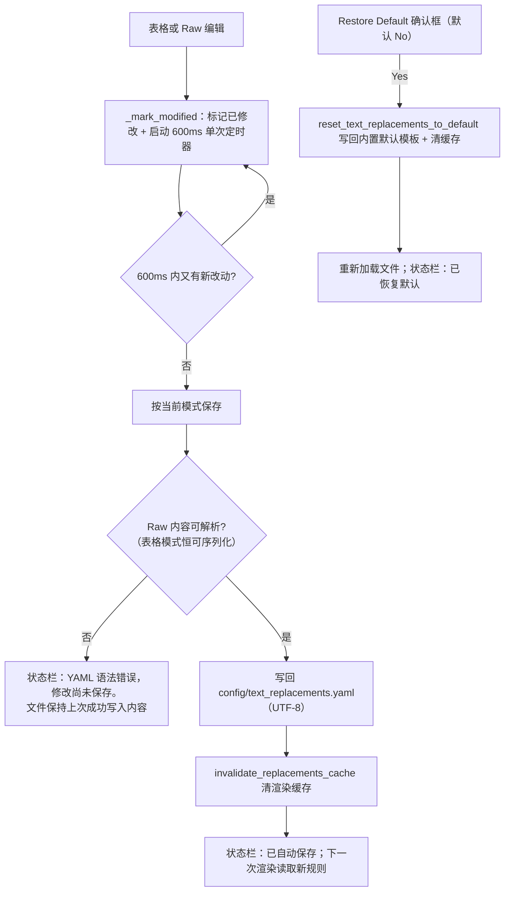

# 替换规则的 Raw YAML 编辑、正则与保存

当你想在译文排版到图片之前统一标点、修正全半角字符或做其他文本规范化时，使用“替换规则”页面编辑 `config/text_replacements.yaml`。页面提供“表格视图”与“源码编辑”两种模式，操作同一个文件；每条规则要么是字面替换，要么是正则替换，改动会自动保存。这里说明两种模式的用法、正则语义、保存与恢复机制，以及规则在渲染阶段的消费方式。

表格视图的行级操作、分组页签与分组执行顺序的完整说明见[表格分组与顺序](./table-groups-and-order.md)；富文本规则（在替换完成后对 `translation` 做样式匹配）见[富文本规则](../rich-text-rules/table-raw-and-match.md)。

## 规则作用范围 {#feature-boundary}

- 这里仅读写 `config/text_replacements.yaml`：该文件保存渲染前的文本替换规则，不保存 API 凭据、翻译器选择、`.env` 或任何其他配置。
- 表格视图与源码编辑视图编辑的是同一个文件、同一组规则；切到源码编辑模式时表格工具栏和筛选行会被禁用（`_set_table_controls_enabled(False)`），避免两处同时编辑。
- 规则只在渲染阶段由 `apply_replacements` 消费，作用于区域译文（`region.translation`）；不改变原文、OCR 文本或翻译请求。
- 富文本规则读取替换完成后的 `translation` 做样式匹配，属于另一份文件 `config/rich_text_rules.yaml` 与另一个页面，不在本页。
- 不要把真实业务文本、密钥、用户名或私有绝对路径写进规则文件；文件内容会被渲染逐条读取，并可能出现在日志与调试产物中。

## 在替换规则中操作 {#ui-operations}

### 打开替换规则页 {#open-page}

1. 在主导航点击“替换规则”进入页面；标题下方副标题为“管理应用到译文的文本替换规则（顺序：通用（始终执行）→ 横排/竖排；规则由上到下级联替换）”。
2. 面板顶部是工具栏，中部是“表格视图 / 源码编辑”模式切换，底部状态栏显示当前分组规则数量与模式。
3. 面板提供 `refresh()` 公共接口（重新加载文件并套用当前筛选）；切换语言时 `refresh_ui_texts()` 会刷新全部按钮与列头文案。

### 表格视图编辑 {#table-view-editing}

1. 分组页签：通用（始终执行）、横排、竖排。
2. 表格列：启用（`✓`/`✗`）、匹配、替换、正则（`✓`/`✗`）、备注。启用与正则列不可直接输入，双击单元格切换 `✓`/`✗`。
3. 工具栏按钮：添加规则、删除、上移/下移（`↑`/`↓`，图标按钮无文字）、全部选中、启用/禁用（按选中行多数状态动态显示）、正则/取消正则（动态显示）、恢复默认。
4. “添加规则”会插入一行新规则并直接进入“匹配”单元格编辑；保存时匹配为空的行会被跳过。
5. 筛选框按“匹配 / 替换 / 备注”做大小写不敏感的子串过滤，只影响显示，不改变文件内容。

### Raw YAML 编辑 {#raw-yaml-editing}

1. 点击“源码编辑”进入等宽字体编辑器；顶部提示“直接编辑原始 YAML 内容，修改会自动保存。”。编辑器关闭自动换行，并提供简单 YAML 语法高亮（注释斜体、键名加粗）。
2. 切到源码编辑模式时，若表格有未保存改动会先按表格内容保存，再把序列化后的完整 YAML 填入编辑器；因此编辑器里看到的是与表格一致的内容。
3. 从源码编辑切回“表格视图”时，编辑器先解析 YAML：解析失败会弹出“解析错误 / YAML 语法错误，无法切换到表格视图。”并留在源码编辑模式；解析成功则按三个分组重建表格。
4. 源码编辑模式下你手写的键、缩进与转义由你自己负责；保存只校验“能否被 YAML 解析”，不校验根结构是否为对象（根类型错误只在切回表格视图时报错）。

## 规则格式与正则语义 {#rule-format-and-regex}

### 规则字段 {#rule-fields}

文件顶层必须是对象，包含三个列表键：`common`、`horizontal`、`vertical`。每条规则是一个对象：

| 字段 | 必填 | 语义 |
| --- | --- | --- |
| `pattern` | 是 | 匹配模式；`regex: true` 时按 Python `re` 语法解析，否则按字面文本匹配 |
| `replace` | 是 | 替换内容；正则模式下支持反向引用 `\1`、`\2` 等 |
| `regex` | 否 | 默认 `false`（字面替换）；`true` 时 `pattern` 作为正则处理 |
| `enabled` | 否 | 默认 `true`；`false` 表示临时禁用该条规则 |
| `comment` | 否 | 备注，不参与匹配 |

### 字面替换与正则替换 {#literal-vs-regex}

运行时对每条规则做一次编译：字面替换调用 `re.compile(re.escape(pattern))`，正则替换调用 `re.compile(pattern)`；`pattern` 为空或 `enabled: false` 的规则被跳过。正则编译失败（`re.error`）时该条规则被跳过并写 warning 日志，不影响其他规则，也不会让渲染失败。因此：

- 字面替换中出现的 `.`、`(`、`\` 等正则特殊字符会被原样匹配，无需转义；
- 正则替换按 Python `re` 语法匹配，`\d`、`\.{3}`、反向引用 `\1` 等均可用；`replace` 中的 `\1` 引用第一个捕获组。

### 分组、方向与执行顺序 {#groups-direction-and-order}

- 执行顺序固定：先按文件顺序应用 `common` 全部规则；再按区域排版方向选择 `horizontal`（`direction == 0`，横排）或 `vertical`（`direction == 1`，竖排）分组，继续自上而下应用。
- 同一分组内规则按 YAML 列表顺序级联执行：前一条的输出是后一条的输入，因此“先替换 A 再替换 B”与“先替换 B 再替换 A”的结果可能不同。
- 方向在渲染阶段判定：`_resolve_region_render_horizontal` 先看区域强制方向（`horizontal`/`h` 或 `vertical`/`v`），`auto` 时回退到区域的 `horizontal` 属性。

### 换行标记保护 {#linebreak-protection}

`apply_replacements` 会先把 `[BR]`、`【BR】`、` `、` ` 等换行标记替换为占位符，替换完成后再恢复。因此即使规则写到了这些标记，也不会命中受保护的占位符。

## 保存与恢复机制 {#save-and-restore}

### 自动保存 {#autosave}

任何编辑动作（改单元格、双击切换、增删/移动行、源码编辑文本变化）都会调用 `_mark_modified`：把面板标记为已修改，启动 600ms 的单次防抖定时器，并刷新状态栏（追加 `●`）。定时器到点且仍有未保存修改时按当前模式保存：

- 表格模式用 `_tables_to_yaml()` 序列化（`allow_unicode=True`、`default_flow_style=False`、`sort_keys=False`；`Pattern` 为空的行会被跳过，`regex`/`enabled`/`comment` 为默认值或空时省略）；
- 源码编辑模式先 `yaml.safe_load` 校验语法，再原样写回。

写入成功后会清空渲染缓存（`invalidate_replacements_cache`）、停止定时器、清除修改标记，并把状态栏设为“已自动保存”。正常编辑不需要手动保存。

### 模式切换时的保存与校验 {#mode-switch-save}

- 表格 → 源码编辑：先按当前表格内容保存一次（失败只更新状态栏，不弹窗），再把序列化结果填入编辑器，保证源码编辑编辑器反映表格最终状态。
- 源码编辑 → 表格：先解析编辑器内容。解析失败弹出“解析错误 / YAML 语法错误，无法切换到表格视图。”并留在源码编辑模式；解析成功且存在未保存修改时先保存，再按三个分组重建表格。
- 源码编辑自动保存失败（YAML 语法错误）时，状态栏显示“YAML 语法错误，修改尚未保存。”，文件保持最后一次成功写入的内容；修复语法后再次编辑或切换模式即可保存。

### 恢复默认 {#restore-default}

点击“恢复默认”会弹出确认框（标题“恢复默认”，正文“要将替换规则恢复为内置默认值吗？当前自定义规则会被覆盖。”，按钮“是”/“否”，默认“否”）。确认后：

1. 停止自动保存定时器，调用 `reset_text_replacements_to_default` 把内置默认模板写入 `config/text_replacements.yaml`；
2. 清空渲染缓存，重新加载文件并套用当前筛选；
3. 状态栏显示“已恢复默认”，面板发出 `data_changed` 信号。

恢复默认会直接覆盖当前自定义规则且没有 `.bak` 备份（与批量管理方案的备份/恢复机制不同），确认前请确认当前规则不再需要。

### 渲染缓存与启动升级 {#cache-and-startup}

- 渲染侧 `load_replacements` 以“文件路径 → (mtime, 解析结果)”缓存规则；保存与恢复默认都会清缓存，因此下一次渲染会重新读取文件。手动改文件但 mtime 未变化时可能命中旧缓存。
- 启动初始化 `ensure_runtime_files` 会删除仍为历史内置模板 MD5 的 `text_replacements.yaml`（两个已知旧哈希：`5b8fbc89492ff2a1d5c064f5e85a458b`、`94b2787940afdde800db3aba0742ad98`），随后 `ensure_text_replacements_exists` 重建内置默认模板；用户自定义内容不受影响。
- 文件不存在时编辑器状态栏显示“文件不存在”；读取失败显示“加载失败: {error}”。

## 限制与注意事项 {#dependencies-and-conflicts}

- 规则只作用于渲染前的译文：`prepare_text_replacements_for_layout` 把替换前文本存入 `translation_raw`，替换结果写入 `translation`；渲染后 `sync_translation_raw_from_layout` 会把排版改动回映到 `translation_raw`。
- 富文本文档区域（`is_rich_text_document` 为真）跳过替换；已渲染过的 JSON 导出会记录 `skip_text_replacements`，导入重渲染时不再二次替换。
- 规则文件不参与翻译请求、API 候选轮换或词典（`pre_dict`/`post_dict`）流程；词典是另一套 `apply_dictionary` 消费者。
- 正则语法错误只跳过出错的那条规则，不会让渲染失败；但该条预期替换不会生效。
- 恢复默认、保存失败和源码编辑语法错误的处理见上文；共享日志或调试目录前不要包含规则文件中的业务文本。