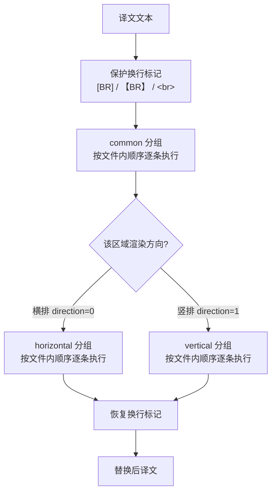
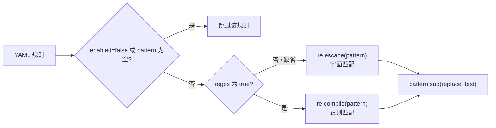
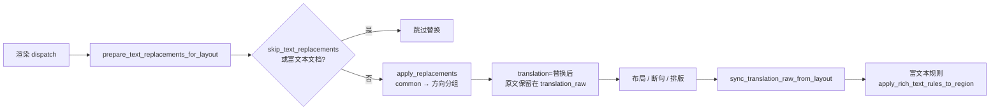

# 替换规则表：分组、顺序与匹配逻辑

当译文中的固定字词、标点符号或竖排字形需要统一改写时，可以使用“替换规则”页维护一组在渲染前应用到译文的规则。每条规则从 `config/text_replacements.yaml` 读取，按“通用 → 横排/竖排”的固定顺序逐条执行；这里说明规则如何分组、排序和匹配。

本页负责表格视图的分组、执行顺序、字面/正则匹配和渲染链路调用位置。Raw YAML 编辑模式、正则语法细节以及保存/恢复默认的完整行为见[原始 YAML、正则与保存](./raw-yaml-regex-and-save.md)；替换完成后追加的富文本规则见[富文本规则表：表格、Raw 与匹配](../rich-text-rules/table-raw-and-match.md)。

## 规则作用范围 {#feature-boundary}

- 三个分组固定为 `common`、`horizontal`、`vertical`：`common` 始终执行，`horizontal` 只在横排渲染时执行，`vertical` 只在竖排渲染时执行。
- 每条规则有 `pattern`、`replace`、`regex`、`enabled`、`comment` 五个字段；表格视图用五列展示这些字段。
- 规则的执行顺序是文件内从上到下：同一分组内先写的规则先应用，替换结果会继续参与后续规则的匹配（级联）。
- 这里不涉及源码编辑模式下的 YAML 语法校验和恢复默认（见[原始 YAML、正则与保存](./raw-yaml-regex-and-save.md)），也不涉及替换完成后的富文本规则（见[富文本规则](../rich-text-rules/table-raw-and-match.md)页面）。

## 在界面中编辑规则表 {#edit-rule-table}

在左侧主导航中打开“替换规则”。页面标题下方的副标题提示替换规则的顺序（“通用（始终执行）→ 横排/竖排；规则由上到下级联替换”）。整个页面由一个标题卡片和一个编辑面板组成，没有其他页签或弹窗。

### 三个分组页签 {#group-tabs}

表格视图顶部有一个分组切换器，固定为三个页签。切换页签只会切换当前编辑的分组，不会修改其他分组的数据，也不会触发保存以外的任何运行行为。

### 表格列与工具栏 {#table-columns-and-toolbar}

表格有五列：启用、匹配、替换、正则、备注。启用和正则是标志列（`✓`/`✗`），双击单元格即可切换；`✓`/`✗` 是代码常量，不是 i18n key。

工具栏按钮从左到右为：添加规则、删除、上移/下移（`↑`/`↓`，只有图标且宽度固定）、全部选中、启用/禁用、正则/取消正则、恢复默认。

操作步骤：

1. 在某个分组页签下点击“添加规则”，表格末尾新增一行：启用为 `✓`、正则为 `✗`，匹配/替换/备注为空，随后自动进入“匹配”单元格编辑。
2. 在“匹配”和“替换”列输入内容；“正则”保持 `✗` 表示字面替换，双击改为 `✓` 表示正则替换。
3. 使用“上移/下移”（`↑`/`↓`）调整当前选中行在分组内的顺序；顺序决定级联匹配的先后。
4. 选中一行或多行后，点击“启用/禁用”或“正则/取消正则”批量切换；按钮文字按选中行的多数状态决定，例如多数已启用时显示“禁用”。
5. 点击“删除”删除当前行（每次一行）。编辑会触发 600ms 防抖自动保存，保存成功后状态条显示“已自动保存”。
6. 点击“恢复默认”会弹出确认框；确认后把 `config/text_replacements.yaml` 覆盖为内置默认模板并重新加载。

“全部选中”只选中当前分组中未被过滤隐藏的行；被过滤隐藏的行不会参与后续的启用/正则批量切换。

### 过滤与状态 {#filter-and-status}

过滤框的提示文字为“输入匹配 / 替换 / 备注以过滤...”。输入后只显示匹配、替换或备注命中该文字的当前分组行；过滤不会改变文件内容，切换分组页签会重新应用过滤。

状态条位于面板底部，格式为 `分组名: 已启用数/总数 已启用 ● [模式]`，例如 `common: 2/3 已启用 ● [表格视图]`。`●` 表示有未保存的修改；文件不存在时显示“文件不存在”，加载失败显示“加载失败”。

## 规则字段 {#rule-fields}

> 本页各字段的存储键、默认值与实现细节，见参考页[界面选项对照表](../../reference/options-i18n-matrix.md)。

表格的五列对应五类信息：启用、匹配、替换、正则、备注。其中正则、启用、备注为可选字段，只有与默认值不同才会写回 YAML；表格保存时跳过匹配为空的整行。

#### 匹配 {#rule-pattern}

在表格的“匹配”列输入要查找的文字；通过“添加规则”新建后会自动进入该单元格编辑。匹配为空的行不会参与替换。开启正则后按 Python `re` 语法解释，未开启时按普通文本查找，正则特殊字符无需转义。

#### 替换 {#rule-replace}

在表格的“替换”列输入替换后的内容；可以为空（相当于删除匹配到的文字）。正则模式下支持反向引用（如 `\1`），详见[原始 YAML、正则与保存](./raw-yaml-regex-and-save.md)。

#### 正则 {#rule-regex}

在表格的“正则”列切换 `✓`/`✗`，也可以选中多行后点工具栏“正则/取消正则”批量切换。开启后“匹配”按正则语法解释；关闭时按普通文本逐字符匹配。正则语法错误只会跳过该条规则并记录警告，不影响其他规则。

#### 启用 {#rule-enabled}

在表格的“启用”列切换 `✓`/`✗`，禁用行会整行灰显。禁用的规则仍保留在文件中并显示在表格里，只是运行时被跳过；需要时改回 `✓` 即可。状态条中的“已启用数/总数”按启用列统计。

#### 备注 {#rule-comment}

在表格的“备注”列填写说明文字，不参与匹配。过滤框会把匹配、替换、备注三列合并后做大小写不敏感的子串匹配。

## 分组与执行顺序 {#groups-and-order}

对一段译文，引擎按以下顺序执行：先保护换行标记，再应用 `common` 分组，然后根据区域的渲染方向应用 `horizontal` 或 `vertical` 分组，最后恢复换行标记。

方向的判定来自 `_resolve_region_render_horizontal`：当区域被强制指定方向（`h`/`horizontal` → 横排，`v`/`vertical` → 竖排）时按强制值执行；否则回退到区域的检测方向（`region.horizontal` 属性，由目标语言预设或宽高比等推断）。渲染方向由渲染设置与检测结果共同决定，替换规则本身不修改方向。

同一分组内，先写的规则先执行，后一条规则在已替换的文本上继续匹配，因此顺序会直接影响结果。例如先执行 `A → B`，再执行 `B → C`，最终 `A` 会被替换为 `C`；如果两条规则顺序颠倒，`B → C` 不会命中 `A`。

## 匹配逻辑 {#matching-logic}

每条规则先被编译为 `(compiled_pattern, replace_string)`，再通过 `pattern.sub(replace, text)` 应用到文本。匹配方式由 `regex` 字段决定：

- 字面匹配：pattern 中的 `.`、`*`、`(` 等正则特殊字符全部被转义，按普通文本逐字符匹配。
- 正则匹配：pattern 按 Python `re` 语法编译，支持反向引用等能力；语法错误时该条规则被跳过并记录警告，不影响其他规则。
- 换行标记保护：`[BR]`、`【BR】`、` `、` `（大小写不敏感）在替换前被替换为占位符，替换结束后恢复，避免标记内容被误替换。
- 富文本条目版（`apply_replacements_to_entries`）会额外跳过空匹配和跨 `\n` 的命中；替换出的字符继承被替换段首字符的样式。
- 模块内还提供 `build_h2v_dict`/`build_v2h_dict` 两个辅助函数，从 vertical/horizontal 分组抽取单字符字面映射；当前渲染链路没有引用它们（代码检查结果）。

## 渲染链路中的调用位置 {#render-pipeline}

替换在渲染阶段、排版测量之前执行，替换结果写入 `region.translation`，替换前文本保留在 `region.translation_raw`；随后布局断句仍可修改译文，最后再同步回原文坐标并执行富文本规则。

- `skip_text_replacements` 为真时整页跳过替换：渲染过的 JSON 导出会写入 `skip_text_replacements: true`，避免导入重渲染时二次替换；编辑器导出的 JSON 恒标记跳过；JSON 缺省为 `false`，导入渲染时正常应用。
- 富文本文档（`is_rich_text_document`）与已生成替换记录的区域不会重复替换；替换前文本通过 `ReplacementLayoutRecord(raw_text, replaced_text)` 记录，供布局改动投影回原文坐标。
- 编辑器里编辑“替换前译文”（`translation_raw`）时，`editor_controller._apply_translation_replacements` 会实时用同一引擎同步到译文；失败时回退原文。
- 富文本同步（`rich_text_sync.py`）对富文本条目跑同一套 common + 方向分组的“条目版”替换，并把富文本规则放在替换之后。

## 限制与注意事项 {#dependencies-and-conflicts}

- 执行哪个方向分组取决于区域的渲染方向，与渲染设置的“方向”选项和检测结果有关；替换规则不改变方向。
- `text_replacements.yaml` 与 `rich_text_rules.yaml` 是独立文件：替换先于富文本规则执行，富文本规则读取的是替换完成后的译文。
- `batch_edit_schemes.yaml` 与替换规则同目录同 YAML 格式，但属于批量管理模块，不进入渲染管线。
- 启动时 `ensure_runtime_files` 会创建缺失的 `config/text_replacements.yaml`，并把历史默认模板（按 MD5 识别）升级为当前内置模板；用户自定义内容不会被覆盖。
- 规则内容可能包含业务术语或特殊文本。共享日志、请求导出或调试目录前应删除请求正文、历史页文本、路径和凭据。