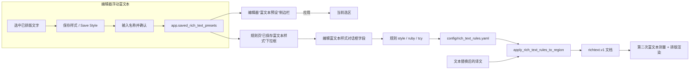

# 富文本样式与预设

当规则命中译文后，除了改变文字本身，还需要同时调整字号、颜色、描边、间距或方向时，本页用于配置每条富文本规则追加的样式字段，以及如何把编辑器里保存的样式预设直接载入规则。规则的匹配条件、表格与源码编辑见[富文本规则：表格、Raw 与匹配](./table-raw-and-match.md)；在编辑器中手工创建样式预设见[浮动富文本编辑器](../editor/floating-rich-text.md)。

## 规则作用范围

- 每条规则的样式存放在 `config/rich_text_rules.yaml` 的 `style`、`ruby`、`tcy` 字段；“编辑富文本样式”对话框的每个控件都映射回这些字段。
- “已保存富文本样式：”下拉框只读取 `app.saved_rich_text_presets`，不在本页创建、重命名或删除预设；预设的增删改在编辑器浮动富文本面板的“富文本预设”侧边栏完成。
- 自动规则使用“只补缺、不覆盖”语义：已有手工富文本字段保留，规则只追加尚未设置的字段；编辑器增量场景改为 `skip` 语义，命中区间带手工痕迹时整段跳过。
- `editor_auto_rich_text_rules` 是编辑器打字时自动应用规则的开关，不是规则文件本身，也不控制渲染管线。
- 纵中横（TCY）与注音（Ruby）是节点级结构，不是 `TextStyle` 字段；规则通过顶层 `tcy` / `ruby` 两个独立字段写入。

## 在富文本规则中操作

### 打开样式编辑对话框 {#open-style-dialog}

1. 打开“富文本规则”页面。
2. 保持在“表格视图”，在“通用（始终执行）”“横排”“竖排”中选择规则所在分组。
3. 双击或选中目标行“富文本编辑”列中的“编辑样式”按钮，打开“编辑富文本样式”对话框。
4. 在对话框中只启用本规则需要追加的属性；未启用的字段不会写入规则。提示语为“只启用本条规则需要追加的样式属性；已有相同富文本属性会保留，不会被自动规则覆盖。”
5. 点击“确定”把字段序列化回规则并触发自动保存；点击“重置”清空为无样式；“取消”丢弃修改。序列化失败会弹出“无效样式”警告。

### 载入已保存样式 {#load-saved-style}

1. 在“编辑富文本样式”对话框顶部，从“已保存富文本样式：”下拉框选择一个名称。
2. 选择后控件会一次性载入该预设的全部字段（含注音与纵中横），再按需要微调。
3. 列表第一项是“选择已保存富文本样式”，不代表任何预设；下拉框提示为“选择一个已保存富文本样式并载入”。

### 样式摘要与过滤 {#style-summary}

- 表格“富文本编辑”列按钮用缩写显示已设置字段：`B` 加粗、`I` 斜体、`U` 下划线、`ST` 删除线、`C` 颜色、`%` 字号倍率、`S` 字号、`F` 字体、`O` 描边、`OS` 外描边、`G` 发光、`D` 着重号、`FA` 强制推进、`K` 字后间距、`PK` 字前间距、`LK` 与前一行间距、`NK` 与后一行间距、`XY/Rot` 变换、`R` 注音、`T` 纵中横。
- 过滤框“按匹配内容、样式或备注筛选...”会同时匹配样式 JSON，因此可以直接输入颜色值或字号定位规则。

## 样式字段 {#style-fields}

> 本页各字段的存储键、默认值与实现细节，见参考页[界面选项对照表](../../reference/options-i18n-matrix.md)。

每个样式字段都对应富文本文档中的一类样式。只有你在对话框中启用的字段才会写入规则；写入前会经过归一化校验，包含未知字段的规则会编译失败并被整体跳过。字段默认值是对话框控件的默认值，不是区域或区域样式默认值。

#### 加粗 {#field-bold}

勾选后，命中文字使用加粗字形；与下划线、着重号互不冲突，可以同时启用。

#### 下划线 {#field-underline}

勾选后，渲染层为命中文字绘制下划线。

#### 删除线 {#field-strikethrough}

勾选后，渲染层为命中文字绘制删除线：横排从字身中部横向穿过，竖排从文字列中心纵向穿过。

#### 着重号 {#field-emphasis}

勾选后，渲染层为命中文字附加着重号。

#### 竖排内横排（纵中横） {#field-tcy}

勾选后，竖排中把命中的这段字符按横排排版，例如连续的问号和感叹号；只在竖排方向生效。

#### 注音文本 {#field-ruby}

输入注音文字并启用后，命中区间会被包装为注音节点，注音文字渲染在被注音字符旁；留空等价于没有注音。

#### 斜体角度 {#field-italic}

输入或调整切变角度（度，正值向右倾）。角度为 0 时无斜体；也支持默认 15 度斜体。

#### 文字颜色 {#field-color}

选择颜色后，命中文字使用该前景色；常用颜色会累积到颜色选择器的常用列表。

#### 绝对字号 {#field-font-size}

设置后，命中文字使用该绝对字号；渲染时会对这些区域做第二次测量，让局部字号反映到最终渲染框。

#### 字号倍率 {#field-scale}

设置后，命中文字按倍率相对区域字号缩放；与绝对字号是不同维度。

#### 强制推进 {#field-vertical-advance}

在竖排中强制每个字符占据半格或全格推进，用于纠正标点占位。

#### 字体 {#field-font-family}

选择字体后，命中文字使用该字体；列表来自本机安装字体与项目字体目录，不是固定枚举。

#### 描边 {#field-stroke}

设置描边颜色与宽度后，为命中文字绘制描边；常用描边颜色会累积到常用列表。

#### 外描边 {#field-outer-stroke}

设置外描边颜色与宽度；外描边比内描边更靠外，常用于需要更强对比的场景。

#### 发光 {#field-glow}

设置发光颜色与模糊值，为命中文字添加光晕。

#### 四类间距 {#field-kernings}

分别调整字后、字前、与前一行、与后一行的间距；0 表示不调整，负数收紧。

#### 局部旋转与偏移 {#field-transform}

设置局部旋转角度与水平/垂直偏移百分比；竖排内置规则用 `rotation: -90` 把没有专用字形的符号旋转 90 度。

## 预设应用 {#preset-application}

### 在浮动富文本编辑器中保存预设 {#save-preset-in-editor}

在编辑器选中一段已排好样式的文字，打开浮动富文本编辑器，用“保存样式”按钮把当前选区的样式保存为预设。弹窗输入“输入样式名称：”，名称默认为“富文本预设 N”。空名称提示“样式名称不能为空”；同名时确认“样式“{name}”已存在，是否覆盖？”。预设内容只包含 `style`、`ruby`、`tcy`，不包含匹配条件。

预设列表显示在“富文本预设”侧边栏，每个预设可应用到当前选区、重命名或删除；无预设时显示“暂无已保存样式”。保存失败会提示“保存样式失败”。

### 在规则页载入预设 {#load-preset-in-rules-page}

规则页的“已保存富文本样式：”下拉框读取同一份 `app.saved_rich_text_presets`：每个预设先经 `normalize_rich_text_preset()` 校验，再经 `normalize_text_style()` 归一化，`tcy` 与 `ruby` 从载荷中提取后并入样式。选择某个名称后 `load_style()` 把全部字段写入样式对话框控件；下拉框只读不写，规则页不提供预设的增删改入口。

### 渲染时应用样式 {#render-time-application}

普通翻译流程中，规则在文本替换与断句完成后应用：`apply_rich_text_rules_to_region()` 读取替换后的 `translation`（或已有 `translation_rich`），按 `common` → 当前方向分组顺序匹配，把命中字符追加 `automatic_style`，再按“只补缺”合并进最终样式，生成 `richtext.v1` 文档；BR 标记随后转换为段落边界。规则命中的区域会做第二次富文本测量，让局部字号、倍率、描边等反映到最终渲染框。

### 预设与规则数据流 {#preset-data-flow}

## 限制与注意事项

- 规则应用顺序固定为 `common`（通用）→ 当前方向的 `horizontal` / `vertical`；后一条规则可在自动样式内覆盖前一条的同名字段，但已有的手工富文本字段始终保留。
- 样式对话框与批量管理的“设置富文本”动作共用 `RichTextStyleDialog`；这里主要说明规则场景，批量场景见[批量管理：预览、应用与恢复](../batch-management/preview-apply-restore.md)。
- 预设与规则是两套存储：预设存 `app.saved_rich_text_presets`（用户 `config.json`），规则存 `config/rich_text_rules.yaml`；载入预设只是把字段填进对话框，不自动建立新规则。
- `editor_auto_rich_text_rules` 关闭时编辑器打字不再自动应用规则，但渲染管线仍然会应用 `config/rich_text_rules.yaml`。
- 样式值可能包含用户业务内容（颜色、字体名、注音）。共享日志、配置导出或调试目录前必须删除规则正文、预设名称、颜色与注音文本等私有内容。
