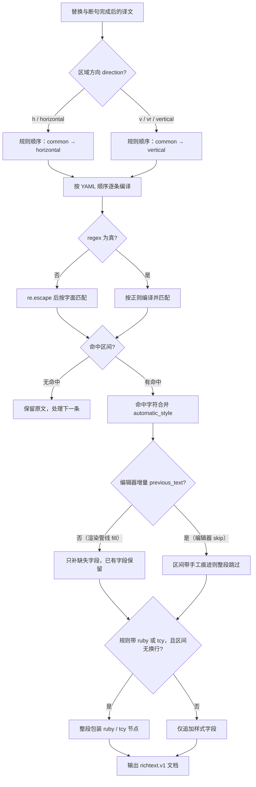

# 富文本规则表、Raw 编辑与匹配逻辑

当希望译文自动出现加粗、颜色、描边、注音或纵中横等效果，而不逐条手工编辑时，使用“富文本规则”页面。规则在文本替换完成后、渲染之前匹配译文，只“追加”尚未设置的富文本字段，不改变译文文字。这里介绍表格视图与源码编辑两种编辑方式、每条规则的字段，以及匹配与执行流程。

文本替换规则见[替换规则：表格分组与顺序](../replacement-rules/table-groups-and-order.md)和[替换规则：Raw、正则与保存](../replacement-rules/raw-yaml-regex-and-save.md)；样式属性本身的字段含义、保存的样式预设和编辑器内的样式面板见[富文本样式与预设](./styles-and-presets.md)。

## 规则作用范围 {#feature-boundary}

- 富文本规则读取“替换及断句完成后的译文”：`[BR]`、`【BR】`、` ` 和换行会先被转换为段落边界，规则不会给标记本身加样式。
- 规则按组执行：`common`（通用，始终执行）→ 再根据区域方向选择 `horizontal`（横排）或 `vertical`（竖排）。
- 规则只追加样式、注音和纵中横节点，不替换文字、不删除已有手工富文本字段；命中区间是否带手工痕迹由“填充/跳过”策略决定（见匹配流程）。
- 这里不负责文本替换规则、编辑器手工样式或样式预设的保存/删除（见上方关联页面），也不保存 API 凭据或用户私有内容。

## 在富文本规则中操作 {#ui-operations}

### 打开富文本规则页 {#open-page}

1. 打开左侧主导航中的“富文本规则”页；页面标题下方是规则编辑面板，底部状态栏显示加载与保存状态。
2. 面板顶部工具栏包含“添加规则”“删除”、上移 `↑`、下移 `↓`、“启用”“正则”和“恢复默认”。
3. 工具栏下方是过滤框和“表格视图”/“源码编辑”模式切换。

### 表格视图 {#table-view}

“表格视图”是默认模式，按组显示规则：

- 用“通用（始终执行）”“横排”“竖排”三个页签切换当前组；对应 YAML 键 `common`、`horizontal`、`vertical`。
- 每行五列：启用、匹配、富文本编辑、正则、备注。
- “启用”和“正则”列是 `✓`/`✗` 文本，双击单元格可切换；选中多行后点工具栏“启用”或“正则”可批量切换。
- “富文本编辑”列是样式按钮：未设置样式时显示“编辑样式”，设置后显示样式缩写（如 `B I C % S` 表示加粗、斜体、颜色、倍率、字号）；单击按钮打开“编辑富文本样式”对话框。
- “添加规则”在底部插入一行并直接进入“匹配”列编辑；“删除”删除选中行；`↑`/`↓` 移动选中行顺序。顺序决定后一条自动规则能否覆盖前一条的同名字段。
- 过滤框按“匹配、样式或备注”做包含筛选，只隐藏不匹配的行，不修改数据。

### 源码编辑 {#raw-edit}

1. 切换到“源码编辑”后，编辑区显示整份 YAML 原文，使用等宽字体和 YAML 语法高亮，提示“直接编辑原始 YAML 内容，修改会自动保存。”。
2. 从表格切到源码编辑时，当前表格数据会序列化为 YAML；从源码编辑切回表格时会解析并校验：根节点必须是映射、`common`/`horizontal`/`vertical` 必须是列表，否则弹出“YAML 错误”警告并停留在源码编辑模式。
3. 修改后状态栏先显示“正在保存...”，600 ms 防抖后写回文件并显示“所有修改已保存”；写回失败显示“保存失败：{error}”，原始修改保留在编辑器里。

### 编辑样式对话框 {#style-dialog}

单击“富文本编辑”列的样式按钮打开“编辑富文本样式”对话框：

- 顶部可从“已保存富文本样式：”下拉框载入预设。
- “开关”区域提供“加粗”“下划线”“删除线”“着重号”“竖排内横排（纵中横）”。
- 其余字段都是可选字段，由行首勾选框控制是否启用：注音文本、斜体角度、文字颜色、绝对字号、字号倍率、强制推进（半格/全格）、字体、描边、外描边、发光、字后间距、字前间距、与前一行间距、与后一行间距、局部旋转、水平偏移、垂直偏移。
- 对话框提示“只启用本条规则需要追加的样式属性；已有相同富文本属性会保留，不会被自动规则覆盖。”。确定时校验样式，非法时弹出“无效样式”。

## 参数与选项 {#parameters-and-options}

> 本页各字段的存储键、默认值与实现细节，见参考页[界面选项对照表](../../reference/options-i18n-matrix.md)。

每条规则对应富文本规则文件某个分组里的一条记录。下面的小节按字段说明它们的作用；界面上的控件与显示值以“编辑样式对话框”为准。

#### 启用 {#rule-enabled}

“启用”列（`✓`/`✗`）控制这条规则是否参与匹配；关闭的规则在编译阶段被整条跳过，不影响其他规则。

#### 匹配 {#rule-pattern}

“匹配”列输入要查找的文字；匹配为空或关闭的规则会被跳过。`regex: false` 时按字面文本匹配（特殊字符无需转义），`regex: true` 时按正则匹配。零宽命中会被忽略。

#### 正则 {#rule-regex}

“正则”列（`✓`/`✗`）或工具栏“正则”批量切换决定“匹配”的解释方式：开启后按 Python `re` 正则编译，支持字符类、量词、捕获组与环视；关闭时按字面文本匹配。正则错误只跳过本条规则并记录警告。

#### 富文本样式 {#rule-style}

通过“编辑富文本样式”对话框设置命中文字要追加的样式，每个字段可独立启用或关闭。没有样式、注音且没有纵中横的规则在编译时被丢弃。

#### 注音文本 {#rule-ruby}

在“编辑富文本样式”对话框的“注音文本”输入框填写注音；命中区间没有换行标记且字符都没有手工节点时，整段被包装为注音节点。注音与纵中横互斥（注音优先）。

#### 竖排内横排 {#rule-tcy}

“竖排内横排（纵中横）”开关；只在竖排方向（`vertical` 组）生效。命中区间无换行且无手工节点时包装为纵中横节点。横排规则即使写 `tcy: true` 也不会生效。

#### 备注 {#rule-comment}

“备注”列填写说明文字，仅用于展示与过滤，不参与匹配。

#### 分组 {#rule-groups}

表格视图顶部的组页签对应 YAML 顶层的三个分组键；规则按 `common` → 当前方向的横排/竖排组顺序执行，同一组内按 YAML 顺序执行。

## 匹配与执行流程 {#matching-flow}

- 字面匹配：`regex: false` 时 `pattern` 经 `re.escape` 转义，`[`、`(`、`*` 等元字符按普通字符对待。
- 增量语义：渲染管线不传 `previous_text`，所有命中都算新命中；编辑器在每次文字变更时传编辑前正文，只应用“编辑前不存在”的新命中，未改动文字上的旧命中不会被重复上样式（手工清掉的样式不会被顶回来）。
- 填充与跳过：渲染管线用 `fill` 策略按字段补缺；编辑器用 `skip` 策略，命中区间带任何“本规则给不出”的富文本（手工痕迹）时整段跳过，只有规则自身的残留样式允许整体补齐。
- 节点包装：`ruby` 或竖排 `tcy` 只在命中区间不含换行标记、且区间字符没有手工节点时整段包装。
- 第二次测量：命中自动规则的区域会标记 `_rich_text_rules_applied`，渲染时对这些区域用 `skip_text_replacements=True` 补做一次富文本测量，让局部字号、倍率、描边等样式反映到最终渲染框；BR 结构不会被再次改写。

## 限制与注意事项 {#dependencies-and-conflicts}

- 富文本规则依赖文本替换规则先执行：改文字会清掉命中区间的样式，所以样式必须放在替换之后。固定顺序为“属性 → 替换 → 富文本”。
- 规则只加样式不改字：编辑器应用规则后如果产物可见文字与译文不一致，会丢弃规则结果并保留同步结果。
- 竖排内置示例用 `transform.rotation: -90` 旋转符号（引擎正角度为逆时针，竖排取顺时针即 `-90`）；方向不同走不同规则组。
- 已有手工富文本字段不被自动规则覆盖；编辑器 `skip` 策略连命中区间都不改。
- 文件按 mtime 缓存：外部修改 `config/rich_text_rules.yaml` 后重新加载即可；UI 保存会主动失效缓存并重新加载。
- “编辑时自动应用富文本规则”是编辑器消费开关，不是规则文件内容；关闭后编辑器不再自动应用，但渲染管线仍会应用。
- 不要把 API Key、Token、用户名、私有绝对路径或业务敏感文本写进规则备注；规则文件可能出现在日志与调试产物中。
