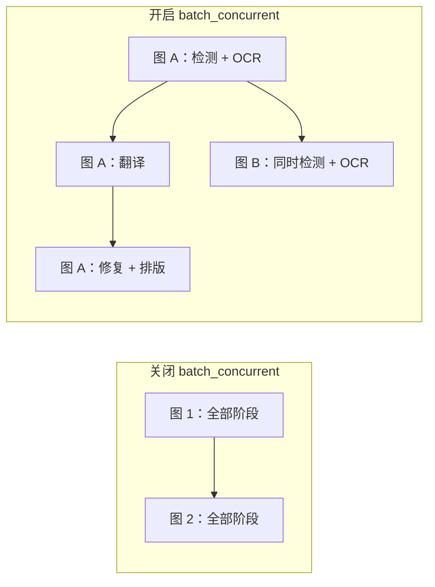
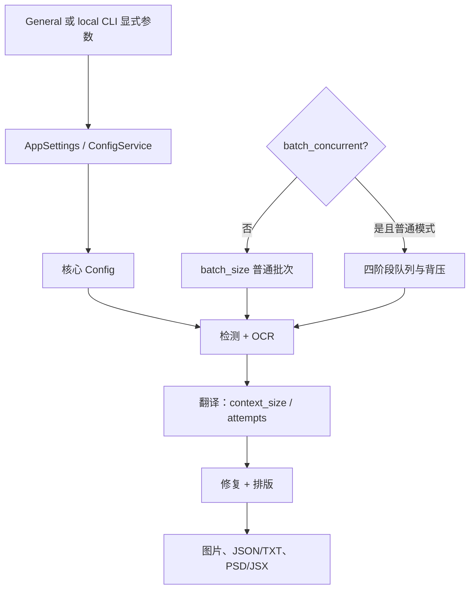

# CLI、批量与输出

内容包括 General 设置中 CLI、批量和输出字段，以及本地 `local` CLI 的显式覆盖；不覆盖 API 凭据、检测/OCR/翻译器/排版算法。配置文件和截图均须脱敏，不展示真实 key、token、用户名、私有绝对路径、用户图片或私有提示词。

## 这组设置控制什么 {#feature-boundary}

包含日志、错误隔离、GPU/ONNX、重试、翻译上下文、批次/流水线、格式/质量/覆盖、文本/JSON/TXT、原图目录、PSD/JSX、自定义 API 参数文件和翻译后模型清理。`context_size` 实际位于 Translation 页签；特殊工作流的按钮属于翻译工作区，这里仅说明其对批量的影响。

## 在桌面端修改 {#ui-operations}

打开“设置”并选择 General；数值是输入框，布尔项是开关，`format` 是下拉框。General 的布局来自 `settings_tab_layout.json` 的 `tab_custom_1`。修改会立即更新内存并合并写盘；导入配置/切换预设可能重建行。`use_custom_api_params` 旁的 `Edit` 是打开 JSON 的文件编辑动作，不是普通配置值。

本地 CLI 的正式入口来自 `manga_translator/args.py`：`python -m manga_translator local -i <脱敏输入> [-o <脱敏输出>]`。`-i/--input` 支持多个值；`--config`、`-v/--verbose`、`--overwrite`、`--use-gpu`、`--disable-onnx-gpu`、`--format`、`--batch-size`、`--attempts` 可覆盖配置，但**未传值不覆盖**。正式顶层子命令是 `local`、`web`、`ws`、`shared`；这里按 `local`。

## 参数

> 本页各参数的界面名称、存储键与默认值的对应关系，见[设置参数索引](../../reference/settings-index.md)。

#### 详细日志 {#cli-verbose}

“详细日志”开关位于“设置 → General”。Qt UI 启动时无论开关状态都会创建 `result/log_<时间戳>.txt`；开启后控制台会显示 DEBUG 级别信息，并为每张图片创建调试目录，保存输入图、检测/OCR、修复和渲染等调试缓存/中间文件。它不改变翻译结果，但额外文件可能很多并占用大量磁盘空间，建议仅在排查问题时开启。默认值：`false`。

#### 重试次数 {#cli-attempts}

“重试次数”是整数输入框。设置翻译请求失败后的重试次数，`-1` 表示无限重试。它只作用于翻译/API 请求层，不是检测、OCR 或渲染的通用重试，也不等同于高质量重试。默认值：`3`。

#### 忽略错误 {#cli-ignore-errors}

“忽略错误”开关开启后，单张图片处理失败会记录并继续处理其余图片；它不会把失败变成成功，也不会吞掉取消操作。默认值：`false`。

#### 使用 GPU {#cli-use-gpu}

“使用 GPU”开关决定模型加载与推理是否使用 GPU，需要匹配的驱动、Torch/CUDA 和显存；开启不代表每个实现都会使用 GPU。默认值：`true`。

#### 禁用 ONNX GPU 加速 {#cli-disable-onnx-gpu}

“禁用 ONNX GPU 加速”开关只强制 ONNX 会话走 CPU，不关闭 Torch 的 CUDA；可以绕开 provider 冲突，但速度会变慢。默认值：`false`。

#### 上下文页数 {#cli-context-size}

“上下文页数”位于 Translation 页签，是整数输入框。翻译时使用最近的非空历史页构建上下文，`0` 或负数关闭。详细说明见[上下文与提示词](../translator/context-and-prompts.md)。

#### 批量大小 {#cli-batch-size}

“批量大小”是整数输入框，控制每次翻译提交的图片数量、并发队列上限和内存峰值；它不等于同时运行的图片数，特殊模式可能强制为 1。默认值：`3`。

#### 并发批量处理 {#cli-batch-concurrent}

“并发批量处理”开关开启后，检测+OCR、翻译、修复和排版四个阶段通过队列流水线并行；它表示阶段级并行，不是所有图片同时请求 API。导入 TXT、仅翻译 JSON、导出原文/翻译、仅上色/超分/修复和替换翻译等特殊工作流会强制关闭并发。

这不是所有图片同时请求 API；队列和 batch size 提供背压，特殊工作流会禁用它。默认值：`false`。

#### 输出格式 {#cli-format}

“输出格式”是下拉框，位于“设置 → General”，决定保存图片时使用的扩展名。

- 不指定：保留原扩展名。
- `png`：PNG 格式。
- `jpg`/`jpeg`/`jfif`：JPEG 格式（需要 RGB 转换）。
- `webp`：WebP 格式，支持质量设置。
- `avif`：AVIF 格式，需要 Pillow 编解码支持。
- `bmp`：BMP 格式（需要 RGB 转换）。
- `tiff`/`tif`：TIFF 格式。
- `heic`/`heif`：HEIF 格式，需要编解码支持。

默认值：不指定。

#### 覆盖已存在文件 {#cli-overwrite}

“覆盖已存在文件”开关关闭时，跳过已经存在的图片输出，TXT/JSON 工作流也会检查对应文件；关闭后结果包含 skipped 项。默认值：`false`。

#### 跳过无文本图像 {#cli-skip-no-text}

“跳过无文本图像”开关开启后，检测/OCR 判定没有可翻译文本的图片会被跳过；这是正常分支，不属于“忽略错误”。默认值：`false`。

#### 图片可编辑 {#cli-save-text}

“图片可编辑”开关开启后，会导出包含区域、原文/译文、尺寸和渲染字段的 JSON 伴随数据；与“导出原文”组合时还会导出原文 TXT。默认值：`true`。

#### 图像保存质量 {#cli-save-quality}

“图像保存质量”是整数输入框，作用于图片、修复和编辑器保存；值越高通常文件越大，具体语义由编码器决定。默认值：`100`。

#### 输出到原图目录 {#cli-save-to-source-dir}

“输出到原图目录”开关开启后，把结果写入原图旁的 `manga_translator_work/result`；关闭时使用输出目录并尽量保留相对结构。目录必须可写。默认值：`false`。

#### 导出可编辑PSD {#cli-export-editable-psd}

“导出可编辑PSD”开关开启后，最终阶段生成 Photoshop PSD/JSX；执行脚本需要 Photoshop，不能当作普通图片格式。默认值：`false`。

#### 仅生成PSD脚本 {#cli-psd-script-only}

“仅生成PSD脚本”开关开启后，只生成 JSX 脚本而不执行 Photoshop；脚本可能包含路径，不要直接分享。默认值：`false`。

#### 使用自定义API参数 {#use-custom-api-params}

“使用自定义API参数”开关开启后，读取 `config/custom_api_params.json` 为请求附加参数；旁边的 `Edit` 按钮打开该 JSON 文件。详细说明见[自定义请求参数](../api-management/custom-request-parameters.md)。

#### 翻译完成后卸载模型 {#app-unload-models-after-translation}

“翻译完成后卸载模型”开关开启后，桌面端在任务完成后主动卸载模型，降低常驻内存，但会增加下次任务的加载时间。默认值：`false`。

## 参数如何生效 {#runtime-behavior}

UI/配置文件进入 `AppSettings`/ConfigService，再进入内存配置、核心 `Config`、`MangaTranslator` 和导出消费者。`local` 在 `mode/local.py` 只把显式 CLI 值覆盖到 `cli`；桌面 `app_logic.py` 另外构造 `save_info`（输出目录、格式、覆盖和原图目录）。

`batch_size` 是翻译批量和并发翻译队列上限；`batch_concurrent` 是阶段流水线并行，不是 API 并发数。导入 TXT、JSON-only、导出原文/翻译、仅上色/超分/修复和替换翻译会关闭并发，以保证顺序与逐图文件回写。`context_size` 使用最近非空历史页构建消息；`attempts`、HQ 质量重试和 API 候选轮换是不同层次；取消不属于可忽略错误。

## 搭配使用时的注意事项 {#dependencies-and-conflicts}

GPU 后端需匹配驱动、Torch/CUDA/ONNX provider。增大批次、开启并发、增加上下文或输出高质量会增加资源/token/磁盘压力；OOM 应降低批量或关闭并发。关闭覆盖会跳过图片/TXT/JSON；模板和 JSON-only 依赖同名工作目录文件。PSD 执行依赖 Photoshop，JSX/JSON/TXT 可能泄露路径和文本，外发前清理。格式编码依赖 Pillow 及平台编解码器。
