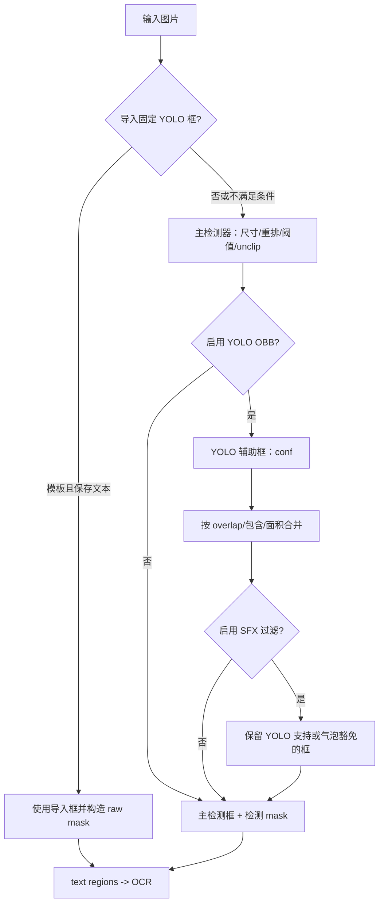
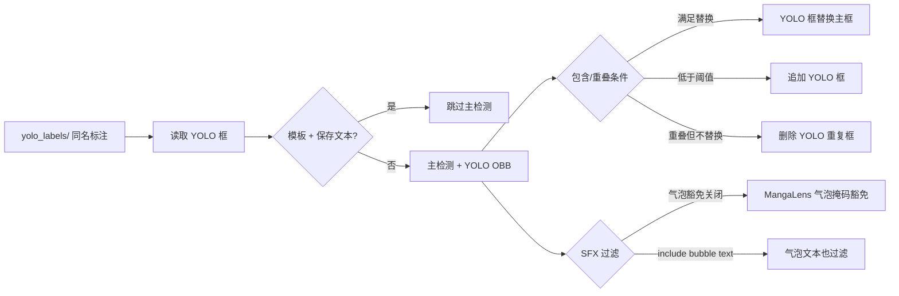

# 检测

检测页负责把输入图像转换为文本区域、检测蒙版和可供 OCR 使用的检测结果；OCR、文本行合并、蒙版细化和修复分别由其他设置页负责。这里仅记录 Detection 页签中的控件、检测阶段行为和它实际读写的标注/调试文件。

## 在桌面端修改

在桌面端打开“设置”，选择“Detection”页签（布局定义中的页签标题未经过翻译）。基础项位于页签顶部，`Advanced` 分隔线以下是尺寸、阈值和 YOLO 参数。动态设置页按当前配置类型创建下拉框、开关或数值输入框；编辑结束或切换开关后，配置服务更新内存配置并合并写入配置文件。

数值输入在失去焦点时提交；非法数值不会成为有效的核心配置。Detection 页的参数行名称由 `app_logic.py` 通过上述 `label_*` key 映射，不能把配置键或环境变量名当作界面标签。

## 参数

> 本页各参数的界面名称、存储键与默认值的对应关系，见[设置参数索引](../../reference/settings-index.md)。

#### 文本检测器 {#detector-detector-parameter}

“文本检测器”下拉框位于“设置 → Detection”，选择检测文本区域的主检测器。

- `default`：默认检测器。
- `dbconvnext`：DBNet 变体检测器。
- `ctd`：面向漫画文本的检测器。
- `craft`：通用文本检测器（不推荐用于漫画）。
- `none`：不运行检测器，返回空检测结果。

默认值：`default`。

#### 检测大小 {#detector-detection-size}

“检测大小”是整数输入框，决定检测器缩放图像使用的尺寸。值越大通常保留更多小字细节，但计算和显存开销也越大；过大可能导致显存不足。默认值：`2048`。

#### 长图重排最低有效短边 {#detector-rearrange-short-side}

“长图重排最低有效短边”是整数输入框。长图被重排/切块检测时，该值约束保留的最低有效短边分辨率；提高它可以保留更清晰的文字，代价是更多计算和显存。默认值：`341`。

#### 文本阈值 {#detector-text-threshold}

“文本阈值”是浮点输入框。文本置信度阈值越高，候选越严格、漏检可能增加；降低会保留更多弱候选，也可能增加误检。它与“边界框生成阈值”分别作用于文本响应和框生成。默认值：`0.5`。

#### 边界框生成阈值 {#detector-box-threshold}

“边界框生成阈值”是浮点输入框。它控制候选响应转为文本框的置信度门槛；较低值通常保留更多框，较高值更严格。阈值过低会把噪声交给 OCR。默认值：`0.5`。

#### Unclip比例 {#detector-unclip-ratio}

“Unclip比例”是浮点输入框。它控制从文本骨架扩张为文本框的程度；值越大框通常越大，可能包含更多背景或相邻文本。默认值：`2.5`。

#### 导入固定YOLO框 {#detector-import-yolo-labels}

“导入固定YOLO框”开关开启后，按图片同名关系从 `manga_translator_work/yolo_labels/` 读取标注；模板且保存文本的流程可跳过主检测直接使用导入框，普通流程则用导入框替换检测框。标签文件必须匹配图片名称和约定格式。默认值：`false`。

#### 启用YOLO辅助检测 {#detector-use-yolo-obb}

“启用YOLO辅助检测”开关开启后，先运行主检测器，再运行 YOLO 有向边界框检测；重叠/包含关系决定框的替换、删除或追加，辅助检测失败时回退主检测结果。需要 YOLO 模型；“导入翻译”流程会强制关闭它。默认值：`true`。

#### YOLO置信度阈值 {#detector-yolo-obb-conf}

“YOLO置信度阈值”是浮点输入框。YOLO 辅助检测用它作为文本置信度门槛；提高会减少弱 YOLO 框，降低会增加候选和合并负担。它不替代主检测器的“文本阈值”。默认值：`0.4`。

#### YOLO辅助检测重叠率删除阈值 {#detector-yolo-obb-overlap-threshold}

“YOLO辅助检测重叠率删除阈值”是浮点输入框。它决定 YOLO 框与主检测框合并时的重叠判定；达到阈值的重叠框按包含、面积等条件替换或删除，低于阈值的 YOLO 框可追加。默认值：`0.1`。

#### 拟声词过滤 {#detector-use-sfx-filter}

“拟声词过滤”不会过滤气泡内文本：气泡内文本默认由气泡掩码保护，只有开启“气泡文本参与拟声词过滤”才会纳入过滤。开关开启后，过滤既未被 YOLO `other` 框完整包裹、也未与非 `other` YOLO 框达到重叠阈值的主检测框；它依赖“启用YOLO辅助检测”。默认值：`false`。

#### 气泡文本参与拟声词过滤 {#detector-sfx-filter-include-bubble-text}

“气泡文本参与拟声词过滤”开关关闭时，未获 YOLO 支持的气泡内文本由气泡掩码保护；开启后跳过该豁免，气泡内文本也进入过滤。开启可能误删气泡对白。默认值：`false`。

#### 最小检测框面积占比 {#detector-min-box-area-ratio}

“最小检测框面积占比”是浮点输入框。面积比例按检测框面积相对整张图片像素计算；大于 0 时过滤面积小于等于阈值的框，设为 `0` 可关闭该过滤。阈值过高会丢失小字。默认值：`0`。

## 参数如何生效

### 检测分支与输出 {#detection-flow}

长图重排会在检测预处理阶段切块并回映坐标；它可能增加检测时间、内存和显存。`mask_raw` 在这里指检测器返回或由导入框构造的原始蒙版，后续 OCR/蒙版细化是否使用它由后续阶段决定。

### 导入标签与混合检测 {#yolo-merge-flow}

图示只表达源码中已确认的分支；它不是每种模式的完整工作流图。

## 搭配使用时的注意事项

- 主检测器离线模型必须能在所选设备加载；GPU/ONNX 后端问题会影响检测阶段，但这里不记录硬件安装教程。
- YOLO OBB 和 SFX 过滤需要辅助 YOLO 模型；没有辅助结果时主检测器结果仍作为回退。
- `load_text` 会关闭 YOLO OBB；导入 YOLO 标签在模板/保存文本条件下可跳过主检测，普通流程则替换检测框并尽量保留 raw mask。
- `text_threshold`、`box_threshold`、`unclip_ratio` 和面积比例是不同后处理层，不能互相替代。阈值过宽会把噪声交给 OCR，阈值过严会漏检。
- 长图重排、较大检测尺寸和 YOLO 辅助检测会增加资源消耗；OOM 或模型缺失时应降低尺寸/关闭辅助项，而不是共享真实运行凭据。
