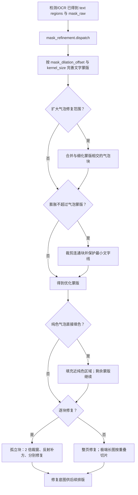

# 蒙版与图像修复

本页对应设置中的“修复”分组：它决定如何把检测和 OCR 已形成的文字区域变成修复蒙版，并如何清除该蒙版内的原文。这里不改变检测器、OCR 识别或文本筛选结果，也不说明译文排版、字体或 AI 渲染器；这些内容分别属于“检测”“OCR、过滤与文本行合并”和“排版与渲染”页面。

## 在桌面端修改 {#ui-operations}

打开“设置”，选择“修复”页签。布局依次显示修复器、蒙版膨胀、两个气泡范围开关、纯色填充和逐块修复；“高级”分隔线后是尺寸、精度、卷积核和 PyTorch 强制开关。动态设置行使用开关、整数输入框或下拉框：修改后会立即更新内存中的 `AppSettings`，由配置服务在 250 ms 合并写入配置文件。数值没有“应用”按钮；实际在下一次进入蒙版细化或修复阶段时读取。

气泡相关的两个存储键在 `ocr` 配置段，但界面有意将它们放在“修复”页，因为它们只作用于修复前的蒙版，不会重新识别或过滤 OCR 文字。开关依赖 MangaLens 气泡检测结果；未取到缓存或检测失败时，代码记录警告并保留原细化蒙版。

## 参数

> 本页各参数的界面名称、存储键与默认值的对应关系，见[设置参数索引](../../reference/settings-index.md)。

### 修复模型

“修复模型”下拉框位于“设置 → 修复”页签，决定清除文字蒙版内的原文时使用哪种修复方式。

- `default`：默认修复方式。
- `lama_large`：质量最佳并推荐。
- `lama_mpe`：速度较快。
- `flux2-klein`：使用 FLUX.2 Klein 4B 图像修复模型，质量较高，但需要较多显存并且速度较慢；首次使用会下载约数 GB 的模型文件。
- `sd`：可选修复方式。
- `none`：不运行模型，将蒙版区域填为白色。
- `original`：返回原图，保留原文。

默认值：`lama_large`。

### 遮罩扩张偏移与卷积核大小 {#dilation-and-kernel}

“遮罩扩张偏移”和“卷积核大小”都是整数输入框，位于“设置 → 修复”页签。

- 遮罩扩张偏移：控制文字蒙版向外扩张多少，以覆盖抗锯齿和残留笔画；值越大覆盖范围越宽，`0` 表示不额外外扩。
- 卷积核大小：控制蒙版细化时清理蒙版的卷积核大小。

默认值：遮罩扩张偏移 `50`；卷积核大小 `3`。

### 膨胀不超过气泡蒙版与扩大气泡修复范围 {#bubble-range}

这两个开关位于“设置 → 修复”页签，都依赖气泡检测结果；未检测到气泡时保持原蒙版。

- 膨胀不超过气泡蒙版：开启后，把细化蒙版限制在检测到的气泡范围内；相交的连通块只保留与气泡相交的部分，避免蒙版溢出到线稿或图案。
- 扩大气泡修复范围：开启后，把与细化蒙版相交的气泡连通块并入蒙版，可能扩大修复区域。

默认值：膨胀不超过气泡蒙版 `true`；扩大气泡修复范围 `false`。

### 纯色气泡直接填色

开启后，先用气泡蒙版识别与文本区域匹配的近似纯色气泡，再仅在“修复蒙版 ∩ 气泡蒙版”范围内填充背景中位色；填色区域会从待修复蒙版中移除，不再交给修复模型。气泡检测失败或交集为空时跳过此优化。默认值：`false`。

### 逐块修复

开启后，把优化后的蒙版拆成孤立连通块分别修复；单块上下文较小、资源占用更低，但复杂背景可能变差。关闭时整页一次送入模型。默认值：`false`。

### 修复大小与修复精度 {#size-and-precision}

“修复大小”和“修复精度”位于“高级”分隔线之后。

- 修复大小：决定每次修复的输入尺寸；越大通常质量越好但更慢，过大可能导致内存不足。
- 修复精度：可选 `fp32`（最准确、最慢）、`fp16`（平衡选项）、`bf16`（推荐选项）。

默认值：修复大小 `2048`；修复精度 `fp32`。

### 强制使用PyTorch修复 {#force-torch}

开启后，强制离线修复模型使用 PyTorch 后端加载；CPU 默认优先使用 ONNX，遇到 ONNX 问题时可以开启此项。默认值：`false`。

## 参数如何生效 {#runtime}

主流程以 `ctx.mask_raw`、文本区域和全局参数调用蒙版细化，得到 `ctx.mask` 后调用修复分发。若没有文本区域或蒙版为空，修复阶段跳过并保留原始工作图。若细化抛错，仅修复路径采用简单膨胀作为回退；修复异常是否继续由通用 `cli.ignore_errors` 控制。AI 渲染器被选中时，主流程明确跳过修复，后续渲染使用原图，这一渲染器边界不改变本页参数的存储值。

## 搭配使用时的注意事项 {#dependencies}

- 蒙版细化以前置的文字区域和原始蒙版为输入；没有文本区域时本页开关没有可处理对象。
- 两个气泡范围开关依赖 MangaLens 结果；缓存未命中、无检测或异常时保留细化蒙版。它们不应被描述为 OCR 重新检测或 OCR 过滤。
- 大尺寸、高精度和完整页修复会增加内存/显存压力；极端长图会按长边切成带重叠的块后拼接。
- 逐块修复以更少上下文换取小裁窗；它与“极端长图切片”不是同一个功能。
- `none` 白填、`original` 保留原图、AI 渲染器跳过修复三者结果不同；不要互相替代。
