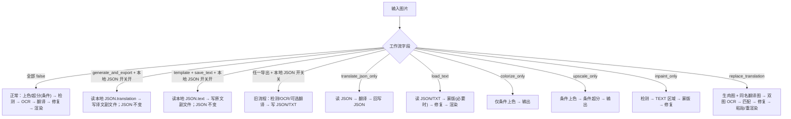
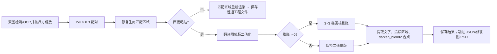

# 模式专用工作流与模板对齐

内容包括翻译页的九种工作流，以及“设置 → 模式相关 → 替换翻译”中的模板对齐参数。它不重复超分/上色字段（见[超分与上色](./upscale-and-colorization.md)）或各阶段通用参数。工作流是 `cli` 分支；模板对齐是 `render` 分支。GUI 选择模式时八个工作流标志先全部清零，因此一次选择只有一个模式；手工叠加多个标志不属于稳定契约。

## 在桌面端修改

在翻译页“翻译流程模式：”下拉框选择模式。切换立即保存配置并刷新说明和开始按钮；已有输出是否跳过仍由“覆盖已存在文件”决定。替换翻译还要求同名配对图。

“启用直接粘贴模式”和“粘贴模式蒙版膨胀大小”位于“设置 → 模式相关 → 替换翻译”。前者是开关，后者为整数；`0` 禁用膨胀。

## 九种工作流与边界

阶段通常为：上色（条件）→ 超分（条件）→ 检测 → OCR → 文本行合并 → 翻译 → 蒙版细化 → 修复 → 排版/渲染。

| UI 模式 | 输入与发现 | 输出 | 阶段、跳过和冲突 |
| --- | --- | --- | --- |
| 正常翻译 | 主图片 | 主图；`save_text=true` 时 JSON，可能有修复图/编辑器底图 | 完整主链；唯一可进入 `batch_concurrent` |
| 导出翻译 | 默认读取主图；开启“仅从本地 JSON 导出文本”后读取已有工程 JSON | 默认沿用检测/OCR/翻译并写 JSON 与译文副文件；开启开关后只写 `<stem>_translated.<format>`，工程 JSON 原样保留 | 开关开启时跳过图片读取、检测、OCR、API 翻译和 JSON 回写；禁用并发 |
| 导出原文 | 默认读取主图和模板；开启“仅从本地 JSON 导出文本”后读取已有工程 JSON | 默认沿用检测/OCR与 JSON 写入；开启开关后只写 `<stem>_original.<format>`，工程 JSON 原样保留 | 开关开启时跳过图片读取、检测、OCR 和 JSON 回写；禁用并发 |
| 仅翻译（JSON） | 已有工程 JSON | 回写 JSON，成功后删除原文副文件 | 只读 JSON 翻译；跳过图像阶段；禁用并发 |
| 导入翻译并渲染 | JSON 及同名原文/译文 TXT | 主图、更新 JSON，必要时修复图 | 导入→蒙版（必要时）→修复→渲染；跳过检测/OCR/翻译；禁用并发 |
| 仅上色 | 主图 | 主图，条件性编辑器底图 | 仅条件上色；跳过超分和文字链；禁用并发 |
| 仅超分 | 主图 | 主图，条件性编辑器底图 | 条件上色→条件超分；跳过文字链；不会自动关闭已选上色器；禁用并发 |
| 仅修复 | 主图和检测器 | 主图 | 条件预处理→检测→字面量 `TEXT` 区域→合并→蒙版→修复；跳过 OCR/翻译/渲染；禁用并发 |
| 替换翻译 | 生肉图；`manga_translator_work/translated_images/<stem><ext>` 同名翻译图 | 主图；普通重渲染可写 JSON/修复图 | 双图检测/OCR/合并→按缩放区域 IoU `0.3` 匹配→修复→粘贴或重渲染；不调用翻译；禁用并发 |

模板 `output_format` 缺失或非法时回退 `json`；同名 JSON 新位置优先，兼容图片同级旧位置。仅超分不会自动禁用上色器，导出原文还需要 `save_text=true`。

## 参数

> 本页各参数的界面名称、存储键与默认值的对应关系，见[设置参数索引](../../reference/settings-index.md)。

#### 仅从本地 JSON 导出文本 {#cli-export-from-local-json}

位于“设置 → 模式相关 → 文本导出”。开关默认关闭，同时控制“导出翻译”和“导出原文”。开启后，程序只读取每张图片已有的 `manga_translator_work/json/<stem>_translations.json`，按模板分别导出 `translation` 或 `text` 字段；不打开图片、不执行检测或 OCR、不调用翻译 API，也不回写工程 JSON，因此不会覆盖用户编辑好的译文。找不到工程 JSON 时该图片明确失败，不会自动回退 OCR。关闭时沿用原来的图片检测/OCR（导出翻译还会调用翻译器）流程。默认值：`false`。

#### 导出翻译 {#cli-generate-and-export}

在“翻译流程模式：”下拉框选择“导出翻译”后，默认沿用旧流程：读取主图，执行检测、OCR 与翻译，写入 JSON 和译文副文件。开启“仅从本地 JSON 导出文本”后，改为从已有工程 JSON 只读导出 `<stem>_translated.<format>`，不修改 JSON，也不调用 OCR 或翻译 API。默认值：`false`（工作流未启用，默认使用“正常翻译”）。

#### 导出原文 {#cli-template}

选择“导出原文”后，默认从主图检测和 OCR，并要求同时开启“图片可编辑”。开启“仅从本地 JSON 导出文本”后，改为从已有工程 JSON 只读导出 `<stem>_original.<format>`，不修改 JSON，也不执行检测或 OCR。默认值：`false`（工作流未启用，默认使用“正常翻译”）。

#### 仅翻译（JSON） {#cli-translate-json-only}

选择“仅翻译（JSON）”后，读取已有工程 JSON 进行翻译并回写，成功后删除原文副文件；不处理图像。需要兼容的 JSON 文件；是否回写不受“图片可编辑”控制。默认值：`false`（未启用，默认使用“正常翻译”）。

#### 导入翻译并渲染 {#cli-load-text}

选择“导入翻译并渲染”后，读取 JSON 和同名原文/译文 TXT：有精炼蒙版则复用，否则细化蒙版后修复并渲染；跳过检测、OCR 和翻译。缺少蒙版且启用 YOLO 导入时可能回退到检测。默认值：`false`（未启用，默认使用“正常翻译”）。

#### 仅上色 {#cli-colorize-only}

选择“仅上色”后，调用当前选定的上色模型并保存结果；跳过超分、检测、OCR、翻译、蒙版、修复和渲染。未选择上色器时原样输出。默认值：`false`（未启用，默认使用“正常翻译”）。

#### 仅超分 {#cli-upscale-only}

选择“仅超分”后，运行条件上色和条件超分并保存结果；跳过文字链。放大倍率来自“超分倍数”；倍率为“不使用”时不超分，已选上色模型仍可能先运行。默认值：`false`（未启用，默认使用“正常翻译”）。

#### 仅修复 {#cli-inpaint-only}

选择“仅修复”后，运行检测、蒙版细化和修复并保存结果；跳过 OCR、翻译和渲染。检测到的文字区域被当作待清除区域；没有区域或蒙版时返回未修复的图片。默认值：`false`（未启用，默认使用“正常翻译”）。

#### 替换翻译 {#cli-replace-translation}

选择“替换翻译”后，把翻译图的译文应用到生肉图的对应区域：双图检测/OCR、按缩放区域以 IoU `0.3` 匹配、修复后粘贴或重新渲染；不调用翻译服务。需要与生肉图同名的翻译图（位于 `manga_translator_work/translated_images/`）；直接粘贴时不写 JSON、修复图或 PSD。默认值：`false`（未启用，默认使用“正常翻译”）。

#### 启用直接粘贴模式 {#render-enable-template-alignment}

位于“设置 → 模式相关 → 替换翻译”。开启后，使用翻译图蒙版提取文字，清除修复后的生肉图对应区域并合成结果；关闭时由通用渲染器重新排版。仅替换翻译模式使用此开关；开启时跳过 JSON、修复图和 PSD 保存。默认值：`false`。

#### 粘贴模式蒙版膨胀大小 {#render-paste-mask-dilation-pixels}

位于“设置 → 模式相关 → 替换翻译”。整数输入框；正值按像素扩张粘贴用的蒙版，值越大覆盖范围越宽，`0` 或负数不扩张。默认值：`10`。

## 参数如何生效 {#workflow-branches}

### 直接粘贴与重新渲染 {#paste-branches}

`batch_size` 是非并发入口的批次大小；`batch_concurrent` 是跨图片并发开关。所有特殊模式均强制关闭并发，避免副文件顺序、上下文和失败隔离被破坏。

## 搭配使用时的注意事项

- 工作流字段由 GUI 互斥清理；手工叠加多个字段没有同时执行契约。
- `save_text` 是导出原文的必要条件；仅翻译（JSON）模式无条件回写 JSON。
- `colorizer` 和 `upscale_ratio` 不会被仅上色/仅超分自动改写；前置条件仍可能生效。
- 替换翻译需要同名翻译图；直接粘贴不是通用模板导入。
- 直接粘贴跳过 JSON、修复图和 PSD；普通重渲染依 `save_text` 保存工程文件。

## 翻译模板文件格式 {#translation-template-format}

- `config/translation_template.json` 是导出原文/译文时使用的文本模板文件（不是严格的 JSON 配置）。文件开头是配置行 `"output_format": "json"`，其后是包含 `<original>` 与 `<translated>` 占位符的条目行，例如 `"<original>": "<translated>"`。
- `output_format` 决定导出文件的扩展名：原文与译文分别保存为 `<stem>_original.<format>` 与 `<stem>_translated.<format>`，`json` 即导出为 JSON 文本文件；也允许 `txt` 等安全扩展名（字母、数字以及 `.`、`_`、`-`）。取值缺失或非法时回退为 `json`。
- “原文→译文”映射：导出时把每条条目行中的 `<original>` 替换为 OCR 识别出的原文、`<translated>` 替换为译文，每个文本区域输出一行，例如 `"原文": "译文"`。
- 默认行为：模板文件缺失或读取失败时扩展名回退为 `json`；应用启动时若模板文件不存在，会写入一份内置默认模板。
