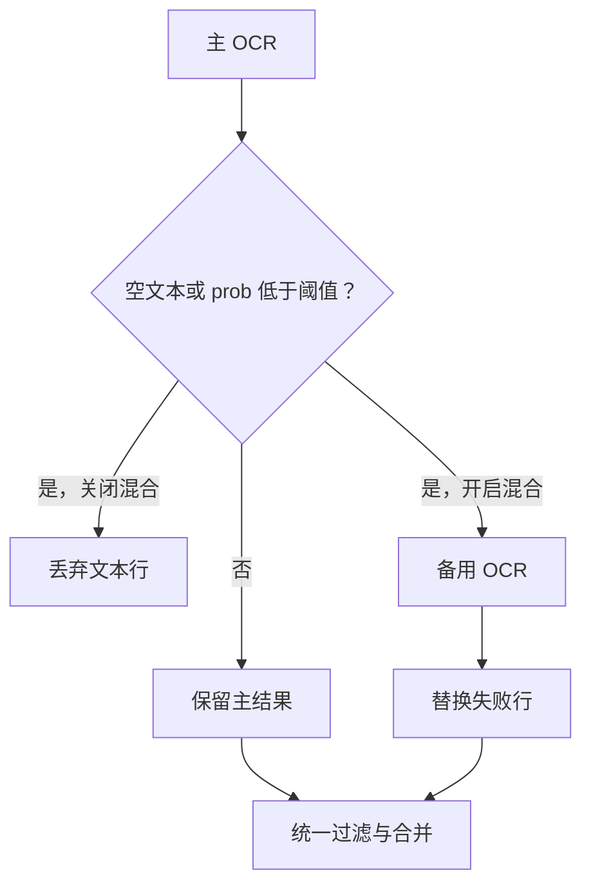
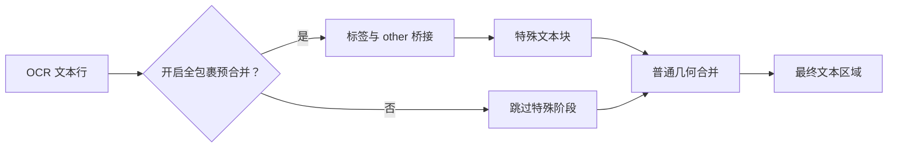
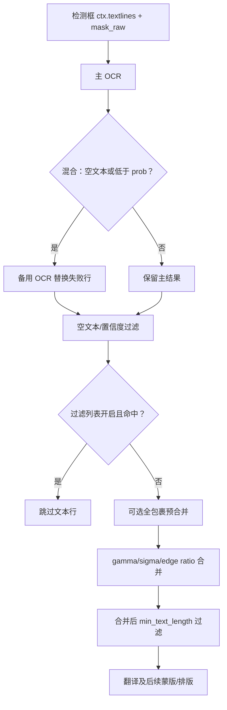

# OCR、过滤与文本行合并

本页对应设置中的 “OCR” 页签，覆盖检测框进入 OCR 后的识别、气泡/置信度筛选、过滤列表，以及文本行合并前后的约束。这里不负责检测器如何产生检测框（见 [Detection 设置](./detection.md)），也不负责翻译、修复或排版参数。

## 这组设置控制什么 {#feature-boundary}

处理顺序是：检测器产生 `ctx.textlines` 和 `mask_raw`，OCR 为每个框写入文本与概率，OCR 阶段过滤无效框，然后合并文本行成为文本区域；文本区域才会进入翻译。模型气泡修复选项虽然位于本页相关配置中，但最终消费者是蒙版细化，详细修复器行为属于 [Mask 与 Inpainting](./mask-and-inpainting.md)。

## 在桌面端修改 {#ui-operations}

1. 打开设置并选择 “OCR”。普通开关、数值框和下拉框直接编辑配置；“Advanced” 分隔线后的字段仍属于同一页，只是面向高级调参。
2. “OCR Model” 选择主 OCR；打开 “Enable Hybrid OCR” 后，低置信或空文本行会交给 “Secondary OCR”。选择 OCR 模型、混合开关或备用 OCR 时，桌面 API 管理区域会按实现刷新所需的 API 组。
3. “AI OCR Prompt” 是文件编辑动作，不是普通 `OcrConfig` 字段；它打开固定的 AI OCR 提示词文件编辑器。不要把提示词正文或凭据写入本文。
4. “PaddleOCR-VL Language Hint” 只在选择 `paddleocr_vl` 时有意义；“PaddleOCR-VL Custom Prompt (Override)” 非空时覆盖内置语言/提示模式。
5. “Edit Filter List” 打开过滤列表编辑器。结构化页有 “Contains Filter”（每行一条包含规则）和 “Exact Filter”（每行一条精确规则）；“Raw Edit” 可直接编辑 JSON。用 “Refresh” 重读、“Cancel” 放弃、“Save” 校验并保存。
6. 空白规则会被丢弃；Raw JSON 根必须是对象。结构化保存保留未知顶层字段；JSON 语法错误显示 “JSON format error” 且不会保存坏配置。

## 参数

> 本页各参数的界面名称、存储键与默认值的对应关系，见[设置参数索引](../../reference/settings-index.md)。

#### OCR 模型 {#ocr-ocr}

“OCR 模型”下拉框位于“设置 → OCR”，选择主 OCR 引擎。

- `32px`：离线 OCR（32px 模型）。
- `48px`：离线 OCR（48px 模型）。
- `48px CTC`：离线 OCR（48px CTC 模型）。
- `Manga OCR`：延迟加载的漫画专用 OCR。
- `PaddleOCR`：PaddleOCR 引擎。
- `PaddleOCR Korean`：韩文 OCR。
- `PaddleOCR Latin`：拉丁文字 OCR。
- `PaddleOCR Thai`：泰文 OCR。
- `PaddleOCR-VL`：VLM OCR 引擎。
- `OpenAI OCR`：需要对应 API 配置。
- `Gemini OCR`：需要对应 API 配置。

离线模型加载到所选设备，API 引擎需要对应 API 配置。默认值：`48px`。

#### 混合 OCR {#hybrid-ocr}

“启用混合 OCR”开关开启后，主 OCR 产生空文本或低于“文本区域最低概率”的行会交给“备用 OCR”替换；之后仍统一过滤和合并。备用模型/API 必须可用，并会增加加载、请求和延迟。默认值：启用混合 OCR `false`；备用 OCR `mocr`。

#### 文本区域最低概率 {#ocr-prob}

“文本区域最低概率”是可空的数值框。低于该概率的行会被丢弃或交给混合回退；它同时决定混合回退和 OCR 后逐行过滤，不是检测器的“文本阈值”。过高会增加回退并丢弃更多文本。默认值：`0.1`。

#### 忽略非气泡文本 {#ocr-ignore-bubble}

“忽略非气泡文本”是 0–1 浮点输入框，`0` 关闭。值越高越严格：OCR 引擎在识别前筛掉非气泡框。可与模型气泡过滤叠加，减少 OCR 输入但不细化蒙版。默认值：`0`。

#### 模型气泡过滤 {#model-bubble-filter}

“启用模型气泡过滤”开关与“模型气泡重叠阈值”数值框位于“设置 → OCR”。开启后，文本框与检测到的气泡框重叠达到阈值才保留，阈值越低越宽松；同一阈值还被纯气泡填充使用。默认值：启用模型气泡过滤 `false`；模型气泡重叠阈值 `0.1`。

#### 最小文本长度 {#ocr-min-text-length}

“最小文本长度”是整数输入框，`0` 表示不按长度删除。它在最终合并后的文本区域上检查文本长度，过短的行仍可参与合并；过大可能删除单字或拟声词。默认值：`0`。

#### 启用过滤列表 {#filter-text-enabled}

“启用过滤列表”开关带有“编辑过滤列表”按钮。开启后，先丢弃空文本和低置信行，再按大小写不敏感的精确/包含规则匹配过滤词；命中行不参与合并、翻译、修复或排版。默认值：`false`。

#### 合并容忍度 {#merge-tolerances}

“合并-距离容忍度”和“合并-离群容忍度”是浮点输入框。前者放宽相邻行距离相对字体大小的条件，后者放宽距离离群标准差条件；过高可能跨气泡过度合并。默认值：`0.8` 与 `2.5`。

#### 合并边缘距离比例阈值 {#merge-edge-ratio}

“合并-边缘距离比例阈值”是浮点输入框，`0` 表示禁用。启用且节点有多个邻居时，较长边与最近边的距离比超过阈值就断开较长边；过小会拆散文本，过大保护变弱。默认值：`0`。

#### 模型辅助合并 {#special-pre-merge}

“模型辅助合并”开关开启时，先按 strip/balloon 标签寻找完全包裹关系；`other` 框仅作桥接，不进入最终文本块，剩余框再走普通合并。关闭则跳过特殊阶段。默认值：`true`。

#### VL 与 AI OCR 参数 {#ocr-vl-and-ai}

- “PaddleOCR-VL 语言提示”：仅在选择 `paddleocr_vl` 时有意义，为 VL OCR 提供语言提示。默认值：`Japanese`。
- “PaddleOCR-VL 自定义提示词（优先）”：非空时覆盖内置语言/提示模式。
- “AI OCR 提示词”：固定提示词文件编辑动作，打开 AI OCR 提示词编辑器。
- “AI OCR 并发数”：限制 AI OCR 同时发出的 API 请求数；较高并发可能触发限流。默认值：`10`。
- AI OCR 自定义提示词：默认空。

OpenAI/Gemini OCR 需要对应 API 配置；这里不展示提示词或密钥。

## 参数如何生效 {#runtime}

OCR 后过滤在合并前，最小长度在合并后。AI OCR 的并发数只限制 OCR API 请求，不代表整条图片流水线并发。

## 搭配使用时的注意事项 {#dependencies}

- 离线 OCR 需要模型与设备后端；OpenAI/Gemini OCR 需要 API 管理页的凭据、地址和模型。
- 混合 OCR 与高 `prob` 会增加第二次推理/请求；过严气泡阈值会漏掉画外文字。
- 合并参数组合不当会造成跨气泡过度合并或碎片化；气泡修复交集和膨胀限制影响修复蒙版，不改变 OCR 文本。
- AI OCR 并发受 API 限流、配额、网络和内存约束。

## 过滤列表文件格式 {#filter-list-file-format}

- `config/filter_list.json` 是当前的过滤列表文件：UTF-8 JSON 根对象，含 `contains`（包含规则数组）与 `exact`（精确规则数组）两个字段，每个元素是一条规则；加载或保存时会去掉空白条目。
- `config/filter_list.txt` 是旧版逐行格式：每行一条规则，以 `#` 开头的行是注释，`[包含过滤]` / `[精确过滤]` 小节标题分别标记包含与精确规则。JSON 文件不存在时，应用首次加载会把 TXT 规则迁移写入 `config/filter_list.json`。
- 匹配方式：`exact` 规则要求 OCR 文本与规则完全相等；`contains` 规则要求规则文本出现在 OCR 文本中即可。规则与 OCR 文本均按大小写不敏感比较，且精确规则先于包含规则检查。
- 与开关的关系：只有“启用过滤列表”开启时规则才生效，关闭时忽略该文件内容。命中规则的文本区域会被跳过，不参与合并、翻译、修复或排版。
