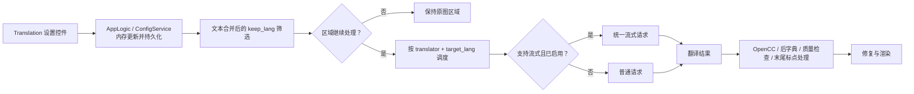

# 翻译设置

## 这组设置控制什么 {#feature-boundary}

此页只覆盖“翻译”设置页的 11 行：翻译器、目标/保留语言、流式传输、术语提取、RPM、上下文和可见的译后处理开关。它说明这些值怎样进入桌面配置和核心翻译阶段。

它不替代[翻译器选择与语言](../translator/selection-and-languages.md)的实现选择、[上下文与提示词](../translator/context-and-prompts.md)的提示词内容，或 API 管理页的密钥、模型、候选槽和轮换。`translator_chain`、`skip_lang`、高质量提示词路径及译后质量检查是核心/API 或 CLI 可接受的字段，但不是当前设置布局的行，故不把它们伪写成此页控件。

## 在桌面端修改 {#ui-operations}

打开“设置”，选择“翻译”。下拉框直接选择存储值；开关和数字编辑器改变后，`AppLogic.update_single_config()` 立即更新内存配置并写入配置文件。更改“翻译器”还会更新桌面翻译服务的当前实现，更改“目标语言”会更新其当前目标语言。其余行由后续任务实际读取完整配置时生效。

1. 选择“翻译器”和“目标语言”；需要仅继续处理某种识别源语言时设置“保留源语言”，否则选“不过滤”。
2. 为支持的 OpenAI/Gemini 实现选择是否“启用流式传输”；用“每分钟最大请求数”限制请求速率，`0` 表示不限速。
3. 只有配套高质量提示词资源可用时才启用“自动提取新术语”。“不跳过目标语言文本”会强制翻译看似已是目标语言的结果。
4. 按项目需要启用末尾标点移除或单向简繁转换；“上下文大小”位于同一页，但存储在 `cli.context_size`。

## 参数 {#parameters}

> 本页各参数的界面名称、存储键与默认值的对应关系，见[设置参数索引](../../reference/settings-index.md)。

#### 翻译器 {#translator-translator}

在“翻译器”下拉框选择翻译实现。选项：OpenAI、OpenAI高质量翻译、Google Gemini、Gemini高质量翻译、Sakura、“无”和“原文”。前四个需要对应 API 凭据；“无”不进行在线翻译，“原文”直接保留原文。默认值：`openai`。

详细说明见[翻译器选择与目标语言](../translator/selection-and-languages.md)。

#### 目标语言 {#translator-target-lang}

在“目标语言”下拉框选择译入语言。选项包括：简体中文、繁体中文、捷克语、荷兰语、英语、法语、德语、匈牙利语、意大利语、日语、韩语、波兰语、葡萄牙语（巴西）、罗马尼亚语、俄语、西班牙语、土耳其语、乌克兰语、越南语、阿拉伯语、塞尔维亚语、克罗地亚语、泰语、印度尼西亚语、菲律宾语（他加禄语）。默认值：`CHS`。

详细说明见[翻译器选择与目标语言](../translator/selection-and-languages.md)。

#### 保留源语言 {#translator-keep-lang}

在“保留源语言”下拉框选择是否过滤识别源语言：选择“不过滤”时所有识别区域都继续处理；选择具体语言后，只有识别为该语言的区域才会继续处理，其余区域不修复、不翻译、不渲染。默认值：`none`（不过滤）。

详细说明见[翻译器选择与目标语言](../translator/selection-and-languages.md)。

#### 启用流式传输 {#translator-enable-streaming}

开关。开启后，支持的 OpenAI/Gemini 实现使用流式传输；关闭时改用普通请求。默认值：`false`（关闭）。

详细说明见[术语表、流式传输与断句换行](../translator/glossary-stream-and-linebreak.md)。

#### 不跳过目标语言文本 {#translator-no-text-lang-skip}

开关。开启后，即使识别文本看起来已是目标语言也会强制翻译；关闭时与目标语言相同的文本可被保留。默认值：`false`（关闭）。

详细说明见[翻译器选择与目标语言](../translator/selection-and-languages.md)。

#### 自动提取新术语 {#translator-extract-glossary}

开关。仅当配套的高质量提示词资源可用时开启；开启后翻译请求会额外请求并解析新术语。默认值：`false`（关闭）。

详细说明见[术语表、流式传输与断句换行](../translator/glossary-stream-and-linebreak.md)。

#### 每分钟最大请求数 {#translator-max-requests-per-minute}

整数输入框，限制每分钟的翻译请求数；`0` 表示不限速。默认值：`0`。

详细说明见[重试、限流与翻译质量](../translator/retry-rate-limit-and-quality.md)。

#### 自动移除末尾句号逗号 {#translator-remove-trailing-period}

开关。开启后，仅在原文没有末尾标点时，移除译文末尾单个可移除的句号或逗号。默认值：`true`（开启）。

#### 上下文大小 {#cli-context-size}

整数输入框，指定翻译时使用的历史页数；`0` 表示不使用历史。开启后，会从当前页之前最近的非空已译页面取最多该数目的内容作为上下文。默认值：`3`。

详细说明见[上下文与提示词](../translator/context-and-prompts.md)。

#### 简体转繁体 / 繁体转简体 {#translator-chinese-conversion}

两个开关，在翻译完成后按需转换简繁：“简体转繁体”把简体结果转成繁体，“繁体转简体”把繁体结果转成简体；两者同时开启时优先执行简体转繁体。默认值：均关闭（`false`）。

## 参数如何生效 {#runtime-behavior}

`context_size` 在请求前额外把最近非空历史页组成独立消息；`extract_glossary` 只在自定义高质量提示词存在时请求额外术语结果。核心固定的译后流程还包含括号/引号处理、后置字典、可选的质量检查及本页末尾标点处理；其中质量检查字段没有列在本 UI 布局中。
