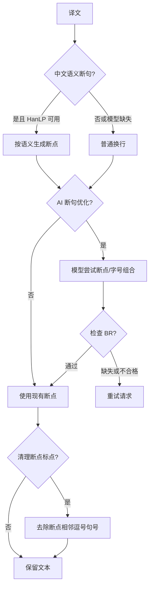
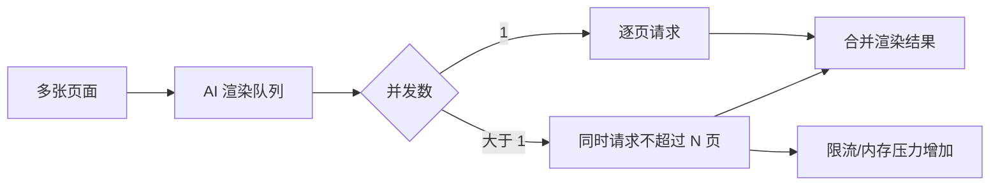
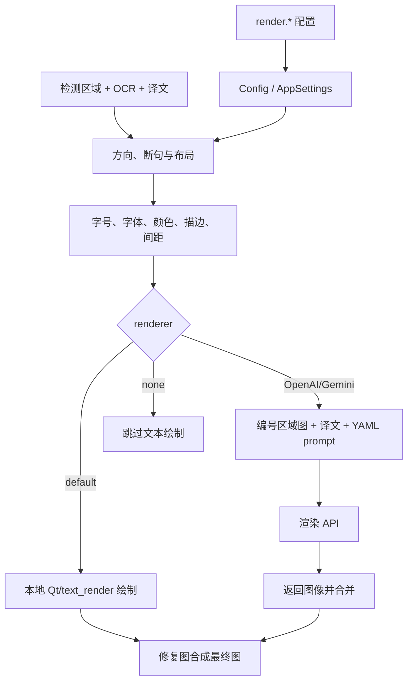

# 排版与渲染

内容包括设置页签“排版”中的 `render.*` 参数，以及“模式相关”中的直接粘贴参数。它们决定译文在文本区域中的断句、字号、方向、颜色、描边和最终绘制方式；检测、OCR、翻译内容本身和图像修复分别见对应设置页。这里不记录 API 凭据，只说明 AI 渲染如何消费已配置的渲染 API。

## 在设置页操作

打开“设置”→“排版”。动态设置行左侧显示字段标签，右侧是下拉框、复选框、数字/文本输入或“编辑”文件编辑动作；右侧说明面板显示当前字段的描述。修改后立即更新内存配置，`render.*` 变化会发出渲染设置变更信号，让编辑器刷新；配置服务随后写入配置文件。选择 `openai_renderer` 或 `gemini_renderer` 时，开始翻译前必须在 API 管理中配置对应功能的候选连接。

“字体”下拉框同时枚举操作系统字体和项目 `fonts/` 目录中的 `.ttf`、`.otf`、`.ttc` 文件。将字体文件放入该目录后重新打开下拉框刷新。开启“禁止使用系统字体库”后，字体下拉框只保留项目 `fonts/` 目录中的字体。AI 渲染提示词是文件编辑动作：点击“编辑”直接编辑固定 YAML 文件，不应当把路径当成普通渲染枚举值。

## 参数逐项说明

> 本页各参数的界面名称、存储键与默认值的对应关系，见[设置参数索引](../../reference/settings-index.md)。

#### 渲染器

在“渲染器”下拉框选择文本绘制方式。选项：Default（本地绘制）、OpenAI Renderer、Gemini Renderer、不翻译（跳过文本渲染）。选择 OpenAI Renderer 或 Gemini Renderer 前，需在 API 管理中配置对应的渲染凭据。默认值：`default`。

#### 字体

在“字体”下拉框选择字体，选项来自操作系统字体和项目 `fonts/` 目录下的 `.ttf`、`.otf`、`.ttc` 文件；放入新字体后重新打开下拉框刷新。默认值：`Microsoft YaHei UI`。在编辑器属性面板的“样式设置 → 字体”列表上悬停会临时刷新文本框预览，点击后才提交字体选择，离开列表则恢复当前字体。

#### 禁止使用系统字体库

开启后，排版设置和编辑器字体列表只显示项目 `fonts/` 目录中注册的字体，不再列出操作系统安装的字体。默认值：关闭（`false`）。已有配置中的系统字体会保留为当前值，便于迁移；切换到其他字体时只能选择项目字体。

#### 对齐方式

在“对齐方式”下拉框选择横排文本的水平对齐：自动（按区域与方向推断）、左对齐、居中、右对齐。默认值：`auto`。

#### 文本方向

在“文本方向”下拉框选择排版方向：自动（按区域/语言判断）、横排、竖排。默认值：`auto`。

#### 排版模式

在“排版模式”下拉框选择文本框适配算法：智能缩放（在可读性与区域适配间缩放）、严格边界（不越过区域边界）、智能气泡（按气泡形状填充）。默认值：`balloon_fill`。

#### 字体颜色

在“字体颜色”输入框填写颜色：留空为自动（使用检测到的区域颜色），`RRGGBB` 指定前景色，`RRGGBB:RRGGBB` 指定前景色和背景色。默认值：留空（自动）。

#### 描边

“描边宽度比例”输入 0.0–1.0 的描边比例，`0` 关闭描边；“禁用字体边框”开关可直接关闭边框，并优先于比例。默认值：比例 `0.07`，开关关闭。

#### 字号

“字体大小”、“字体大小偏移量”、“最小字体大小”、“最大字体大小”和“字体缩放比例”共同决定字号。字体大小留空时使用自动测量，偏移量在自动字号基础上增减，最小/最大值限制范围（`0` 表示无上限），缩放比例是自动布局前的整体倍率。默认值：字体大小留空（自动）、偏移量 `0`、最小值 `0`、最大值 `0`（无上限）、缩放比例 `1.0`。

#### 行距与字距

“行间距”和“字间距”输入 0.1–5.0 的倍率，留空时回退渲染器默认。默认值：`1.0`。

#### 断句

“中文语义断句”、“AI 断句”、“AI断句自动扩大文字”、“自动扩大文字时不扩展文本框”、“AI 断句检查”、“去除换行符周围逗号句号”和“禁用连字符”七个开关控制断句行为：语义断句需要本地模型，模型缺失时回退普通换行；AI 断句相关选项需要支持的 OpenAI/Gemini 翻译器。默认值：全部关闭。

#### 大小写

“大写”和“小写”开关在绘制前转换文本大小写；两者不应同时开启。默认值：关闭。

#### 气泡布局

“根据气泡排版(强制横排)”对所有语言启用气泡形状布局并强制横排；“气泡内居中”将文本块在气泡内居中。默认值：关闭。

#### 从右到左

开启后，阿拉伯语、希伯来语等文本按从右到左顺序处理。默认值：开启（`true`）。

#### AI 渲染提示词

点击“AI 渲染提示词”行的编辑动作直接编辑固定 YAML 提示词文件；它不是普通枚举值。默认值：由应用解析提示词路径。

#### AI 渲染并发数

输入同时进行的 AI 渲染请求数：`1` 为逐页串行，值越大吞吐越高，但网络、API 限流和显存/内存压力也越大。默认值：`1`。

#### 直接粘贴

“启用直接粘贴模式”开关和“粘贴模式蒙版膨胀像素”整数输入只影响替换翻译工作流：开启后按坐标匹配把翻译图区域粘贴到原图，膨胀值在粘贴前扩展蒙版，`0` 禁用。默认值：开关关闭，膨胀 `10`。

## 运行机理：从配置到最终图像

普通路径在已有检测框、OCR 文本、译文和修复图上执行：方向/语言决定布局轴，断句策略产生行边界，字号和布局模式在区域约束内测量，字体、颜色、字距、行距和描边进入 text renderer，最后把绘制层合成到输出图。AI renderer 则将编号区域图像与译文放入固定 YAML 请求，由 provider 返回渲染图，再按区域/页面合并。`renderer=none` 不绘制译文。

配置更新通过 `ConfigService` 写入配置 JSON；运行时核心配置再传入处理流水线。用户配置、Qt 默认、发行示例和核心兜底必须区分；CLI 显式参数可以覆盖运行时值。涉及 API 的 renderer 还要经过 API 管理的 feature/provider 选择和候选解析，候选轮换不改变 `render.renderer`。

## 依赖、冲突与资源影响

- `openai_renderer` / `gemini_renderer`：需要对应 API 配置、网络和有效模型；并发数越高越容易触发速率限制。
- `semantic_linebreak`：需要本地 HanLP 模型；缺失时应回退普通换行。
- `optimize_line_breaks`、`check_br_and_retry`：需要支持的 OpenAI/Gemini 翻译器；检查重试必须设置可控条件，防止循环。
- 字体：系统字体与项目字体的字形覆盖、许可证和 fallback 会影响最终像素；发行配置中的字体名仅作示例。
- 固定字号、严格边界、最大/最小字号、禁用自动换行和强制横排可能互相收紧可用布局，导致缩小、溢出或裁切。
- `ai_renderer_concurrency`、大字号和复杂区域增加 CPU、内存、显存或网络占用；取消任务时不应分享中间请求或用户图像。
