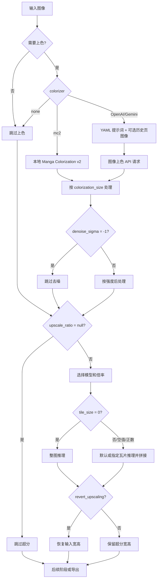

# 超分与上色

## 这组设置控制什么

内容包括“模式相关”页签中的“超分”与“上色”两组设置：图像超分、输出尺寸恢复、离线上色、AI 上色提示词和历史页图像上下文。这里不替代 [模式专用设置](./mode-specific.md) 的九种工作流矩阵，也不展开翻译、检测、OCR、修复或排版参数。超分改变像素尺寸；上色改变颜色信息；两者都不会自动启用检测、OCR、翻译或排版。

## 在桌面端修改

打开“设置”，选择“模式相关”中的“超分”或“上色”。布局文件决定行顺序，动态设置页按字段类型创建下拉框、开关或数值框。编辑完成后内存配置立即更新，并由配置服务合并写入 `config/config.json`；数值框失焦时提交，非法输入不会成为有效配置。

### 超分操作

1. 在“超分模型”选择 Waifu2x、ESRGAN、4x UltraSharp、Real-CUGAN 或 MangaJaNai。
2. 在“超分倍数”选择“不使用”或当前模型提供的倍率。Real-CUGAN 的选择同时写入其内部模型字段。
3. 在“分块大小(0=不分割)”输入瓦片边长；`0` 关闭分块，空值使用运行时默认 400。
4. 需要超分后仍输出原始宽高时启用“还原超分”。这不会跳过超分，只恢复最终尺寸。

### 上色操作

1. 在“上色模型”选择“不使用”、Manga Colorization v2、OpenAI Colorizer 或 Gemini Colorizer。
2. 选择 AI 上色器后，API 管理页会显示对应的上色凭据组；必须准备有效配置，否则 UI 可能阻止启动或请求失败。
3. 点击“AI 上色提示词”的编辑动作修改固定 YAML 文件。它是资源编辑器，不是普通 JSON 配置字段。
4. 调整“上色大小”和“降噪强度”；AI 上色可用“AI 上色历史页数”附加已完成上色的前置页面图像，`0` 关闭。

“仅上色”显示“开始上色”，“仅超分”显示“开始超分”；两种流程都跳过检测、OCR、翻译和排版。其余九种流程的强制覆盖和输入输出归属模式专用页。

## 参数与运行机理

> 本页各参数的界面名称、存储键与默认值的对应关系，见[设置参数索引](../../reference/settings-index.md)。

#### 超分模型 {#upscale-upscaler}

“超分模型”是下拉框，位于“设置 → 模式相关 → 超分”，选择用于图像超分的离线模型：Waifu2x、ESRGAN、4x UltraSharp、Real-CUGAN 或 MangaJaNai。实际是否运行超分及放大倍数由“超分倍数”决定；MangaJaNai 资源消耗最高。默认值：`mangajanai`。

#### 超分倍数 {#upscale-upscale-ratio}

“超分倍数”是随“超分模型”变化的下拉框，位于“设置 → 模式相关 → 超分”。选择“不使用”跳过超分，或选择当前模型提供的倍率：普通模型为 2、3、4；MangaJaNai 为 x2、x4、DAT2 x4；Real-CUGAN 提供完整模型档位（如 2x-conservative、2x-denoise3x），选择档位时同时写入其内部模型字段。默认值：`null`（不使用）。

#### Real-CUGAN 模型 {#upscale-realcugan-model}

“Real-CUGAN 模型”不单独显示为一行，由“超分倍数”选择器维护，仅在“超分模型”为 Real-CUGAN 时使用。选择档位会同时写入内部模型字段并解析出可用的倍率。默认值：`null`。

#### 分块大小 {#upscale-tile-size}

“分块大小”是可选整数输入框，位于“设置 → 模式相关 → 超分”。输入 `0` 关闭分块，正整数为瓦片边长，留空使用运行时默认 400。分块把大图拆成瓦片推理后拼接，降低峰值显存；整图处理可能更快但更容易显存不足。默认值：`400`。

#### 还原超分 {#upscale-revert-upscaling}

“还原超分”是开关，位于“设置 → 模式相关 → 超分”。开启后先超分，再把最终输出恢复到输入宽高；关闭则保留放大后的尺寸。它不会跳过超分。默认值：`false`。

#### 上色模型 {#colorizer-colorizer}

“上色模型”是下拉框，位于“设置 → 模式相关 → 上色”。选择“不使用”跳过上色；Manga Colorization v2 在本地推理；OpenAI Colorizer 和 Gemini Colorizer 通过对应图像上色 API 请求。选择 AI 上色器后，API 管理页会显示对应的上色凭据组。默认值：`none`（不使用）。

#### AI 上色提示词 {#colorizer-ai-colorizer-prompt-path}

“AI 上色提示词”是固定 YAML 提示词文件的编辑动作，不是普通配置行。编辑内容用于 AI 上色请求；不要与 AI OCR、AI 渲染或翻译提示词混用。

#### AI 上色历史页数 {#colorizer-ai-colorizer-history-pages}

“AI 上色历史页数”是整数输入框。它把当前任务之前已完成上色的前置页面图像附加到 AI 上色请求中；`0` 关闭。只传图像，不是翻译文字历史；历史不足时只使用已有页。增大值会增加上传、内存、延迟和费用。默认值：`0`。

#### 上色大小 {#colorizer-colorization-size}

“上色大小”是整数输入框。正数为处理尺寸，`-1` 使用原始/完整尺寸。尺寸越大通常细节更好但更慢，并受模型与显存/网络限制。默认值：`2048`。

#### 降噪强度 {#colorizer-denoise-sigma}

“降噪强度”是整数输入框，范围 `0–255`。数值越大平滑作用越强；`-1` 禁用。它只在上色后处理阶段生效，过强会抹掉细节。默认值：`30`。

## 参数如何生效

### 超分与上色分支 {#upscale-colorization-flow}

“仅上色”和“仅超分”在完成对应阶段后直接导出；检测、OCR、翻译和排版的完整主链及互斥覆盖由其他页面说明。

## 搭配使用时的注意事项

- `upscale_ratio=null` 跳过超分；`tile_size=0` 只关闭分块，两者不可混为一谈。
- 倍率选项随模型变化；Real-CUGAN 档位同步维护内部模型字段。
- `revert_upscaling` 只恢复输出尺寸，不取消超分。
- `colorizer=none` 跳过上色；MC2 需本地模型，AI 值需对应 API 配置和网络。
- 历史页是 AI 上色的图像上下文，不是翻译器文字上下文；增大它会增加上传、内存、延迟和费用。
- 上色大小、瓦片大小和超分倍率分别作用于不同阶段。
- 仅上色/仅超分跳过检测、OCR、翻译、排版；九种工作流强制覆盖归属 `mode-specific.md` 和 workflows 页面。
