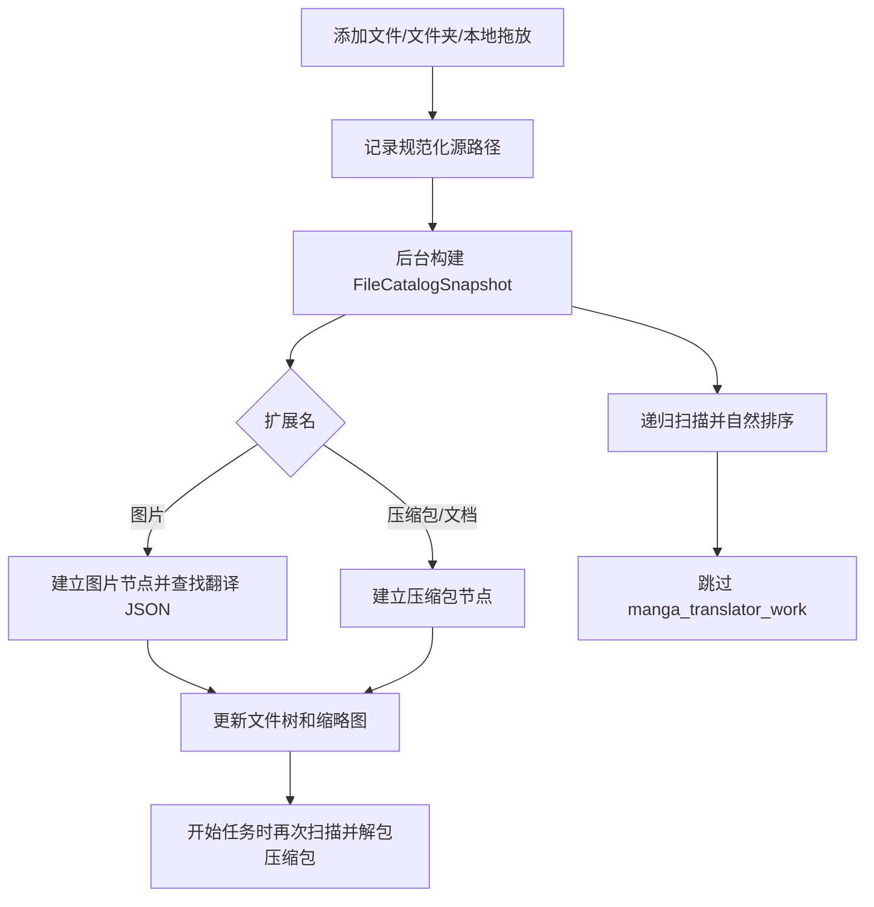

# 文件列表与输入

## 这部分负责什么

这里说明桌面“翻译界面”中待处理输入的添加、展示和移除：单个图片文件、文件夹、拖放路径以及受支持的压缩包/文档。文件列表只负责收集输入源、建立缩略图树和提供选择状态；输出目录、工作流选择、开始按钮和任务进度分别见[输出目录与工作流](./output-directory-and-workflow.md)及[进度、停止与任务状态](./progress-stop-and-task-state.md)。

压缩包会进入输入列表，但“列表中可见”不等于“已经解包”。真正的解包和图片发现发生在开始任务后的扫描阶段。

## 在翻译页操作

### 添加文件、文件夹和拖放

翻译页面的输入卡片包含三个按钮。文件选择器记住上次打开目录；成功选择后，首个文件所在目录会更新为下次打开位置。

1. 点击“添加文件”，在文件选择器中选择一个或多个受支持的图片或压缩包。
2. 点击“添加文件夹”，在文件夹选择器中选择一个或多个目录。文件夹扫描会递归进入子目录。
3. 也可以把文件或文件夹拖到文件列表区域。Qt 拖放事件只接收本地文件 URL，然后把路径交给与按钮相同的输入协调逻辑。
4. 同一路径不会重复加入；添加父文件夹时，其包含的已单独添加路径会被父文件夹覆盖。反过来，添加已包含在列表中的父文件夹也不会重复产生源。

“清空列表”会移除所有输入源和对列表内目录/文件的排除记录。任务运行期间不能添加、删除或清空文件列表；操作会被拒绝并写入警告日志。

### 文件树、缩略图和单项删除

列表使用一层或多层文件夹树显示扫描结果：文件夹节点显示文件数量，图片节点显示缩略图、文件名和状态点。图片状态为“已翻译”或“未翻译”，依据扫描时是否找到关联的翻译 JSON；压缩包显示压缩包图标而不是图片缩略图。

- 点击图片节点会发出选择事件，主窗口可据此打开对应文件或同步编辑器。
- 图片缩略图在可见时异步加载，并使用有上限的缓存；读取失败时保留文件节点，不把失败误报为列表扫描失败。
- 点击节点右侧的关闭图标只移除该项。移除文件夹会同时移除其子项；如果该文件仍被一个保留的父文件夹覆盖，删除动作会记录为排除文件/子目录，避免下一次扫描把它重新加入。
- 重新扫描期间，列表先清空模型并显示加载提示；结果返回后会尽量恢复已展开的目录和当前选中路径。

### 空、加载、就绪和错误状态

| 状态 | 界面表现 | 用户动作 |
| --- | --- | --- |
| 空 | 列表中显示“拖拽文件或文件夹到此处 或点击上方按钮添加”提示和虚线区域 | 点击“添加文件”或“添加文件夹”，或拖放本地路径 |
| 加载 | 列表模型暂时清空，显示“正在加载文件列表...” | 等待后台扫描；旧结果不会覆盖较新的扫描请求 |
| 就绪 | 显示文件夹树、文件数量、缩略图和“已翻译”/“未翻译”状态 | 选择文件、展开目录或删除单项 |
| 错误 | 列表模型清空，提示文字以错误颜色显示具体错误 | 修正路径或权限后重新添加；不要把错误提示中的私有路径复制到公开报告 |

如果开始任务后的扫描没有得到有效图片，应用会显示“文件列表为空”和“请先添加要翻译的图片文件！”警告；仅有无法解包的压缩包或不支持的文件不能作为有效图片输入。

## 任务如何执行

### 从输入源到文件树

目录按自然排序，因此 `file2` 位于 `file10` 之前；重复源路径会按规范化路径键去重。扫描会跳过名为 `manga_translator_work` 的目录，避免把上一次任务的工程文件当作新的输入。

图片节点同时保存源图片路径和找到的 JSON 路径。新位置优先查找 `<image-dir>/manga_translator_work/json/<stem>_translations.json`，然后兼容图片同目录的旧位置；因此状态点只表示“扫描时找到关联 JSON”，不代表本次任务已成功翻译。

### 开始任务时的压缩包处理

页面列表阶段仅识别并展示压缩包。开始任务后，归档提取器解包压缩包并收集其中图片，建立压缩包到临时解包目录的映射；输出到指定目录时还会检查同名解包目录冲突，并根据覆盖设置跳过或清理冲突目录。没有找到图片、解包失败或任务已停止时，会通过进度/错误提示报告结果。

不同压缩包内容、同名文件和输出目录的实际相对层级需在实际运行中确认；压缩包内部副文件不保证会自动与外部 TXT/JSON 配对。

### 删除与快照更新

删除源节点不会删除磁盘上的原图、压缩包或翻译 JSON。删除文件夹/文件时，主逻辑维护源列表和排除集合，随后主窗口请求新的快照；列表视图也会立即从内存模型移除节点并清理相关缩略图缓存。清空列表同样只改变内存中的输入源和排除集合，不清理用户工作目录。

## 任务限制

- 输入文件必须存在且可读；图片扩展名必须属于支持集合。旧 `FileService.validate_image_file()` 还会检查图片 MIME 类型和可读权限。
- 文件夹递归扫描会忽略 `manga_translator_work`；不要把工程目录直接当作新的原图目录来理解。
- 任务运行期间文件列表锁定，添加、删除和清空都会被拒绝。停止任务和任务状态见下一页。
- 大目录会触发后台扫描和异步缩略图读取；列表快照与缩略图加载均带取消/代际保护，避免旧扫描覆盖新列表，但磁盘访问和缩略图仍消耗 CPU、内存和 I/O。
- 压缩包识别不等于解包成功。PDF、EPUB、CBZ、CBR 和 ZIP 的内容、权限、同名冲突和临时目录清理应在实际运行中确认。
