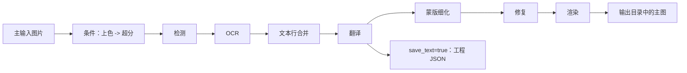

# 输出目录与工作流

在翻译页的“翻译任务”卡片中，可以指定主输出目录并选择处理模式。这里仅说明输出路径控件、九种工作流的选择和它们对输出与处理阶段的影响；输入文件添加和列表状态见[文件列表与输入](./file-list-and-input.md)，开始、进度和停止状态见[进度、停止与任务状态](./progress-stop-and-task-state.md)。

## 这部分负责什么

内容包括：

- 输出目录的输入、浏览和打开操作。
- “翻译流程模式：”下拉框的九个选项、切换后的按钮和说明文字。
- 每种模式的输入发现、输出文件、处理阶段、跳过阶段和互斥限制。

这里不定义各检测器、OCR、翻译器、修复器或渲染器的参数算法，也不把工作流选择当作翻译器或 API 候选槽切换。手工同时设置多个工作流字段也不构成 GUI 支持的组合。

## 在翻译页操作

### 设置输出目录

1. 在“输出目录:”旁的输入框中填写路径，或把输出文件夹拖入输入框。输入框的占位文案是“选择或拖入输出文件夹...”。
2. 点击“浏览...”打开目录选择动作并选择目标文件夹。
3. 点击“打开”调用系统打开所选输出目录。
4. 选择文件后，在“翻译流程模式：”中选定处理方式，再点击该模式对应的开始按钮。

输出输入框与“浏览”“打开”按钮分别连接目录选择和打开动作；目录不存在、不可写或无法打开时，提示文字可能随系统和版本不同。输出目录不会替代每张图片的工作目录，JSON、TXT 和修复图仍按输入图片的工作目录规则保存。

### 选择工作流

下拉框切换时，GUI 先清除八个互斥 CLI 工作流字段，再只设置所选模式对应的字段并保存配置。切换也会更新标题、说明文字和开始按钮；模式切换不会自动运行任务。

选择后，标题会显示当前模式，副标题会显示对应提示。例如导出翻译提示检查 `manga_translator_work/translations/`，导入翻译并渲染提示从 `manga_translator_work/originals/` 或 `translations/` 读取 TXT，并优先 `_original.txt`。这些路径是程序显示的提示和工作目录名，不是用户私有路径。

## 任务如何执行

### 常规输出链

正常翻译会按条件执行上色和超分，然后进入检测、OCR、文本行合并、翻译、蒙版细化、修复和渲染。无检测框或没有 OCR 文本时，核心可能提前返回输入图或超分后的图。正常模式是九种模式中唯一允许进入 `batch_concurrent` 并发管线的模式。

### 九种模式的阶段和输出

| 工作流 | 输入/发现 | 输出 | 运行阶段 | 跳过或特殊边界 |
| --- | --- | --- | --- | --- |
| 正常翻译 | 主输入图片 | 主输出图；`save_text=true` 时工程 JSON；修复完成时修复图；启用上色/超分时编辑器底图 | 条件上色 → 超分 → 检测 → OCR → 合并 → 翻译 → 蒙版 → 修复 → 渲染 | 没有检测框或 OCR 文本时可能提前返回；仅此模式使用并发管线 |
| 导出翻译 | 默认使用主图；开关开启时需要已有工程 JSON 与可用模板 | 默认写工程 JSON 与译文副文件；开关开启时只写 `<stem>_translated.<template-format>` 且 JSON 原样保留；不写主图 | 默认检测 → OCR → 翻译 → 模板导出；开关开启时读取 JSON `translation` 后按模板导出 | `export_from_local_json=true` 时跳过图片读取、检测、OCR、API 翻译和 JSON 回写 |
| 导出原文 | 默认使用主图与模板；开关开启时需要已有工程 JSON 与可用模板 | 默认写工程 JSON 与原文副文件；开关开启时只写 `<stem>_original.<template-format>` 且 JSON 原样保留；不写主图 | 默认检测 → OCR → 模板导出；开关开启时读取 JSON `text` 后按模板导出 | `export_from_local_json=true` 时跳过图片读取、检测、OCR 和 JSON 回写 |
| 仅翻译（JSON） | 必须找到工程 JSON；兼容旧区域列表和新 `regions` 对象 | 回写工程 JSON；成功后删除同图原文副文件；不写主输出图 | 载入 JSON → 翻译 → 回写 JSON | 跳过上色、超分、检测、OCR、合并、蒙版、修复和渲染；不以 `save_text` 为保存条件 |
| 导入翻译并渲染 | 必须有工程 JSON；TXT 优先原文副文件，否则译文副文件 | 主输出图和更新后的工程 JSON；必要时修复图 | 读取 JSON/内存载荷 → 复用或细化蒙版 → 修复 → 渲染 | 跳过上色、超分、检测、OCR、合并和翻译；JSON 无蒙版且导入 YOLO 标签时会额外检测；已有修复图可复用，AI renderer 可跳过真正修复 |
| 仅上色 | 主输入图片 | 主输出图；上色有效时编辑器底图 | 条件上色 | 跳过超分、检测、OCR、合并、翻译、蒙版、修复和渲染；不强制选择上色器，选择 `none` 时可能原样输出 |
| 仅超分 | 主输入图片；倍率由 `upscale.upscale_ratio` 决定 | 主输出图；启用上色或倍率时编辑器底图 | 条件上色 → 条件超分 | 跳过检测、OCR、合并、翻译、蒙版、修复和渲染；不强制倍率，倍率为空时保留上色结果或原图 |
| 仅修复 | 主输入图片 | 主输出图；分支清空 `text_regions`，不按译文渲染 | 条件上色 → 超分 → 检测 → 以字面量 `TEXT` 填充检测行 → 合并 → 蒙版 → 修复 | 跳过 OCR、翻译和渲染；无检测行/蒙版/合并区域时可能返回未修复图；AI renderer 会跳过真正修复并使用工作图 |
| 替换翻译 | 生肉图；工作目录中必须有同名翻译图 | 主输出图；重新渲染分支可写修复图和 JSON，直接粘贴分支不写二者或 PSD | 两张图条件上色 → 超分 → 检测 → OCR → 合并 → 区域配对 → 修复并渲染，或直接粘贴文字 | 不调用翻译服务；强制 `disable_auto_wrap=true`、`layout_mode='strict'`；`enable_template_alignment=true` 走直接粘贴，`paste_mask_dilation_pixels` 仅该分支消费 |

工作流的显示名称描述“目标”，并不总是自动开启相关模型：例如仅超分不强制倍率，且源码仍可能先执行已启用的上色；仅上色也不强制把上色器从 `none` 改为具体实现。

### 工作流互斥和并发

GUI 切换时八个布尔字段互斥；从已有配置同步下拉框时，源码优先级为：替换翻译、仅修复、仅超分、仅上色、导入翻译、仅翻译 JSON、导出原文、导出翻译、正常。手工 JSON、服务请求或其他入口可提供组合，但运行时分派按固定优先级处理，不存在“同时执行”契约。

`batch_concurrent` 对导入翻译、JSON-only、两种导出、仅上色、仅超分、仅修复和替换翻译均不兼容；桌面控制层和核心都会把这些模式按非并发处理。特殊模式不会因为界面仍保存并发配置就变成并发管线。

## 任务限制

- 两种文本导出默认沿用从主图检测/OCR的旧行为。开启 `cli.export_from_local_json` 后才依赖已有工程 JSON；JSON 缺失时明确失败，不回退 OCR。
- `cli.overwrite` 在开始前按模式检查既有 TXT、副文件或主输出图。
- `cli.save_text` 默认由 Qt/发行配置设为 `true`，影响普通模式及旧导出流程的 JSON、修复图和工程写入；导出原文的工作流标志仍要求它为 `true`。
- 上色、超分、检测、OCR、修复和渲染的模型、显存、网络和 API 成本由所选阶段参数决定；开启本地文本导出后不进入这些阶段。
