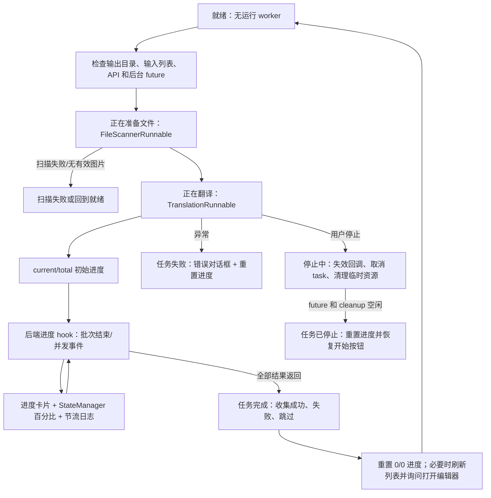

# 进度、停止与任务状态

当翻译页已经有输入文件、输出目录有效且 API 校验通过后，这里说明点击开始按钮后的状态变化、文件计数、百分比、停止请求和任务结束处理。工作流选择及每种模式的输入输出见[输出目录与工作流](./output-directory-and-workflow.md)，文件列表的添加、扫描和空列表状态见[文件列表与输入](./file-list-and-input.md)。

## 这部分负责什么

内容包括桌面 Qt 翻译工作区的：

- 开始按钮在准备、启动、运行、停止中和就绪之间的切换。
- 扫描文件、处理文件、已跳过文件、失败文件和完成数量如何进入进度显示。
- 停止请求的取消边界、后台收尾、错误反馈和完成后打开编辑器的询问。

这里不定义检测、OCR、翻译器、修复器或渲染器的算法，也不把进度条当作服务端任务协议。九种工作流的阶段差异仍以工作流页为准。

## 在翻译页操作

### 开始任务

1. 确认输出目录存在且为目录，并在文件列表中至少保留一个输入项。
2. 选择工作流后，点击当前模式的开始按钮。控制器会再次检查任务是否正在运行、上一次扫描/翻译/清理是否仍在后台，以及 API 凭据是否满足当前配置。
3. 通过检查后，界面先进入“正在准备文件...”，后台扫描文件夹、压缩包和排除项；扫描完成后才创建翻译 worker，并进入“正在翻译...”。
4. 处理开始后，按钮先短暂显示“Starting...”（中文 locale 没有此 key，实际回退为英文 key），约 2 秒后才可点击“停止翻译”。这是为了避免任务刚提交时重复启动或过早停止。

扫描或翻译无法启动时，状态会回到非运行状态并记录“任务启动失败”；无有效图片时回到“就绪”。输出目录、文件列表或 API 校验失败会在任务真正启动前弹窗阻止开始。

### 查看进度

进度卡片显示一条说明文字、`current/total (percentage%)` 计数和进度条。`current` 是已完成或已跳过的原始输入数量，`total` 是扫描后的原始总数，因此禁用覆盖并跳过已有输出时，跳过项仍计入总数。没有有效总数时显示 `0/0 (0%)`，不会把未知数量伪装成百分比。

说明文字可能包含“批量处理中”或“并发处理中”、平均每张耗时、预计剩余时间、已跳过数量和已失败数量。控制器同时写入状态管理器的 `[current/total] message`；日志以大约每秒一次的节流频率记录，但首个、最后一个和边界进度会记录。

### 停止任务

1. 任务运行且延迟停止按钮已经启用时，点击“停止翻译”。
2. 控制器立即设置停止请求标志，状态消息变为“正在停止...”，按钮禁用并显示“停止中...”。
3. 扫描请求 ID 和任务 ID 都递增，使已经排队但晚到的扫描、进度、完成或错误回调失效；worker 的 `stop()` 将运行标志设为 false，并取消当前 asyncio task。
4. 扫描 future、翻译 future 和压缩包临时文件清理全部结束后，状态才变为“任务已停止”，进度卡片重置为 `0/0 (0%)`，按钮恢复为当前工作流的开始文案。

停止是协作式取消，不保证中断已经发出的网络请求、模型内部不可取消的同步调用或已经写入磁盘的输出。停止中不可再次点击按钮，也不能用“停止”马上恢复开始状态；若后台仍在收尾，控制器会保持停止中。

### 处理完成或失败

成功完成后，控制器收集后端返回的已保存路径，按成功、失败和跳过数量设置状态消息并重置进度条。对于会产生编辑器结果的工作流，主窗口会刷新文件快照并询问“翻译完成，成功保存 {count} 个文件。\n\n是否在编辑器中打开结果？”；导出、JSON-only、仅上色、仅超分、仅修复等不适合编辑器的模式不显示该询问。

任务失败时状态为“任务失败”、进度重置，并弹出“翻译错误”对话框。对话框显示友好错误摘要，并提供“打开日志文件夹”；批量任务部分失败时仍会保留成功结果，同时在完成状态中列出成功和失败数量。全部输入因已有输出被跳过时，不视为 API 翻译失败，而是提示删除同名文件或开启覆盖。

## 任务如何执行

### 状态与进度流

进度计数会按跳过偏移修正当前数和总数，并把百分比限制在 0–100，同时更新主视图的进度条。并发模式和普通批处理都使用原始输入总数；特殊工作流会强制按非并发处理。

### 停止和资源边界

停止会先使回调失效，再请求 worker 取消；只有后台扫描、翻译和压缩包清理真正完成后，状态才切到“任务已停止”。是否卸载模型取决于 `app.unload_models_after_translation`。

## 任务限制

- 开始前依赖有效输出目录、非空输入列表、当前翻译器所需 API 凭据和没有未完成的前一任务收尾。
- 扫描阶段仍属于“正在翻译”状态，因此添加文件、添加文件夹、清空列表、文件列表和 API 管理页会被禁用。
- 停止与后台线程、asyncio task、压缩包临时目录和模型内存清理协作；强制终止进程可能留下部分输出或临时文件。
- `cli.overwrite=false` 时已有输出会计入进度但不处理；所有文件都跳过时任务会完成并提示覆盖设置，而不是调用翻译服务。
- `batch_concurrent` 仅对正常工作流有效；导入 TXT/JSON、导出、仅上色、仅超分、仅修复和替换翻译会按串行处理。
- 任务 ID 防止旧任务的延迟信号污染新任务，但不能撤销已落盘文件；需要由用户检查输出目录决定是否清理。
