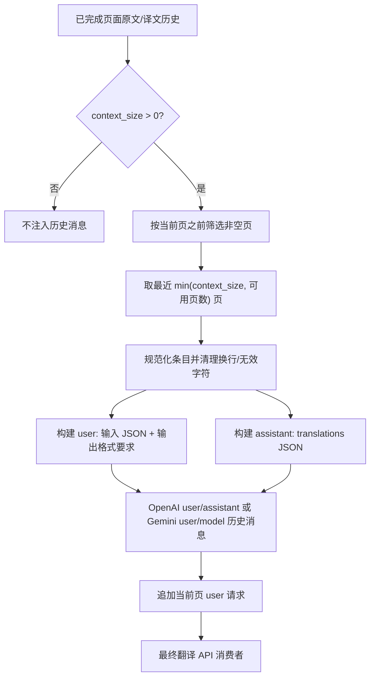
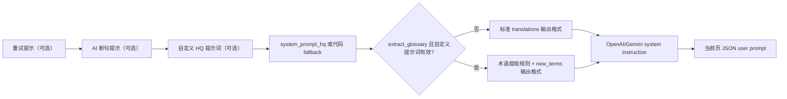

# 上下文与提示词

当相邻页面共享人名、术语、语气或格式时，本页用于配置翻译请求携带的历史页面，以及翻译器使用的系统、自定义和断句提示词。这里不负责选择翻译器、API 凭据和候选槽（见[翻译器选择](./selection-and-languages.md)及 API 管理页面），也不负责提示词文件列表的完整 CRUD（见[提示词列表、应用与预览](../prompts/list-apply-and-preview.md)）。

## 适用场景

- “上下文页数”决定联合翻译时最多选取多少个最近的非空历史页；它不是文本区域数量，也不是 API 候选槽数量。
- “自定义提示词”是翻译器读取自定义提示词的资源路径/文件编辑动作。它不是把私密提示词内容写入本文档，也不是 AI OCR、AI 上色或 AI 渲染提示词。
- 系统 HQ 提示词、输出格式提示词、术语提取提示词和 AI 断句提示词由运行时分别加载并按固定顺序组合；这里仅解释翻译链路中的消费者。

## 在桌面端设置

### 在设置页选择上下文和提示词

1. 打开“设置”，选择“翻译”分组。
2. 在“上下文页数”输入非负整数。设为 `0` 表示不注入历史上下文。
3. 在“自定义提示词”对应的文件编辑动作中选择或编辑提示词文件。可选提示词文件为 `.yaml`、`.yml`、`.json` 格式；系统提示词文件不会出现在列表中。
4. 点击“编辑”后直接修改文件；保存前应保持可解析的 YAML/JSON 结构。设置页重建或重新加载配置后，路径显示和说明面板会刷新。
5. “启用流式传输”只改变响应传输方式，不改变上下文选择或提示词组合。

### 在提示词管理页检查和应用文件

打开“提示词管理”。列表显示可用的用户提示词文件；选中后可使用“应用所选提示词”将路径写入翻译器配置，也可使用“提示词预览”和“编辑”查看结构化字段或 Raw 内容。

如果列表为空、文件不存在或无法解析，预览页显示对应错误/空状态；不要把错误信息中的本机路径复制到公开报告。

## 参数与选项

> 本页各参数的界面名称、存储键与默认值的对应关系，见[界面选项对照表](../../reference/options-i18n-matrix.md)。

#### 上下文页数 {#cli-context-size}

- 控件：整数输入框。
- 所在界面：设置 → 翻译。
- 可选值：非负整数；没有枚举下拉选项。
- 默认值：`3`。
- 原理：每页翻译完成后保存原文/译文条目；下一页从当前页之前筛选非空页，只携带最近“上下文页数”页，再追加当前页请求。空页不会占用名额；页数越大，提示词字符数和 token 成本越高。

#### 自定义提示词 {#translator-high-quality-prompt-path}

- 控件：提示词文件选择/编辑动作，不是普通文本参数输入。
- 所在界面：设置 → 翻译的“自定义提示词”行，或“提示词管理”页的“应用所选提示词”按钮。
- 可选值：扫描到的 `.yaml`、`.yml`、`.json` 文件；系统专用提示词文件不会作为普通用户提示词列出。
- 默认值：`dict/prompt_example.yaml`。
- 原理：保存后，翻译请求会解析该文件并把其中的目标语言占位符替换为目标语言全称，再与系统、输出格式提示词组合；解析失败只记录警告/错误，不会当作有效提示词发送。启用术语提取时，成功响应中的新术语还会回写该文件；提示词越长，token 和网络成本越高。

## 翻译请求如何处理

### 历史页如何成为上下文消息 {#history-to-messages}

处理器只使用当前页之前已经完成的页面，并跳过没有同时存在有效原文和译文的页面。历史消息只包含文本，不附带历史图片。

处理结束后历史会被裁剪以避免长批次内存增长；它是本次进程的运行时状态，不是持久化的提示词档案。并发或导入型工作流若没有严格的先后完成页，不能假定所有图片都能看到同一历史序列。

### 提示词组合顺序 {#prompt-composition}

每次重试都会重新构建系统提示词，并在开头加入重试提示（若有）。随后是 AI 断句提示（仅 `render.disable_auto_wrap` 开启且提示词文件可载入时），自定义 HQ 提示词，基础 HQ 系统提示词，最后是标准输出格式提示词。启用 `translator.extract_glossary` 且自定义提示词有效时，在基础提示词后追加术语提取规则和带 `new_terms` 的扩展输出格式。

自定义字段中的目标语言占位符会替换为目标语言全称。启用 AI 断句时还附加 `original_region_count`，让最终渲染检查能判断 `[BR]` 标记数量。

## 模型、网络与质量

- 上下文质量依赖先前页面的 OCR 文本和成功译文；错误 OCR 不会被历史机制自动修正。
- “上下文页数”、“批量大小”和“并发批量处理”是不同层级：前者控制历史页数量，后两者控制单次区域批量与图片编排，不能相互替代。
- 自定义提示词只影响翻译请求；固定 AI OCR/上色/渲染提示词有各自配置键和消费者，勿混用文件。
- OpenAI/Gemini 请求还受流式、RPM、普通重试和 API 候选轮换影响；这些机制不改变历史内容，详见翻译设置及 API 管理页。
- 提示词内容可能包含业务文本。共享日志、请求导出或调试目录前必须删除请求正文、历史页文本、路径和凭据。
