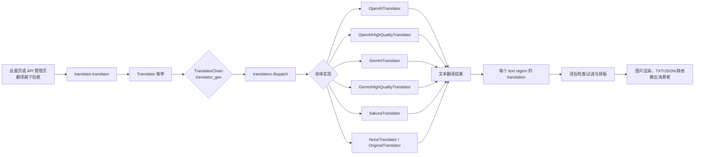
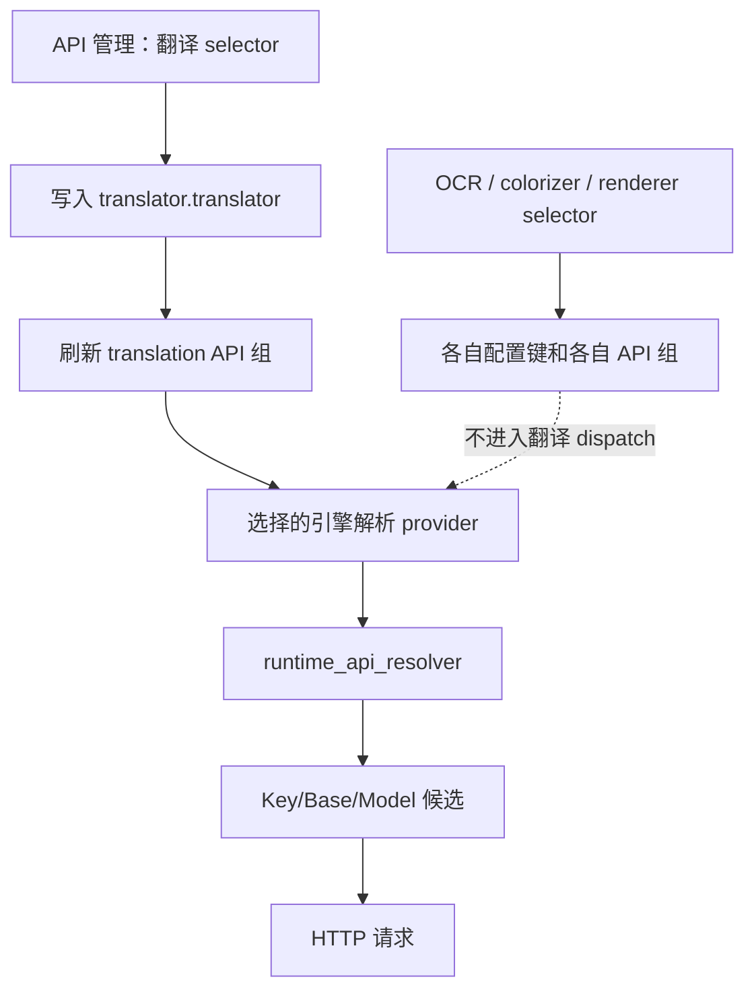

# 翻译器引擎分发

当需要知道“翻译器”下拉框到底会调用哪个实现、何时需要 API，以及多步翻译如何串联时使用本页。这里按“翻译器”选择到翻译实现和最终文本消费者的分发边界；目标语言、跳过语言、上下文、提示词、流式和译后处理见[翻译器选择与语言](./selection-and-languages.md)及相邻专题页。

## 适用场景

- **负责**：桌面设置页和 API 管理页中的翻译器选择；存储值到 `Translator` 枚举、`TranslatorChain` 和 `dispatch` 的映射；OpenAI/Gemini 普通与高质量实现、Sakura、无翻译和保留原文的差异。
- **不负责**：OCR、上色、渲染下拉框；同一提供商内的 Key/Base/Model 候选轮换；提示词内容、上下文构造和质量重试；这些分别属于 API 管理或其他翻译器专题。
- API 管理页的“翻译器”选择器不是仅筛选界面：它写入同一个 `translator.translator`，并刷新下方翻译 API 分组；但 API 槽本身不会改变所选引擎。

## 在桌面端设置

### 设置页选择引擎

1. 打开“设置”，进入“翻译”分组，在“翻译器”下拉框选择实现。
2. 下拉框显示本地化名称，但写入配置的是存储值（如 `openai_hq`）。选择后，动态设置发出 `translator.translator` 变更；`MainAppLogic.update_single_config()` 更新内存配置、保存配置文件，并通知 `TranslationService.set_translator()`。
3. 目标语言和其他翻译参数仍在同一分组配置；改变引擎不会自动改变目标语言。
4. 打开“API 管理”的翻译页签时，可在顶部同样改变翻译器。改变后页面异步重建当前功能的凭据/地址/模型分组；不会改 OCR、上色或渲染的配置键。

## 运行机理：从存储值到最终消费者

1. 单一翻译器按 `翻译器:目标语言` 进入链式调用；链字符串的每一段必须是 `枚举名:语言`，语言必须存在于 `VALID_LANGUAGES`。
2. 高质量实现接收上下文参数，普通 AI 实现也可接收用于 AI 断句的上下文；空查询直接返回，不产生 API 请求。
3. 翻译结果回到文本区域的译文字段，随后由翻译后处理、排版和保存器消费；翻译器选择并不直接写最终图片。

### 普通、高质量与本地分支

- `openai` 与 `gemini` 是通用聊天翻译实现，仍可使用统一流式传输和上下文。
- `openai_hq` 与 `gemini_hq` 走专用高质量类；它们的提示词/结构化处理和质量行为不要与普通重试混写。
- `sakura` 是独立服务实现，不会因为选择 OpenAI/Gemini API 候选而自动切换。
- `none` 与 `original` 不应被当成“API 失败后的回退”。前者清空译文，后者保留原文；它们是用户主动选择的实现。

## API 功能选择器的边界

API 管理页有四个 feature selector：翻译、OCR、上色、渲染。它们分别绑定到四个真实配置键，键与刷新的 API 分组见[界面选项对照表](../../reference/options-i18n-matrix.md)。

所以，在 API 管理页把翻译 selector 改为 `gemini` 会真正改变翻译引擎，并刷新 Gemini 的翻译 API 字段；它不是只切换“凭据标签”。相反，填写多个 OpenAI Key、Base 或 Model 槽只影响已选 OpenAI 提供商的运行时候选。候选解析、`failover`/`round_robin`、冷却和恢复属于 API 管理页，不在这里重复实现。

### 依赖与冲突

- `openai*` 需要至少一个可用的 OpenAI 或 OpenAI-compatible 凭据/地址/模型；`gemini*` 需要 Gemini 凭据。真实 key 只应由本地环境或安全的运行时覆盖提供，本文和截图不展示其值。
- `sakura` 依赖 Sakura 服务地址及其字典/服务配置；它与 OpenAI/Gemini API 字段不是同一组，切换后必须检查对应分组。
- `none`、`original` 不需要网络 API，但仍会进入后续工作流的不同语义：空译文可能导致渲染为空，原文则保留源文本。不要将它们作为自动故障转移策略。
- `translator_chain`/`selective_translation` 与单一 `translator` 是互斥的选择来源：存在链或按语言选择配置时，`translator_gen` 优先构造链；链内每个 provider 仍须满足自己的凭据和语言能力。
- `batch_size` 只改变一次调度提交的文本数量，`batch_concurrent` 改变图片阶段的并发流水线；二者都不改变引擎枚举。上下文相关的并发限制和 API 请求并发见翻译设置页。
- 目标语言不受 UI 语言影响；`auto` 是输入语言传给实现的标志，不是“自动选择翻译器”。
